### 配置网站

一个网站使用EC2作为服务器，域名直接解析ip来访问

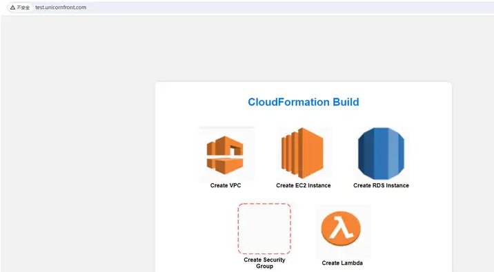

域名是托管到cloudflare，在其它平台也一样

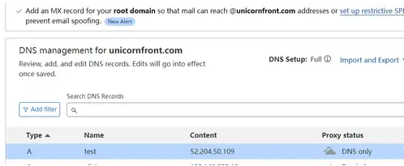

目前没有配置https，使用网站工具来测试延迟

[https://tool.chinaz.com/sitespeed](https://link.zhihu.com/?target=https%3A//tool.chinaz.com/sitespeed)

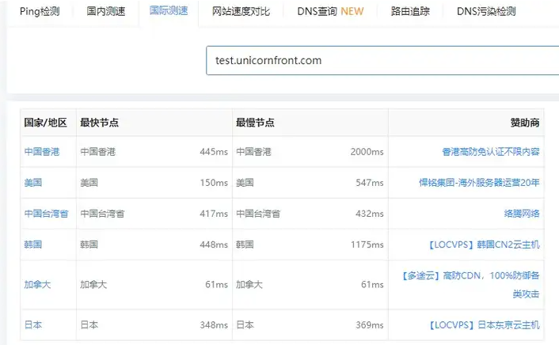

这是国际测速，中国香港最快要445ms最慢要2000ms

接下来使用AWS的CloudFront服务为我们网站配置CDN

### 申请ssl证书

因为我还要给我的网站配置https所以还需要到AWS的Certificate Manager服务里申请我们这个子域的ssl证书

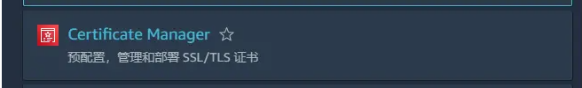

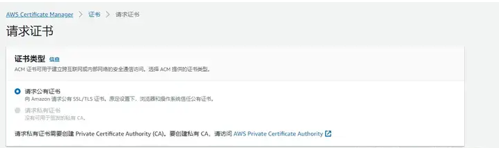

输入我们的子域

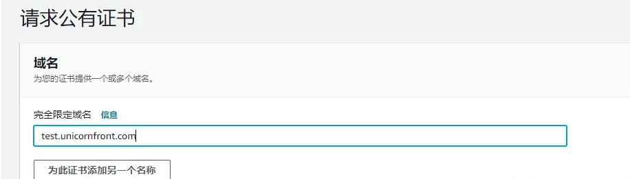

验证方法我们选择dns验证，密钥算法默认

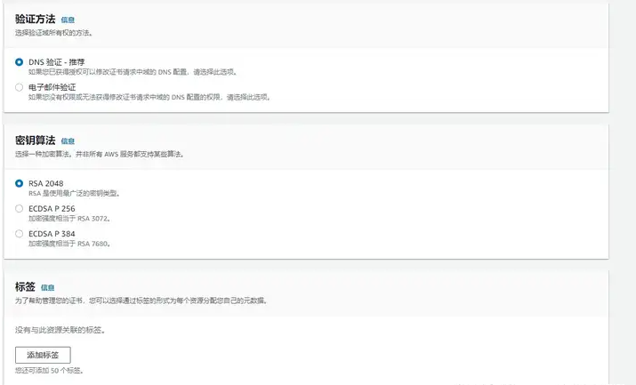

点击请求

注意目前其状态是等待验证，证书还没有颁发成功

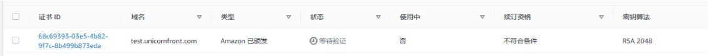

点进去，我们需要给域名配置一个cname的解析才能验证成功

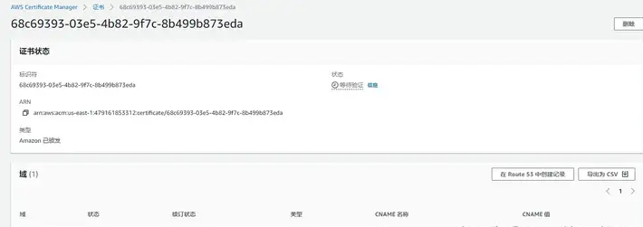

把cname的名称和值配置到域名即可

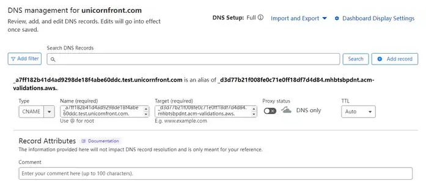

接着等待其状态变为验证成功

在等待的这段时间我们先把其A记录解析到网站ip的记录删除

等待证书状态已验证成功

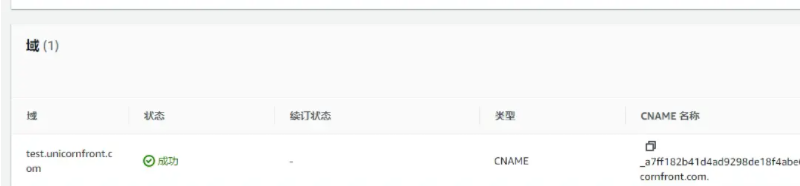

这个证书是给AWS的ALB负载均衡器和CloudFront使用的，我们并不能拿到证书文件

### 创建负载均衡器

CloudFront并不能直接指定EC2作为源，其需要负载均衡器，所以我们要给EC2创建一个负载均衡器

我们先要创建一个目标组

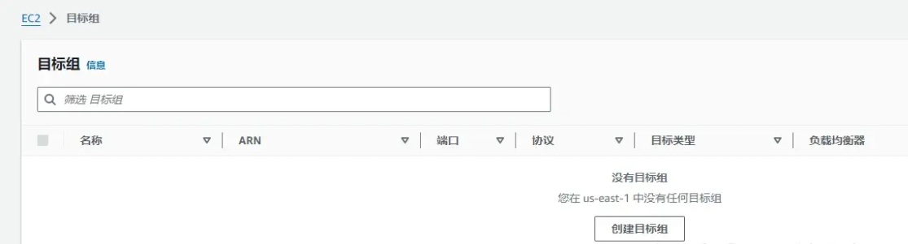

目标类型选择实例，目标组名称随意

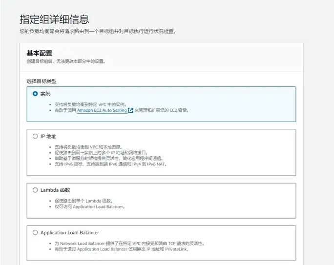

这里不变（除非你的网站不是运行在80端口）

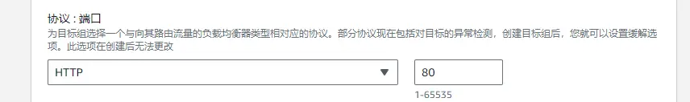

选择EC2实例所在的VPC

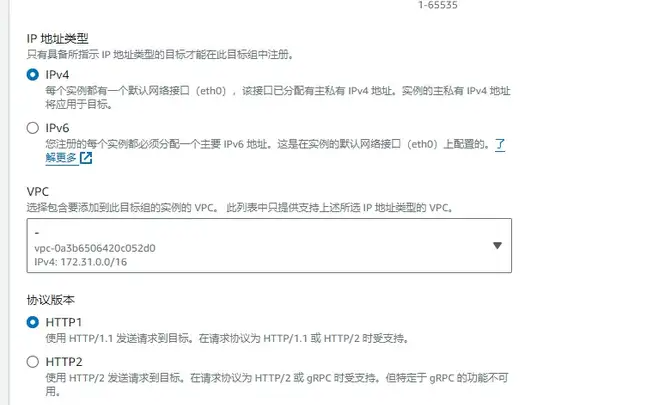

勾选我们的实例记得点击 包含如下待处理事项按钮

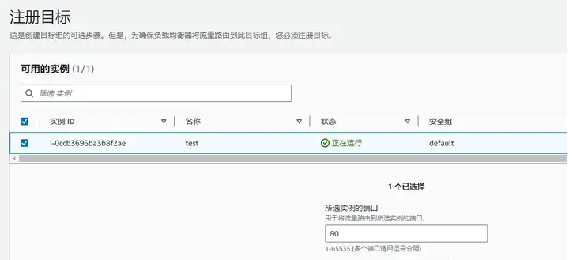

然后点击创建目标组即可

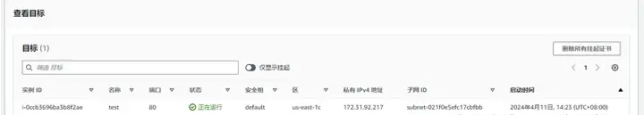

接下来创建负载均衡器

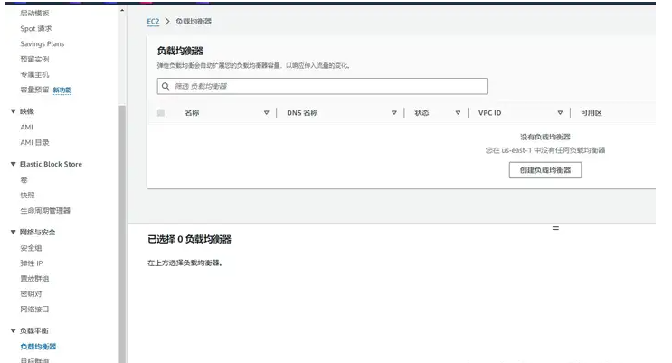

选择第一个**Application Load Balancer**

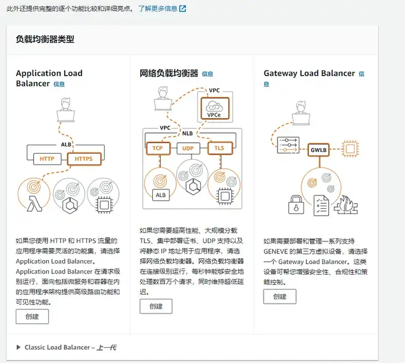

名称随意，模式选择面向互联网

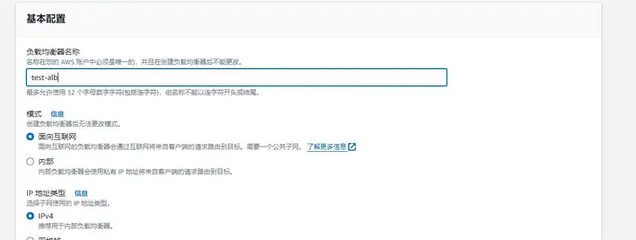

网络映射的话我这里是默认VPC所以就全选了，如果是自己创建的VPC则选择公有子网

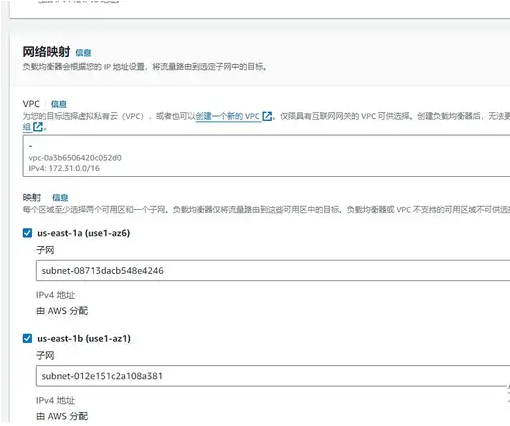

安全组选择开放了80和443端口的

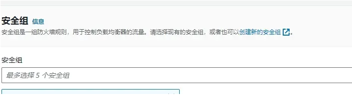

侦听器和路由我们选择https协议，目标组就是我们前面创建的目标组

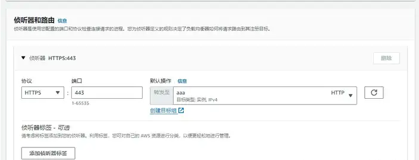

接下来选择证书，就是我们前面AWS给我们域名颁发的的证书

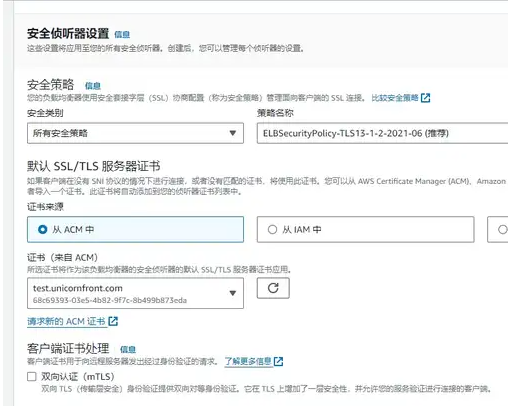

其它的都默认即可，点击下面的创建负载均衡器。

### 创建CloudFront

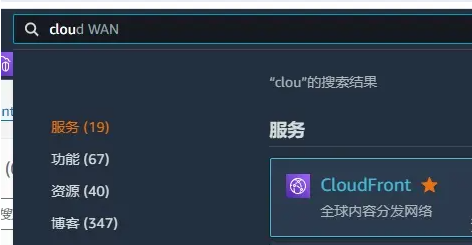

点击创建分配

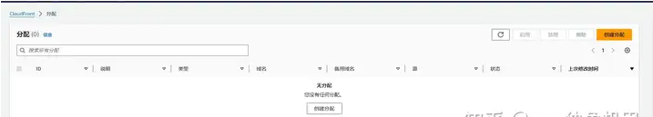

源就选择我们前面创建的负载均衡器

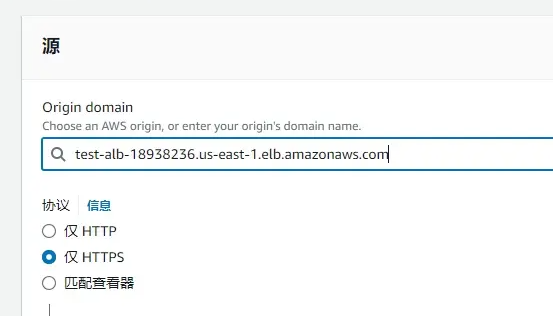

协议选择https

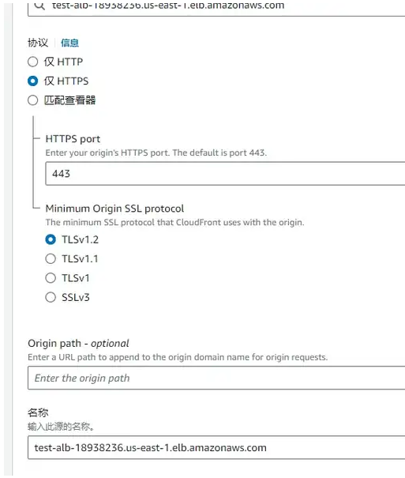

下面的都默认直到缓存这里，CDN缓存策略我选择的都是全部缓存，要根据自己网站实际需要缓存的内容来选择

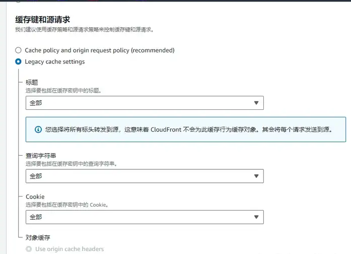

WAF防火墙选择不开启

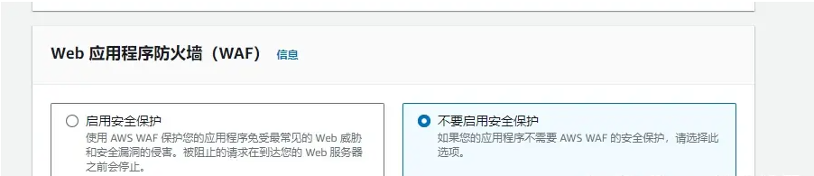

价格级别选择所有边缘节点

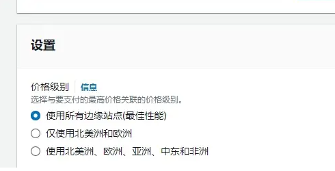

然后我们点击添加备用域名

这里就要加入我们的域名，下面选择我们之前创建的ssl证书

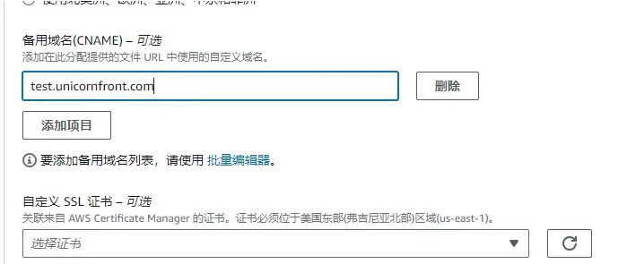

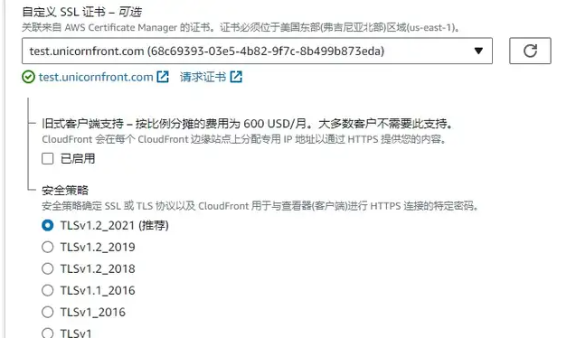

接下来点击最下面的创建即可

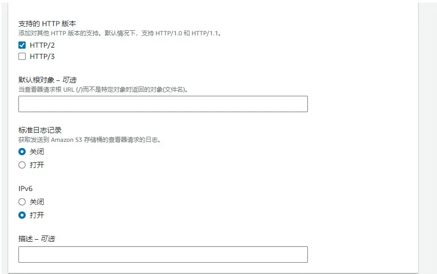

然后会给我们一个CloudFront的域名我们复制下来

到我们域名的DNS解析哪里，添加CNAME解析到CloudFront

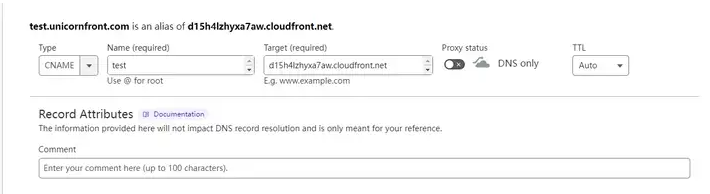

接下来我们等待CloudFront部署完成

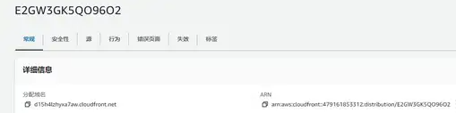

### 测试

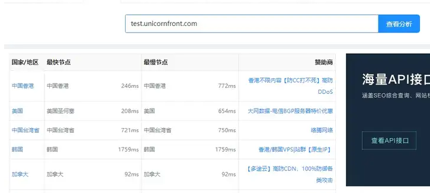

现在中国香港最快246ms最慢772ms，对比前面域名直接解析快了很多

我们可以ping一下域名看看

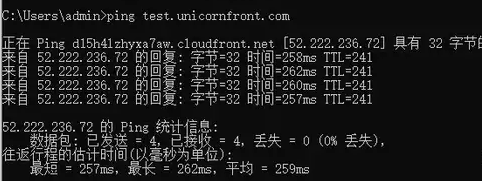

