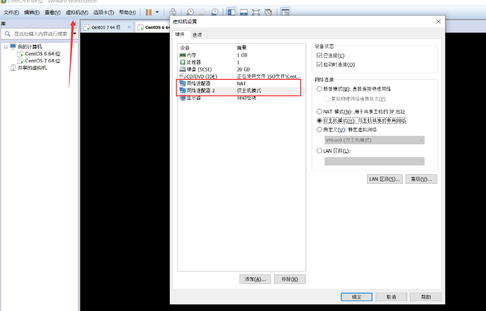
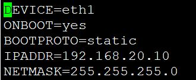
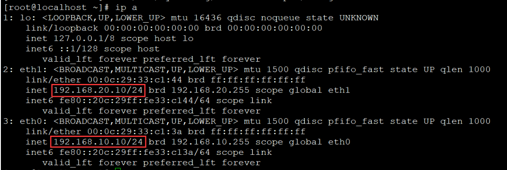
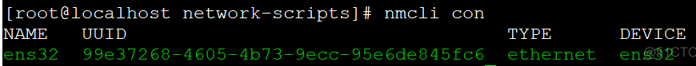
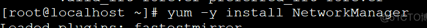
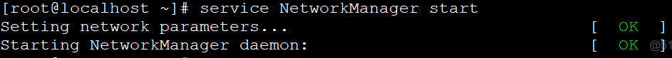

有时候我们在装完系统后有可能有新增网卡的需求

<!--more-->


在这种情况下，linux不会主动去添加配置文件ifcfg-eth1的，如果需要使用这块网卡，



我们需要复制ifcfg-eth0为ifcfg-eth1，并修改ifcfg-eth1配置：

```
#[root@localhost ~]# cp /etc/sysconfig/network-scripts/ifcfg-eth0 /etc/sysconfig/network-scripts/ifcfg-eth1
#[root@localhost ~]# vi /etc/sysconfig/network-scripts/ifcfg-eth1
```

```bash
DEVICE=eth1 #修改网卡名为eth1
HWADDR=00:1A:A0:FC:79:D6 #修改为新网卡的MAC地址
TYPE=Ethernet
UUID=3aeb57ea-c5c0-42fa-8dbd-b8eeb3fcadf8 #新设备的UUID
ONBOOT=yes
NM_CONTROLLED=yes
BOOTPROTO=static
IPADDR=192.168.20.10 #修改为为新网卡指派的IP地址
NETMASK=255.255.255.0
```

如果为了方便 就只保留 DEVICE， ONBOOT， BOOTPROTO, IPADDR, NETMASK五行就行



重启网络服务：

```
#[root@localhost ~]# service network restart
```

查看IP地址：



ps：HWADDR和UUID可以不进行添加，但是如果不进行设置的的话，就需要把这二行删除，不能保留在配置文件里。
如果不设置HWADDR的话，系统会在启动网卡时读取硬件的MAC地址；
使用ifconfig -a 可以查看到mac地址（HWaddr）
而UUID存在的目标则是如果多块网卡在硬件安装的位置发生变化时，系统会根据UUID判断应该读取哪 个配置文件。
因为在linux系统里硬件的名称不是固定的，硬件的名称如:eth0 eth1 sda1 sda2 是按硬件安装时的顺序进行命名的。这样的话，如果硬件安装的位置发生变化，就可能出现读取错误配置文件的情况。为了防止这种情况发生，就产生了UUID。


查看UUID：



若提示无此命令的话，需要安装NetworkManager:



启动NetworkManager服务：


