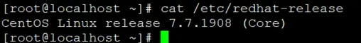
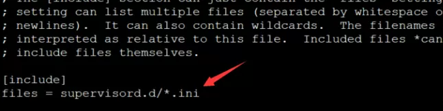

1.什么是supervisor
supervisor是用python写的一个进程管理工具，用来启动，重启，关闭进程。

<!--more-->

环境：



2.安装CentOS7扩展软件仓库：

```
yum install -y epel-release
```

3.安装supervisor：

```
yum install -y supervisor
```

查看安装了哪些文件以及所在的路径：

```
rpm -ql supervisor
```

4.修改并定义ini文件：
4.1找到supervisor 的配置的文件，可以使用例如： whereis supervisord.conf 或者 find / -name supervisor* 命令进行查询

4.2修改配置文件：

```
vim /etc/supervisor/supervisord.conf
```

4.3将配置文件最后一行修改ini 文件路径，意为：supervisor每次update都会加载这个自定义路径文件夹下的所有后缀为ini的文件。




4.4 创建ini文件，加入supervisor的进程管理中， 实现服务器后台运行

```
[program:exmaple] # example是在supercisor中的进程名，随便取啥
command=/usr/local/bin/gunicorn -w 4 -b 127.0.0.1:91 run:app 
#上述代码为使用gunicorn 运行flask。run是你的文件名 ：app指的是app = Flask(__name__)此处的app或者是
command=/usr/local/bin/python3 /root/test/test.py
numprocs=1           ; number of processes copies to start (def 1)   
autostart = true     ; 在 supervisord 启动的时候也自动启动   
startsecs = 1        ; 启动 1 秒后没有异常退出，就当作已经正常启动了   
autorestart = true   ; 程序异常退出后自动重启   
startretries = 3     ; 启动失败自动重试次数，默认是 3   
user = root          ; 用哪个用户启动   
redirect_stderr = true          ; 把 stderr 重定向到 stdout，默认 false   
stdout_logfile_maxbytes = 20MB  ; stdout 日志文件大小，默认 50MB   
stdout_logfile_backups = 10     ; stdout 日志文件备份数 
stdout_logfile=/**自定义路径/gunicorn.log       ; log 日志
stderr_logfile=/**自定义路径/gunicorn.error     ; 错误日志的绝对路径
```

5.启动supervisor：

```
supervisord -c /etc/supervisor/supervisord.conf
```

关闭supervisor：

```
 supervisorctl shutdown
```

重启supervisor服务

```
 supervisorctl restart
```

6.管理Supervisor服务

```
#开启所有
supervisorctl start all
#开启单个(配置文件里你起得进程名字-->[program:myProgram])
supervisorctl start myProgram
#关闭所有
supervisorctl stop all 
#关掉其中一个
supervisorctl stop example 
#查看Supervisor 服务状态
supervisorctl status
```

6.2 修改了Supervisor ini文件或者conf文件配置后，需要更新服务：

```
supervisorctl update # 更新supervisor的配置
supervisorctl reload # 重新加载项目到内存中
```

7.查看Superviso日志

```
tail -f /var/log/supervisor/supervisord.log
```

至此，supervisor安装完成。
