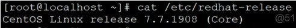

frp 是一个可用于内网穿透的高性能的反向代理应用，支持 tcp, udp, http, https 协议。 本文将基于 frp 来实现内网穿透。

<!--more-->

frp 的作用：
1.利用处于内网或防火墙后的机器，对外网环境提供 http 或 https 服务。
2.对于 http, https 服务支持基于域名的虚拟主机，支持自定义域名绑定，使多个域名可以共用一个80端口。
3.利用处于内网或防火墙后的机器，对外网环境提供 tcp 和 udp 服务，例如在家里通过 ssh 访问处于公司内网环境内的主机。

在具有公网IP的服务器或VPS上安装运行 frp 的服务端程序frps，并在处于内网的目标主机上面安装运行 frp 的客户端程序 frpc ，然后 User 就可以通过公网服务器来实现内网穿透从而访问内网主机。

环境：



配置 ssh 访问内网机器
1.下载安装包：
在公网服务器和内网机器上都要下载安装包并解压：

```
$ wget https://github.com/fatedier/frp/releases/download/v0.21.0/frp_0.21.0_linux_amd64.tar.gz
$ tar -xzvf frp_0.21.0_linux_amd64.tar.gz
```

2.在公网服务器上配置并启动：
修改配置文件修改配置文件 $ vi frps.ini，如下：

```
[common]
bind_port = 3389  #frp服务端端口（必须）
```

配置很简单，然后启动：

```
$ nohup ./frps -c frps.ini &
```

查看 nohup.out 的信息，success：

```
# tail -f nohup.out 

2018/09/14 05:33:15 [I] [service.go:130] frps tcp listen on 0.0.0.0:7000
2018/09/14 05:33:15 [I] [root.go:207] Start frps success
2018/09/14 05:49:47 [I] [service.go:130] frps tcp listen on 0.0.0.0:7000
2018/09/14 05:49:47 [I] [root.go:207] Start frps success
2018/09/14 06:28:59 [I] [service.go:319] client login info: ip [125.71.219.33:37092] version [0.21.0] hostname [] os [linux] arch [amd64]
2018/09/14 06:28:59 [I] [proxy.go:217] [93eec0dde173fc68] [ssh] tcp proxy listen port [6000]
2018/09/14 06:28:59 [I] [control.go:335] [93eec0dde173fc68] new proxy [ssh] success
```

3.在内网机器上配置并启动：
修改配置文件 $ vi frpc.ini，如下：

```
[common]
server_addr = 0.0.0.0   #frp服务端地址，可以填ip或者域名，这里假设为0.0.0.0
server_port = 3389      #frp服务端端口，即填写服务端配置中的 bind_port

[ssh]
type = tcp              #连接类型，填tcp或udp
local_ip = 127.0.0.1    #填127.0.0.1或内网ip都可以
local_port = 22         #需要转发到的端口，ssh端口是22
remote_port = 6000      #frp服务端的远程监听端口，即你访问服务端的remote_port就相当于访
                       #问客户端的 local_port，如果填0则会随机分配一个端口
											 

[jumpserver_web]
type = tcp
local_ip = 127.0.0.1
local_port = 81
remote_port = 62226

[jumpserver_ssh]
type = tcp
local_ip = 127.0.0.1
local_port = 2222
remote_port = 2222
```


启动客户端程序：：

```
$ nohup ./frpc -c frpc.ini &
```

查看 nohup.out 的信息，success：

```
$ tail -f nohup.out
2018/09/14 14:28:58 [I] [proxy_manager.go:300] proxy removed: []
2018/09/14 14:28:58 [I] [proxy_manager.go:310] proxy added: [ssh]
2018/09/14 14:28:58 [I] [proxy_manager.go:333] visitor removed: []
2018/09/14 14:28:58 [I] [proxy_manager.go:342] visitor added: []
2018/09/14 14:28:59 [I] [control.go:246] [93eec0dde173fc68] login to server success, get run id [93eec0dde173fc68], server udp port [0]
2018/09/14 14:29:00 [I] [control.go:169] [93eec0dde173fc68] [ssh] start proxy success
```

4.登录：

```
ssh -oPort=6000 username@server_addr
```

或者

```
ssh -p 6000 username@server_addr
```

上面登录使用的 username 是内网机器的用户名，server_addr是公网服务器的IP，port 6000就是设置的 remote_port，最后的登录密码是内网机器的密码，而不是公网机器的密码，这一点一定要注意。

问题解决:
在启动服务端和客户端程序之后，可能发现还是无法登录到内网内网机器，在内网机器上面执行 tail -f nohup.out 查看启动命令的执行结果，可以发现以下的问题：

```
$ tail -f nohup.out 
2018/09/14 14:11:02 [I] [proxy_manager.go:333] visitor removed: []
2018/09/14 14:11:02 [I] [proxy_manager.go:342] visitor added: []
2018/09/14 14:13:09 [W] [control.go:113] login to server failed: dial tcp xxx.xxx.xxx.xxx:7000: connect: connection timed out
dial tcp xxx.xxx.xxx.xxx:7000: connect: connection timed out
```

仔细检查了一下，发现是公网服务器防火墙的原因，没有允许对应端口的流量通过，所以需要配置防火墙：

```
#firewall-cmd --zone=public --add-port=3389/tcp --permanent
#firewall-cmd --zone=public --add-port=6000/tcp --permanent
#firewall-cmd --reload
```

阿里云服务器需要在esc管理中配置安全组规则中添加3389，6000端口
