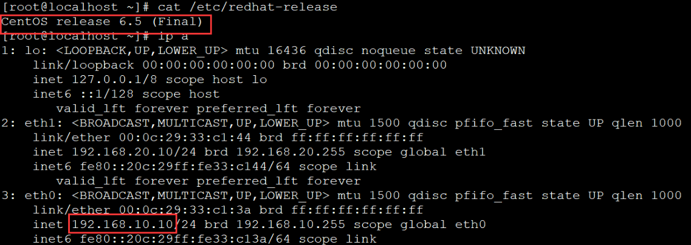
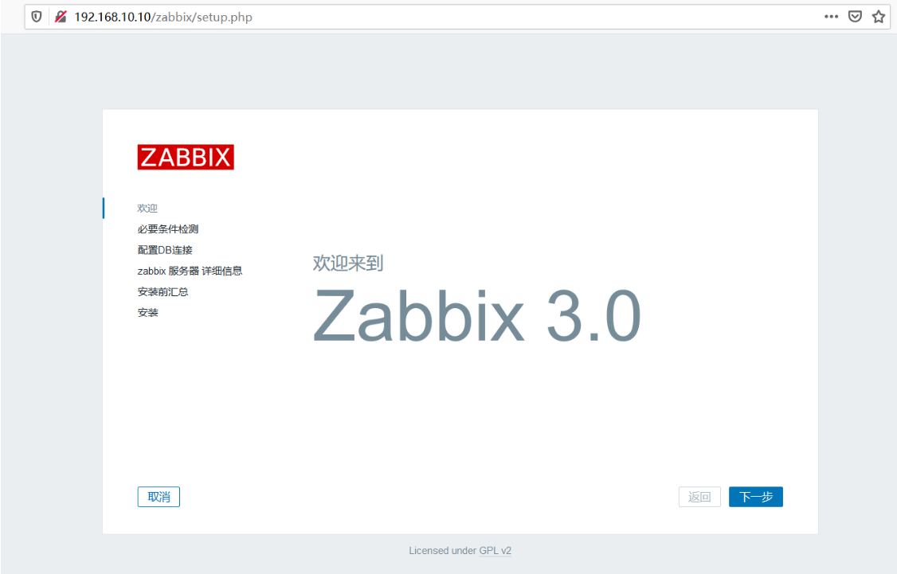
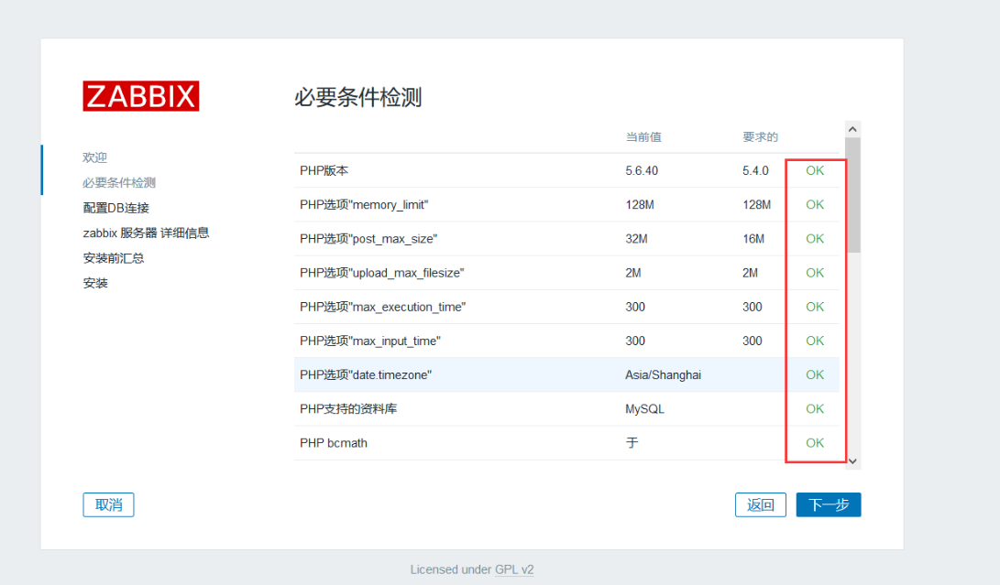
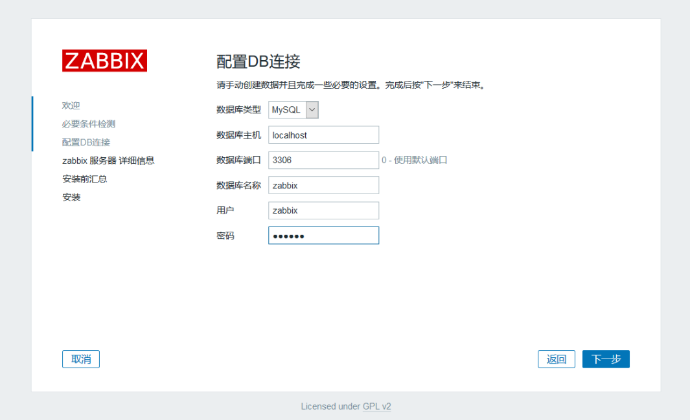
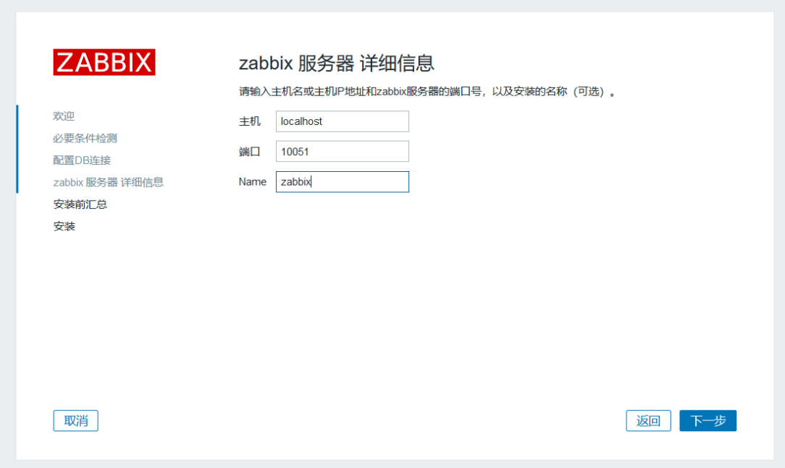
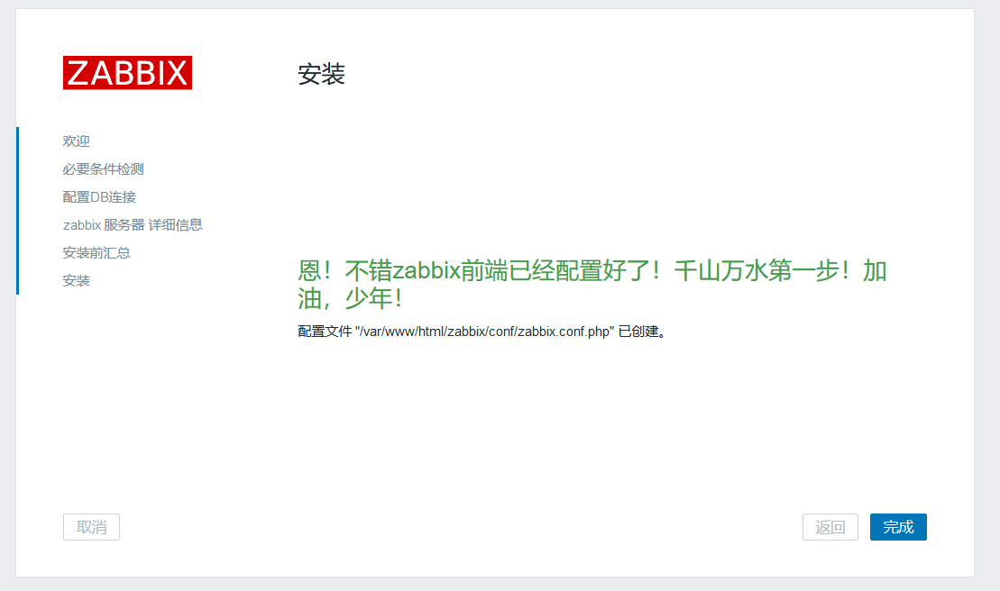
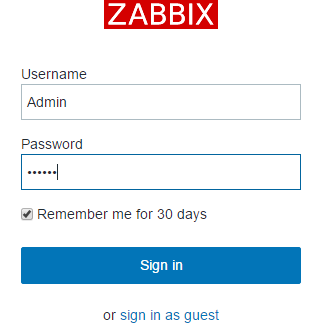

zabbix是一个基于WEB界面的提供分布式系统监视以及网络监视功能的企业级的开源解决方案。

zabbix能监视各种网络参数，保证服务器系统的安全运营；并提供灵活的通知机制以让系统管理员快速定位/解决存在的各种问题。

zabbix由2部分构成，zabbix server与可选组件zabbix agent。

zabbix server可以通过SNMP，zabbix agent，ping，端口监视等方法提供对远程服务器/网络状态的监视，数据收集等功能，它可以运行在Linux，Solaris，HP-UX，AIX，Free BSD，Open BSD，OS X等平台上。

<!--more-->

环境：



首先关掉相关安全设置

```
[root@localhost ~]#service iptables stop
[root@localhost ~]#chkconfig iptables off
[root@localhost ~]#setenforce 0
[root@localhost ~]#sed -i 's#SELINUX=enforcing#SELINUX=disabled#g' /etc/selinux/config
```

卸载相关软件包（如果有的话），保持干净环境

	[root@localhost ~]#yum remove -y mysql* httpd* php* nginx* zabbix*
### 安装PHP

Zabbix 3.0对PHP的要求最低为5.4，而CentOS6默认为5.3.3，完全不满足要求，故需要利用第三方源，将PHP升级到5.4以上，注意，不支持PHP7

```
[root@localhost ~]#rpm -ivh http://repo.webtatic.com/yum/el6/latest.rpm    //安装epel源
[root@localhost ~]#yum install php56w php56w-gd php56w-mysql php56w-bcmath php56w-mbstring php56w-xml php56w-ldap  //安装软件包依赖
[root@localhost ~]#vim /etc/php.ini     //修改配置
			date.timezone = Asia/Shanghai
			post_max_size = 32M
			max_execution_time = 300
			max_input_time = 300
			always_populate_raw_post_data = -1
```

### 安装MySQL

MySQL建议使用5.6版本，CentOS6默认为5.1，不建议使用，性能偏低

```
[root@localhost ~]#wget http://repo.mysql.com/mysql-community-release-el6-5.noarch.rpm 
[root@localhost ~]#rpm -ivh mysql-community-release-el6-5.noarch.rpm   //安装epel源
[root@localhost ~]#yum install -y mysql-server mysql-devel   //安装软件
[root@localhost ~]#service mysqld start
[root@localhost ~]#mysql_secure_installation        #MySQL安全配置向导
```


		Enter current password for root (enter for none):    <–初次运行直接回车
	
		Set root password? [Y/n]       <– 是否设置root用户密码，输入y并回车或直接回车
	
		Remove anonymous users? [Y/n]      <– 是否删除匿名用户,生产环境建议删除，所以直接回车
	
		Disallow root login remotely? [Y/n]     <–是否禁止root远程登录,根据自己的需求选择Y/n并回车,建议禁止
	
		Remove test database and access to it? [Y/n]  　　<– 是否删除test数据库,直接回车
	
		Reload privilege tables now? [Y/n]      <– 是否重新加载权限表，直接回车

```
[root@localhost ~]#mysql -uroot -p
mysql> CREATE DATABASE zabbix CHARACTER SET utf8 COLLATE utf8_bin;   #创建mysql库
mysql> GRANT ALL PRIVILEGES ON zabbix.* TO zabbix@% IDENTIFIED BY 'zabbix';  #给zabbix用户授权，密码是zabbix
mysql> GRANT ALL PRIVILEGES ON *.* TO 'zabbix'@'%';   #给zabbix用户授权所有库，表权限
mysql> flush privileges;     #刷新MySQL的系统权限相关表
mysql> show databases; 
±-------------------+

| Database |

±-------------------+

| information_schema |

| mysql |

| performance_schema |

| zabbix |

±-------------------+
```

### 安装Zabbix

```
[root@localhost ~]#yum install httpd libxml2-devel net-snmp-devel libcurl-devel      #安装httpd及依赖包
[root@localhost ~]#groupadd  -g 201  zabbix                #创建zabbix用户
[root@localhost ~]#useradd  -g zabbix  -u 201 -m zabbix
[root@localhost ~]#wget http://sourceforge.net/projects/zabbix/files/ZABBIX%20Latest%20Stable/3.0.3/zabbix-3.0.3.tar.gz
[root@localhost ~]#tar zxvf zabbix-3.0.3.tar.gz       # 解压
[root@localhost ~]#cd zabbix-3.0.3
[root@localhost ~]#/usr/bin/mysql -uzabbix -pzabbix zabbix < database/mysql/schema.sql #导入zabbix数据表结构
[root@localhost ~]#/usr/bin/mysql -uzabbix -pzabbix zabbix < database/mysql/images.sql  #导入zabbix数据表结构
[root@localhost ~]#/usr/bin/mysql -uzabbix -pzabbix zabbix < database/mysql/data.sql   #导入zabbix数据表结构

[root@localhost ~]#/./configure --prefix=/usr/local/zabbix --sysconfdir=/etc/zabbix/ --enable-server --enable-agent --with-net-snmp --with-libcurl --with-mysql --with-libxml2   #编译
[root@localhost ~]#/make &&make install          #安装
```

编译 zabbix 如果报下面错误，就做以下操作
报错信息：configure: error: Not found mysqlclient library

```
[root@localhost ~]#find / -name libmysqlclient*
[root@localhost ~]#ln -s /usr/lib64/mysql/libmysqlclient.so.18.1.0 /usr/lib64/mysql/libmysqlclient.so
[root@localhost ~]#ln -s /usr/lib64/mysql/libmysqlclient_r.so.18.1.0 /usr/lib64/mysql/libmysqlclient_r.so 
```

### 配置Zabbix

```
[root@localhost ~]#vim /etc/zabbix/zabbix_server.conf
```


			DBHost=192.168.10.10  #数据库ip地址
			DBName=zabbix
			DBUser=zabbix
			DBPassword=zabbix
			ListenIP=192.168.10.10   #zabbix server ip地址

```
[root@localhost ~]#ln -s /usr/local/zabbix/sbin/* /usr/sbin/
[root@localhost ~]#cp /root/zabbix-3.0.3/misc/init.d/fedora/core/zabbix_* /etc/init.d/
[root@localhost ~]#chmod +x /etc/init.d/zabbix_*
[root@localhost ~]#sed -i "s@BASEDIR=/usr/local@BASEDIR=/usr/local/zabbix@g" /etc/init.d/zabbix_server
```

### 配置http WEB

```
[root@localhost ~]#vim /etc/httpd/conf/httpd.conf
```

```
ServerName 127.0.0.1
DocumentRoot  "/var/www/html"
ServerName 192.168.10.10	
```

```
[root@localhost ~]#mkdir -p /var/www/html/zabbix
[root@localhost ~]#cp -r /root/zabbix-3.0.3/frontends/php/* /var/www/html/zabbix/
[root@localhost ~]#chown -R apache.apache /var/www/html/zabbix/
```

### 启动服务

```
[root@localhost ~]#chkconfig zabbix_server on
[root@localhost ~]#/etc/init.d/zabbix_server start
[root@localhost ~]#service httpd restart
```

### 用浏览器访问http://192.168.10.10/zabbix/，并按照提示安装：



全部都OK后，点击下一步：



输入MySQL密码，点击下一步：



继续下一步：



点击完成：



默认用户名/密码：Admin/zabbix，注意用户名也区分大小写



至此zabbix的安装完成！可以查看zabbix服务端日志：

```
tail -100f /tmp/zabbix_server.log
```

另外：

zabbix server is not running 解决方法：


```
1.关闭selinux
2.关闭防火墙
3.登录mysql数据库，查看是否可以登录.
4.打开 vim /var/www/html/zabbix/conf/zabbix.conf.php 将server改成ip地址：
					$DB['SERVER']  = '192.168.10.10';  #ip为MySQL服务器地址.
					$ZBX_SERVER  = '192.168.10.10'; #ip为zabbix sever服务器地址.
```

