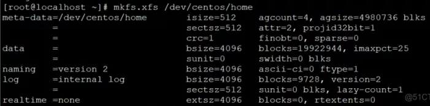

服务器安装CentOS7系统时，没注意点了自动分区，空间大部分分到了/home目录。

<!--more-->


需重新分配分区，把空间加到/目录。

操作步骤：

1.首先你需要备份home文件夹里面的内容（新系统若是没有创建其他帐户可以不备份）

```
[root@localhost ~]# cp -pr /home/ /homebak/
```

2.卸载 home ：（如果出现 home 存在进程，使用 fuser -m -v -i -k /home 终止 home 下的进程，最后使用 umount /home 卸载 /home）

```
[root@localhost ~]# umount /home
```

3.删除home扇区：

```
[root@localhost ~]# lvremove /dev/mapper/centos-home
```


4.给/目录所在的扇区增加800G:

```
[root@localhost ~]# lvextend -L +800G /dev/mapper/centos-root
```


5.扩展/dev/mapper/centos-root文件系统:

```
[root@localhost ~]# xfs_growfs /dev/mapper/centos-root
```


6.根据 vgdisplay 中的free PE 的大小确定还有多少空间可分配：

```
[root@localhost ~]# vgdisplay
```


7.重新创建home lv ：

```
[root@localhost ~]# lvcreate -L 76G -n home centos
```


8.创建文件系统：

```
[root@localhost ~]# mkfs.xfs /dev/centos/home
```



9.挂载 home：

```
[root@localhost ~]# mount /dev/centos/home /home
```

重新分区后的分区大小：


10.把备份的东西cp回home，删掉备份。

