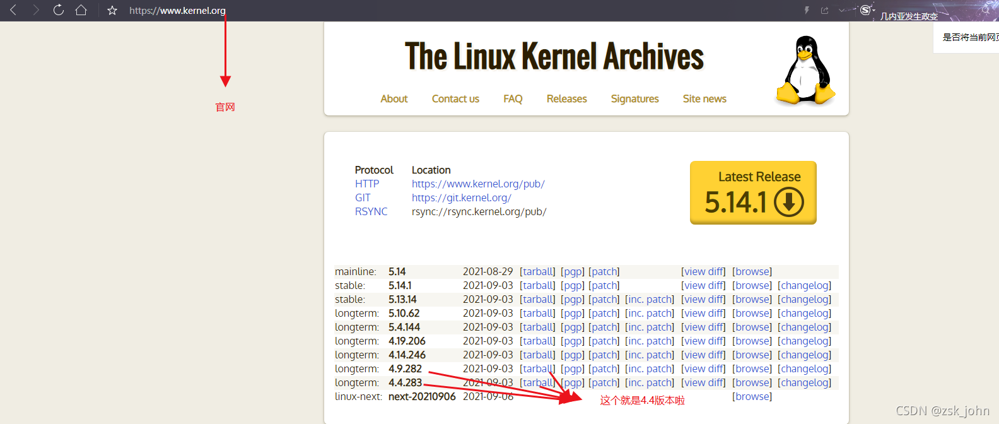

Linux的内核概念不用说大家也很清楚，正是内核版本的不同，才有Linux发行版本的说法，现在主流的centos应该都是centos7了，从centos7.2开始，内核版本为3.10，越往后内核版本越高。高版本的内核修复了许多的低版本内核的bug，因此，系统是需要提高内核版本的，从而提高安全性，稳定性，并增加更多的功能。

<!--more-->

通常来说，Linux是支持多版本内核共存的，无非是系统启动的时候应用哪个版本内核而已。

**关于内核：**

Linux 内核分两种：官方内核（通常是内核开发人员用）和各大 Linux 发行版内核（一般用户常用）。

**关于Linux内核版本号：**

```
[root@centos7 ~]# uname -r
3.10.0-1127.19.1.el7.x86_64
```

查询得到的版本号为：3.10.0-1127.19.1.el7.x86_64

第一个组数字：3, 主版本号

第二个组数字：10, 次版本号，当前为稳定版本，一般这个数字为偶数表示稳定，奇数表示在开发版本，通常这样的不做生产使用。

第三个组数字：0, 修订版本号

第四个组数字：1127.19.1，表示发型版本的补丁版本

el7：则表示我正在使用的内核是 RedHat / CentOS 系列发行版专用内核 ，centos7

x86_64：采用的是适用64位的CPU的操作系统。

**内核版本的分类：**

**查看内核的种类在官网：**[The Linux Kernel Archives](https://www.kernel.org/)


- Prepatch：Prepatch 或 “RC” 内核是主要的内核预发行版本，主要针对内核开发人员和 Linux 爱好者。必须从源代码进行编译，并且通常包含必须在可以放入稳定版本之前进行测试的新功能。Prepatch 内核由 Linus Torvalds 维护和发布。
- Mainline：Mainline 主线树由 Linus Torvalds 维护。这个版本的内核会引入所有新功能。新的 Mainline 内核每 2-3 个月发布一次。
- Stable：每个主线内核被发布后，即被认为是“stable”。任何对 stable 内核的 BUG 修复都会从 Mainline 主线树中回溯并由指定的 stable 内核维护人员使用。 在下一个主线内核可用之前，通常只有几个 BUG 修复内核版本 - 除非它被指定为“longterm maintenance kernel（长期维护内核）”。stable 内核更新按需发布，通常每月 2-3 次。
- Longterm：通常会提供几个“longterm maintenance”内核版本，用于修复旧版内核的 BUG。这些内核只会修复重大 BUG，并且不会频繁发布版本。
- 下载地址为官网网站：如下图




**内核的选择：** 

根据上面的内核的种类的介绍，我们可以知道稳定的并且大部分bug已经修复的内核种类为longterm，因此在上面的第二章表内挑选一个longterm种类的内核即可，下面的实验是使用的5.4.69的tarball源码包。（顺带一说，上表也说了，下一个版本内核发布时间为2020-10-02）。

选择的理由是：longterm是长期稳定版本，并且大部分bug也修复了，主版本也够高，内核是向下兼容的，并且可以体验到更多的新功能。（第一张表说的是对应版本提供的发行人员名字，发行日期，最终支持时间--过了那个时间就没人管了）

**内核的升级：（两种方法：内核编译和yum更新）**

通常，centos是可以多内核共存的，因此不建议删除旧版本的内核，仅仅安装新版本内核后，grub选择新版本内核进入系统并使用即可，（谁也不敢保证新的内核就一定好用，毕竟留个旧的，以后想反悔也简单一点）

**第一种方法：yum 升级安装的方式（简单）**

步骤 1：检查已安装的内核版本

uname -rs,给出的结果为：Linux 3.10.0-1127.19.1.el7.x86_64

步骤 2：在 CentOS 7 中升级内核

CentOS 允许使用 ELRepo，这是一个第三方仓库，可以将内核升级到最新版本。

在 CentOS 7 上启用 ELRepo 仓库，运行如下命令：

```
rpm --import https://www.elrepo.org/RPM-GPG-KEY-elrepo.org   #导入该源的秘钥
rpm -Uvh http://www.elrepo.org/elrepo-release-7.0-2.el7.elrepo.noarch.rpm   #启用该源仓库
yum --disablerepo="\*" --enablerepo="elrepo-kernel" list available   #查看有哪些内核版本可供安装
```

输出如下：

```
[root@centos7 ~]# yum --disablerepo="\*" --enablerepo="elrepo-kernel" list available
Loaded plugins: fastestmirror
Loading mirror speeds from cached hostfile
 \* elrepo-kernel: mirrors.tuna.tsinghua.edu.cn
Available Packages
elrepo-release.noarch                            7.0-5.el7.elrepo                        elrepo-kernel
kernel-lt.x86_64                              4.4.238-1.el7.elrepo                      elrepo-kernel
kernel-lt-devel.x86_64                           4.4.238-1.el7.elrepo                      elrepo-kernel
kernel-lt-doc.noarch                            4.4.238-1.el7.elrepo                      elrepo-kernel
kernel-lt-headers.x86_64                          4.4.238-1.el7.elrepo                      elrepo-kernel
kernel-lt-tools.x86_64                           4.4.238-1.el7.elrepo                      elrepo-kernel
kernel-lt-tools-libs.x86_64                         4.4.238-1.el7.elrepo                      elrepo-kernel
kernel-lt-tools-libs-devel.x86_64                      4.4.238-1.el7.elrepo                      elrepo-kernel
kernel-ml-devel.x86_64                           5.8.13-1.el7.elrepo                      elrepo-kernel
kernel-ml-doc.noarch                            5.8.13-1.el7.elrepo                      elrepo-kernel
kernel-ml-headers.x86_64                          5.8.13-1.el7.elrepo                      elrepo-kernel
kernel-ml-tools.x86_64                           5.8.13-1.el7.elrepo                      elrepo-kernel
kernel-ml-tools-libs.x86_64                         5.8.13-1.el7.elrepo                      elrepo-kernel
kernel-ml-tools-libs-devel.x86_64                      5.8.13-1.el7.elrepo                      elrepo-kernel
perf.x86_64                                 5.8.13-1.el7.elrepo                      elrepo-kernel
python-perf.x86_64    
```

开始安装：

```
yum --enablerepo=elrepo-kernel install kernel-ml -y         #安装的是主线版本，该版本比较激进，慎重选择。版本号5.8.13
yum --enablerepo=elrepo-kernel install kernel-lt -y         #安装的长期稳定版本，稳定可靠，版本为4.4.238
```

两个yum命令选择一个安装。安装完毕后，重启机器，手动选择新安装的新版本哦！！！

步骤 3：设置 GRUB 默认的内核版本

为了让新安装的内核成为默认启动选项，你需要如下修改 GRUB 配置：

打开并编辑 `/etc/default/grub` 并设置 `GRUB_DEFAULT=0`。意思是 GRUB 初始化页面的第一个内核将作为默认内核。

```
GRUB_TIMEOUT=5
GRUB_DISTRIBUTOR="$(sed 's, release .\*$,,g' /etc/system-release)"
GRUB_DEFAULT=saved       #这里的saved改为0即可，重启后，默认就是你上次所选的版本了。
GRUB_DISABLE_SUBMENU=true
GRUB_TERMINAL_OUTPUT="console"
GRUB_CMDLINE_LINUX="rhgb quiet"
GRUB_DISABLE_RECOVERY="true"
```

执行命令：

```
grub2-mkconfig -o /boot/grub2/grub.cfg
```


**第二种方法：使用官网源码包编译安装**

root账号操作，编译这么重大的事，别的普通用户不用想的。

```
wget https://cdn.kernel.org/pub/linux/kernel/v5.x/linux-5.4.69.tar.xz     #下载得到这么一个xz包，解压它
```


```bash
tar -xf  linux-5.4.69.tar.xz  
```

进入解压出来的东西的目录内：

```bash
cd  linux-5.4.69
```

编译前的环境准备（安装编译依赖并升级所有软件）：

```bash
yum install gcc make ncurses-devel openssl-devel flex bison  elfutils-libelf-devel  -y
yum upgrade -y
```

查看现有的内核配置文件（我这里是已经rpm方式升级过了，因此，有两个内核配置文件，如果是yum upgrade -y 后，那么，应该有一个文件是config-3.10.0-693.el7.x86_64）：

```bash
[root@master boot]# pwd
/boot
[root@master boot]# ls config-*
config-3.10.0-693.el7.x86_64  config-5.16.9-1.el7.elrepo.x86_64
```


> cp /boot/config-3.10.0-693.el7.x86_64 .config      #复制内核配置文件到前面解压出来的目录内，这个文件是发行版自带的文件，比如我的内核原来查询出的是3.10.0-1127.19.1.el7.x86_64，这个是由于我使用命令 yum upgrade -y 升级的，最初的版本是3.10.0-693.el7.x86_64 （这里注意一下，这个命令是复制并改名， 是. config）

OK，环境准备完毕，开始正式安装了。

```
#make config（基于文本的最为传统的配置界面，不推荐使用） 
#make menuconfig（基于文本选单的配置界面，字符终端下推荐使用） 
#make xconfig（基于图形窗口模式的配置界面，Xwindow下推荐使用） 
#make oldconfig（如果只想在原来内核配置的基础上修改一些小地方，会省去不少麻烦）
```

下面的安装是选择使用 make menuconfig（上面的四个命令选择使用第二个）。

------

make menuconfig #该命令会出现一个简陋的菜单，类似bios菜单，其中可以进行功能挑选，具体的功能太多太多，不能一一介绍，懒人办法-默认即可。选择save，选择ok即可。


```
make -j `nproc` && make modules_install && make install      #内核全开，编译三连
```

编译时间比较长，我的四核CPU大概一个小时。编译完毕后， echo $? 下，看看是否正常，如返回0，重启机器，如别的数字，根据报错更正即可。开机菜单顺序问题参照第一种方法的最后处理步骤，不在多说了。

两种方法的优劣：

第一种方法简单，这是唯一优点。缺点是只能选择4.4.238和5.8.13这两种内核（源里有什么才可以选择，没有神仙都没办法）(2021年九月以后，此网络源里只有5.14和5.4两种内核)

第二种方法，编译，可选择的余地更多，并且更为灵活，可以选自己需要的模块编译进去嘛，就是难度比较高，需要比较了解内核才可以。

现在网络源的内核版本只有5.14和5.4啦

```bash
[root@overseas-net ~]# yum --disablerepo="*" --enablerepo="elrepo-kernel" list available
Loaded plugins: fastestmirror
Repodata is over 2 weeks old. Install yum-cron? Or run: yum makecache fast
Determining fastest mirrors
 * elrepo-kernel: hkg.mirror.rackspace.com
Available Packages
kernel-lt-doc.noarch                                                                  5.4.92-1.el7.elrepo                                                      elrepo-kernel
kernel-lt-headers.x86_64                                                              5.4.92-1.el7.elrepo                                                      elrepo-kernel
kernel-lt-tools.x86_64                                                                5.4.92-1.el7.elrepo                                                      elrepo-kernel
kernel-lt-tools-libs.x86_64                                                           5.4.92-1.el7.elrepo                                                      elrepo-kernel
kernel-lt-tools-libs-devel.x86_64                                                     5.4.92-1.el7.elrepo                                                      elrepo-kernel
kernel-ml.x86_64                                                                      5.10.10-1.el7.elrepo                                                     elrepo-kernel
kernel-ml-devel.x86_64                                                                5.10.10-1.el7.elrepo                                                     elrepo-kernel
kernel-ml-doc.noarch                                                                  5.10.10-1.el7.elrepo                                                     elrepo-kernel
kernel-ml-headers.x86_64                                                              5.10.10-1.el7.elrepo                                                     elrepo-kernel
kernel-ml-tools.x86_64                                                                5.10.10-1.el7.elrepo                                                     elrepo-kernel
kernel-ml-tools-libs.x86_64                                                           5.10.10-1.el7.elrepo                                                     elrepo-kernel
kernel-ml-tools-libs-devel.x86_64                                                     5.10.10-1.el7.elrepo                                                     elrepo-kernel
perf.x86_64                                                                           5.10.10-1.el7.elrepo                                                     elrepo-kernel
python-perf.x86_64                                                                    5.10.10-1.el7.elrepo                                                     elrepo-kernel
```
