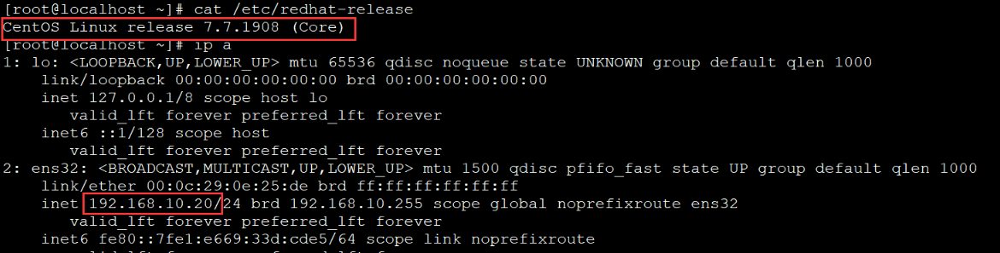
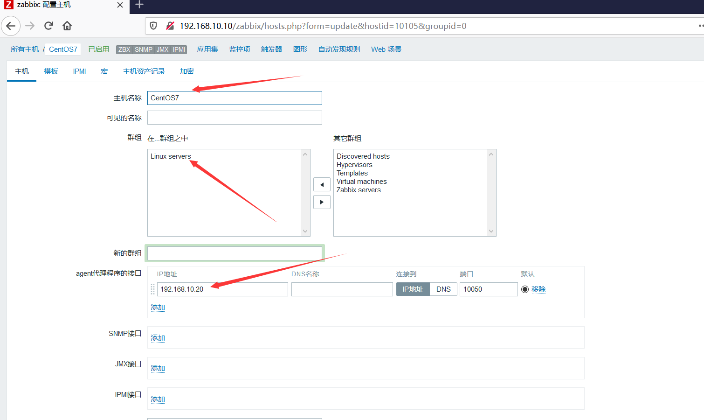
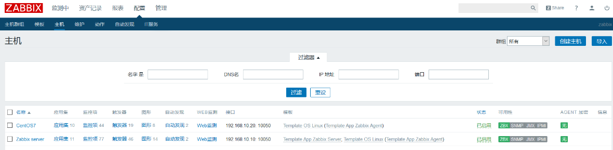

zabbix agent的安装方式主要有源码安装、rpm包安装、二进制包安装等多种方式，本文介绍YUM方式rpm包安装，此方式安装步骤简单、快捷。

<!--more-->

环境：




首先关掉相关安全设置：

```
[root@localhost ~]#setenforce 0
[root@localhost ~]#sed -i 's#SELINUX=enforcing#SELINUX=disabled#g' /etc/selinux/config
[root@localhost ~]#systemctl stop firewalld
[root@localhost ~]#systemctl disable firewalld
```

### 安装3.2版本的zabbix的yum源

```
[root@localhost ~]#rpm -ivh https://mirrors.aliyun.com/zabbix/zabbix/3.2/rhel/7/x86_64/zabbix-release-3.2-1.el7.noarch.rpm
```

### 修改zabbix的repo文件中的源地址

```
[root@localhost ~]#vim /etc/yum.repos.d/zabbix.repo
```

```
[zabbix]
name=Zabbix Official Repository - $basearch
baseurl=http://mirrors.aliyun.com/zabbix/zabbix/3.2/rhel/7/$basearch/
enabled=1
gpgcheck=1
gpgkey=file:///etc/pki/rpm-gpg/RPM-GPG-KEY-ZABBIX-A14FE591

[zabbix-non-supported]
name=Zabbix Official Repository non-supported - $basearch 
baseurl=http://mirrors.aliyun.com/zabbix/non-supported/rhel/7/$basearch/
enabled=1
gpgkey=file:///etc/pki/rpm-gpg/RPM-GPG-KEY-ZABBIX
gpgcheck=1
```

### 安装zabbix-agent

```
[root@localhost ~]#yum -y install zabbix-agent
```

### 修改agent的配置文件

修改3个地方:
Server是服务器地址
ServerActive是开启主动模式，也写服务地址
Hostname写上客户端服务器的主机名，这里写ip地址

```
[root@localhost ~]#vim /etc/zabbix/zabbix_agentd.conf
```

```
Server=192.168.10.10
ServerActive=192.168.10.10
Hostname=192.168.10.20
```

### 启动zabbix-agent

```
[root@localhost ~]#systemctl enable zabbix-agent.service
[root@localhost ~]#systemctl start zabbix-agent.service
```

在zabbix后台创建主机：




创建完成：


