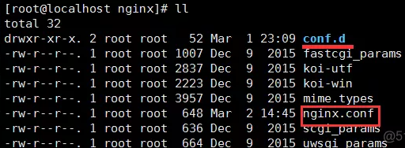

Phabricator是一套基于Web的软件开发协作工具，包括代码审查工具Differential，资源库浏览器Diffusion，变更监测工具Herald，Bug跟踪工具Maniphest和维基工具Phriction。Phabricator可与Git、Mercurial、Subversion集成使用。
<!--more-->

环境：


首先搭建LNMP环境：

1.安装MySQL
1.1安装（需要5.5或更新的版本）：

```
#wget http://dev.mysql.com/get/mysql-community-release-el7-5.noarch.rpm
#rpm -ivh mysql-community-release-el7-5.noarch.rpm
#yum install mysql-community-server
```

安装成功后重启mysql服务：

```
#service mysqld restart
```

首次登录没有密码：

```
#mysql -u root
```

设置密码，无需重启即可生效：

```
mysql> set password for 'root'@'localhost' =password('password');
```

2.安装PHP
需要5.5或更新的版本
2.1编译源码：
新建一个目录,下载源码并解压：

```
#mkdir /twy
#cd /twy
#wget  http://cn2.php.net/distributions/php-5.6.30.tar.gz
#tar zxvf php-5.6.30.tar.gz
```

安装依赖库：

```
#yum install gcc automake autoconf libtool make –y  
#yum install gcc gcc-c++ glibc –y  
#yum install libmcrypt-devel mhash-devel libxslt-devel –y  
#yum install libjpeg libjpeg-devel libpng libpng-devel freetype freetype-devel libxml2 libxml2-devel –y  
#yum install zlib zlib-devel glibc glibc-devel glib2 glib2-devel bzip2 bzip2-devel –y  
#yum install ncurses ncurses-devel curl curl-devel e2fsprogs e2fsprogs-devel -y
#yum install php-devel 
#yum install krb5 krb5-devel libidn libidn-devel openssl openssl-devel -y 
#yum install mysql-devel（防止之后需要安装mysql扩展时找不到mysql.h）
#yum install -y openssl openssl-devel 
```

在解压目录执行configure后执行make install：

```
#cd /twy/php-5.6.30
#./configure --prefix=/usr/local/php-5.6.30 --enable-fpm --with-mcrypt --enable-mbstring --disable-pdo --enable-pdo --with-curl --disable-debug --disable-rpath --enable-inline-optimization --with-bz2 --with-zlib --enable-sockets --enable-sysvsem --enable-sysvshm --enable-pcntl --enable-mbregex --with-mhash --enable-zip --with-pcre-regex --with-mysql --with-mysqli --with-gd --with-jpeg-dir -with-gettext --enable-xml --enable-freetype --with-openssl --enable-apcu --enable-opcache --with-mysql=mysqlnd --with-mysqli=mysqlnd --with-pdo-mysql=mysqlnd
#make
#make install
```

2.2 php.ini配置
首先将刚才解压的文件夹中将php.ini-development拷贝到/usr/local/php/lib目录并命名为php.ini：

```
#cp /twy/php-5.6.30/php.ini-development /usr/local/php-5.6.30/lib/php.ini
```

打开配置文件

```
vim /usr/local/php-5.6.30/lib/php.ini
```

修改以下内容：

```
always_populate_raw_post_data = -1
post_max_size = 32M
date.timezone =Asia/Shanghai
```

2.3 php-fpm.conf配置
首先将/usr/local/php-5.6.30/etc/php-fpm.conf.default拷贝一份并命名为php-fpm.conf:

```
#cd /usr/local/php-5.6.30  
#cp etc/php-fpm.conf.default etc/php-fpm.conf 
```

接着对php-fpm.conf做如下更改（ 注意：不能另外加这几句，只能在原语句上去掉注释后修改）：

```
;pid = run/php-fpm.pid这一句取消注释，并改为：pid = /usr/local/php-5.6.30/var/run/php-fpm.pid；
;error_log = log/php-fpm.log这一句取消注释，并改为：error_log = /usr/local/php-5.6.30/var/log/error-log.log
user = nobody改为：user = nginx
group = nobody改为：group = nginx
;catch_workers_output = yes这一句取消注释，改为：catch_workers_output = yes
```

2.4 启动PHP：

```
#/usr/local/php-5.6.30/sbin/php-fpm
```

查看端口是否在监听：

```
[root@localhost nginx]# netstat -lntp | grep 9000  
tcp        0      0 127.0.0.1:9000          0.0.0.0:*               LISTEN      16124/php-fpm: pool 
```

关闭php-fpm：

```
kill -INT `cat /usr/local/php5/var/run/php-fpm.pid`
```

或者

```
pkill php-fpm
```

ps：可以用PHP -v看下现在用的是不是你安装的php,有时用的是系统自带的，启动phabricator后还是不能查看那个访问页面。执行这条语句可以使用自己安装的：

```
ln -s /usr/local/php-5.6.30/bin/php /usr/bin/php 
```

3.安装nginx
3.1 gcc 安装
安装 nginx 需要先将官网下载的源码进行编译，编译依赖 gcc 环境，如果没有 gcc 环境，则需要安装：

```
yum install  -y gcc-c++
```

3.2 PCRE pcre-devel 安装
PCRE(Perl Compatible Regular Expressions) 是一个Perl库，包括 perl 兼容的正则表达式库。nginx 的 http 模块使用 pcre 来解析正则表达式，所以需要在 linux 上安装 pcre 库，pcre-devel 是使用 pcre 开发的一个二次开发库。nginx也需要此库。

```
yum install -y pcre pcre-devel
```

3.3 zlib 安装
zlib 库提供了很多种压缩和解压缩的方式， nginx 使用 zlib 对 http 包的内容进行 gzip ，所以需要在 Centos 上安装 zlib 库。

```
yum install -y zlib zlib-devel
```

3.4 OpenSSL 安装
OpenSSL 是一个强大的安全套接字层密码库，囊括主要的密码算法、常用的密钥和证书封装管理功能及 SSL 协议，并提供丰富的应用程序供测试或其它目的使用。
nginx 不仅支持 http 协议，还支持 https（即在ssl协议上传输http），所以需要在 Centos 安装 OpenSSL 库。

```
yum install -y openssl openssl-devel
```

3.5下载nginx并编译

```
#wget -c https://nginx.org/download/nginx-1.10.1.tar.gz
#tar -zxvf nginx-1.10.1.tar.gz
#cd nginx-1.10.1
#./configure
#make
#make install
```

nginx常用命令：

```
nginx -s stop       快速关闭Nginx，可能不保存相关信息，并迅速终止web服务。
nginx -s quit       平稳关闭Nginx，保存相关信息，有安排的结束web服务。
nginx -s reload     因改变了Nginx相关配置，需要重新加载配置而重载。
nginx -s reopen     重新打开日志文件。
nginx -c filename   为 Nginx 指定一个配置文件，来代替缺省的。
nginx -t            不运行，而仅仅测试配置文件。nginx 将检查配置文件的语法的正确性，并尝试打开配置文件中所引用到的文件。
nginx -v            显示 nginx 的版本。
nginx -V            显示 nginx 的版本，编译器版本和配置参数
```

3.6配置nginx：
默认配置文件是nginx.conf,可以在这里面配置，但是如果把所有内容都放在nginx.conf里就太乱了，我们可以把其他的配置内容放在conf.d目录下。只要你的默认配置中把conf.d目录include进去就行了。




在conf.d中新建一个pha.example.com.conf，内容如下：

	server {
	server_name phabricator.example.com;#域名
	listen 端口（记得加到防火墙里）;
	root     你下载phabricator的目录/phabricator/webroot;
	
	location / {
		index index.php;
		rewrite ^/(.*)$ /index.php?__path__=/$1 last;
	}
	
	location /index.php {
		fastcgi_pass   127.0.0.1:9000;
		fastcgi_index   index.php;
	
		#required if PHP was built with --enable-force-cgi-redirect
		fastcgi_param  REDIRECT_STATUS    200;
	
		#variables to make the $_SERVER populate in PHP
		fastcgi_param  SCRIPT_FILENAME    $document_root$fastcgi_script_name;
		fastcgi_param  QUERY_STRING       $query_string;
		fastcgi_param  REQUEST_METHOD     $request_method;
		fastcgi_param  CONTENT_TYPE       $content_type;
		fastcgi_param  CONTENT_LENGTH     $content_length;
	
		fastcgi_param  SCRIPT_NAME        $fastcgi_script_name;
	
		fastcgi_param  GATEWAY_INTERFACE  CGI/1.1;
		fastcgi_param  SERVER_SOFTWARE    nginx/$nginx_version;
	
		fastcgi_param  REMOTE_ADDR        $remote_addr;
	  }
	}
启动nginx

```
#/usr/sbin/nginx -c nginx.conf所在的目录/nginx.conf
```

将phabricator下载到一个目录下，配置nginx和mysql会用到这个目录。

```
 somewhere/ $ git clone https://github.com/phacility/libphutil.git
 somewhere/ $ git clone https://github.com/phacility/arcanist.git
 somewhere/ $ git clone https://github.com/phacility/phabricator.git
```

4.1 phabricator连通mysql

到phabricator的安装目录下：

```
./bin/config set mysql.host 'localhost'
./bin/config set mysql.port '3306'
./bin/config set mysql.user 'root'
./bin/config set mysql.pass 'root的密码'

./bin/storage upgrade
```

5.邮件设置
5.1 配置邮件发送来源

```
bin/config set metamta.default-address admin@example.com
```

5.2 生成 mailers.json 文件：

```
#cat << EOF > mailers.json
[
	 {
		 "key": "stmp-mailer",
		 "type": "smtp",
		 "options": {
			 "host": "smtp.exmail.qq.com",
			 "port": 465,
			 "user": "admin@example.com",
			 "password": "admin",
			 "protocol": "ssl"
		 }
	 }
]
EOF
```

5.3 导入邮件 smtp 配置

```
bin/config set cluster.mailers --stdin < mailers.json
```

5.4 发送测试邮件：

```
#bin/mail send-test --to lb@example.com --subject hello < mailers.json
Reading message body from stdin...
Mail sent! You can view details by running this command:
phabricator/ $ ./bin/mail show-outbound --id 12
```

6.设置管理员和认证方式
这时，浏览器应该可以访问Phabricator了： http://mydomain.com
作为第一个访问用户，可创建管理员账号。
注意，管理员不是标准用户。
如果能创建管理员，说明安装过程成功。
这时可以添加认证方式（Auth Provider）。phabricator提供了多种认证方式，其中最基本的是用户名／密码的provider。
作为管理员，在主页左侧栏选择Auth，访问Auth，选择Add Provider ，然后添加 Username/Password Provider即可。

7.Phabricator中文汉化
进入phabricator/src/extensions/目录下，rm -fr README，再执行下面git命令，然后在客户端设置里，选择语言中文即可．

```
git clone https://github.com/wanthings/phabricator-zh_CN.git ./
```

8.配置完成后，进入web页面左上角有很多杂项，可根据提示修改即可：


至此，Phabricator服务部署完成。
