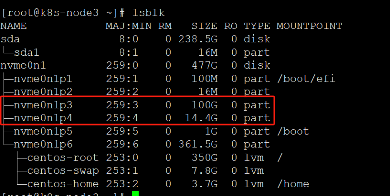
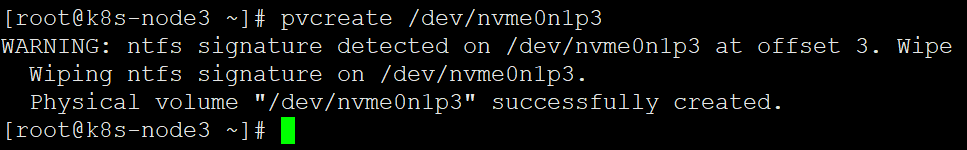
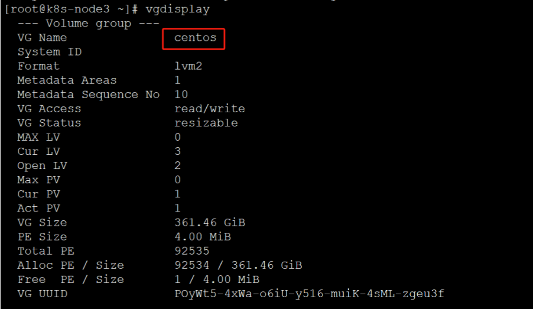
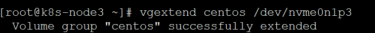
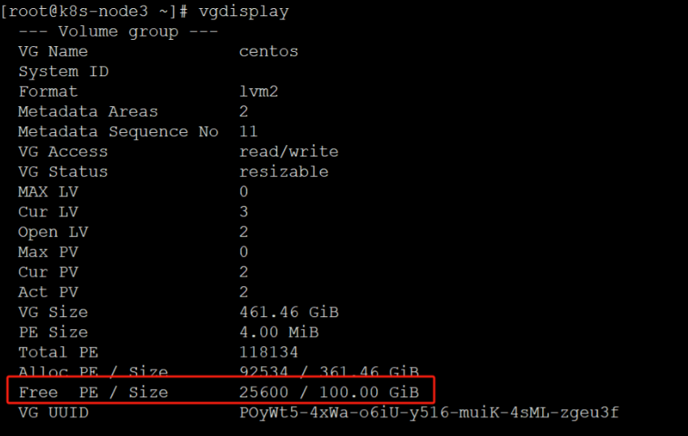
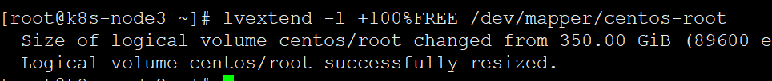
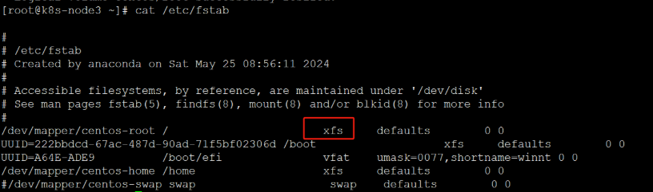
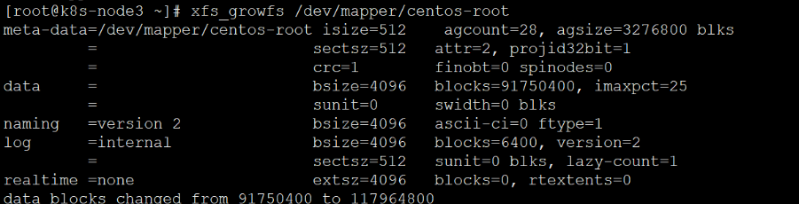
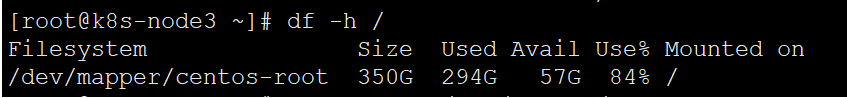
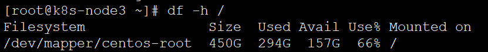

内网机器磁盘可用空间不足，发现磁盘分区不合理，且有的分区磁盘未挂载使用

<!--more-->




 把分区初始化为物理卷，以便被 LVM 使用：

```
pvcreate /dev/nvme0n1p3
```



查看卷组信息：



扩展卷组：

```
vgextend centos /dev/nvme0n1p3
```




再查看卷组信息，发现有空闲的空间了：




扩容空间：把全部空间扩容给 /dev/mapper/centos-root

```
lvextend -l +``100``%FREE /dev/mapper/centos-root
```




看一下你的分区文件系统格式，运行cat /etc/fstab：




扩展/dev/mapper/centos-root文件系统：

如果是ext文件系统：`resize2fs /dev/mapper/centos-root`
如果是XFS文件系统：`xfs_growfs /dev/mapper/centos-root`




查看文件系统是否扩容成功：

扩容前：



扩容后：

