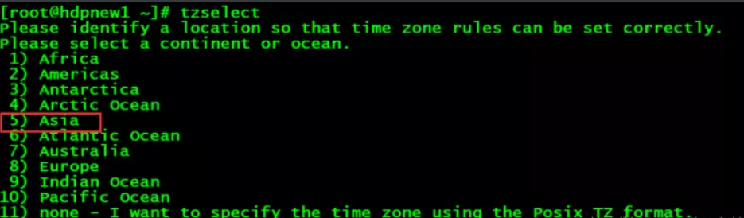
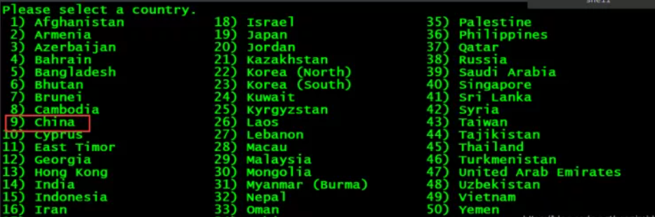
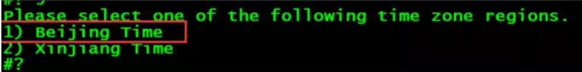
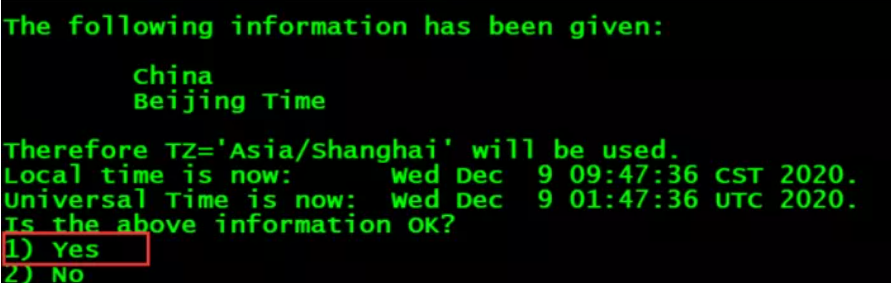

中国标准时间(CST)比世界协调时间(UTC)早08:00小时。该时区为标准时区时间，主要用于亚洲。

<!--more-->

直接输入以下命令：

```
tzselect
```

然后选择5




然后选择9



然后选择1



然后继续选择1



最后执行下面的命令：

```
TZ='Asia/Shanghai';
export TZ
#修改配置文件的时区
vi /etc/sysconfig/clock
#填写如下信息
ZONE=Asia/Shanghai
#删除localtime
rm -f /etc/localtime
#链接文件
ln -sf /usr/share/zoneinfo/Asia/Shanghai /etc/localtime
#查看时间命令，如果是当前时间，则表示时间同步成功
date
#查看当地时间和世界时间
timedatectl status
```


