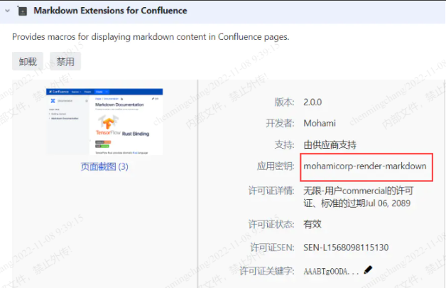

本章说一下confluence的插件如何破解。

<!--more-->

### 环境配置

1.下载atlassian-agent.jar放置在你不会删除的任意位置。
全局设置：

```
[root@nbu upgrade-confluence]# tailf -1 /etc/profile
export JAVA_OPTS="-javaagent:/usr/local/confluence/atlassian-agent.jar ${JAVA_OPTS}"
[root@nbu upgrade-confluence]# source /etc/profile
```

或者：
可以把：export JAVA_OPTS="-javaagent:/usr/local/confluence/ ${JAVA_OPTS}"这样的命令放到服务安装所在bin目录下的setenv.sh或setenv.bat（供windows使用）中。
或者：
还可以直接命令行执行：JAVA_OPTS="-javaagent:/usr/local/confluence/atlassian-agent.jar" /path/to/start-confluence.sh来启动服务。
3.重启服务
4.查看是否配置成功，使用ps -ef |grep java查看是否带有 -javaagent参数，且查看日志catalina.out，搜索agent working，无报错情况。

### 破解步骤

1.在确认环境配置好的前提下，执行以下命令，这里以confluence的mohamicorp-render-markdown 插件为例。

```
java -jar atlassian-agent.jar -p mohamicorp-render-markdown -m admin@chuangyue.cn -n name   -o https://mohami.io/  -s B93T-TNVL-Q1QC-LZ3N
```

关于参数详情可以运行java -jar atlassian-agent.jar查看。
-p 指的是应用密钥/插件关键字，这里mohamicorp-render-markdown

-m 指的是邮箱，随便填写即可。
-n 指的是名字，随意填写
-o 指的是提供提供该产品的开发者，具体指的是上图中的开发者。
-s 是你的server-id,可以在的授权细节中查看。



运行后会得到如下所示：

```
[root@nbu upgrade-confluence]# java -jar atlassian-agent.jar -p mohamicorp-render-markdown -m admin@chuangyue.cn -n name   -o https://mohami.io/  -s B93T-TNVL-Q1QC-LZ3N
 
====================================================
=======        Atlassian Crack Agent         =======
=======           https://zhile.io           =======
=======          QQ Group: 30347511          =======
====================================================
 
Your license code(Don't copy this line!!!):
 
AAABTQ0ODAoPeJx9kUFvgjAYhu/9FSQ7VylkTk2abEMOJohzoIfdavmUZlDI1+LGfv06wcuSLWn7H
Zo+75und3kHXgatx3yPzZYsWIYzL8pyL/DZgqRdfQTcnvYG0HDKyEYobUELLSH+bBX2K2GBB/58Q
f0Ht0iiJGjzx2XdlKJWssGWIugCkNYC34vmQ0/AYbFFZYBb7ICswEhUrVWN5ntdqVpZKLxqoHvH3
iutbc1yOv0qVQUT1fwHz6xAh+cnURkgUaOtkDYVNXDtDpIBXgDXK/68CHOap4eE7tguoslbmJItn
oVWRlyb3EKHLJc6vdFiZ6bioqiVfpRlJ/S572AiNYkQrm9HF8y5WFDmkyxOuds0YfezOfNDN/wwI
PFFVN0QNrQdheZ9C9fG0XaziV+j9VNCXjqUpTDwG/2PCddUXUbFo8yD+9qfuOAb+2SxgDAtAhUAk
NaZ1D/IFPRzMP4dpn4dsrEtQ60CFHDHThIq23PE4kdA6aHvKzM9SM7wX02gg
```

然后复制生成的license，完成破解。
此方法破解可以在插件升级后依旧是破解状态。

### 异常处理

如果你之前不是一个干净的jira或confluence，你加了java环境变量后可能会起不来，通常看日志里会报License问题，原因在于你之前已经录进了一些license，而这license与现在的agent冲突，解决的办法是：根据日志里报出的license，你去你的数据库里搜，找到并删除，之后重启进入系统后，用它的keygen重新算license，然后输入就可以了。
