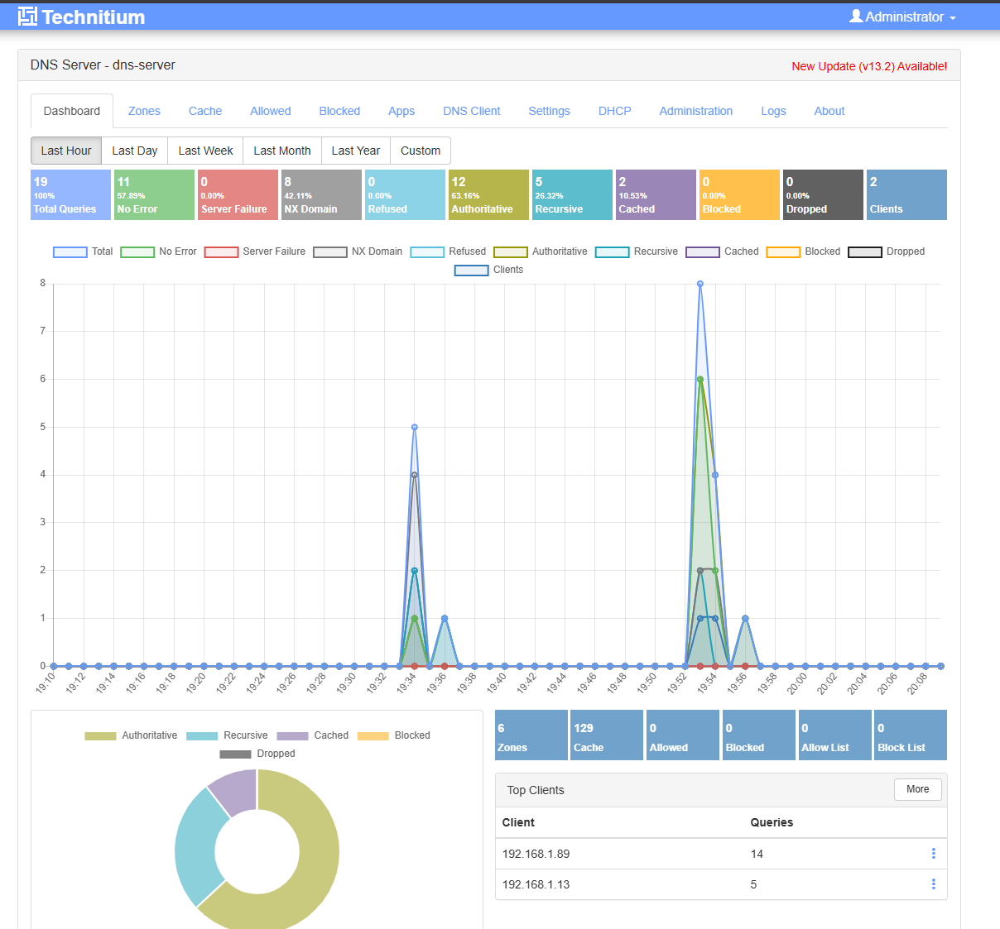
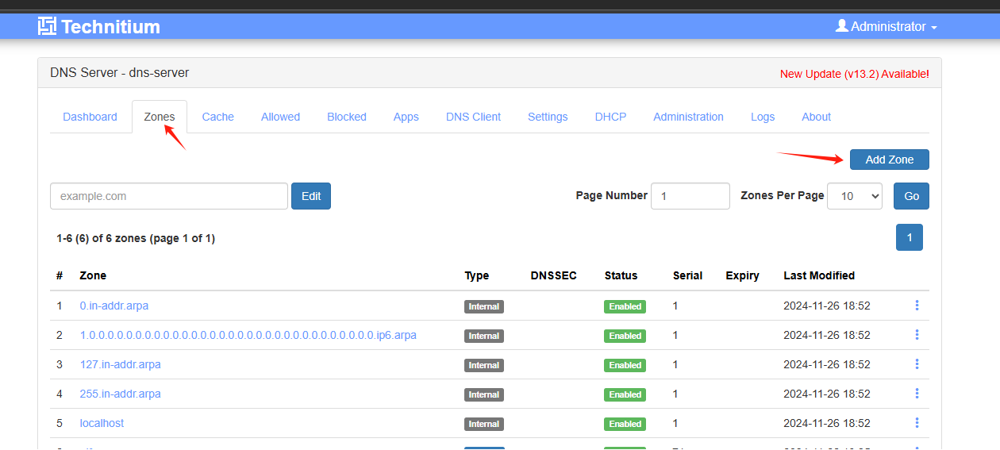
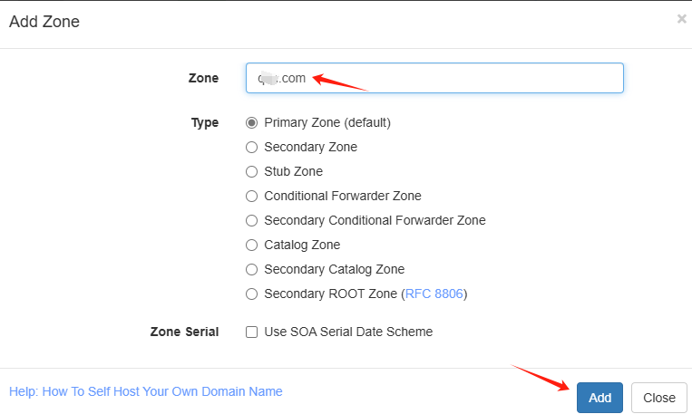
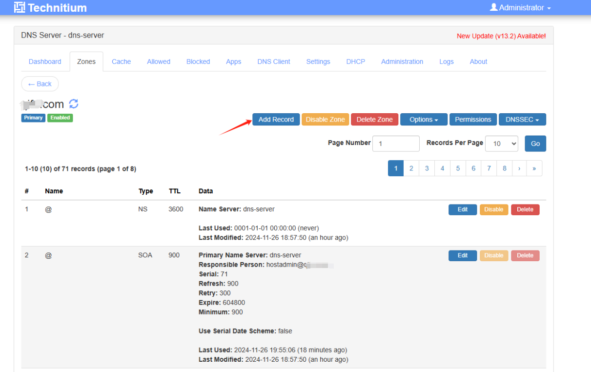
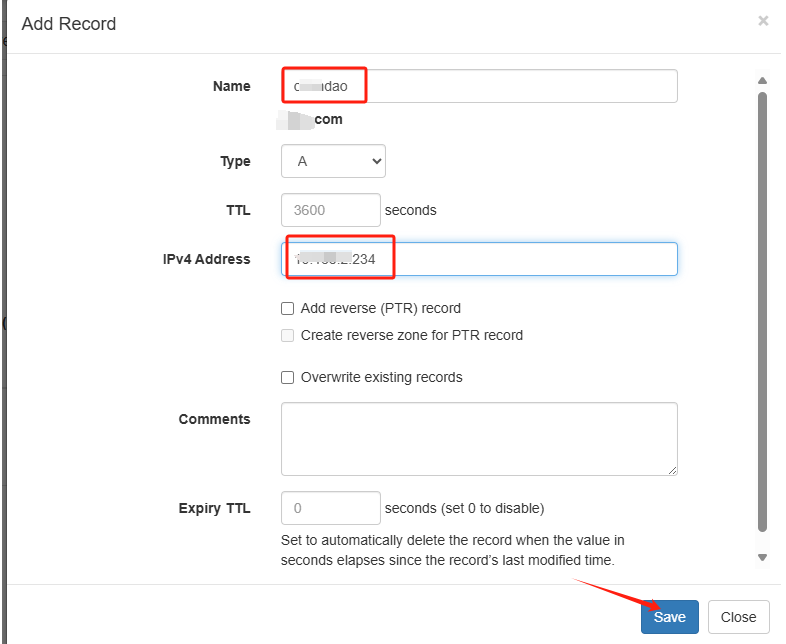

之前已经发过一篇DNS服务器的部署教程，最近发现一个通过docker-compose启动的DNS服务，相对简单，也能实现需求，记录一下。

<!--more-->

通过docker-compose部署

先创建网络：

```bash
docker network create devopsnetwork
```

创建docker-compose.yml文件：

```
version: '3.1'
services:
  dns-server:
    container_name: dns_server_13_1
    hostname: dns-server
    restart: always
    image: swr.cn-north-4.myhuaweicloud.com/ddn-k8s/docker.io/technitium/dns-server:13.1
    ports:
      - "5380:5380/tcp" #DNS web console (HTTP)
      - "53:53/udp" #DNS service
      - "53:53/tcp" #DNS service
    environment:
      - TZ=Asia/Shanghai
      - DNS_SERVER_LOG_USING_LOCAL_TIME=true
      - DNS_SERVER_DOMAIN=dns-server #The primary domain name used by this DNS Server to identify itself.
      - DNS_SERVER_ADMIN_PASSWORD=devops6666 #DNS web console admin user password.
    sysctls:
      - net.ipv4.ip_local_port_range=1024 65000
    volumes:
      - ./data:/etc/dns
    networks:
      - devopsnetwork
 
networks:
  devopsnetwork:
    external: true
```

启动服务：

```
docker compose up -d
```


添加解析：

启动完成后通过IP+端口访问web界面：



点击Zones-Add Zone



填写域名：



添加解析：



填写相关信息：



保存即可。

注意：设置此DNS服务器为DNS1时还需要设置DNS2为202.96.128.86或114.114.114.114才可以访问外部解析