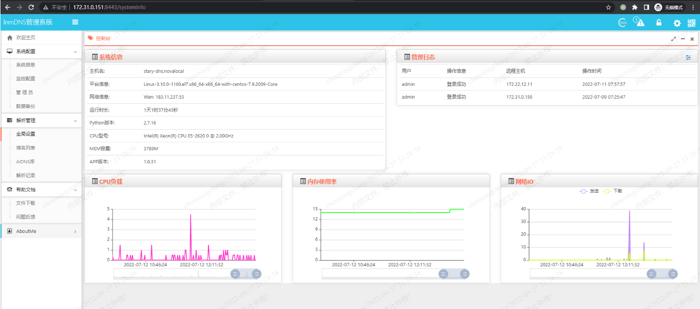

dns服务器就是域名服务器，它可以把用户的网站地址解析成相应的IP地址。

<!--more-->

DNS服务部署：

1.安装LnmOS初始化环境：

```
curl -o - 'https://raw.githubusercontent.com/fxtxkktv/fxtxkktv.github.io/master/files/Install_LnmOS_env.sh'|bash
```

Python安装失败可手动安装，Python包会下载到/tmp目录，需要先安装依赖[libdb4-4.8.30-13.el7.x86_64.rpm](http://wiki.stary.ltd/download/attachments/66814873/libdb4-4.8.30-13.el7.x86_64.rpm?version=1&modificationDate=1657632308000&api=v2)，再安装Python，再用yum安装python-pip。

2.获取主程序：

```
git clone https://github.com/fxtxkktv/lnmDNS.git
```

进入程序目录：

```
cd lnmDNS
```

创建程序独立运行Python环境：

```
virtualenv -p /opt/Py27lnmos/bin/python venv
```

进入virtualenv环境：

```
source venv/bin/activate
```

安装DNS服务：

```
yum -y install bind bind-sdb bind-utils
```

named服务自启动：

```
systemctl enable named
```

安装Python程序扩展包：

```
pip install -r readme/requirements.txt
```

3.创建数据库并恢复数据模版

[创建数据库]:

```
mysql -u root -p -e "create database lnmdns"
```

[恢复数据模版]:

```
mysql -u root -p lnmdns < readme/db_schema.sql
```

[配置数据库连接及其他]:

```
vim config/config.ini
```

lnmDNS服务默认不支持特殊符号解析，只支持字母和数字，需修改一下/root/lnmDNS/views/recordconf.tpl文件：

```
<input type="text" class="form-control" onkeyup="value=value.replace(/[^\w\.\@]/ig,'')" id="host" name="host" placeholder="" required>
 
改为
 
<input type="text" class="form-control" οnkeyup="value=value.replace(//s/g,'')" id="host" name="host" placeholder="" required>
```

4.正式运行程序：

[程序调试]：

```
python main.py
```

[后台运行]:

```
startweb.sh restart
```

[前端访问]：主机ip:8443  

默认用户名：admin 密码: admin




**启停命令：**

启动服务命令：

```
/root/lnmDNS/startweb.sh start
```

关闭服务命令：

```
/root/lnmDNS/startweb.sh stop
```

状态监控：

```
/root/lnmDNS/startweb.sh status
```

