### 简介

Docker 是一个开源的应用容器引擎，让开发者可以打包他们的应用以及依赖包到一个可移植的容器中，然后发布到任何流行的 Linux 机器上，也可以实现虚拟化。容器是完全使用沙箱机制，相互之间不会有任何接口。几乎没有性能开销，可以很容易地在机器和数据中心中运行。

<!--more-->

### Docker基本组成

#### 镜像(Image)

镜像，就是面向对象中的类，相当于一个模板。从本质上来说，镜像相当于一个文件系统。Docker 镜像是一个特殊的文件系统，除了提供容器运行时所需的程序、库、资源、配置等文件外，还包含了一些为运行时准备的一些配置参数（如匿名卷、环境变量、用户等）。镜像不包含任何动态数据，其内容在构建之后也不会被改变。

#### 容器(Container)

容器，就是类创建的实例，就是依据镜像这个模板创建出来的实体。容器的实质是进程，但与直接在宿主执行的进程不同，容器进程运行于属于自己的独立的命名空间。因此容器可以拥有自己的root 文件系统、自己的网络配置、自己的进程空间，甚至自己的用户ID 空间。容器内的进程是运行在一个隔离的环境里，使用起来，就好像是在一个独立于宿主的系统下操作一样。这种特性使得容器封装的应用比直接在宿主运行更加安全。

#### 仓库(Repository)

仓库，从认识上来说，就好像软件包上传下载站，有各种软件的不同版本被上传供用户下载。镜像构建完成后，可以很容易的在当前宿主机上运行，但是，如果需要在其它服务器上使用这个镜像，我们就需要一个集中的存储、分发镜像的服务，Docker Registry 就是这样的服务。

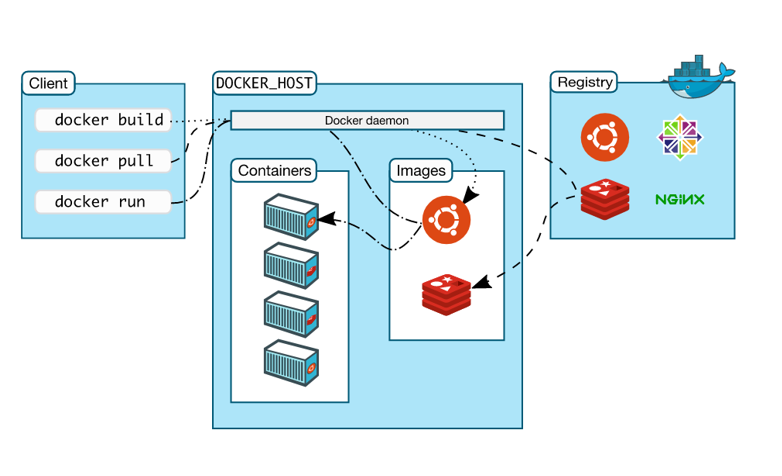

### Docker的优势

1.更高效的利用系统资源：由于容器不需要进行硬件虚拟以及运行完整操作系统等额外开销，Docker 对系统资源的利用率更高。无论是应用执行速度、内存损耗或者文件存储速度，都要比传统虚拟机技术更高效。因此，相比虚拟机技术，一个相同配置的主机，往往可以运行更多数量的应用。

2.更快速的启动时间：传统的虚拟机技术启动应用服务往往需要数分钟，而Docker 容器应用，由于直接运行于宿主内核，无需启动完整的操作系统，因此可以做到秒级、甚至毫秒级的启动时间。

3.一致的运行环境：开发过程中一个常见的问题是环境一致性问题。由于开发环境、测试环境、生产环境不一 致，导致有些bug 并未在开发过程中被发现。而Docker 的镜像提供了除内核外完整的运行时环境，确保了应用运行环境一致性，从而不会再出现这类问题。

4.持续交付和部署：Docker是build once，run everywhere. 使用Docker 可以通过定制应用镜像来实现持续集成、持续交付、部署。开发人员可以通过Dockerfile 来进行镜像构建，并结合持续集成(Continuous Integration) 系统进行集成测试，而运维人员则可以直接在生产环境中快速部署该镜像。

5.更轻松的迁移：Docker 使用的分层存储以及镜像的技术，使得应用重复部分的复用更为容易，也使得应用的维护更新更加简单，基于基础镜像进一步扩展镜像也变得非常简单。

传统开发流程:

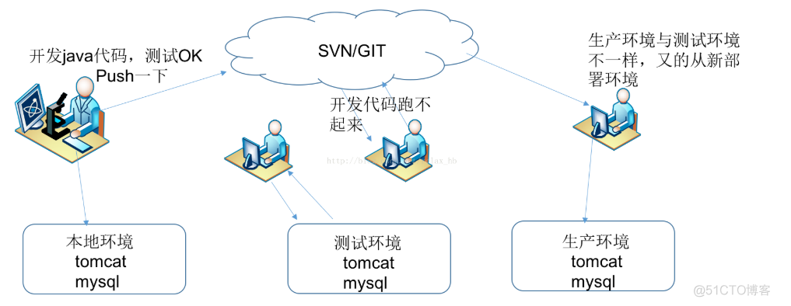

Docker环境开发流程:

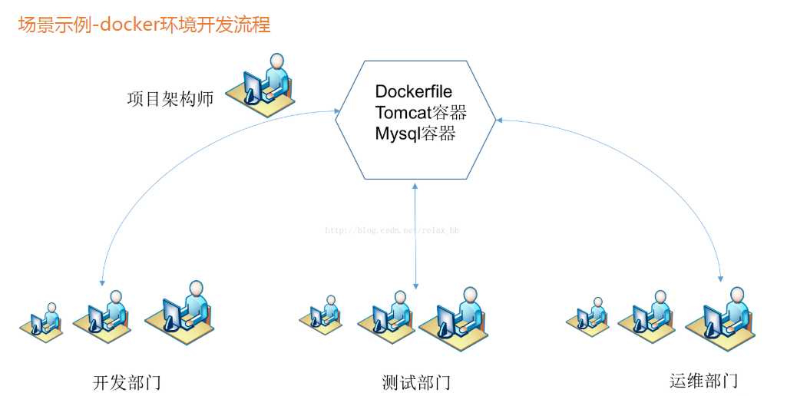

### 与传统虚拟机对比

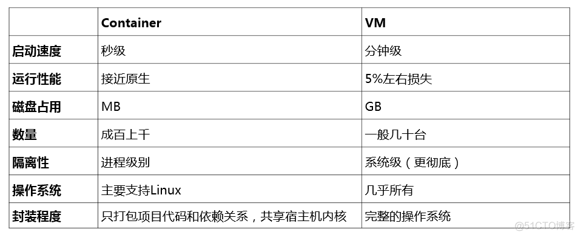

### Docker命令

#### 创建镜像

1.1基于已有的镜像容器创建

```
docker commit [options] container [repository[:tag]]
```


	option:
	-a,--author=“”       #作者信息
	-m,--message=“”      #提交信息
	-p,--pause=true        #提交时暂停容器运行
1.2基于本地模板导入创建

    docker load < ***.tar  --本地模板文件tar
1.3基于Dockerfile文件构建镜像

    docker build -t image-name basedir
#### 删除镜像

	docker rmi image     #image可以是标签或者ID
	docker rmi –f image    #强制删除镜像
注意：用docker rmi 命令删除镜像时，首先要删除容器，再删除镜像。否则会提示镜像在容器中运行。

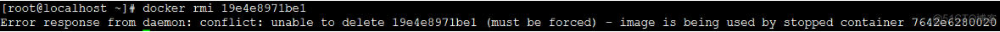

镜像管理指令:

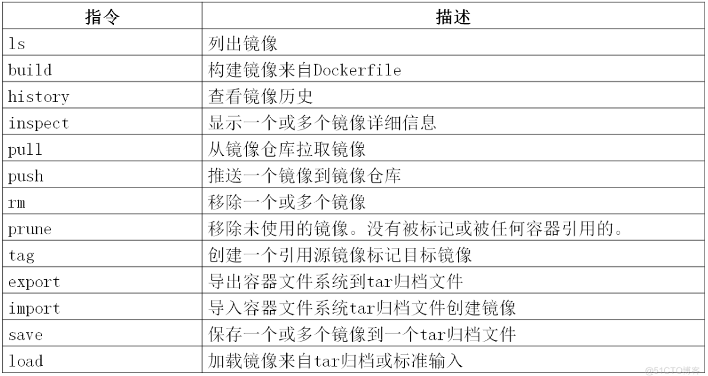

#### 创建/启动/停止/删除容器

	docker  create image   #创建的容器是停止状态
	docker  start/stop container_id     #启动/停止容器
	docker  run image         #创建并启动容器
	docker rm container_id    #删除容器
创建容器常用选项

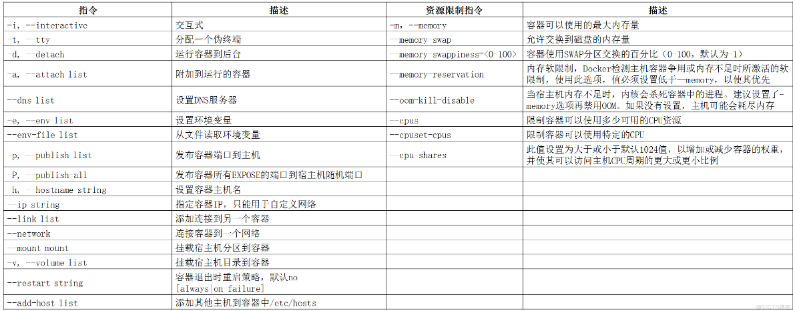

管理容器常用命令

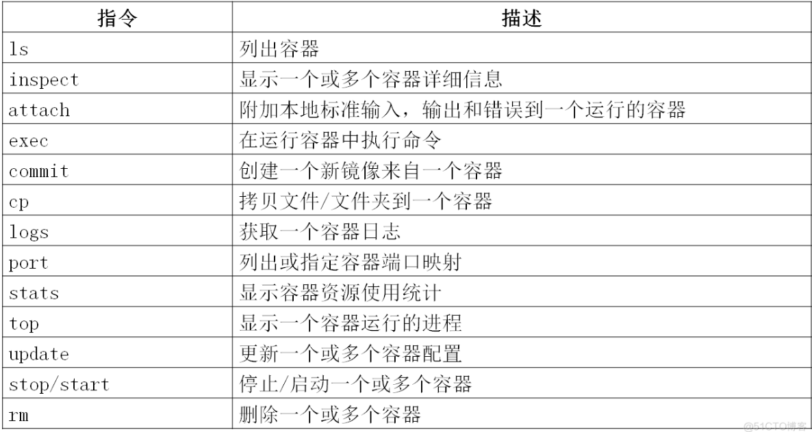

#### 镜像与容器联系

镜像不是一个单一的文件，而是有多层构成。我们可以通过docker history <ID/NAME> 查看镜像中各层内容及大小，每层对应着Dockerfile中的一条指令。Docker镜像默认存储在/var/lib/docker/<storage-driver>中。
容器其实是在镜像的最上面加了一层读写层，在运行容器里做的任何文件改动，都会写到这个读写层。如果容器删除了，最上面的读写层也就删除了，改动也就丢失了。
Docker使用存储驱动管理镜像每层内容及可读写层的容器层。

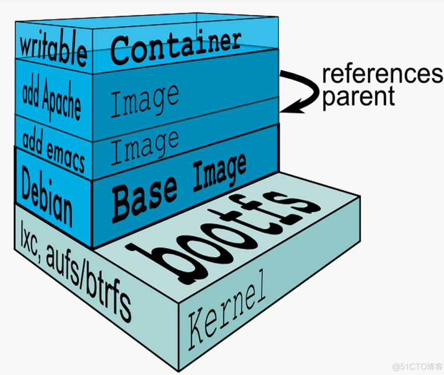

#### 将主机数据挂载到容器

Docker提供三种不同的方式将数据从宿主机挂载到容器中：volumes，bind mounts和tmpfs。

```
volumes：Docker管理宿主机文件系统的一部分（/var/lib/docker/volumes）。
bind mounts：可以存储在宿主机系统的任意位置。
tmpfs：挂载存储在宿主机系统的内存中，而不会写入宿主机的文件系统。
```

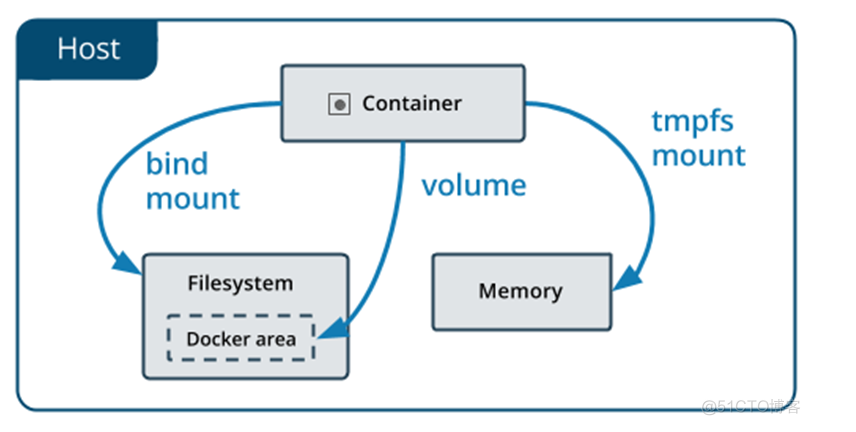

##### volume

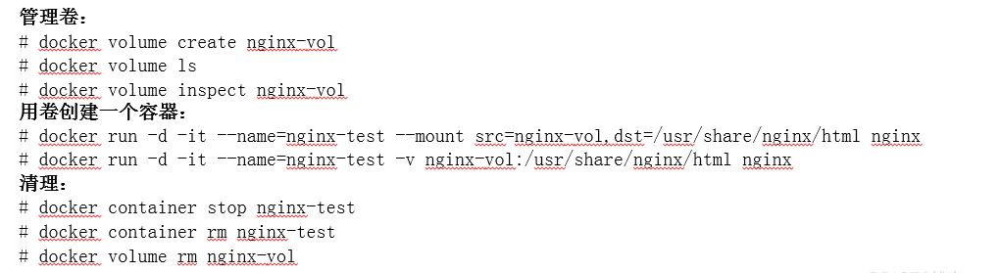

注意：

```
# 如果没有指定卷，自动创建。
# 建议使用--mount，更通用。
```

##### Bind Mounts

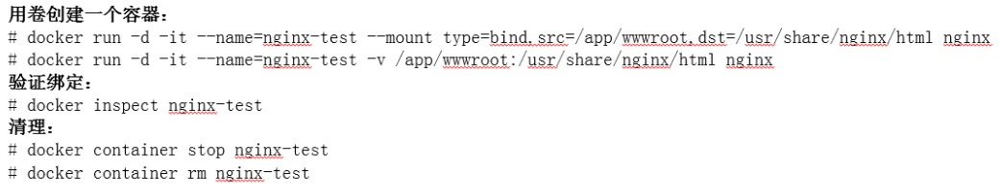


注意：

```
# 如果源文件/目录没有存在，不会自动创建，会抛出一个错误。
# 如果挂载目录在容器中非空目录，则该目录现有内容将被隐藏。
```

##### tmpfs

容器中使用 tmpfs：

```
docker run -d -it --name nginx-test --mount type=tmpfs,destination=/usr/share/nginx/html nginx
docker run -d -it --name nginx-test --tmpfs /usr/share/nginx/html nginx
```

注意：

```
# tmpfs方式仅存储在主机系统的内存中，不会写入主机的文件系统。
# tmpfs挂载不能在容器间共享。
# tmpfs只能在Linux容器上工作，不能在Windows容器上工作。
```

### Docker实战–构建lnmp环境，搭建WordPress博客

实验环境：

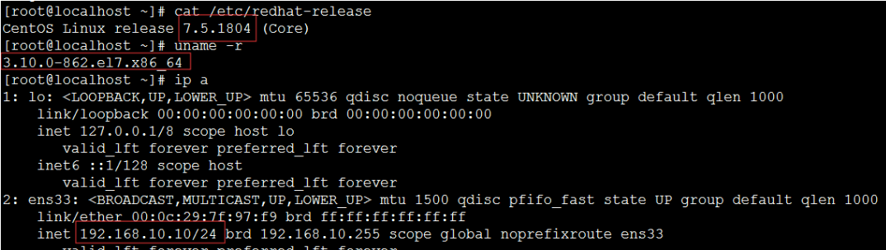

#### Docker安装

首先安装依赖包

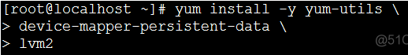

安装Docker（之前已安装过，所以提示已经安装）

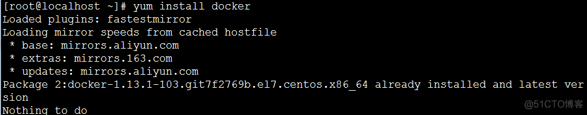

查看Docker是否安装成功

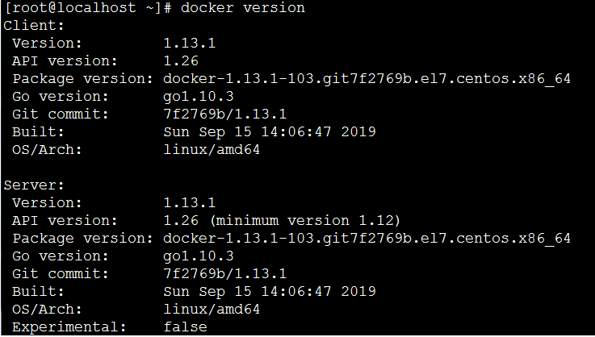


启动Docker并加入开机自启动

```
[root@localhost ~]# systemctl start docker
[root@localhost ~]# systemctl enable docker
```

#### 用Dockerfile方式构建镜像

Dockerfile指令

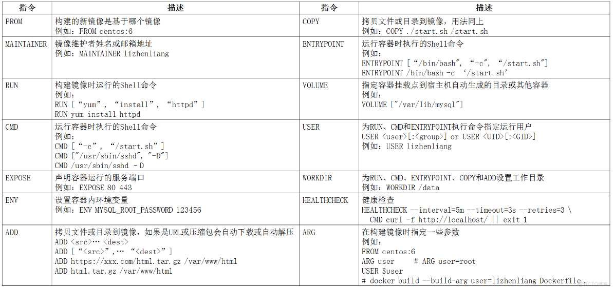

环境说明：
在本文中我都是基于centos 7.5系统，nginx和php用的源码包来构建，如果你不想用源码包，也可用yum方式构建。

```
nginx，用的是源码包来构建，版本为nginx-1.12.2.tar.gz，下载地址http://nginx.org/en/download.html/
php，也用的源码包来构建，版本为php-5.6.31.tar.gz，下载地址http://php.net/downloads.php
```

创建镜像时所需文件

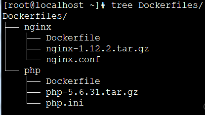


在Dockerfiles目录下创建了两个目录（nginx，php），里面分别存放Dockerfile文件、源码包。nginx目录下放了nginx.conf配置文件，php目录下也放置了php.ini配置文件（在实际环境中，这两个文件是经常需要修改的，单独拿出来后在启动容器时你可以把这两个文件mount到容器中，便于管理。）。

##### nginx 构建

Dockerfile内容：

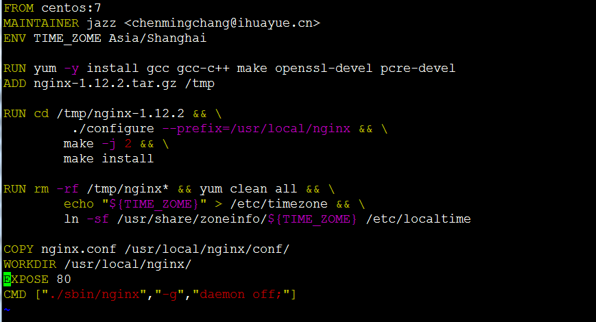


分析一下Dockerfile的内容，当你构建镜像时，它会根据你编排好的内容一步一步的执行下去，如果当中的某一步执行不下去，会立刻停止构建。上面的大部分指令都很好理解，大家可以对照上文的Dockerfile指令图进行理解，最后一个指令我要详细说明一下：CMD [“./sbin/nginx”,“-g”,“daemon off;”]

./sbin/nginx ，就是正常启动nginx服务；
-g： 设置配置文件外的全局指令，也就是启动nginx时设置了daemon off参数，默认参数是打开的on，是否以守护进程的方式运行nginx，守护进程是指脱离终端并且在后台运行的进程。这里设置为off，也就是不让它在后台运行。为什么我们启动nginx容器时不让它在后台运行呢，docker 容器默认会把容器内部第一个进程，也就是pid=1的程序作为docker容器是否正在运行的依据，如果docker 容器pid挂了，那么docker容器便会直接退出。


nginx.conf 内容：

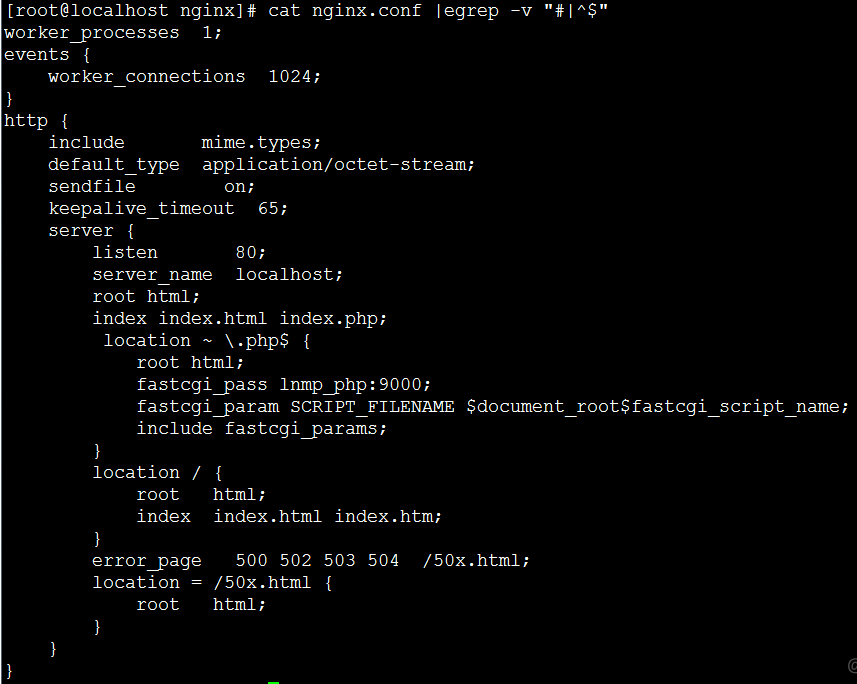

配置中主要添加了 location ~ .php这一段的内容，其中fastcgi_pass的 lnmp_php，这个是后面启动php容器时的名称。当匹配到php的请求时，它会转发给lnmp_php这个容器php-fpm服务来处理。正常情况下，如果php服务不是跑在容器中，lnmp_php这个内容一般写php服务器的Ip地址。

build 构建nginx镜像

切换到nginx目录下：

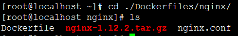


构建：

```
[root@localhost nginx]# docker build  -t nginx:1.12.2
```

查看镜像是否构建成功：

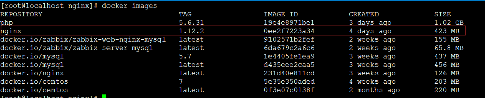

##### PHP构建

Dockerfile内容：

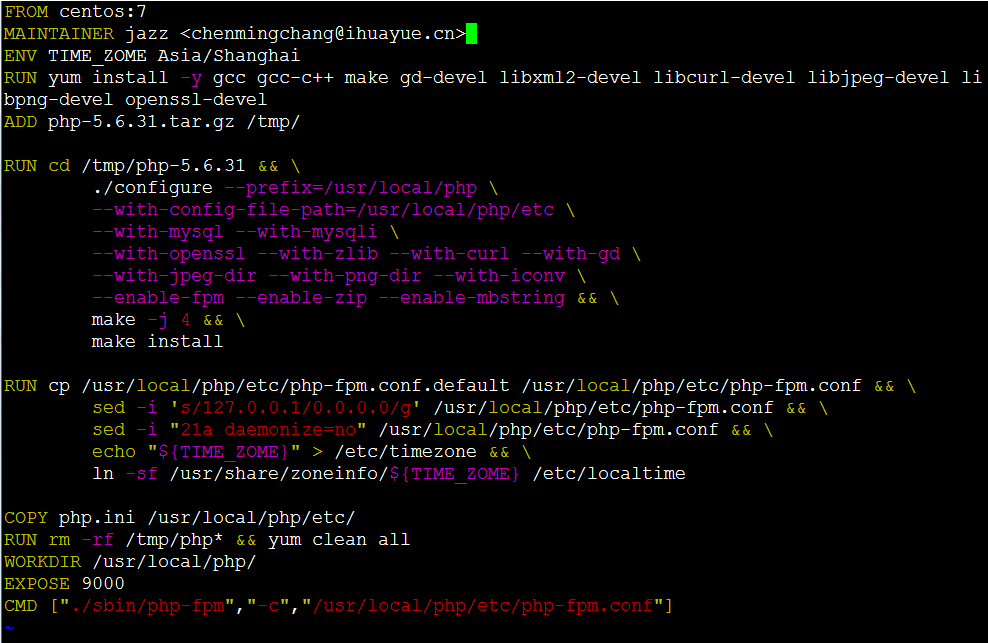


php.ini 内容（PHP默认的配置内容就好，实在找不到的可以复制粘贴我的）

	[PHP]
	engine = On
	short_open_tag = Off
	asp_tags = Off
	precision = 14
	output_buffering = 4096
	zlib.output_compression = Off
	implicit_flush = Off
	unserialize_callback_func =
	serialize_precision = 17
	disable_functions =
	disable_classes =
	zend.enable_gc = On
	expose_php = On
	max_execution_time = 300
	max_input_time = 300
	memory_limit = 128M
	error_reporting = E_ALL & ~E_DEPRECATED & ~E_STRICT
	display_errors = Off
	display_startup_errors = Off
	log_errors = On
	log_errors_max_len = 1024
	ignore_repeated_errors = Off
	ignore_repeated_source = Off
	report_memleaks = On
	track_errors = Off
	html_errors = On
	variables_order = "GPCS"
	request_order = "GP"
	register_argc_argv = Off
	auto_globals_jit = On
	post_max_size = 32M
	auto_prepend_file =
	auto_append_file =
	default_mimetype = "text/html"
	always_populate_raw_post_data = -1
	doc_root =
	user_dir =
	enable_dl = Off
	file_uploads = On
	upload_max_filesize = 2M
	max_file_uploads = 20
	allow_url_fopen = On
	allow_url_include = Off
	default_socket_timeout = 60
	[CLI Server]
	cli_server.color = On
	[Date]
	date.timezone = Asia/Shanghai
	[filter]
	[iconv]
	[intl]
	[sqlite]
	[sqlite3]
	[Pcre]
	[Pdo]
	[Pdo_mysql]
	pdo_mysql.cache_size = 2000
	pdo_mysql.default_socket=
	[Phar]
	[mail function]
	SMTP = localhost
	smtp_port = 25
	mail.add_x_header = On
	[SQL]
	sql.safe_mode = Off
	[ODBC]
	odbc.allow_persistent = On
	odbc.check_persistent = On
	odbc.max_persistent = -1
	odbc.max_links = -1
	odbc.defaultlrl = 4096
	odbc.defaultbinmode = 1
	[Interbase]
	ibase.allow_persistent = 1
	ibase.max_persistent = -1
	ibase.max_links = -1
	ibase.timestampformat = "%Y-%m-%d %H:%M:%S"
	ibase.dateformat = "%Y-%m-%d"
	ibase.timeformat = "%H:%M:%S"
	[MySQL]
	mysql.allow_local_infile = On
	mysql.allow_persistent = On
	mysql.cache_size = 2000
	mysql.max_persistent = -1
	mysql.max_links = -1
	mysql.default_port =
	mysql.default_socket =
	mysql.default_host =
	mysql.default_user =
	mysql.default_password =
	mysql.connect_timeout = 60
	mysql.trace_mode = Off
	[MySQLi]
	mysqli.max_persistent = -1
	mysqli.allow_persistent = On
	mysqli.max_links = -1
	mysqli.cache_size = 2000
	mysqli.default_port = 3306
	mysqli.default_socket =
	mysqli.default_host =
	mysqli.default_user =
	mysqli.default_pw =
	mysqli.reconnect = Off
	[mysqlnd]
	mysqlnd.collect_statistics = On
	mysqlnd.collect_memory_statistics = Off
	[OCI8]
	[PostgreSQL]
	pgsql.allow_persistent = On
	pgsql.auto_reset_persistent = Off
	pgsql.max_persistent = -1
	pgsql.max_links = -1
	pgsql.ignore_notice = 0
	pgsql.log_notice = 0
	[Sybase-CT]
	sybct.allow_persistent = On
	sybct.max_persistent = -1
	sybct.max_links = -1
	sybct.min_server_severity = 10
	sybct.min_client_severity = 10
	[bcmath]
	bcmath.scale = 0
	[browscap]
	[Session]
	session.save_handler = files
	session.use_strict_mode = 0
	session.use_cookies = 1
	session.use_only_cookies = 1
	session.name = PHPSESSID
	session.auto_start = 0
	session.cookie_lifetime = 0
	session.cookie_path = /
	session.cookie_domain =
	session.cookie_httponly =
	session.serialize_handler = php
	session.gc_probability = 1
	session.gc_divisor = 1000
	session.gc_maxlifetime = 1440
	session.referer_check =
	session.cache_limiter = nocache
	session.cache_expire = 180
	session.use_trans_sid = 0
	session.hash_function = 0
	session.hash_bits_per_character = 5
	url_rewriter.tags = "a=href,area=href,frame=src,input=src,form=fakeentry"
	[MSSQL]
	mssql.allow_persistent = On
	mssql.max_persistent = -1
	mssql.max_links = -1
	mssql.min_error_severity = 10
	mssql.min_message_severity = 10
	mssql.compatibility_mode = Off
	mssql.secure_connection = Off
	[Assertion]
	[COM]
	[mbstring]
	[gd]
	[exif]
	[Tidy]
	tidy.clean_output = Off
	[soap]
	soap.wsdl_cache_enabled=1
	soap.wsdl_cache_dir="/tmp"
	soap.wsdl_cache_ttl=86400
	soap.wsdl_cache_limit = 5
	[sysvshm]
	[ldap]
	ldap.max_links = -1
	[mcrypt]
	[dba]
	[opcache]
	[curl]
build构建php镜像
php源码包、php.ini、Dockerfile都准备好了之后，现在我们可以来用docker build来构建这个镜像了：
切换到php目录下：

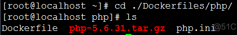


构建php镜像：

```
[root@localhost php]# docker build  -t php:5.6.31 .
```

查看镜像是否构建成功：

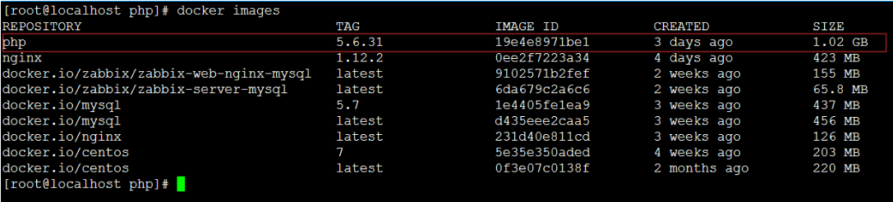

##### 运行容器

###### 创建自定义网络lnmp

先创建一个自定义网络，运行ningx、php这些容器的时候加入到lnmp网络中来：

```
# 查看默认网络：
[root@localhost php]# docker network ls
创建：
[root@localhost php]# docker network create lnmp
```

###### 创建php容器

创建容器：

```
[root@localhost php]# docker run -itd --name lnmp_php --network lnmp -v /app/wwwroot:/usr/local/nginx/html php:5.6.31
```

参数说明：

```
-itd： # 在容器中打开一个伪终端进行交互操作，并在后台运行；
--name： # 为容器分配一个名字lnmp_php；
--network： # 为容器指定一个网络环境为lnmp网络；
--mout： # 把宿主机的/app/wwwroot目录挂载到容器的/usr/local/nginx/html目录，挂载也相当于数据持久化；
php:5.6.31： # 指定刚才构建的php镜像来启动容器；
```

查看php容器是否运行：

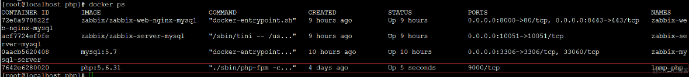

###### 创建nginx容器：

创建容器：

```
[root@localhost php]# docker run -itd --name lnmp_nginx --network lnmp -p 80:80 -v /app/wwwroot:/usr/local/nginx/html nginx:1.12.2
```

查看容器是否运行：

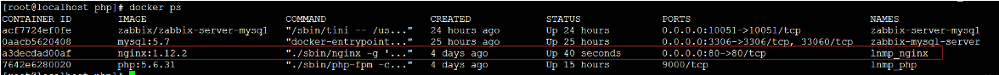

###### 测试访问

创建一个index.html静态页面来访问：

```
[root@localhost wordpress]# echo "Dockerfile lnmp test" > /app/wwwroot/index.html
```

用浏览器访问宿主机的IP：

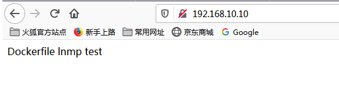

再创建一个index.php文件开测试：

```
[root@localhost wordpress]# echo "<? phpinfo();" > /app/wwwroot/index.php
```

访问PHP页面：

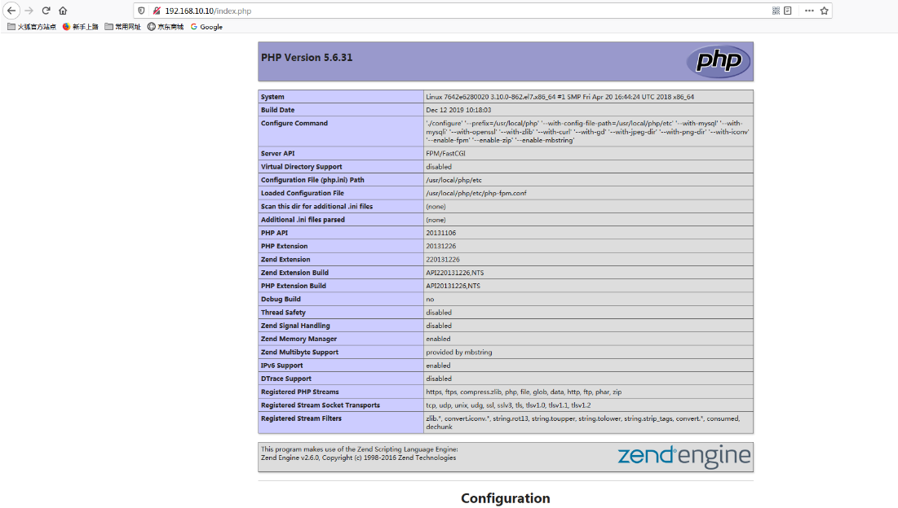

###### 创建mysql容器

```
[root@localhost ~]# docker run -itd --network lnmp -p 3306:3306 --name mysql -e MYSQL_ROOT_PASSWORD=123456 mysql:5.6 --character-set-server=utf8     #本地没有mysql5.6的镜像的话，会自动从仓库拉取；
```

查看mysql容器是否启动：

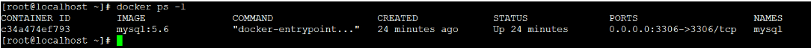

进到mysql容器里创建wordpress数据库：

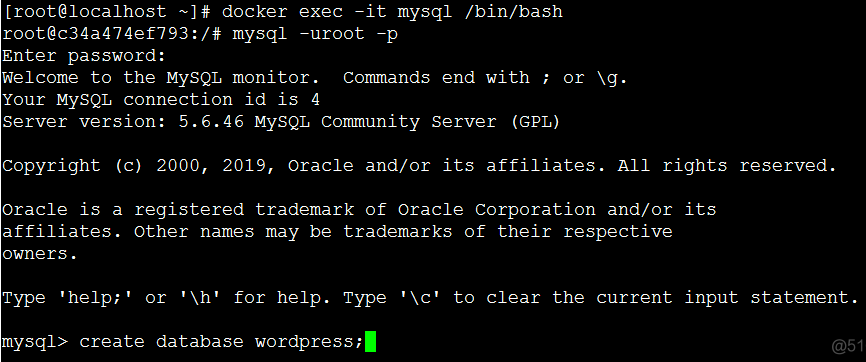

查看wordpress是否创建成功：

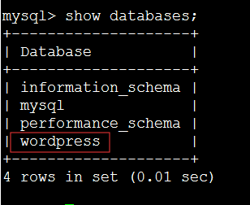

Ctrl+p再Ctrl+q退出mysql容器，回到宿主机

###### 下载wordpress博客系统测试lnmp

下载wordpress文件到/app/wwwroot目录下

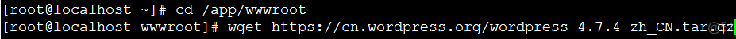

wordpress文件下载地址： https://cn.wordpress.org/wordpress-4.7.4-zh_CN.tar.gz
解压wordpress压缩包并访问测试：

```
root@localhost ~]# tar -zxvf wordpress-4.7.4-zh_CN.tar.gz
```

打开浏览器访问：
 http://容器宿主机IP/wordpress/wp-admin/setup-config.php

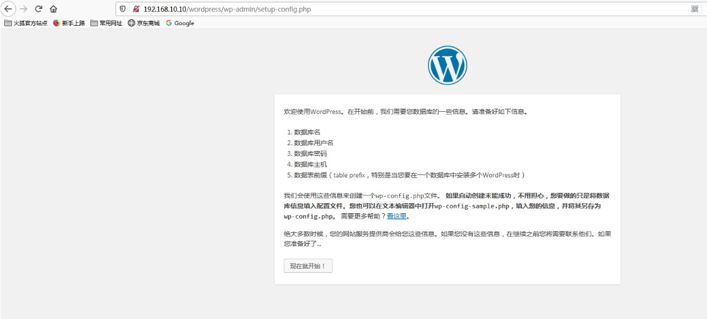

配置wordpress博客：

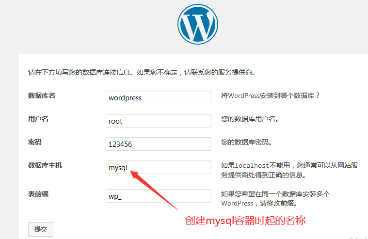

提交：


输入信息安装Wordpress：

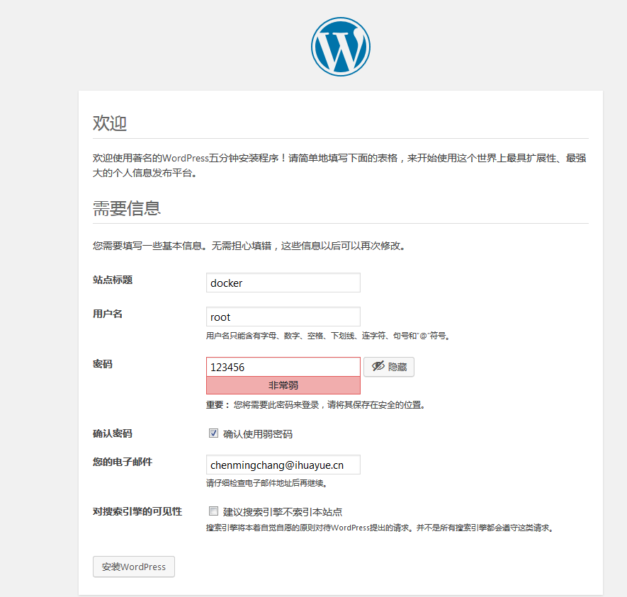


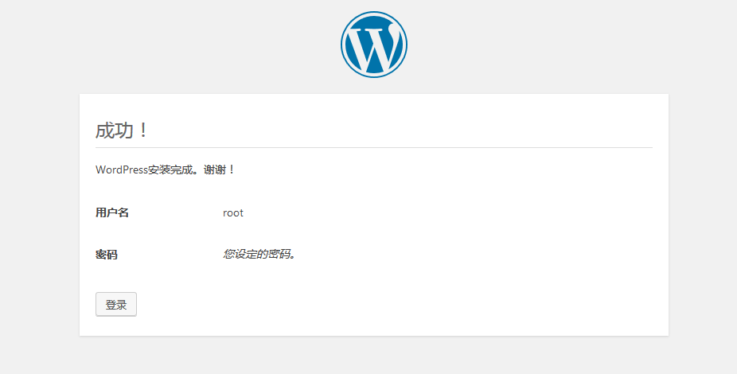

### 文件迁移

可用docker save命令将镜像保存为一个tar文件：

```
[root@localhost ~]# docker save nginx:1.12.2 | gzip > nginx1.12.2.tar.gz
```

再用docker load命令导入：

```
[root@localhost ~]# docker load < nginx.1.12.2.tar.gz
```

