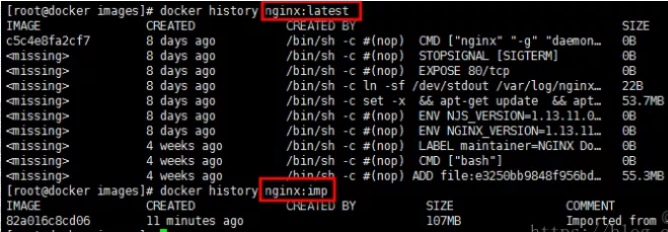

Docker镜像的导入导出

本文介绍Docker镜像的导入导出，用于迁移、备份、升级等场景

<!--more-->

准备环境如下：

CentOS 7.0

Docker 1.18

导入导出命令介绍

涉及的命令有export、import、save、load

**save命令**

```
docker save [options] images [images...]
```

示例:

```
docker save -o nginx.tar nginx:latest
```

或

```
docker save > nginx.tar nginx:latest
```

其中-o和>表示输出到文件，nginx.tar为目标文件，nginx:latest是源镜像名（name:tag）


**load命令**

```
docker load [options]
```

示例:

```
docker load -i nginx.tar
```

或

```
docker load < nginx.tar
```

其中-i和<表示从文件输入。会成功导入镜像及相关元数据，包括tag信息


**export命令**

```
docker export [options] container
```

示例:

```
docker export -o nginx-test.tar nginx-test
```

其中-o表示输出到文件，nginx-test.tar为目标文件，nginx-test是源容器名（name）


**import命令**

```
docker import [options] file|URL|- [REPOSITORY[:TAG]]
```

示例:

```
docker import nginx-test.tar nginx:imp
```

或

```
cat nginx-test.tar | docker import - nginx:imp
```

区别：

export命令导出的tar文件略小于save命令导出的。

export命令是从容器（container）中导出tar文件，而save命令则是从镜像（images）中导出。

基于第二点，export导出的文件再import回去时，无法保留镜像所有历史（即每一层layer信息，不熟悉的可以去看Dockerfile），不能进行回滚操作；而save是依据镜像来的，所以导入时可以完整保留下每一层layer信息。如下图所示，nginx:latest是save导出load导入的，nginx:imp是export导出import导入的。



**建议**

可以依据具体使用场景来选择命令：

​	>若是只想备份images，使用save、load即可

​	>若是在启动容器后，容器内容有变化，需要备份，则使用export、import
