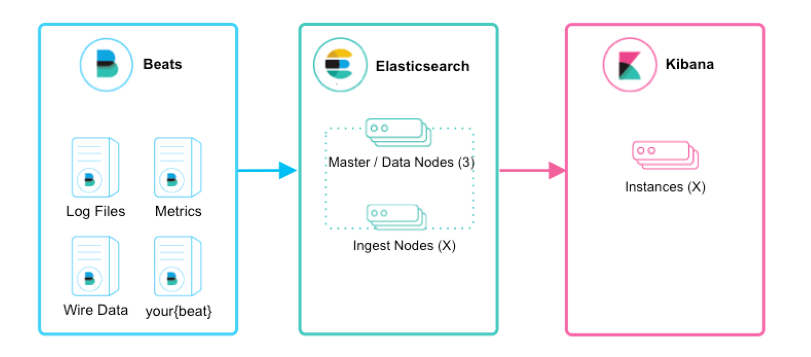
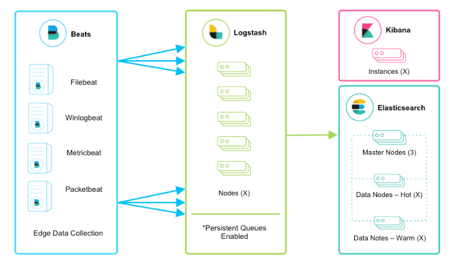
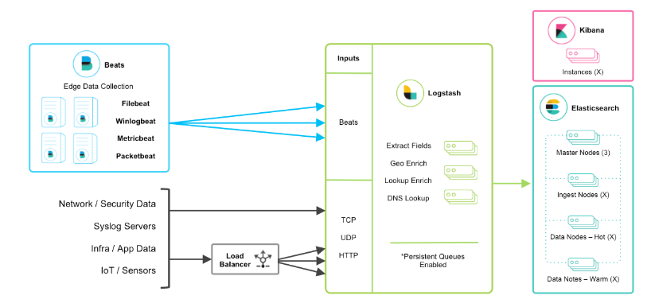
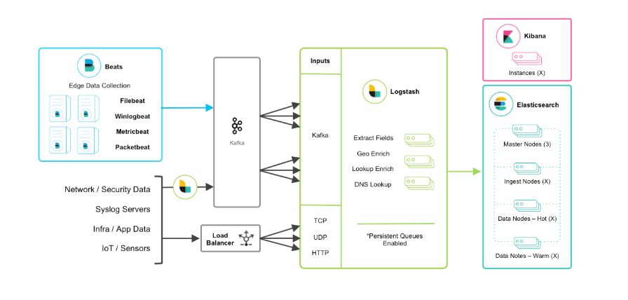
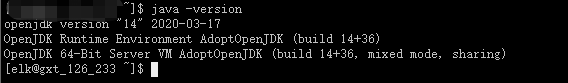
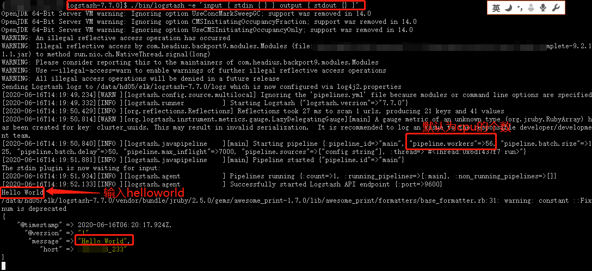
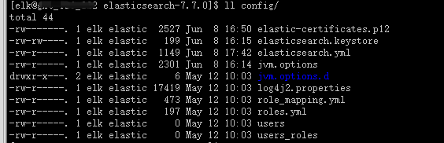
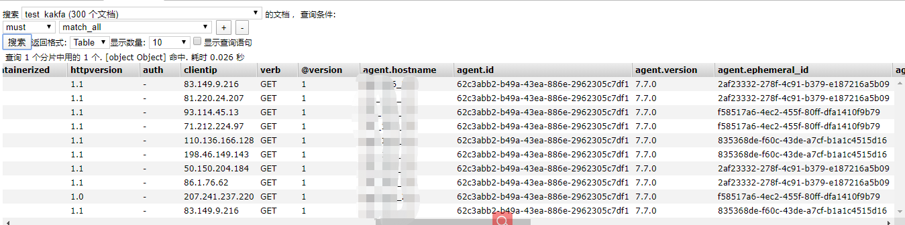
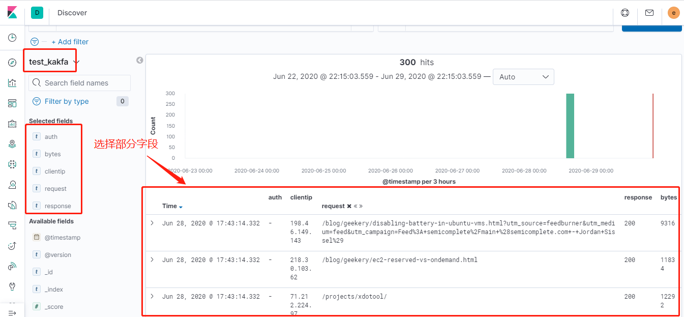

本篇文章主要介绍elk的一些框架组成，原理和实践，采用的ELK本版为7.7.0版本

<!--more-->

转载自：https://www.cnblogs.com/zsql/p/13164414.html#_label0


## ELK介绍

### ELK简介

　　ELK是Elasticsearch、Logstash、Kibana三大开源框架首字母大写简称(但是后期出现的filebeat(beats中的一种)可以用来替代logstash的数据收集功能，比较轻量级)。市面上也被成为Elastic Stack。

　　Filebeat是用于转发和集中日志数据的轻量级传送工具。Filebeat监视您指定的日志文件或位置，收集日志事件，并将它们转发到Elasticsearch或 Logstash进行索引。Filebeat的工作方式如下：启动Filebeat时，它将启动一个或多个输入，这些输入将在为日志数据指定的位置中查找。对于Filebeat所找到的每个日志，Filebeat都会启动收集器。每个收集器都读取单个日志以获取新内容，并将新日志数据发送到libbeat，libbeat将聚集事件，并将聚集的数据发送到为Filebeat配置的输出。

　　Logstash是免费且开放的服务器端数据处理管道，能够从多个来源采集数据，转换数据，然后将数据发送到您最喜欢的“存储库”中。Logstash能够动态地采集、转换和传输数据，不受格式或复杂度的影响。利用Grok从非结构化数据中派生出结构，从IP地址解码出地理坐标，匿名化或排除敏感字段，并简化整体处理过程。

　　Elasticsearch是Elastic Stack核心的分布式搜索和分析引擎,是一个基于Lucene、分布式、通过Restful方式进行交互的近实时搜索平台框架。Elasticsearch为所有类型的数据提供近乎实时的搜索和分析。无论您是结构化文本还是非结构化文本，数字数据或地理空间数据，Elasticsearch都能以支持快速搜索的方式有效地对其进行存储和索引。

　　Kibana是一个针对Elasticsearch的开源分析及可视化平台，用来搜索、查看交互存储在Elasticsearch索引中的数据。使用Kibana，可以通过各种图表进行高级数据分析及展示。并且可以为 Logstash 和 ElasticSearch 提供的日志分析友好的 Web 界面，可以汇总、分析和搜索重要数据日志。还可以让海量数据更容易理解。它操作简单，基于浏览器的用户界面可以快速创建仪表板（dashboard）实时显示Elasticsearch查询动态


### 为什么要使用ELK

　　日志主要包括系统日志、应用程序日志和安全日志。系统运维和开发人员可以通过日志了解服务器软硬件信息、检查配置过程中的错误及错误发生的原因。经常分析日志可以了解服务器的负荷，性能安全性，从而及时采取措施纠正错误。

　　往往单台机器的日志我们使用grep、awk等工具就能基本实现简单分析，但是当日志被分散的储存不同的设备上。如果你管理数十上百台服务器，你还在使用依次登录每台机器的传统方法查阅日志。这样是不是感觉很繁琐和效率低下。当务之急我们使用集中化的日志管理，例如：开源的syslog，将所有服务器上的日志收集汇总。集中化管理日志后，日志的统计和检索又成为一件比较麻烦的事情，一般我们使用grep、awk和wc等Linux命令能实现检索和统计，但是对于要求更高的查询、排序和统计等要求和庞大的机器数量依然使用这样的方法难免有点力不从心。

　　一般大型系统是一个分布式部署的架构，不同的服务模块部署在不同的服务器上，问题出现时，大部分情况需要根据问题暴露的关键信息，定位到具体的服务器和服务模块，构建一套集中式日志系统，可以提高定位问题的效率。


### 完整日志系统基本特征

- 收集：能够采集多种来源的日志数据
- 传输：能够稳定的把日志数据解析过滤并传输到存储系统
- 存储：存储日志数据
- 分析：支持 UI 分析
- 警告：能够提供错误报告，监控机制

##  ELK架构分析


### beats+elasticsearch+kibana模式



 

　　如上图所示，该ELK框架由beats（日志分析我们通常使用filebeat）+elasticsearch+kibana构成，这个框架比较简单，入门级的框架。其中filebeat也能通过module对日志进行简单的解析和索引。并查看预建的Kibana仪表板。

 

该框架适合简单的日志数据，一般可以用来玩玩，生产环境建议接入logstash


### beats+logstash+elasticsearch+kibana模式



该框架是在上面的框架的基础上引入了logstash，引入logstash带来的好处如下：

- 通Logstash具有基于磁盘的自适应缓冲系统，该系统将吸收传入的吞吐量，从而减轻背压
- 从其他数据源（例如数据库，S3或消息传递队列）中提取
- 将数据发送到多个目的地，例如S3，HDFS或写入文件
- 使用条件数据流逻辑组成更复杂的处理管道

filebeat结合logstash带来的优势：

1、水平可扩展性，高可用性和可变负载处理：filebeat和logstash可以实现节点之间的负载均衡，多个logstash可以实现logstash的高可用

2、消息持久性与至少一次交付保证：使用Filebeat或Winlogbeat进行日志收集时，可以保证至少一次交付。从Filebeat或Winlogbeat到Logstash以及从Logstash到Elasticsearch的两种通信协议都是同步的，并且支持确认。Logstash持久队列提供跨节点故障的保护。对于Logstash中的磁盘级弹性，确保磁盘冗余非常重要。

3、具有身份验证和有线加密的端到端安全传输：从Beats到Logstash以及从 Logstash到Elasticsearch的传输都可以使用加密方式传递 。与Elasticsearch进行通讯时，有很多安全选项，包括基本身份验证，TLS，PKI，LDAP，AD和其他自定义领域

当然在该框架的基础上还可以引入其他的输入数据的方式：比如：TCP，UDP和HTTP协议是将数据输入Logstash的常用方法（如下图所示）：



 

 

 


### beats+缓存/消息队列+logstash+elasticsearch+kibana模式



 

在如上的基础上我们可以在beats和logstash中间添加一些组件redis、kafka、RabbitMQ等，添加中间件将会有如下好处：
第一，降低对日志所在机器的影响，这些机器上一般都部署着反向代理或应用服务，本身负载就很重了，所以尽可能的在这些机器上少做事；
第二，如果有很多台机器需要做日志收集，那么让每台机器都向Elasticsearch持续写入数据，必然会对Elasticsearch造成压力，因此需要对数据进行缓冲，同时，这样的缓冲也可以一定程度的保护数据不丢失；
第三，将日志数据的格式化与处理放到Indexer中统一做，可以在一处修改代码、部署，避免需要到多台机器上去修改配置

## ELK部署 

elk各个组件的网址可以在官网下载：https://www.elastic.co/cn/

或者在中文社区下载：https://elasticsearch.cn/download/

注：本次安装都是采用压缩包的方式安装


### filebeat的安装介绍

#### 原理

　　Filebeat的工作方式如下：启动Filebeat时，它将启动一个或多个输入，这些输入将在为日志数据指定的位置中查找。对于Filebeat所找到的每个日志，Filebeat都会启动收集器。每个收集器都读取单个日志以获取新内容，并将新日志数据发送到libbeat，libbeat将聚集事件，并将聚集的数据发送到为Filebeat配置的输出

　　Filebeat结构：由两个组件构成，分别是inputs（输入）和harvesters（收集器），这些组件一起工作来跟踪文件并将事件数据发送到您指定的输出，harvester负责读取单个文件的内容。harvester逐行读取每个文件，并将内容发送到输出。为每个文件启动一个harvester。harvester负责打开和关闭文件，这意味着文件描述符在harvester运行时保持打开状态。如果在收集文件时删除或重命名文件，Filebeat将继续读取该文件。这样做的副作用是，磁盘上的空间一直保留到harvester关闭。默认情况下，Filebeat保持文件打开，直到达到close_inactive

#### 简单安装

本文采用压缩包的方式安装，linux版本，filebeat-7.7.0-linux-x86_64.tar.gz

```
curl-L-Ohttps://artifacts.elastic.co/downloads/beats/filebeat/filebeat-7.7.0-linux-x86_64.tar.gz
tar -xzvf filebeat-7.7.0-linux-x86_64.tar.gz
```

配置示例文件：filebeat.reference.yml（包含所有未过时的配置项）
配置文件：filebeat.yml
启动命令：./filebeat -e

**具体的原理、使用、实例见文**：[一篇文章搞懂filebeat（ELK）](https://www.cnblogs.com/zsql/p/13137833.html)


### logstash的安装介绍

#### 基本原理

logstash分为三个步骤：inputs（必须的）→ filters（可选的）→ outputs（必须的），inputs生成时间，filters对其事件进行过滤和处理，outputs输出到输出端或者决定其存储在哪些组件里。inputs和outputs支持编码和解码

Logstash管道中的每个input阶段都在自己的线程中运行。将写事件输入到内存（默认）或磁盘上的中心队列。每个管道工作线程从该队列中取出一批事件，通过配置的filter处理该批事件，然后通过output输出到指定的组件存储。管道处理数据量的大小和管道工作线程的数量是可配置的

#### 简单安装

下载地址1：https://www.elastic.co/cn/downloads/logstash  

下载地址2：https://elasticsearch.cn/download/

这里需要安装jdk，我使用的是elasticsearch7.7.0自带的jdk：



解压即安装：

```
tar -zxvf logstash-7.7.0.tar.gz
```

来个logstash版本的HelloWorld：

```
./bin/logstash -e 'input { stdin { } } output { stdout {} }'
```



**具体的原理、使用、实例见文**：[从0到1学会logstash的玩法（ELK）](https://www.cnblogs.com/zsql/p/13143445.html)


### elasticsearch的安装介绍

#### 基本介绍

　　Elasticsearch（ES）是一个基于Lucene构建的开源、分布式、RESTful接口的全文搜索引擎。Elasticsearch还是一个分布式文档数据库，其中每个字段均可被索引，而且每个字段的数据均可被搜索，ES能够横向扩展至数以百计的服务器存储以及处理PB级的数据。可以在极短的时间内存储、搜索和分析大量的数据。

　　基本概念有：Cluster 集群、Node节点、Index索引、Document文档、Shards & Replicas分片与副本等

elasticsearch的优势：

- 分布式：横向扩展非常灵活
- 全文检索：基于lucene的强大的全文检索能力；
- 近实时搜索和分析：数据进入ES，可达到近实时搜索，还可进行聚合分析
- 高可用：容错机制，自动发现新的或失败的节点，重组和重新平衡数据
- 模式自由：ES的动态mapping机制可以自动检测数据的结构和类型，创建索引并使数据可搜索。
- RESTful API：JSON + HTTP

#### linux系统参数设置

```
1、设置系统配置
ulimit #暂时修改，切换到该用户es，ulimit -n 65535 
/etc/security/limits.conf #永久修改 es -  nofile  65535
ulimit -a #查看当前用户的资源限制

2、禁用sawpping
方式一：
swapoff -a #临时禁用所有的swap文件
vim /etc/fstab #注释掉所有的swap相关的行，永久禁用

方式二：
cat /proc/sys/vm/swappiness #查看该值
sysctl vm.swappiness=1 #临时修改该值为1
vim /etc/sysctl.conf #修改文件 永久生效
vm.swappiness = 1 #如果有该值，则修改该值，若没有，则追加该选项，sysctl -p生效命令

方式三：
配置elasticsearch.yml文件，添加如下配置：
bootstrap.memory_lock: true
GET _nodes?filter_path=**.mlockall  #检查如上配置是否成功
注意：如果试图分配比可用内存更多的内存，mlockall可能会导致JVM或shell会话退出!

3、配置文件描述符
ulimit -n 65535  #临时修改
vim /etc/security/limits.conf #永久修改
es         soft    nproc     65535
es         hard    nproc     65535

4、配置虚拟内存
sysctl -w vm.max_map_count=262144 #临时修改该值
vim /etc/sysctl.conf #永久修改
vm.max_map_count=262144

5、配置线程数
ulimit -u 4096 #临时修改
vim /etc/security/limits.conf #永久修改
```

#### elasticsearch安装

elasticsearch是需要其他用户启动的，所以需要先创建一个新的用户elk：

```
groupadd  elastic
useradd elk -d /data/hd05/elk -g elastic
echo '2edseoir@' | passwd elk --stdin
```

下载：https://elasticsearch.cn/download/ 

也可以去官网下载：wget https://artifacts.elastic.co/downloads/elasticsearch/elasticsearch-7.7.0-linux-x86_64.tar.gz

```
解压：tar -zxvf elasticsearch-7.7.0-linux-x86_64.tar.gz
建立软链接：ln –s elasticsearch-7.7.0  es
```

目录介绍：

```
$ES_HOME：/data/hd05/elk/elasticsearch-7.7.0
bin: $ES_HOME/bin  #es启动命令和插件安装命令
conf：$ES_HOME/conf #elasticsearch.yml配置文件目录
data：$ES_HOME/data  #对应的参数path.data，用于存放索引分片数据文件
logs：$ES_HOME/logs  #对应的参数path.logs，用于存放日志
jdk：$ES_HOME/jdk  #自带支持该es版本的jdk
plugins： $ES_HOME/jplugins #插件存放目录
lib： $ES_HOME/lib #存放依赖包，比如java类库
modules： $ES_HOME/modules #包含所有的es模块
```

配置自带的java环境：

Vim ~/.bashrc
\############往后面添加如下内容######################
export JAVA_HOME=/data/hd05/elk/es/jdk
export PATH=$JAVA_HOME/bin:PATH
export CLASSPATH=.:$JAVA_HOME/lib/dt.jar\:/lib/tools.jar

jvm.options文件说明：

```
配置java参数
一种是通过修改/data/hd05/elk/elasticsearch-7.7.0/config/jvm.options文件修改jvm参数，一个使用过一个变量ES_JAVA_OPTS来声明jvm参数
/data/hd05/elk/elasticsearch-7.7.0/config/jvm.options介绍：
8:-Xmx2g  #表示只适合java8
8-:-Xmx2g  #表示适合高于java8的版本
8-9:-Xmx2g #表示适合java8，和java9
其他配置，都是jvm的相关参数，如果要想明白，得去看java虚拟机

通过变量ES_JAVA_OPTS来声明jvm参数：
例如：export ES_JAVA_OPTS="$ES_JAVA_OPTS -Djava.io.tmpdir=/path/to/temp/dir"
./bin/elasticsearch
```

配置config/jvm.options

```
[elk@lgh config]$ cat  jvm.options  | egrep -v '^$|#'                 
-Xms2g
-Xmx2g
8-13:-XX:+UseConcMarkSweepGC
8-13:-XX:CMSInitiatingOccupancyFraction=75
8-13:-XX:+UseCMSInitiatingOccupancyOnly
14-:-XX:+UseG1GC
14-:-XX:G1ReservePercent=25
14-:-XX:InitiatingHeapOccupancyPercent=30
-Djava.io.tmpdir=${ES_TMPDIR}
-XX:+HeapDumpOnOutOfMemoryError
-XX:HeapDumpPath=data
-XX:ErrorFile=logs/hs_err_pid%p.log
8:-XX:+PrintGCDetails
8:-XX:+PrintGCDateStamps
8:-XX:+PrintTenuringDistribution
8:-XX:+PrintGCApplicationStoppedTime
8:-Xloggc:logs/gc.log
8:-XX:+UseGCLogFileRotation
8:-XX:NumberOfGCLogFiles=32
8:-XX:GCLogFileSize=64m
9-:-Xlog:gc*,gc+age=trace,safepoint:file=logs/gc.log:utctime,pid,tags:filecount=32,filesize=64m
```

配置加密通信证书

生成证书：

- 方法一：

```
./bin/elasticsearch-certutil ca -out config/elastic-certificates.p12 -pass "password"
```

查看config目录，有elastic-certificates.p12文件生成



 

 

 

- 方法二： 

```
./bin/elasticsearch-certutil ca  #创建集群认证机构，需要交互输入密码
./bin/elasticsearch-certutil cert --ca elastic-stack-ca.p12  #为节点颁发证书，与上面密码一样
执行./bin/elasticsearch-keystore add xpack.security.transport.ssl.keystore.secure_password 并输入第一步输入的密码 
执行./bin/elasticsearch-keystore add xpack.security.transport.ssl.truststore.secure_password 并输入第一步输入的密码 
将生成的elastic-certificates.p12、elastic-stack-ca.p12文件移动到config目录下
```

配置config/elasticsearch.yml

```
[elk@lgh config]$ cat  elasticsearch.yml  | egrep -v '^$|#'
cluster.name: my_cluster
node.name: lgh01
node.data: true
node.master: true
path.data: /data/hd05/elk/elasticsearch-7.7.0/data
path.logs: /data/hd05/elk/elasticsearch-7.7.0/logs
network.host: 192.168.110.130
http.port: 9200
transport.tcp.port: 9300
discovery.seed_hosts: ["192.168.110.130","192.168.110.131","192.168.110.132","192.168.110.133"]
cluster.initial_master_nodes: ["lgh01","lgh02","lgh03"]
cluster.routing.allocation.cluster_concurrent_rebalance: 32
cluster.routing.allocation.node_concurrent_recoveries: 32
cluster.routing.allocation.node_initial_primaries_recoveries: 32
http.cors.enabled: true
http.cors.allow-origin: '*'#下面的是配置x-pack和tsl/ssl加密通信的
xpack.security.enabled: true
xpack.license.self_generated.type: basic
xpack.security.transport.ssl.enabled: true
xpack.security.transport.ssl.verification_mode: certificate
xpack.security.transport.ssl.keystore.path: elastic-certificates.p12
xpack.security.transport.ssl.truststore.path: elastic-certificates.p12
bootstrap.memory_lock: false   #centos6需要配置
bootstrap.system_call_filter: false #centos6需要配置
```

然后通过scp到其他的节点，修改上面的node.name和node.master参数，然后要删除data目标，不然会存在报错

然后使用./bin/elasticsearch -d 后台启动elasticsearch，去掉-d则是前端启动elasticsearch

然后./bin/elasticsearch-setup-passwords interactive 配置默认用户的密码：（有如下的交互），可以使用auto自动生成。

```
[elk@lgh elasticsearch-7.7.0]$ ./bin/elasticsearch-setup-passwords interactive
Enter password for the elasticsearch keystore : 
Initiating the setup of passwords for reserved users elastic,apm_system,kibana,logstash_system,beats_system,remote_monitoring_user.
You will be prompted to enter passwords as the process progresses.
Please confirm that you would like to continue [y/N]y


Enter password for [elastic]: 
Reenter password for [elastic]: 
Enter password for [apm_system]: 
Reenter password for [apm_system]: 
Enter password for [kibana]: 
Reenter password for [kibana]: 
Enter password for [logstash_system]: 
Reenter password for [logstash_system]: 
Enter password for [beats_system]: 
Reenter password for [beats_system]: 
Enter password for [remote_monitoring_user]: 
Reenter password for [remote_monitoring_user]: 
1qaz@WSXChanged password for user [apm_system]
Changed password for user [kibana]
Changed password for user [logstash_system]
Changed password for user [beats_system]
Changed password for user [remote_monitoring_user]
```

然后可以登录http://192.168.110.130:9200/ 需要输入密码，输入elastic/passwd即可登录


 

 

 

#### head插件安装

https://github.com/mobz/elasticsearch-head  #head官网

https://nodejs.org/zh-cn/download/ #nodejs下载

官方说明，elasticsearch7有三种方式使用head插件，这里我只试过两种：

第一种：使用谷歌浏览器head插件，这个直接在谷歌浏览器上面安装插件就可以使用了

第二种：使用head服务（把head当做一个服务来使用），安装如下

```
#Running with built in server
git clone git://github.com/mobz/elasticsearch-head.git
cd elasticsearch-head
npm install
npm run start
open http://localhost:9100/
```

如果在如上的安装过程中报错，可以尝试下这个命令再继续安装npm install phantomjs-prebuilt@2.1.16 --ignore-scripts


### kibana的安装介绍

下载地址：https://elasticsearch.cn/download/

也可以去官网下载

解压后修改kibana.yml文件

```
[elk@lgh config]$ cat kibana.yml  | egrep -v "^$|#"
server.port: 5601
server.host: "0.0.0.0"
server.name: "my-kibana"
elasticsearch.hosts: ["http://192.168.110.130:9200","http://192.168.110.131:9200","http://192.168.110.132:9200"]
elasticsearch.preserveHost: true
kibana.index: ".kibana"
elasticsearch.username: "elastic"
elasticsearch.password: "password"   #或者使用keystore的保存的密码"${ES_PWD}"
```

./bin/kibana 启动

访问网址：[http://192.168.110.130:5601/](http://10.18.126.222:5601/) 并使用elastic/password 登录

## 实例分析

[一篇文章搞懂filebeat（ELK）](https://www.cnblogs.com/zsql/p/13137833.html) 该文章中有beats+elasticsearch+kibana的实例

[从0到1学会logstash的玩法（ELK）](https://www.cnblogs.com/zsql/p/13143445.html) 该文章中有beats+logstash+elasticsearch+kibana实例

现在我们弄一个beats+缓存/消息队列+logstash+elasticsearch+kibana的实例：

中间组件我们使用kafka，我们看下filebeat把kafka作为output的官网：

https://www.elastic.co/guide/en/beats/filebeat/7.7/kafka-output.html


 

 这里要注意kafka的版本，我试过两个都是极端的版本，坑了自己一把。假如你已经有kafka集群了，我这里安装的是一个单机版本（1.1.1）：

数据集我们采用apache的日志格式，下载地址：https://download.elastic.co/demos/logstash/gettingstarted/logstash-tutorial.log.gz

日志格式如下：

```
[elk@lgh ~]$ tail -3 logstash-tutorial.log 
86.1.76.62 - - [04/Jan/2015:05:30:37 +0000] "GET /projects/xdotool/ HTTP/1.1" 200 12292 "http://www.haskell.org/haskellwiki/Xmonad/Frequently_asked_questions" "Mozilla/5.0 (X11; Linux x86_64; rv:24.0) Gecko/20140205 Firefox/24.0 Iceweasel/24.3.0"
86.1.76.62 - - [04/Jan/2015:05:30:37 +0000] "GET /reset.css HTTP/1.1" 200 1015 "http://www.semicomplete.com/projects/xdotool/" "Mozilla/5.0 (X11; Linux x86_64; rv:24.0) Gecko/20140205 Firefox/24.0 Iceweasel/24.3.0"
86.1.76.62 - - [04/Jan/2015:05:30:37 +0000] "GET /style2.css HTTP/1.1" 200 4877 "http://www.semicomplete.com/projects/xdotool/" "Mozilla/5.0 (X11; Linux x86_64; rv:24.0) Gecko/20140205 Firefox/24.0 Iceweasel/24.3.0"
```

首先我们配置filebeat的配置文件filebeat.yml

```
#=========================== Filebeat inputs =============================

filebeat.inputs:

# Each - is an input. Most options can be set at the input level, so
# you can use different inputs for various configurations.
# Below are the input specific configurations.

- type: log

  # Change to true to enable this input configuration.
  enabled: true

  # Paths that should be crawled and fetched. Glob based paths.
  paths:
    - /data/elk/logstash-tutorial.log  #这里使用的是apache的日志格式
    #- c:\programdata\elasticsearch\logs\*

  # Exclude lines. A list of regular expressions to match. It drops the lines that are
  # matching any regular expression from the list.
  #exclude_lines: ['^DBG']

  # Include lines. A list of regular expressions to match. It exports the lines that are
  # matching any regular expression from the list.
  #include_lines: ['^ERR', '^WARN']

  # Exclude files. A list of regular expressions to match. Filebeat drops the files that
  # are matching any regular expression from the list. By default, no files are dropped.
  #exclude_files: ['.gz$']

  # Optional additional fields. These fields can be freely picked
  # to add additional information to the crawled log files for filtering
  #fields:
  #  level: debug
  #  review: 1

  ### Multiline options

  # Multiline can be used for log messages spanning multiple lines. This is common
  # for Java Stack Traces or C-Line Continuation

  # The regexp Pattern that has to be matched. The example pattern matches all lines starting with [
  #multiline.pattern: ^\[

  # Defines if the pattern set under pattern should be negated or not. Default is false.
  #multiline.negate: false

  # Match can be set to "after" or "before". It is used to define if lines should be append to a pattern
  # that was (not) matched before or after or as long as a pattern is not matched based on negate.
  # Note: After is the equivalent to previous and before is the equivalent to to next in Logstash
  #multiline.match: after
#================================ Outputs =====================================
output.kafka:
  hosts: ["192.168.110.130:9092"]   #配置kafka的broker
  topic: 'filebeat_test'   #配置topic 名字
  partition.round_robin:
    reachable_only: false
  required_acks: 1
  compression: gzip
  max_message_bytes: 1000000
```

然后使用命令后台启动：

```
cd filebeat-7.7.0-linux-x86_64 && nohup ./filebeat -e &
```

接下来我们配置logstash的配置文件

```
cd logstash-7.7.0/ && mkidr conf.d
cd conf.d
vim apache.conf 
################apache.conf文件中填入如下内容##############################
input {
        kafka{
                bootstrap_servers => "192.168.110.130:9092"
                topics => ["filebeat_test"]
                group_id => "test123"
                auto_offset_reset => "earliest"
        }
    }
filter {
json
        {
                source => "message"
        }
        grok {
        match => { "message" => "%{COMBINEDAPACHELOG}"}
        remove_field => "message"
    }
}
output {
    stdout { codec => rubydebug }
    elasticsearch {
                    hosts => ["192.168.110.130:9200","192.168.110.131:9200","10.18.126.224:9200","192.168.110.132:9200"]
                    index => "test_kakfa"
                    user => "elastic"
                    password => "${ES_PWD}"
                }
}
```

然后后台启动logstash命令

```
cd logstash-7.7.0/ && nohup ./bin/logstash -f conf.d/apache.conf &
```

然后我们查看elasticsearch集群查看该索引


 



 

 接下来我们登录到kibana查看该索引的分析


