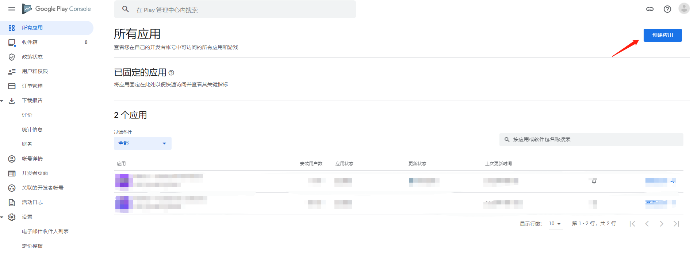
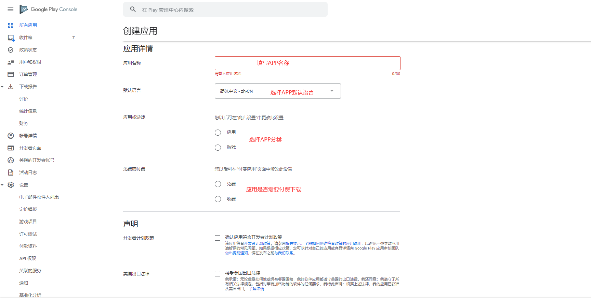
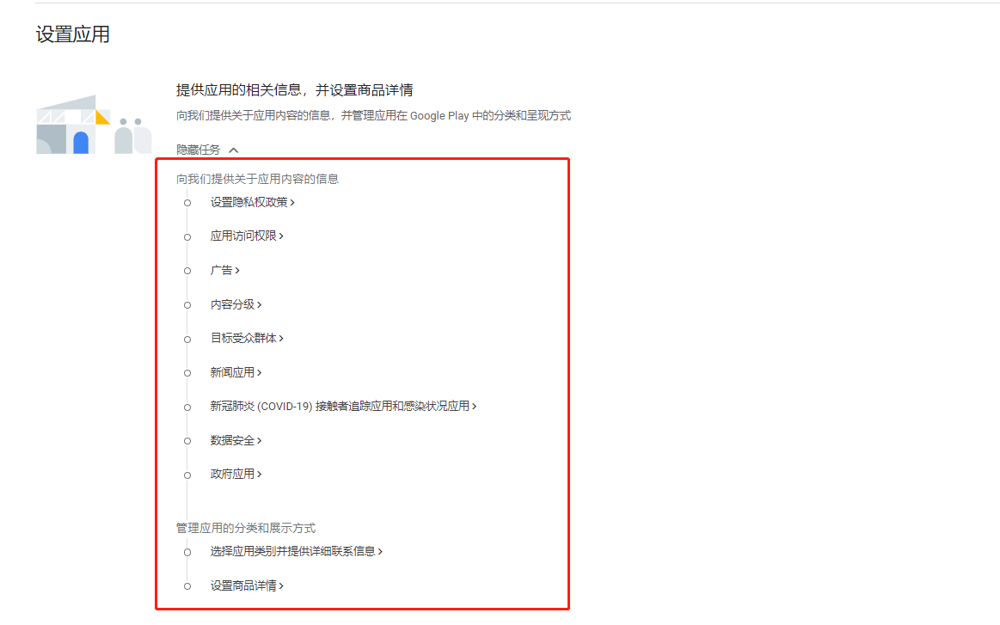
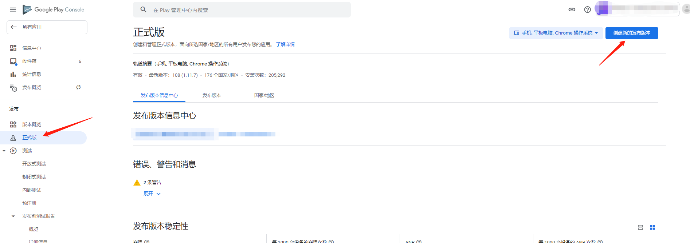
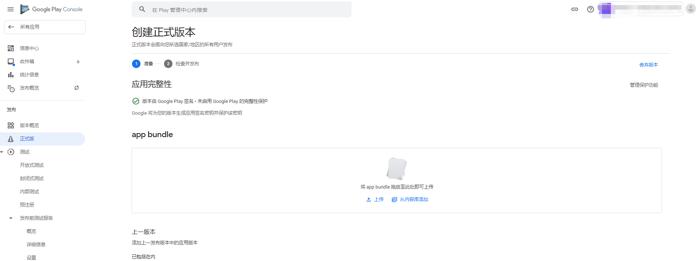
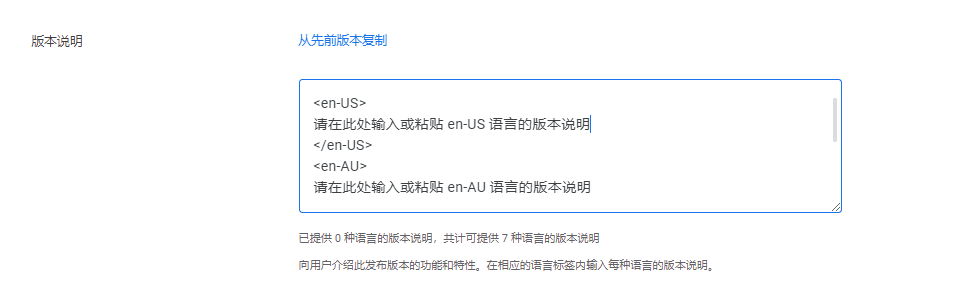
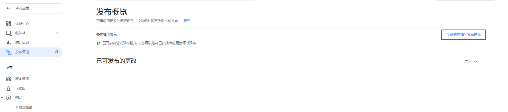
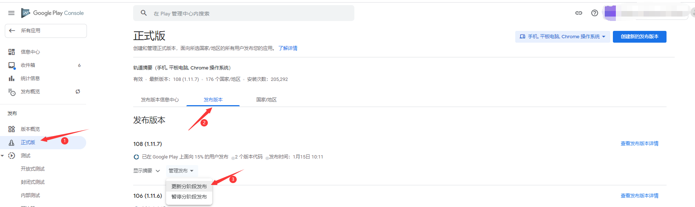

国内的应用商店上架流程都大同小异，今天来说一下Google应用商店的上架流程。

<!--more-->

### 应用首发

首先，得先申请一个Google开发者账号，申请流程[点此查看](https://yixian12580.github.io/2023/011df77120.html)（需花费25美元）。

打开Google Play控制台：[点此前往](https://play.google.com/console/u/0/developers)

1.点击右上角创建应用：

2.填写相关信息：

3.点击创建后回跳转到信息中心，需要按照他的提示全部完成任务，完成之后回打钩：

全部完成之后，可以先在测试渠道上传包，先测试APP登录，支付等是否有问题，如无问题可直接把包推到正式版，或者在正式版渠道提交包进行审核，两种方式皆需要审核，审核通过后即可在Google应用商店发布。

### 应用更新版本

1.应用在Google商店发布之后，有更新版本的需求，登录到Google Play控制台。点击需要更新的APP，点击左边的导航栏：正式版，确认是手机渠道后，点击右上角的创建新的发布版本：

2.点击上传需要更新的APP（因为手机和手表在同一渠道，如有手表包，需要等手机包上传完毕后，再点击上传手表包）：

3.填写更新版本日志（替换中文字体就行，其他字符不可删除，如有多语言，需全部语言替换）：

4.点击检查发布版本，警告可忽略，填写灰度比例，点击发布版本即可提交到Google审核。

5.审核通过后，如果开启了自管式发布，不会自动发布到Google商店，需要到发布概览处点击发布（如需自动发布可在发布概览处关闭自管式发布）：

6.观察数据无异常后，可加大灰度比例，如数据有异常，也可暂停灰度：

