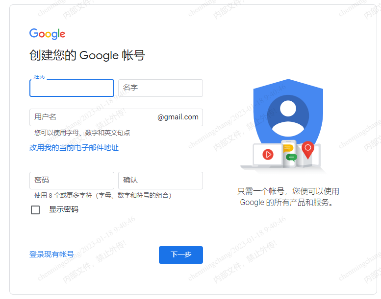
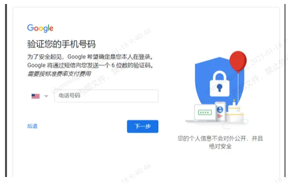
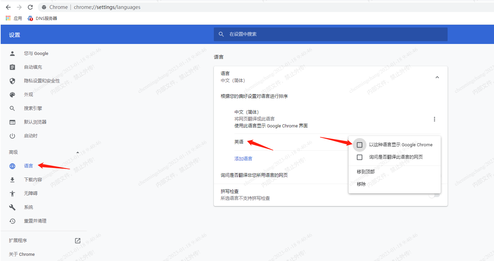
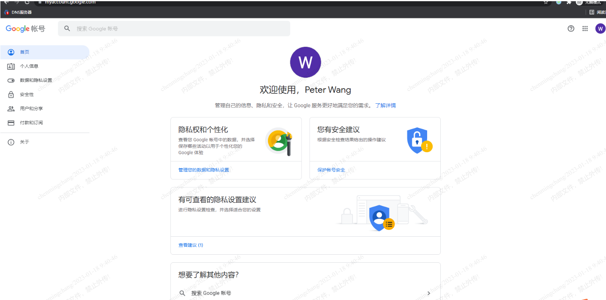
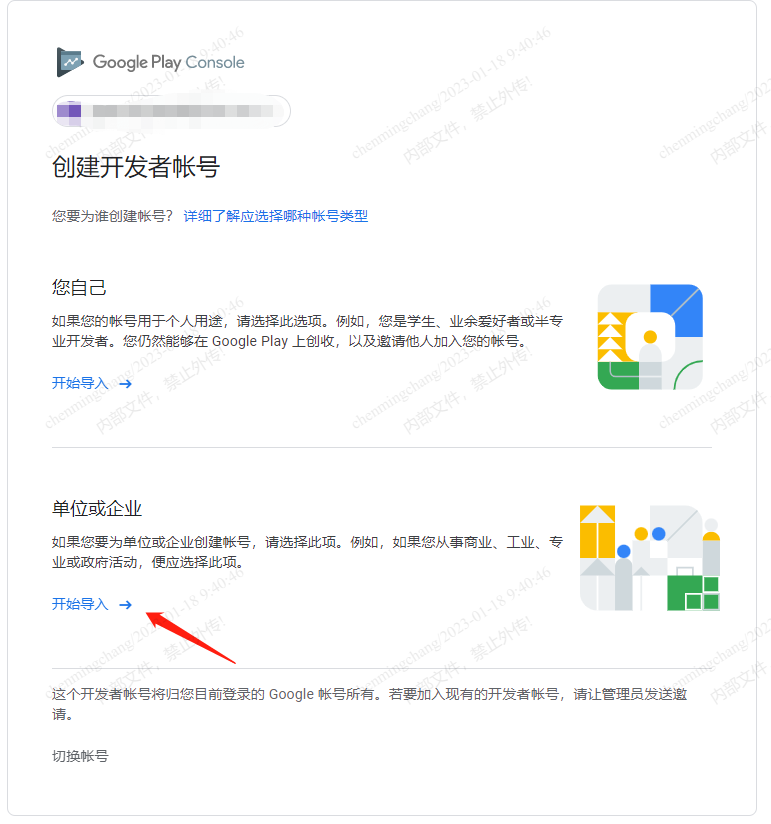
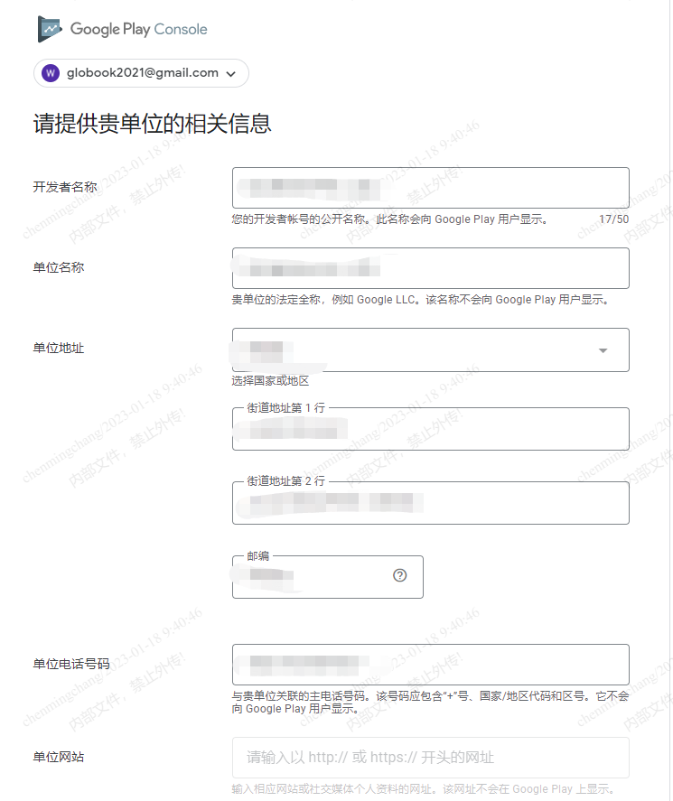
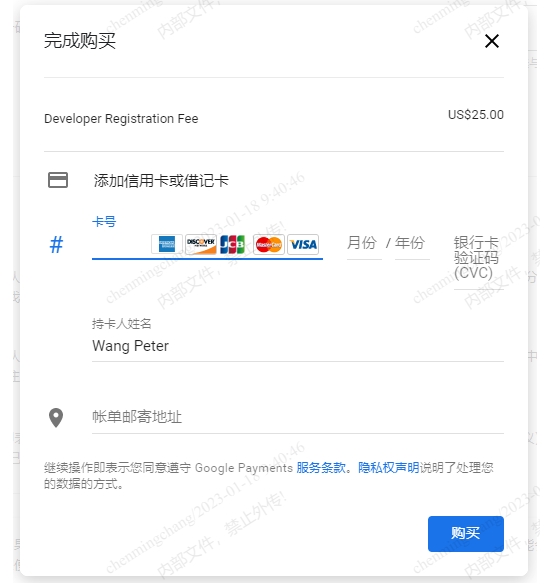
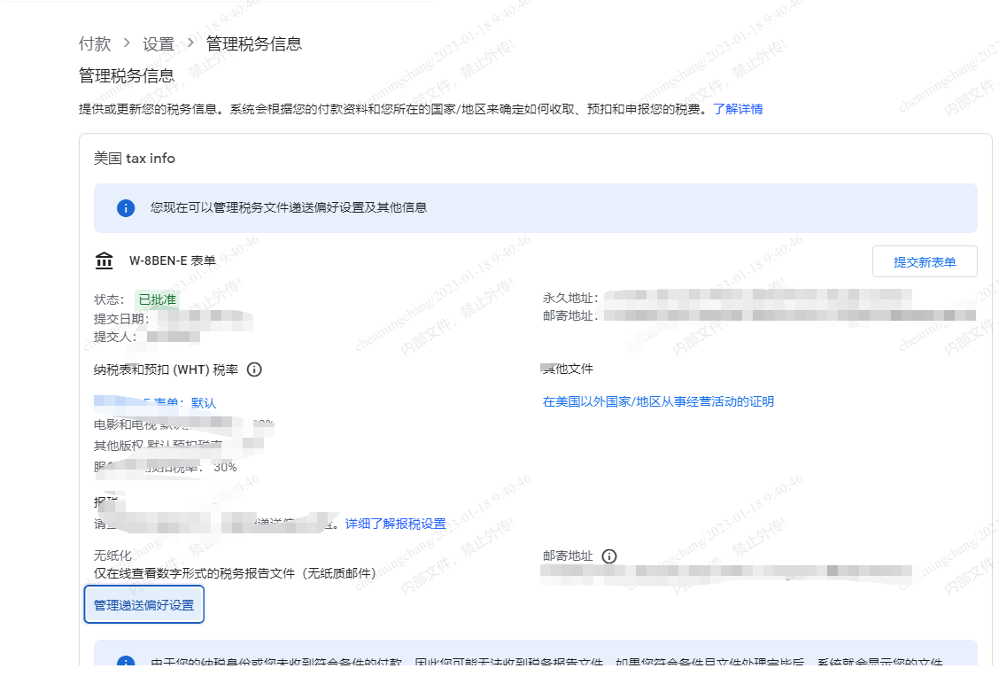
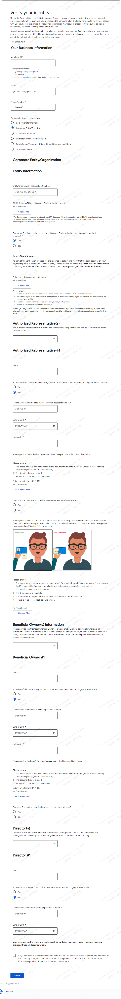

Google商店作为海外最大的应用商店，今天来说说如何申请Google开发者账号，上架我们的APP到谷歌商店。

<!--more-->

1.首先我们要先申请一个Google账号：[前往申请](https://accounts.google.com/signup/v2/webcreateaccount?flowName=GlifWebSignIn&flowEntry=SignUp)

2.验证手机号码，填写国内的手机号码就行：

ps：如果输入号码后提示：“**此电话号码无法用于进行验证**” ：

把Google浏览器设置为英文后重启浏览器重新注册：

3.注册完成后打开[Google开发者后台](https://play.google.com/console/u/2/signup)：

选择个人或公司：

填写相关信息：

付款：

购买完成后即可进入Google Play后台。

4.绑定付款资料（财务提供），Google会往你提供的银行打一笔款，收到款后需填写具体金额进行验证。

验证成功后，需要财务同事协助填写美国税务信息。

5.**账号产生收益后，Google会再次要求验证收款账户，需提供公司注册证书，法人身份证（护照），手持法人身份证（护照）带上Google字眼和时间的标签，银行流水等信息：**

一定要处理，两周到一个月内（时间不定）如果没有完成认证，会导致用户支付失败。账号产生收益，但未绑定银行账号也会出现红色警报

