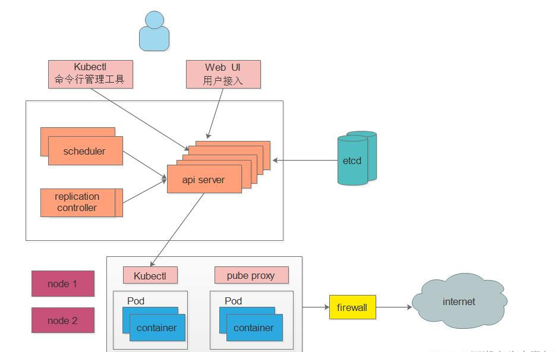
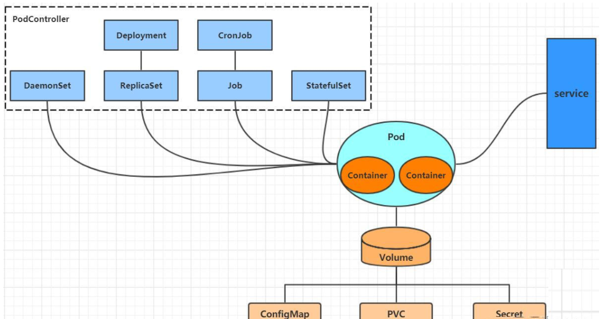
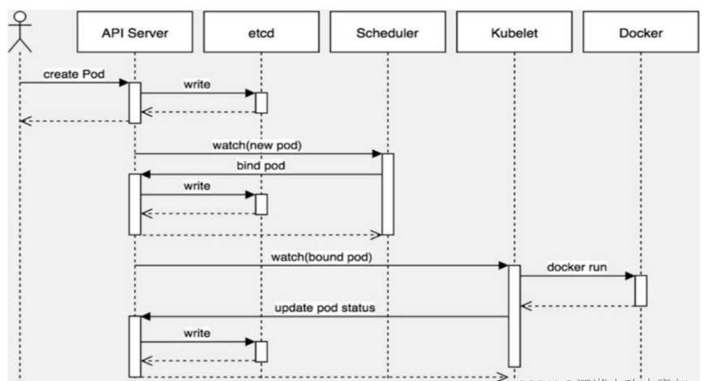

Kubernetes（k8s）作为云原生的核心平台，吸引了越来越多的运维、开发、测试以及其他技术员去了解学习。随着行业越来越内卷，k8s已经被广泛使用。

<!--more-->

#### 什么是K8s

它前生是谷歌的Borg系统，后经过Go语言重写，在2014 年开源了 Kubernetes 项目,并捐献给CNCF 基金会开源,即Kubernetes，之所以简称k8s，因为 Kubernetes 中间有 8个字母。

K8s是一个可移植的、用于自动化部署、扩展和管理容器化应用的开源容器编排技术。
K8s使部署和管理微服务架构应用程序变得很简单。它通过在集群之上形成一个抽象层来实现这一点，允许开发团队平滑地部署应用程序，而 K8s主要处理以下任务：

- 控制和管理应用程序对资源的使用
- 自动负载均衡应用程序的多个实例之间请求
- 监控资源使用和资源限制，为了可以自动阻止应用消耗过多的资源并且可以再次恢复它们
- 如果主机资源耗尽或主机死机，将应用程序实例从一台主机迁移到另一台主机是一个可行的选项
- 当有新的主机加入集群时，新增加的额外资源可以被自动使用

#### K8s为何被广泛应用

为什么现在有很多企业依赖K8s来满足他们的容器编排需求? 因为k8s在Docker技术的基础上，为容器化的应用提供部署运行、资源调度、服务发现和动态伸缩等一系列完整功能，提高了大规模容器集群管理的便捷性。同时Kubernetes是一个完备的分布式系统支撑平台，具有完备的集群管理能力，多扩多层次的安全防护和准入机制、多租户应用支撑能力、透明的服务注册和发现机制、內建智能负载均衡器、强大的故障发现和自我修复能力、服务滚动升级和在线扩容能力、可扩展的资源自动调度机制以及多粒度的资源配额管理能力。同时Kubernetes提供完善的管理工具，涵盖了包括开发、部署测试、运维监控在内的各个环节。概括为：

- **可移植性和灵活性：** K8s有很强的兼容性，因为它可以在各种基础设施和环境设置下运行。大多数其他编排器没有这种灵活性。
- **开源：** CNCF负责管理K8s，这是一个完全开源、由社区驱动的项目。它有许多重要的企业赞助商，但没有一家公司能“控制”这个平台或者控制它的发展方向。
- **多云兼容性：** K8s不但可以将工作负载托管在单个云上，而且可以将工作负载分布在多个云上。 K8s也能轻松地将其环境从一个云扩展到另一个云。虽然其它编排器也能支持多云架构，但K8s在多云兼容性性方面可以完全超越它们。
- **市场领导者：** 大部分公司都在使用K8s，根据红帽公司的一项调查，K8s被客户广泛使用 (88%)，尤其在生产环境中(74%)。

#### K8s架构

K8s是一个架构良好的分布式系统的例子，它将集群中的所有机器都视为单个资源池的一部分。K8s与其他成熟的分布式系统一样，主要是由控制节点(master)、工作节点(node)构成，每个节点上都会安装不同的组件。


##### 控制节点Master

K8S中的Master是集群控制节点，负责整个集群的管理和控制

- **ApiServer :** 资源操作的唯一入口，接收用户输入的命令，提供认证、授权、API注册和发现等机制，其他模块通过API Server查询或修改数据，只有API Server才直接和etcd进行交互；
- **Scheduler :** 负责集群资源调度，通过API Server的Watch接口监听新建Pod副本信息，按照预定的调度策略将Pod调度到相应的node节点上；
- **ControllerManager** : K8S里所有资源对象的自动化控制中心，通过 api-server 提供的 restful 接口实时监控集群内每个资源对象的状态，发生故障时，导致资源对象的工作状态发生变化，就进行干预，尝试将资源对象从当前状态恢复为预期的工作状态，常见的 controller 有 Namespace Controller、Node Controller、Service Controller、ServiceAccount Controller、Token Controller、ResourceQuote Controller、Replication Controller等；
- **Etcd ：** 是Kubernetes的存储状态的数据库（所有master的持续状态都存在etcd的一个实例中）

##### 工作节点Node

Node是K8S集群中的工作负载节点，每个Node都会被Master分配一些工作负载，当某个Node宕机时，其上的工作负载会被Master自动转移到其他节点上

- **Kubelet :** 负责维护容器的生命周期，即通过控制docker，控制Pod 的创建、启动、监控、重启、销毁等工作，处理Master节点下发到本节点的任务；
- **KubeProxy :** 负责制定数据包的转发策略，并以守护进程的模式对各个节点的pod信息实时监控并更新转发规则，service收到请求后会根据kube-proxy制定好的策略来进行请求的转发，从而实现负载均衡，总的来说，负责为Service提供cluster内部的服务发现和负载均衡；
- **Docker :** 负责节点上容器的各种操作；

##### 其他组件

学习kubernetes的核心，就是学习如何对集群上的Pod、Pod控制器、Service、存储等各种资源进行操作

- **Pod：** kubernetes的最小控制单元，容器都是运行在pod中的，一个pod中可以有1个或者多个容器
- **Controller：** 控制器，通过它来实现对pod的管理，比如启动pod、停止pod、伸缩pod的数量等等
- **Service：** pod对外服务的统一入口，下面可以维护者同一类的多个pod
- **Label：** 标签，用于对pod进行分类，同一类pod会拥有相同的标签
- **NameSpace：** 命名空间，用来隔离pod的运行环境



kubernetes在集群启动之后，会默认创建几个namespace:default、kube-node-lease、kube-public、kube-system。默认情况下，kubernetes集群中的所有的Pod都是可以相互访问的，但是在实际中，可能不想让两个Pod之间进行互相的访问，那此时就可以将两个Pod划分到不同的namespace下。kubernetes通过将集群内部的资源分配到不同的Namespace中，可以形成逻辑上的"组"，以方便不同的组的资源进行隔离使用和管理。

#### 部署实例

##### nginx服务部署

为了方便理解，我们部署一个nginx服务来说明kubernetes系统各个组件调用关系：

首先要了解，一旦kubernetes环境启动之后，master和node都会将自身的信息存储到etcd数据库中。

一个nginx服务的安装请求会首先被发送到master节点的apiServer组件，apiServer组件会调用scheduler组件来决定到底应该把这个服务安装到哪个node节点上。在此时，它会从etcd中读取各个node节点的信息，然后按照一定的算法进行选择，并将结果告知apiServer，apiServer调用controller-manager去调度Node节点安装nginx服务，kubelet接收到指令后，会通知docker，然后由docker来启动一个nginx的pod。pod是kubernetes的最小操作单元，容器必须跑在pod中。至此，一个nginx服务就运行了，如果需要访问nginx，就需要通过kube-proxy来对pod产生访问的代理，这样，外界用户就可以访问集群中的nginx服务了。

##### Pod创建流程

1、客户端提交创建请求，可以通过API Server的Restful API，也可以使用kubectl命令行工具。支持的数据类型包括JSON和YAML。

2、API Server处理用户请求，存储Pod数据到etcd。

3、调度器通过API Server查看未绑定的Pod。尝试为Pod分配主机。

4、过滤主机 (调度预选)：调度器用一组规则过滤掉不符合要求的主机。比如Pod指定了所需要的资源量，那么可用资源比Pod需要的资源量少的主机会被过滤掉。

5、主机打分(调度优选)：对第一步筛选出的符合要求的主机进行打分，在主机打分阶段，调度器会考虑一些整体优化策略，比如把容一个Replication Controller的副本分布到不同的主机上，使用最低负载的主机等。

6、选择主机：选择打分最高的主机，进行binding操作，结果存储到etcd中。

7、kubelet根据调度结果执行Pod创建操作： 绑定成功后，scheduler会调用APIServer的API在etcd中创建一个boundpod对象，描述在一个工作节点上绑定运行的所有pod信息。运行在每个工作节点上的kubelet也会定期与etcd同步boundpod信息，一旦发现应该在该工作节点上运行的boundpod对象没有更新，则调用Docker API创建并启动pod内的容器。



在整个生命周期中，Pod会出现5种状态（相位），分别如下：

- **挂起(Pending):** apiserver已经创建了pod资源对象，但它尚未被调度完成或者仍处于下载镜像的过程中
- **运行中(Running):** pod已经被调度至某节点，并且所有容器都已经被kubelet创建完成
- **成功(Succeeded):** pod中的所有容器都已经成功终止并且不会被重启
- **失败(Failed):** 所有容器都已经终止，但至少有一个容器终止失败，即容器返回了非0值的退出状态
- **未知(Unknown):** apiserver无法正常获取到pod对象的状态信息，通常由网络通信失败所导致

#### K8s常用命令

kubectl 命令的语法如下：

```
kubectl [command] [TYPE] [NAME] [flags]
```

kubectl命令中，指定执行什么操作（command，如create,delete,describe ,get ,apply 等）指定什么类型资源对象（type）指定此类型的资源对象名称（name）指定可选参数（flags）

查看pod，nodee，service，endpoints，secret等信息

```
kubectl get 组件名      #例如kubectl get pod
```

查看资源状态，比如有一组deployment内的pod没起来，一般用于pod调度过程出现的问题排查

```
kubectl describe pod pod名    #先用kubectl get pod查看
```

查看node节点或者是pod资源（cpu，内存资源）使用情况

```
kubectl top 组件名     #例如kubectl top node  kubectl top pod
```

进入pod内部

```
kubectl exec -ti pod名 /bin/bash   #先用kubectl get pod查看
```

删除pod

```
kubectl delete pod -n
```

查看集群健康状态

```
kubectl get cs
```

基于 pod.yaml 定义的名称删除指定资源

```
kubectl delete -f pod.yaml
```

查看容器的日志

```
kubectl logs -f <pod-name> # 实时查看日志
```

创建资源

```
kubectl apply -f ./my-manifest.yaml 
```
