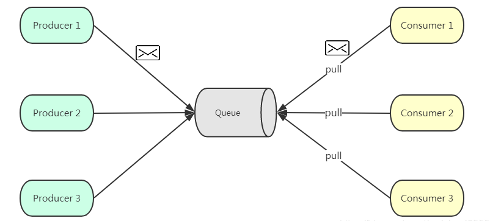
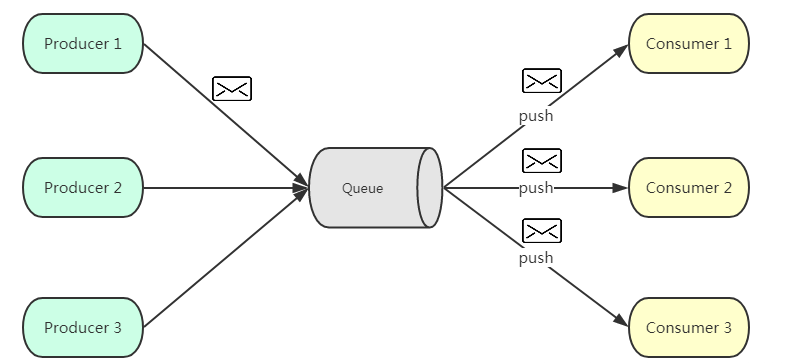
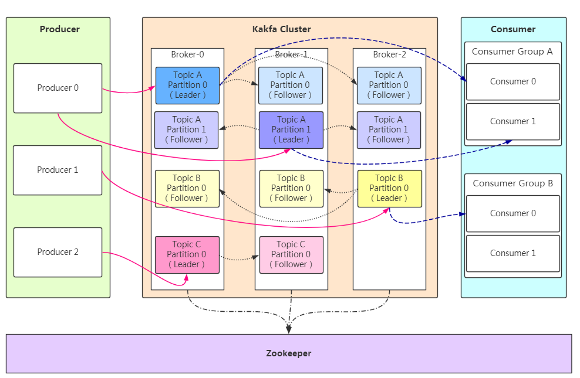
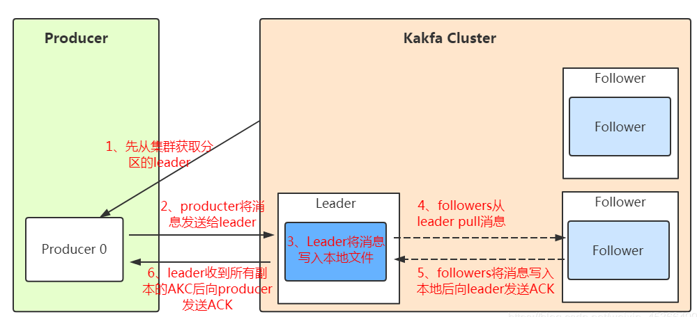
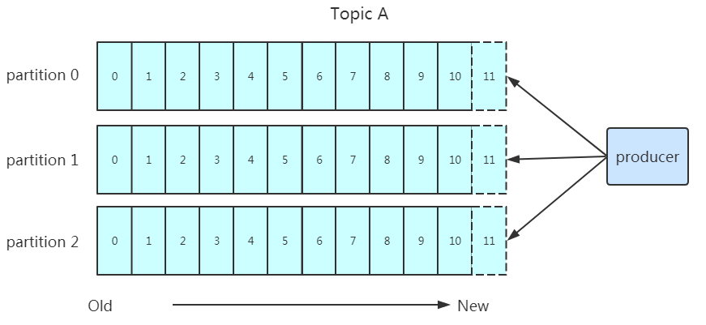
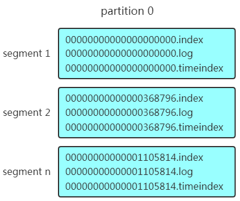
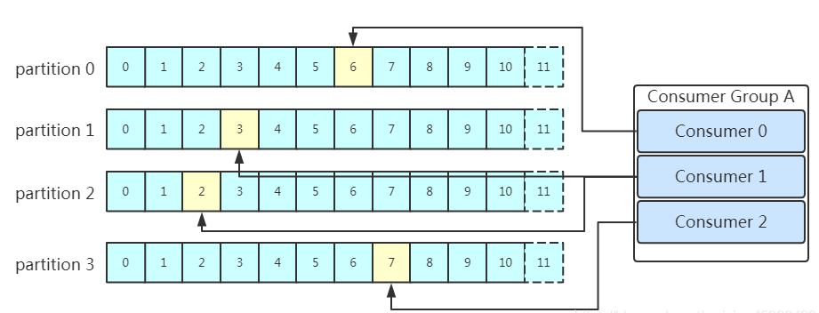
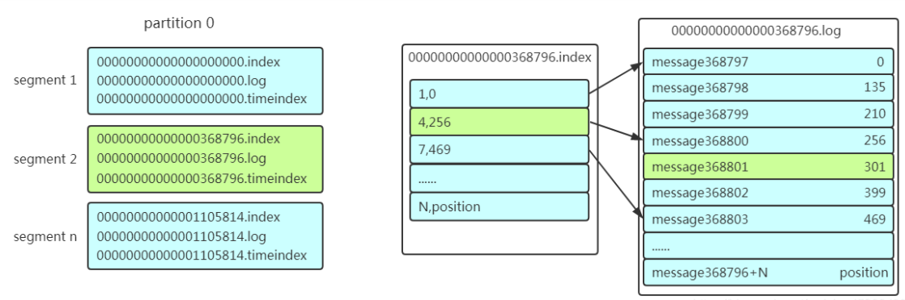

Kafka是最初由Linkedin公司开发，是一个分布式、支持分区的（partition）、多副本的（replica），基于zookeeper协调的分布式消息系统，它的最大的特性就是可以实时的处理大量数据以满足各种需求场景：比如基于hadoop的批处理系统、低延迟的实时系统、storm/Spark流式处理引擎，web/nginx日志、访问日志，消息服务等等，用scala语言编写，Linkedin于2010年贡献给了Apache基金会并成为顶级开源 项目。

<!--more-->

## 概念理解

### 产生背景

当今社会各种应用系统诸如商业、社交、搜索、浏览等像信息工厂一样不断的生产出各种信息，在大数据时代，我们面临如下几个挑战：

1. 如何收集这些巨大的信息
2. 如何分析它
3. 如何及时做到如上两点

以上几个挑战形成了一个业务需求模型，即生产者生产（produce）各种信息，消费者消费（consume）（处理分析）这些信息，而在生产者与消费者之间，需要一个沟通两者的桥梁-消息系统。从一个微观层面来说，这种需求也可理解为不同的系统之间如何传递消息。

**Kafka诞生**
Kafka由 linked-in 开源
kafka-即是解决上述这类问题的一个框架，它实现了生产者和消费者之间的无缝连接。
kafka-高产出的分布式消息系统(A high-throughput distributed messaging system)

### Kafka的特性

- **高吞吐量、低延迟**：kafka每秒可以处理几十万条消息，它的延迟最低只有几毫秒
- **可扩展性**：kafka集群支持热扩展
- **持久性、可靠性**：消息被持久化到本地磁盘，并且支持数据备份防止数据丢失
- **容错性**：允许集群中节点失败（若副本数量为n,则允许n-1个节点失败）
- **高并发**：支持数千个客户端同时读写

### Kafka场景应用

- **日志收集**：一个公司可以用Kafka可以收集各种服务的log，通过kafka以统一接口服务的方式开放给各种consumer，例如hadoop、Hbase、Solr等。
- **消息系统**：解耦和生产者和消费者、缓存消息等。
- **用户活动跟踪**：Kafka经常被用来记录web用户或者app用户的各种活动，如浏览网页、搜索、点击等活动，这些活动信息被各个服务器发布到kafka的topic中，然后订阅者通过订阅这些topic来做实时的监控分析，或者装载到hadoop、数据仓库中做离线分析和挖掘。
- **运营指标**：Kafka也经常用来记录运营监控数据。包括收集各种分布式应用的数据，生产各种操作的集中反馈，比如报警和报告。
- **流式处理**：比如spark streaming和storm
- **事件源**

### Kafka一些重要设计思想

- **Consumergroup**：各个consumer可以组成一个组，每个消息只能被组中的一个consumer消费，如果一个消息可以被多个consumer消费的话，那么这些consumer必须在不同的组。
- **消息状态**：在Kafka中，消息的状态被保存在consumer中，broker不会关心哪个消息被消费了被谁消费了，只记录一个offset值（指向partition中下一个要被消费的消息位置），这就意味着如果consumer处理不好的话，broker上的一个消息可能会被消费多次。
- **消息持久化**：Kafka中会把消息持久化到本地文件系统中，并且保持极高的效率。
- **消息有效期**：Kafka会长久保留其中的消息，以便consumer可以多次消费，当然其中很多细节是可配置的。
- **批量发送**：Kafka支持以消息集合为单位进行批量发送，以提高push效率。
- **push-and-pull** :Kafka中的Producer和consumer采用的是push-and-pull模式，即Producer只管向broker push消息，consumer只管从broker pull消息，两者对消息的生产和消费是异步的。
- **Kafka集群中broker之间的关系**：不是主从关系，各个broker在集群中地位一样，我们可以随意的增加或删除任何一个broker节点。
- **负载均衡方面**： Kafka提供了一个 metadata API来管理broker之间的负载（对Kafka0.8.x而言，对于0.7.x主要靠zookeeper来实现负载均衡）。
- **同步异步**：Producer采用异步push方式，极大提高Kafka系统的吞吐率（可以通过参数控制是采用同步还是异步方式）。
- **分区机制partition**：Kafka的broker端支持消息分区，Producer可以决定把消息发到哪个分区，在一个分区中消息的顺序就是Producer发送消息的顺序，一个主题中可以有多个分区，具体分区的数量是可配置的。分区的意义很重大，后面的内容会逐渐体现。
- **离线数据装载**：Kafka由于对可拓展的数据持久化的支持，它也非常适合向Hadoop或者数据仓库中进行数据装载。
- **插件支持**：现在不少活跃的社区已经开发出不少插件来拓展Kafka的功能，如用来配合Storm、Hadoop、flume相关的插件。

## 消息队列通信的模式

### 点对点模式

如上图所示，点对点模式通常是基于拉取或者轮询的消息传送模型，这个模型的特点是发送到队列的消息被一个且只有一个消费者进行处理。生产者将消息放入消息队列后，由消费者主动的去拉取消息进行消费。点对点模型的的优点是消费者拉取消息的频率可以由自己控制。但是消息队列是否有消息需要消费，在消费者端无法感知，所以在消费者端需要额外的线程去监控。

### 发布订阅模式

如上图所示，发布订阅模式是一个基于消息送的消息传送模型，改模型可以有多种不同的订阅者。生产者将消息放入消息队列后，队列会将消息推送给订阅过该类消息的消费者（类似微信公众号)。由于是消费者被动接收推送，所以无需感知消息队列是否有待消费的消息！但是consumer1、consumer2、consumer3由于机器性能不一样，所以处理消息的能力也会不一样，但消息队列却无法感知消费者消费的速度！所以推送的速度成了发布订阅模模式的一个问题！假设三个消费者处理速度分别是8M/s、5M/s、2M/s，如果队列推送的速度为5M/s，则consumer3无法承受！如果队列推送的速度为2M/s，则consumer1、consumer2会出现资源的极大浪费！

## Kafka的架构原理

上面简单的介绍了为什么需要消息队列以及消息队列通信的两种模式，下面主角介绍Kafka。Kafka是一种**高吞吐量的分布式发布订阅消息系统**，它可以处理消费者规模的网站中的所有动作流数据，具有高性能、持久化、多副本备份、横向扩展能力。

### 基础架构与名词解释

- Producer：Producer即生产者，消息的产生者，是消息的入口。
- Broker：Broker是kafka实例，每个服务器上有一个或多个kafka的实例，我们姑且认为每个broker对应一台服务器。每个kafka集群内的broker都有一个不重复的编号，如图中的broker-0、broker-1等……
- Topic：消息的主题，可以理解为消息的分类，kafka的数据就保存在topic。在每个broker上都可以创建多个topic。
- Partition：Topic的分区，每个topic可以有多个分区，分区的作用是做负载，提高kafka的吞吐量。同一个topic在不同的分区的数据是不重复的，partition的表现形式就是一个一个的文件夹！
- Replication:每一个分区都有多个副本，副本的作用是做备胎。当主分区（Leader）故障的时候会选择一个备胎（Follower）上位，成为Leader。在kafka中默认副本的最大数量是10个，且副本的数量不能大于Broker的数量，follower和leader绝对是在不同的机器，同一机器对同一个分区也只可能存放一个副本（包括自己）。
- Message：每一条发送的消息主体。
- Consumer：消费者，即消息的消费方，是消息的出口。
- Consumer Group：我们可以将多个消费组组成一个消费者组，在kafka的设计中同一个分区的数据只能被消费者组中的某一个消费者消费。同一个消费者组的消费者可以消费同一个topic的不同分区的数据，这也是为了提高kafka的吞吐量！
- Zookeeper：kafka集群依赖zookeeper来保存集群的的元信息，来保证系统的可用性。

### 工作流程分析

#### 发送数据

我们看上面的架构图中，producer就是生产者，是数据的入口。注意看图中的红色箭头，**Producer在写入数据的时候永远的找leader**，不会直接将数据写入**follower**！那leader怎么找呢？写入的流程又是什么样的呢？我们看下图：

发送的流程就在图中已经说明了，就不单独在文字列出来了！需要注意的一点是，消息写入leader后，follower是主动的去leader进行同步的！producer采用push模式将数据发布到broker，每条消息追加到分区中，顺序写入磁盘，所以保证同一分区内的数据是有序的！写入示意图如下：

上面说到数据会写入到不同的分区，那kafka为什么要做分区呢？相信大家应该也能猜到，分区的主要目的是：

1. **方便扩展**：因为一个topic可以有多个partition，所以我们可以通过扩展机器去轻松的应对日益增长的数据量。
2. **提高并发**：以partition为读写单位，可以多个消费者同时消费数据，提高了消息的处理效率。

熟悉负载均衡的朋友应该知道，当我们向某个服务器发送请求的时候，服务端可能会对请求做一个负载，将流量分发到不同的服务器，那在kafka中，如果某个topic有多个partition，producer又怎么知道该将数据发往哪个partition呢？kafka中有几个原则：

1. partition在写入的时候可以指定需要写入的partition，如果有指定，则写入对应的partition。
2. 如果没有指定partition，但是设置了数据的key，则会根据key的值hash出一个partition。
3. 如果既没指定partition，又没有设置key，则会轮询选出一个partition。

保证消息不丢失是一个消息队列中间件的基本保证，那producer在向kafka写入消息的时候，怎么保证消息不丢失呢？其实上面的写入流程图中有描述出来，那就是通过ACK应答机制！在生产者向队列写入数据的时候可以设置参数来确定是否确认kafka接收到数据，这个参数可设置的值为**0、1、all**。

- 0代表producer往集群发送数据不需要等到集群的返回，不确保消息发送成功。安全性最低但是效率最高。
- 1代表producer往集群发送数据只要leader应答就可以发送下一条，只确保leader发送成功。
- all代表producer往集群发送数据需要所有的follower都完成从leader的同步才会发送下一条，确保leader发送成功和所有的副本都完成备份。安全性最高，但是效率最低。

最后要注意的是，如果往不存在的topic写数据，能不能写入成功呢？kafka会自动创建topic，分区和副本的数量根据默认配置都是1。

#### 保存数据

Producer将数据写入kafka后，集群就需要对数据进行保存了！kafka将数据保存在磁盘，可能在我们的一般的认知里，写入磁盘是比较耗时的操作，不适合这种高并发的组件。Kafka初始会单独开辟一块磁盘空间，顺序写入数据（效率比随机写入高）。

##### Partition 结构

前面说过了每个topic都可以分为一个或多个partition，如果你觉得topic比较抽象，那partition就是比较具体的东西了！Partition在服务器上的表现形式就是一个一个的文件夹，每个partition的文件夹下面会有多组segment文件，每组segment文件又包含.index文件、.log文件、.timeindex文件（早期版本中没有）三个文件， log文件就实际是存储message的地方，而index和timeindex文件为索引文件，用于检索消息。

如上图，这个partition有三组segment文件，每个log文件的大小是一样的，但是存储的message数量是不一定相等的（每条的message大小不一致)。文件的命名是以该segment最小offset来命名的，如000.index存储offset为0~368795的消息，kafka就是利用分段+索引的方式来解决查找效率的问题。

##### Message结构

上面说到log文件就实际是存储message的地方，我们在producer往kafka写入的也是一条一条的message，那存储在log中的message是什么样子的呢？消息主要包含消息体、消息大小、offset、压缩类型……等等！我们重点需要知道的是下面三个：

- **offset**：offset是一个占8byte的有序id号，它可以唯一确定每条消息在parition内的位置！
- **消息大小**：消息大小占用4byte，用于描述消息的大小。
- **消息体**：消息体存放的是实际的消息数据（被压缩过），占用的空间根据具体的消息而不一样。

##### 存储策略

无论消息是否被消费，kafka都会保存所有的消息。那对于旧数据有什么删除策略呢？

- 基于时间，默认配置是168小时（7天）。
- 基于大小，默认配置是1073741824。

需要注意的是，kafka读取特定消息的时间复杂度是O(1)，所以这里删除过期的文件并不会提高kafka的性能！

#### 消费数据

消息存储在log文件后，消费者就可以进行消费了。在讲消息队列通信的两种模式的时候讲到过点对点模式和发布订阅模式。Kafka采用的是发布订阅模式，消费者主动的去kafka集群拉取消息，与producer相同的是，消费者在拉取消息的时候也是找**leader**去拉取。

多个消费者可以组成一个消费者组（consumer group），每个消费者组都有一个组id！同一个消费组者的消费者可以消费同一topic下不同分区的数据，但是不会组内多个消费者消费同一分区的数据！！！我们看下图：

图示是消费者组内的消费者小于partition数量的情况，所以会出现某个消费者消费多个partition数据的情况，消费的速度也就不及只处理一个partition的消费者的处理速度！如果是消费者组的消费者多于partition的数量，那会不会出现多个消费者消费同一个partition的数据呢？上面已经提到过不会出现这种情况！多出来的消费者不消费任何partition的数据。所以在实际的应用中，**建议消费者组的consumer的数量与partition的数量一致**！

在保存数据的小节里面，我们聊到了partition划分为多组segment，每个segment又包含.log、.index、.timeindex文件，存放的每条message包含offset、消息大小、消息体……我们多次提到segment和offset，查找消息的时候是怎么利用segment+offset配合查找的呢？假如现在需要查找一个offset为368801的message是什么样的过程呢？我们先看看下面的图：

1. 先找到offset的368801message所在的segment文件（利用二分法查找），这里找到的就是在第二个segment文件。
2. 打开找到的segment中的.index文件（也就是368796.index文件，该文件起始偏移量为368796+1，我们要查找的offset为368801的message在该index内的偏移量为368796+5=368801，所以这里要查找的相对offset为5）。由于该文件采用的是稀疏索引的方式存储着相对offset及对应message物理偏移量的关系，所以直接找相对offset为5的索引找不到，这里同样利用二分法查找相对offset小于或者等于指定的相对offset的索引条目中最大的那个相对offset，所以找到的是相对offset为4的这个索引。
3. 根据找到的相对offset为4的索引确定message存储的物理偏移位置为256。打开数据文件，从位置为256的那个地方开始顺序扫描直到找到offset为368801的那条Message。

这套机制是建立在offset为有序的基础上，利用segment+有序offset+稀疏索引+二分查找+顺序查找等多种手段来高效的查找数据！至此，消费者就能拿到需要处理的数据进行处理了。那每个消费者又是怎么记录自己消费的位置呢？在早期的版本中，消费者将消费到的offset维护zookeeper中，consumer每间隔一段时间上报一次，这里容易导致重复消费，且性能不好！在新的版本中消费者消费到的offset已经直接维护在kafk集群的__consumer_offsets这个topic中！
