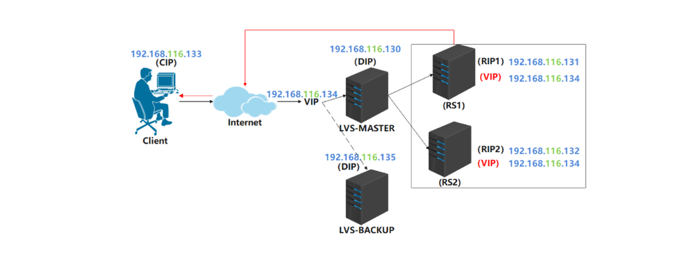

高可用集群（High Availability Cluster，简称HA Cluster），是指以减少服务中断时间为目的得服务器集群技术。它通过保护用户得业务程序对外部间断提供的服务，把因为软件，硬件，认为造成的故障对业务得影响降低到最小程度。

<!--more-->

之前部署的LVS有说到一个缺点就是LVS只是前端调度的功能，没有健康检查，导致如果后端服务器出现故障的话，请求还是会发到故障的服务器，今天我们通过Keepalive健康检查来解决这个问题，同时，Keepalive还对director做冗余，如果主director故障了，备director会及时顶上工作，实现高可用。

### KeepAlived

#### keepAlived简介

 Keepalived的作用是检测服务器状态，如果有一台web服务器宕机，或工作出现故障，Keepalived将检测到，并将有故障的服务器从系统中剔除，同时使用其他服务器代替该服务器的工作，当服务器工作正常后Keepalived自动将服务器加入到服务器群中。

 **VRRP协议**

 在现实的网络环境中。主机之间的通信都是通过配置静态路由或者(默认网关)来完成的，而主机之间的路由器一旦发生故障，通信就会失效，因此这种通信模式当中，路由器就成了一个单点瓶颈，为了解决这个问题，就引入了VRRP协议。

 VRRP协议是一种容错的主备模式的协议，保证当主机的下一跳路由出现故障时，由另一台路由器来代替出现故障的路由器进行工作，通过VRRP可以在网络发生故障时透明的进行设备切换而不影响主机之间的数据通信。

 **故障迁移原理**

 在 Keepalived 服务正常工作时，主 Master 节点会不断地向备节点发送（多播的方式）心跳消息，用以告诉备 Backup 节点自己还活着，当主 Master 节点发生故障时，就无法发送心跳消息，备节点也就因此无法继续检测到来自主 Master 节点的心跳了，于是调用自身的接管程序，接管主 Master 节点的 IP 资源及服务。而当主 Master 节点恢复时，备 Backup 节点又会释放主节点故障时自身接管的 IP 资源及服务，恢复到原来的备用角色。

**keepAlived原理**

 Keepalived工作在TCP/IP参考模型的三层、四层、五层

**分布式选主策略**

 在一个一主多备的Keepalived集群中，priority值最大的将成为集群中的MASTER节点，而其他都是BACKUP节点。在MASTER节点发生故障后，BACKUP节点之间将进行“民主选举”，通过对节点优先级值priority和weight的计算，选出新的MASTER节点接管集群服务。

**设置priority和weight**

 **weight值为正数时**

 在vrrp_script中指定的脚本如果检测成功，那么MASTER节点的权值将是weight值与priority值之和；如果脚本检测失效，那么MASTER节点的权值保持为priority值

 MASTER 节点vrrp_script脚本检测失败时，如果MASTER节点priority值小于BACKUP节点weight值与priority值之和，将发生主、备切换。

 MASTER节点vrrp_script脚本检测成功时，如果MASTER节点weight值与priority值之和大于BACKUP节点weight值与priority值之和，主节点依然为主节点，不发生切换。

 **weight值为负数时**

 在vrrp_script中指定的脚本如果检测成功，那么MASTER节点的权值仍为priority值，当脚本检测失败时，MASTER节点的权值将是priority值与weight值之差

 MASTER节点vrrp_script脚本检测失败时，如果MASTER节点priority值与weight值之差小于BACKUP节点priority值，将发生主、备切换。

 MASTER节点vrrp_scrip脚本检测成功时，如果MASTER节点priority值大于BACKUP节点priority值时，主节点依然为主节点，不发生切换。

> weight设置标准

 对于weight值的设置，有一个简单的标准，即weight值的绝对值要大于MASTER和BACKUP节点priority值之差。由此可见，对于weight值的设置要非常谨慎，如果设置不好，主节点发生故障时将导致集群角色选举失败，使集群陷于瘫痪状态。

### LVS+keepAlived实战

#### 实战拓扑




> 为了测试lvs的高可用，这里需要增加一台lvs服务器，需在此服务器上安装ipvsadm。

#### keepAlived安装和配置

 在两台lvs服务器上都需要安装keepAlived，安装命令如下:

```text
yum install -y keepalived
```

 keepAlived安装完成后，在/etc/keepalived目录下有一个keepalived.conf配置文件，内容如下:

```text
! Configuration File for keepalived

global_defs {
   notification_email {
     acassen@firewall.loc
     failover@firewall.loc
     sysadmin@firewall.loc
   }
   notification_email_from Alexandre.Cassen@firewall.loc
   smtp_server 192.168.200.1
   smtp_connect_timeout 30
   router_id LVS_DEVEL
   vrrp_skip_check_adv_addr
   vrrp_strict
   vrrp_garp_interval 0
   vrrp_gna_interval 0
}
#上面的配置无需关注，重点关注和修改下面的配置
vrrp_instance VI_1 {
    state MASTER      #标识当前lvs是主，根据实际lvs服务器规划确定，可选值MASTER和BACKUP
    interface eth0      #lvs服务器提供服务器的网卡，根据实际服务器网卡进行修改
    virtual_router_id 51    #lvs提供的服务所属ID，目前无需修改
    priority 100         #lvs服务器的优先级，主服务器最高，备份服务器要低于主服务器
    advert_int 1
    authentication {
        auth_type PASS
        auth_pass 1111
    }
    #virtual_ipaddress用于配置VIP和LVS服务器的网卡绑定关系，一般需要修改
    #示例: 192.168.116.134/24 dev ens33 label ens33:9
    virtual_ipaddress {
        192.168.200.16
        192.168.200.17
        192.168.200.18
    }
}
#配置lvs服务策略，相当于ipvsadm -A -t 192.168.116.134:80 -s rr，一般需要修改
virtual_server 192.168.200.100 443 {
    delay_loop 6
    lb_algo rr    #配置lvs调度算法，默认轮询
    lb_kind NAT    #配置lvs工作模式，可以改为DR
    persistence_timeout 50     #用于指定同一个client在多久内，只去请求第一次提供服务的RS，为查看轮询效果，这里需要改为0
    protocol TCP#TCP协议
    #配置RS信息，相当于ipvsadm -a -t 192.168.116.134:80 -r 192.168.116.131 -g
    real_server 192.168.201.100 443 {
        weight 1       #当前RS的权重
        SSL_GET {          #SSL_GET健康检查，一般改为HTTP_GET
            #两个url可以删除一个，url内的内容改为path /和status_code 200，digest删除
            url {
              path /
              digest ff20ad2481f97b1754ef3e12ecd3a9cc
            }
            url {
              path /mrtg/
              digest 9b3a0c85a887a256d6939da88aabd8cd
            }
            connect_timeout 3
            nb_get_retry 3
            delay_before_retry 3
        }
    }
}
#下面的配置实际是两组lvs服务的配置，含义和上面的lvs服务配置一致。如果用不到，下面的配置可以全部删除
virtual_server 10.10.10.2 1358 {
    delay_loop 6
    lb_algo rr 
    lb_kind NAT
    persistence_timeout 50
    protocol TCP

    sorry_server 192.168.200.200 1358

    real_server 192.168.200.2 1358 {
        weight 1
        HTTP_GET {
            url { 
              path /testurl/test.jsp
              digest 640205b7b0fc66c1ea91c463fac6334d
            }
            url { 
              path /testurl2/test.jsp
              digest 640205b7b0fc66c1ea91c463fac6334d
            }
            url { 
              path /testurl3/test.jsp
              digest 640205b7b0fc66c1ea91c463fac6334d
            }
            connect_timeout 3
            nb_get_retry 3
            delay_before_retry 3
        }
    }

    real_server 192.168.200.3 1358 {
        weight 1
        HTTP_GET {
            url { 
              path /testurl/test.jsp
              digest 640205b7b0fc66c1ea91c463fac6334c
            }
            url { 
              path /testurl2/test.jsp
              digest 640205b7b0fc66c1ea91c463fac6334c
            }
            connect_timeout 3
            nb_get_retry 3
            delay_before_retry 3
        }
    }
}

virtual_server 10.10.10.3 1358 {
    delay_loop 3
    lb_algo rr 
    lb_kind NAT
    persistence_timeout 50
    protocol TCP

    real_server 192.168.200.4 1358 {
        weight 1
        HTTP_GET {
            url { 
              path /testurl/test.jsp
              digest 640205b7b0fc66c1ea91c463fac6334d
            }
            url { 
              path /testurl2/test.jsp
              digest 640205b7b0fc66c1ea91c463fac6334d
            }
            url { 
              path /testurl3/test.jsp
              digest 640205b7b0fc66c1ea91c463fac6334d
            }
            connect_timeout 3
            nb_get_retry 3
            delay_before_retry 3
        }
    }

    real_server 192.168.200.5 1358 {
        weight 1
        HTTP_GET {
            url { 
              path /testurl/test.jsp
              digest 640205b7b0fc66c1ea91c463fac6334d
            }
            url { 
              path /testurl2/test.jsp
              digest 640205b7b0fc66c1ea91c463fac6334d
            }
            url { 
              path /testurl3/test.jsp
              digest 640205b7b0fc66c1ea91c463fac6334d
            }
            connect_timeout 3
            nb_get_retry 3
            delay_before_retry 3
        }
    }
}
```

#####  配置keepAlived

 基于上述配置文件和实战拓扑图及服务器规划，对两台lvs服务器分别修改keepalived.conf配置如下:

 **lvs主服务器**

```text
! Configuration File for keepalived

global_defs {
   notification_email {
     acassen@firewall.loc
     failover@firewall.loc
     sysadmin@firewall.loc
   }
   notification_email_from Alexandre.Cassen@firewall.loc
   smtp_server 192.168.200.1
   smtp_connect_timeout 30
   router_id LVS_DEVEL
   vrrp_skip_check_adv_addr
   #vrrp_strict
   vrrp_garp_interval 0
   vrrp_gna_interval 0
}

vrrp_instance VI_1 {
    state MASTER
    interface ens33
    virtual_router_id 51
    priority 100
    advert_int 1
    authentication {
        auth_type PASS
        auth_pass 1111
    }
    virtual_ipaddress {
        192.168.116.134/24 dev ens33 label ens33:9
    }
}

virtual_server 192.168.116.134 80 {
    delay_loop 6
    lb_algo rr
    lb_kind DR
    persistence_timeout 0
    protocol TCP

    real_server 192.168.116.131 80 {
        weight 1
        HTTP_GET {
            url {
              path /
              status 200 
            }
            connect_timeout 3
            nb_get_retry 3
            delay_before_retry 3
        }
    }
    real_server 192.168.116.132 80 {
        weight 1
        HTTP_GET {
            url {
              path /
              status 200 
            }
            connect_timeout 3
            nb_get_retry 3
            delay_before_retry 3
        }
    }
}
```

**lvs备份服务器**

```text
! Configuration File for keepalived

global_defs {
   notification_email {
     acassen@firewall.loc
     failover@firewall.loc
     sysadmin@firewall.loc
   }
   notification_email_from Alexandre.Cassen@firewall.loc
   smtp_server 192.168.200.1
   smtp_connect_timeout 30
   router_id LVS_DEVEL
   vrrp_skip_check_adv_addr
   #vrrp_strict
   vrrp_garp_interval 0
   vrrp_gna_interval 0
}

vrrp_instance VI_1 {
    state BACKUP
    interface ens33
    virtual_router_id 51
    priority 80
    advert_int 1
    authentication {
        auth_type PASS
        auth_pass 1111
    }
    virtual_ipaddress {
        192.168.116.134/24 dev ens33 label ens33:9
    }
}

virtual_server 192.168.116.134 80 {
    delay_loop 6
    lb_algo rr
    lb_kind DR
    persistence_timeout 0
    protocol TCP

    real_server 192.168.116.131 80 {
        weight 1
        HTTP_GET {
            url {
              path /
              status 200 
            }
            connect_timeout 3
            nb_get_retry 3
            delay_before_retry 3
        }
    }
    real_server 192.168.116.132 80 {
        weight 1
        HTTP_GET {
            url {
              path /
              status 200 
            }
            connect_timeout 3
            nb_get_retry 3
            delay_before_retry 3
        }
    }
}
```

> 注意：配置文件中的key和大括号之间一定要有空格

##### 启动keepAlived

 在两台lvs服务器上分别启动keepAlived，命令如下:

```text
service keepalived start
```

#### 高可用测试 4.3.1 测试环境检查

 上述步骤执行完毕后，可以在lvs主服务器和备份服务器分别执行ifconfig命令，可以查看到VIP被绑定到了主服务器，如下:

```text
[root@lvs01 ~]# ifconfig
ens33: flags=4163<UP,BROADCAST,RUNNING,MULTICAST>  mtu 1500
        inet 192.168.116.130  netmask 255.255.255.0  broadcast 192.168.116.255
        inet6 fe80::3264:bc00:653f:77b2  prefixlen 64  scopeid 0x20<link>
        inet6 fe80::cc13:177d:ec0:60d2  prefixlen 64  scopeid 0x20<link>
        inet6 fe80::b105:ad45:a07e:f946  prefixlen 64  scopeid 0x20<link>
        ether 00:50:56:38:1d:eb  txqueuelen 1000  (Ethernet)
        RX packets 1574  bytes 135506 (132.3 KiB)
        RX errors 0  dropped 0  overruns 0  frame 0
        TX packets 840  bytes 96383 (94.1 KiB)
        TX errors 0  dropped 0 overruns 0  carrier 0  collisions 0

ens33:9: flags=4163<UP,BROADCAST,RUNNING,MULTICAST>  mtu 1500
        inet 192.168.116.134  netmask 255.255.255.0  broadcast 0.0.0.0
        ether 00:50:56:38:1d:eb  txqueuelen 1000  (Ethernet)

lo: flags=73<UP,LOOPBACK,RUNNING>  mtu 65536
        inet 127.0.0.1  netmask 255.0.0.0
        inet6 ::1  prefixlen 128  scopeid 0x10<host>
        loop  txqueuelen 1000  (Local Loopback)
        RX packets 0  bytes 0 (0.0 B)
        RX errors 0  dropped 0  overruns 0  frame 0
        TX packets 0  bytes 0 (0.0 B)
        TX errors 0  dropped 0 overruns 0  carrier 0  collisions 0
```

 这样，就可以在客户端请求VIP192.168.116.134来进行测试。

#### 测试负载均衡

 在客户端发起请求，测试负载均衡，如下:

```text
[root@client ~]# curl 192.168.116.134
this is RS02
[root@client ~]# curl 192.168.116.134
this is RS01
[root@client ~]# curl 192.168.116.134
this is RS02
[root@client ~]# curl 192.168.116.134
this is RS01
```

#### 测试RS高可用

 关闭一台RS后(这里可以使用**ifconfig 网卡名 down**命令暂时关闭网卡)，客户端继续发起请求，查看是否可以正常访问，如下:

```text
[root@client ~]# curl 192.168.116.134
this is RS02
[root@client ~]# curl 192.168.116.134
this is RS02
[root@client ~]# curl 192.168.116.134
this is RS02
[root@client ~]# curl 192.168.116.134
```

 会发现，此时客户端可以正常访问，但只有RS2在提供服务。这说明，keepAlived检测到了RS1服务器异常，将其剔除了。

 此时再启动RS1服务器，客户端继续访问，会发现响应结果如下，keepAlived检测到RS1服务器恢复正常，又将其加入服务列表了。

```text
[root@client ~]# curl 192.168.116.134
this is RS01
[root@client ~]# curl 192.168.116.134
this is RS02
[root@client ~]# curl 192.168.116.134
this is RS01
[root@client ~]# curl 192.168.116.134
this is RS02
```

#### 测试LVS高可用

 这里主要进行两个测试：

 **测试lvs主服务宕机**

 使用ifconfig 网卡名 down命令，关闭主服务器网卡，此时主服务器不能提供服务。观察备份服务器是否将VIP绑定到自己，以及客户端是否可以继续正常访问。如下：

 关闭主服务器网卡

```text
[root@lvs01 keepalived]# ifconfig ens33 down
```

 观察备份服务器，会发现VIP已经绑定过来了。这里实际是keepAlived检测到了主服务器的异常，而做出的故障转移和自动切换。

```text
[root@lvs02 ~]# ifconfig
ens33: flags=4163<UP,BROADCAST,RUNNING,MULTICAST>  mtu 1500
        inet 192.168.116.135  netmask 255.255.255.0  broadcast 192.168.116.255
        inet6 fe80::3264:bc00:653f:77b2  prefixlen 64  scopeid 0x20<link>
        inet6 fe80::cc13:177d:ec0:60d2  prefixlen 64  scopeid 0x20<link>
        inet6 fe80::b105:ad45:a07e:f946  prefixlen 64  scopeid 0x20<link>
        ether 00:50:56:3a:95:05  txqueuelen 1000  (Ethernet)
        RX packets 1891  bytes 167840 (163.9 KiB)
        RX errors 0  dropped 0  overruns 0  frame 0
        TX packets 830  bytes 77459 (75.6 KiB)
        TX errors 0  dropped 0 overruns 0  carrier 0  collisions 0

ens33:9: flags=4163<UP,BROADCAST,RUNNING,MULTICAST>  mtu 1500
        inet 192.168.116.134  netmask 255.255.255.0  broadcast 0.0.0.0
        ether 00:50:56:3a:95:05  txqueuelen 1000  (Ethernet)

lo: flags=73<UP,LOOPBACK,RUNNING>  mtu 65536
        inet 127.0.0.1  netmask 255.0.0.0
        inet6 ::1  prefixlen 128  scopeid 0x10<host>
        loop  txqueuelen 1000  (Local Loopback)
        RX packets 6  bytes 528 (528.0 B)
        RX errors 0  dropped 0  overruns 0  frame 0
        TX packets 6  bytes 528 (528.0 B)
        TX errors 0  dropped 0 overruns 0  carrier 0  collisions 0
```

 观察客户端是否可以继续正常访问

```text
[root@client ~]# curl 192.168.116.134
this is RS01
[root@client ~]# curl 192.168.116.134
this is RS02
[root@client ~]# curl 192.168.116.134
this is RS01
[root@client ~]# curl 192.168.116.134
this is RS02
```

 **测试lvs主服务器恢复**

 上述测试通过后，可以开启主服务器网卡，让其能够提供服务，然后观察VIP是否会回到主服务器。

 开启主服务器网卡

```text
ifconfig ens33 up
```

 查看主服务器和备份服务器

 **主服务器**

```text
[root@lvs01 ~]# ifconfig
ens33: flags=4163<UP,BROADCAST,RUNNING,MULTICAST>  mtu 1500
        inet 192.168.116.130  netmask 255.255.255.0  broadcast 192.168.116.255
        inet6 fe80::3264:bc00:653f:77b2  prefixlen 64  scopeid 0x20<link>
        inet6 fe80::cc13:177d:ec0:60d2  prefixlen 64  scopeid 0x20<link>
        inet6 fe80::b105:ad45:a07e:f946  prefixlen 64  scopeid 0x20<link>
        ether 00:50:56:38:1d:eb  txqueuelen 1000  (Ethernet)
        RX packets 2323  bytes 219033 (213.8 KiB)
        RX errors 0  dropped 0  overruns 0  frame 0
        TX packets 1953  bytes 189317 (184.8 KiB)
        TX errors 0  dropped 0 overruns 0  carrier 0  collisions 0

ens33:9: flags=4163<UP,BROADCAST,RUNNING,MULTICAST>  mtu 1500
        inet 192.168.116.134  netmask 255.255.255.0  broadcast 0.0.0.0
        ether 00:50:56:38:1d:eb  txqueuelen 1000  (Ethernet)

lo: flags=73<UP,LOOPBACK,RUNNING>  mtu 65536
        inet 127.0.0.1  netmask 255.0.0.0
        inet6 ::1  prefixlen 128  scopeid 0x10<host>
        loop  txqueuelen 1000  (Local Loopback)
        RX packets 7  bytes 616 (616.0 B)
        RX errors 0  dropped 0  overruns 0  frame 0
        TX packets 7  bytes 616 (616.0 B)
        TX errors 0  dropped 0 overruns 0  carrier 0  collisions 0
```

 **备份服务器**

```text
[root@lvs02 ~]# ifconfig
ens33: flags=4163<UP,BROADCAST,RUNNING,MULTICAST>  mtu 1500
        inet 192.168.116.135  netmask 255.255.255.0  broadcast 192.168.116.255
        inet6 fe80::3264:bc00:653f:77b2  prefixlen 64  scopeid 0x20<link>
        inet6 fe80::cc13:177d:ec0:60d2  prefixlen 64  scopeid 0x20<link>
        inet6 fe80::b105:ad45:a07e:f946  prefixlen 64  scopeid 0x20<link>
        ether 00:50:56:3a:95:05  txqueuelen 1000  (Ethernet)
        RX packets 2182  bytes 197998 (193.3 KiB)
        RX errors 0  dropped 0  overruns 0  frame 0
        TX packets 1117  bytes 100885 (98.5 KiB)
        TX errors 0  dropped 0 overruns 0  carrier 0  collisions 0

lo: flags=73<UP,LOOPBACK,RUNNING>  mtu 65536
        inet 127.0.0.1  netmask 255.0.0.0
        inet6 ::1  prefixlen 128  scopeid 0x10<host>
        loop  txqueuelen 1000  (Local Loopback)
        RX packets 6  bytes 528 (528.0 B)
        RX errors 0  dropped 0  overruns 0  frame 0
        TX packets 6  bytes 528 (528.0 B)
        TX errors 0  dropped 0 overruns 0  carrier 0  collisions 0
```

会发现，VIP重新绑定到了主服务器。
