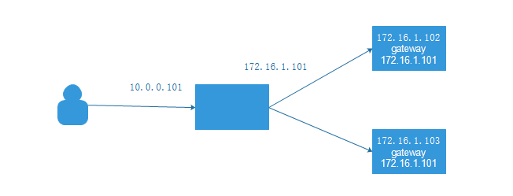

 LVS是Linux Virtual Server的简写，在1998年5月由章文嵩博士成立，工作在OSI模型的四层，基于IP进行负载均衡， 在linux2.2内核时，IPVS就已经以内核补丁的形式出现， 从2.4版本以后，IPVS已经成为linux官方标准内核的一部分。

<!--more-->

系统必须有ip_vs模块

```
#查看ip_vs模块
[root@node1 ~]# lsmod |grep -i ip_vs
ip_vs_rr               12600  1 
ip_vs                 141432  3 ip_vs_rr
nf_conntrack          133053  7 ip_vs,nf_nat,nf_nat_ipv4,nf_nat_ipv6,xt_conntrack,nf_conntrack_ipv4,nf_conntrack_ipv6
libcrc32c              12644  4 xfs,ip_vs,nf_nat,nf_conntrack
#没有，加载ip_vs
[root@node1 ~]# modprobe ip_vs
```

## LVS的安装

### yum安装

```
#1、安装清华的epel源
#2、安装ipvadm
yum install -y ipvsadm
```

### 源码包安装

```
#https://mirrors.edge.kernel.org/pub/linux/utils/kernel/ipvsadm/选择与内核相同版本的软件
mkdir -p /server/tools
cd /server/tools
wget -c https://mirrors.edge.kernel.org/pub/linux/utils/kernel/ipvsadm/ipvsadm-1.30.tar.xz
ln -s /usr/src/kernels/3.10.0-1062.18.1.el7.x86_64/ /usr/src/linux
tar xzvf ipvsadm-1.30.tar.gz 
cd ipvsadm-1.30
make 
make install
#如果编译报错，请安装依赖包
#yum install -y popt-static kernel-devel make gcc openssl-devel lftplibnl* popt* openssl-devel lftplibnl* popt* libnl* libpopt* gcc*
```

## ipvsadm命令详解

ipvsadm是ipvs的管理器，需要yum安装。

### LVS 相关软件

程序包：ipvsadm Unit File: ipvsadm.service 

主程序：/usr/sbin/ipvsadm

 规则保存工具：/usr/sbin/ipvsadm-save 

规则重载工具：/usr/sbin/ipvsadm-restore

 配置文件：/etc/sysconfig/ipvsadm-config 

ipvs调度规则文件：/etc/sysconfig/ipvsadm

### ipvsadm 命令

ipvsadm核心功能：

```
1、集群服务管理：增、删、改
2、集群服务的RS管理：增、删、改
3、查看
```

### ipvsadm 工具用法：

```
#管理集群服务
ipvsadm -A|E -t|u|f service-address [-s scheduler] [-p [timeout]] [-M netmask]
[--pe persistence_engine] [-b sched-flags]
ipvsadm -D -t|u|f service-address #删除
ipvsadm –C #清空
ipvsadm –R #重载,相当于ipvsadm-restore
ipvsadm -S [-n] #保存,相当于ipvsadm-save

#管理集群中的RS
ipvsadm -a|e -t|u|f service-address -r server-address [-g|i|m] [-w weight]
ipvsadm -d -t|u|f service-address -r server-address
ipvsadm -L|l [options]
ipvsadm -Z [-t|u|f service-address]
```

### 防火墙标记

FWM：FireWall Mark MARK target 可用于给特定的报文打标记 --set-mark value 其中：value 可为0xffff格式，表示十六进制数字 借助于防火墙标记来分类报文，而后基于标记定义集群服务；可将多个不同的应用使用同一个集群服务 进行调度 实现方法： 在Director主机打标记：

```
iptables -t mangle -A PREROUTING -d $vip -p $proto -m multiport --dports $port1,$port2,… -j MARK --set-mark NUMBER
```

范例:

```
[root@lvs ~]#iptables -t mangle -A PREROUTING -d 172.16.0.100 -p tcp -m
multiport --dports 80,443 -j MARK --set-mark 10
[root@lvs ~]#ipvsadm -C
[root@lvs ~]#ipvsadm -A -f 10 -s rr
[root@lvs ~]#ipvsadm -a -f 10 -r 10.0.0.7 -g
[root@lvs ~]#ipvsadm -a -f 10 -r 10.0.0.17 -g
[root@lvs ~]#ipvsadm -Ln
IP Virtual Server version 1.2.1 (size=4096)
Prot LocalAddress:Port Scheduler Flags
-> RemoteAddress:Port Forward Weight ActiveConn InActConn
FWM 10 rr
-> 10.0.0.7:0 Route 1 0 0
-> 10.0.0.17:0 Route 1 0 0
[root@lvs ~]#cat /proc/net/ip_vs
IP Virtual Server version 1.2.1 (size=4096)
Prot LocalAddress:Port Scheduler Flags
-> RemoteAddress:Port Forward Weight ActiveConn InActConn
FWM 0000000A rr
-> 0A000011:0000 Route 1 0 9
-> 0A000007:0000 Route 1 0 9
```

在Director主机基于标记定义集群服务：

```
ipvsadm -A -f NUMBER [options]
```

范例：

```
[root@lvs ~]#ipvsadm -A -f 10
[root@lvs ~]#ipvsadm -a -f 10 -r 10.0.0.7 -g
[root@lvs ~]#ipvsadm -a -f 10 -r 10.0.0.17 -g
[root@lvs ~]#ipvsadm -Ln
IP Virtual Server version 1.2.1 (size=4096)
Prot LocalAddress:Port Scheduler Flags
-> RemoteAddress:Port Forward Weight ActiveConn InActConn
FWM 10 wlc
-> 10.0.0.7:0 Route 1 0 0
-> 10.0.0.17:0 Route 1 0 0

[root@LVS ~]#cat /proc/net/ip_vs
IP Virtual Server version 1.2.1 (size=4096)
Prot LocalAddress:Port Scheduler Flags
-> RemoteAddress:Port Forward Weight ActiveConn InActConn
TCP AC14C8C8:0050 rr
-> 0A000011:0050 Masq 1 0 0
-> 0A000007:0050 Masq 1 0 0
123456789101112131415161718
```

### LVS 持久连接

session 绑定：对共享同一组RS的多个集群服务，需要统一进行绑定，lvs sh算法无法实现 持久连接（ lvs persistence ）

模板：实现无论使用任何调度算法，在一段时间内（默认360s ），能够实现将来自同一个地址的请求始终发往同一个RS

```
ipvsadm -A|E -t|u|f service-address [-s scheduler] [-p [timeout]]
```

持久连接实现方式：

```
1、每端口持久（PPC）：每个端口定义为一个集群服务，每集群服务单独调度
2、每防火墙标记持久（PFWMC）：基于防火墙标记定义集群服务；可实现将多个端口上的应用统一调度，即所谓的port Affinity
3、每客户端持久（PCC）：基于0端口（表示所有服务）定义集群服务，即将客户端对所有应用的请求都调度至后端主机，必须定义为持久模式
```

范例：

```
[root@lvs ~]#ipvsadm -E -f 10 -p
[root@lvs ~]#ipvsadm -Ln
IP Virtual Server version 1.2.1 (size=4096)
Prot LocalAddress:Port Scheduler Flags
-> RemoteAddress:Port Forward Weight ActiveConn InActConn
FWM 10 wlc persistent 360
-> 10.0.0.7:0 Route 1 0 15
-> 10.0.0.17:0 Route 1 0 7
[root@lvs ~]#ipvsadm -E -f 10 -p 3600
[root@lvs ~]#ipvsadm -Ln
IP Virtual Server version 1.2.1 (size=4096)
Prot LocalAddress:Port Scheduler Flags
-> RemoteAddress:Port Forward Weight ActiveConn InActConn
FWM 10 wlc persistent 3600
-> 10.0.0.7:0 Route 1 0 79
-> 10.0.0.17:0 Route 1 0 7

[root@lvs ~]#cat /proc/net/ip_vs_conn
Pro FromIP FPrt ToIP TPrt DestIP DPrt State Expires PEName PEData
TCP C0A80006 C816 AC100064 01BB 0A000011 01BB FIN_WAIT 67
TCP C0A80006 C812 AC100064 01BB 0A000011 01BB FIN_WAIT 67
TCP C0A80006 9A36 AC100064 0050 0A000011 0050 FIN_WAIT 65
TCP C0A80006 C806 AC100064 01BB 0A000011 01BB FIN_WAIT 65
TCP C0A80006 9A3E AC100064 0050 0A000011 0050 FIN_WAIT 66
TCP C0A80006 C81A AC100064 01BB 0A000011 01BB FIN_WAIT 67
TCP C0A80006 C80A AC100064 01BB 0A000011 01BB FIN_WAIT 66
TCP C0A80006 9A3A AC100064 0050 0A000011 0050 FIN_WAIT 66
TCP C0A80006 9A4E AC100064 0050 0A000011 0050 FIN_WAIT 68
TCP C0A80006 9A42 AC100064 0050 0A000011 0050 FIN_WAIT 67
TCP C0A80006 9A46 AC100064 0050 0A000011 0050 FIN_WAIT 67
TCP C0A80006 C81E AC100064 01BB 0A000011 01BB FIN_WAIT 68
IP C0A80006 0000 0000000A 0000 0A000011 0000 NONE 948
TCP C0A80006 C80E AC100064 01BB 0A000011 01BB FIN_WAIT 66
TCP C0A80006 9A4A AC100064 0050 0A000011 0050 FIN_WAIT 67

[root@lvs ~]#ipvsadm -Lnc
IPVS connection entries
pro expire state source virtual destination
TCP 00:46 FIN_WAIT 192.168.0.6:51222 172.16.0.100:443 10.0.0.17:443
TCP 00:46 FIN_WAIT 192.168.0.6:51218 172.16.0.100:443 10.0.0.17:443
TCP 00:45 FIN_WAIT 192.168.0.6:39478 172.16.0.100:80 10.0.0.17:80
TCP 00:45 FIN_WAIT 192.168.0.6:51206 172.16.0.100:443 10.0.0.17:443
TCP 00:46 FIN_WAIT 192.168.0.6:39486 172.16.0.100:80 10.0.0.17:80
TCP 00:47 FIN_WAIT 192.168.0.6:51226 172.16.0.100:443 10.0.0.17:443
TCP 00:45 FIN_WAIT 192.168.0.6:51210 172.16.0.100:443 10.0.0.17:443
TCP 00:45 FIN_WAIT 192.168.0.6:39482 172.16.0.100:80 10.0.0.17:80
TCP 00:47 FIN_WAIT 192.168.0.6:39502 172.16.0.100:80 10.0.0.17:80
TCP 00:46 FIN_WAIT 192.168.0.6:39490 172.16.0.100:80 10.0.0.17:80
TCP 00:46 FIN_WAIT 192.168.0.6:39494 172.16.0.100:80 10.0.0.17:80
TCP 00:47 FIN_WAIT 192.168.0.6:51230 172.16.0.100:443 10.0.0.17:443
IP 15:27 NONE 192.168.0.6:0 0.0.0.10:0 10.0.0.17:0
TCP 00:46 FIN_WAIT 192.168.0.6:51214 172.16.0.100:443 10.0.0.17:443
TCP 00:47 FIN_WAIT 192.168.0.6:39498 172.16.0.100:80 10.0.0.17:80
1234567891011121314151617181920212223242526272829303132333435363738394041424344454647484950515253
```

## 部署LVS NAT

### LVS NAT模式注意事项

LVS NAT模式工作原理用户请求LVS VIP到达director（LVS服务器：LB）（公网VIP：211.1.1.1），director 将请求的报文的目标IP地址改成后端的real server IP地址，同时将报文的目标端口也改成后端选定的real server相应端口，最后将报文发送到real server，real server将数据返给director，director再把数据发送给用户。（两次请求都经过director， 所以访问大的话，director会成为瓶颈），

```
1）、LVS服务器至少2块物理网卡，一块连接公网（VIP），一块连接内网；
2）、后端Realserver机器的默认网关设置为LVS的内网IP地址；
3）、保证LVS内网网卡通常跟Realserver在同一网段；
4）、LVS NAT模式后端Realserver机器数量不超过30台；
5）、用户的请求进入和返回均会经过LVS，LVS会成为瓶颈。
```

### 实验环境



```
DR: inode1:外网ip:10.0.0.101   内网ip:172.16.1.101
RS1: inode2:172.16.1.102----->web页面 www.ywx1.com
RS2: inode3:172.16.1.103----->web页面 www.ywx2.com

[root@inode1 ~]# uname -r
3.10.0-862.el7.x86_64
[root@inode1 ~]# cat /etc/redhat-release 
CentOS Linux release 7.5.1804 (Core) 
```

### 部署RS1和RS2的nginx

这里已经部署好了：

```
[root@inode2 ~]# curl 172.16.1.102
www.ywx1.com

[root@inode3 ~]# curl 172.16.1.103
www.ywx2.com
```


### 将RS1和RS2的网关配置为DR的内网ip地址：172.16.1.101

```
[root@inode2 ~]#  sed -i '$aGATEWAY=172.16.1.101' /etc/sysconfig/network-scripts/ifcfg-eth1
[root@inode2 ~]# cat /etc/sysconfig/network-scripts/ifcfg-eth1
TYPE=Ethernet
BOOTPROTO=static
DEFROUTE=yes
NAME=eth1
DEVICE=eth1
ONBOOT=yes
IPADDR=172.16.1.102
PREFIX=24
GATEWAY=172.16.1.101
[root@inode2 ~]#systemctl restart network


[root@inode3 ~]#  sed -i '$aGATEWAY=172.16.1.101' /etc/sysconfig/network-scripts/ifcfg-eth1
[root@inode3 ~]# cat /etc/sysconfig/network-scripts/ifcfg-eth1
TYPE=Ethernet
BOOTPROTO=static
DEFROUTE=yes
NAME=eth1
DEVICE=eth1
ONBOOT=yes
IPADDR=172.16.1.103
PREFIX=24
GATEWAY=172.16.1.101
[root@inode3 ~]#systemctl restart network
```

### 部署NAT的LVS

第一步：安装LVS

```
yum install -y ipvsadm
```

第二步：把DR的外网ip：10.0.0.101作为VIP，加入lvs集群

```
ipvsadm -A -t 10.0.0.101:80 -s rr
#-A 添加虚拟服务器的VIP  
#-t TCP协议，ip:port   
#-s 指定算法为RR轮询模式
```

第三步：在虚拟集群10.10.10.101中，加入后端Realserver服务器

```
ipvsadm -a -t 10.0.0.101:80 -r 172.16.1.102 -m -w 50
ipvsadm -a -t 10.0.0.101:80 -r 172.16.1.103 -m -w 50

# -a，往虚拟服务器集群中添加真实服务器；
# -t，TCP协议；
# -r，指定后端realserver服务器的IP和端口；
# -m，指定NAT转发模式；
# -w，weight权重设置；
```

查看LVS信息

```
[root@inode1 ~]# ipvsadm -L -n 
IP Virtual Server version 1.2.1 (size=4096)
Prot LocalAddress:Port Scheduler Flags
  -> RemoteAddress:Port           Forward Weight ActiveConn InActConn
TCP  10.0.0.101:80 rr
  -> 172.16.1.102:80              Masq    50     0          0         
  -> 172.16.1.103:80              Masq    50     0          0    
```

第四步：LVS NAT模式能够实现数据转发，还要依靠Linux内核开启转发功能

```
#临时生效
echo 1 > /proc/sys/net/ipv4/ip_forward
#关闭icmp的重定向
echo 0 > /proc/sys/net/ipv4/conf/all/send_redirects
echo 0 > /proc/sys/net/ipv4/conf/default/send_redirects
echo 0 > /proc/sys/net/ipv4/conf/eth0/send_redirects
echo 0 > /proc/sys/net/ipv4/conf/eth1/send_redirects

#永久生效
vim /etc/sysctl.conf
net.ipv4.ip_forward = 1
net.ipv4.conf.all.send_redirects = 0
net.ipv4.conf.default.send_redirects = 0
net.ipv4.conf.eth0.send_redirects = 0
net.ipv4.conf.eth1.send_redirects = 0

sysctl -p
```

第五步：测试

在inode4上访问10.0.0.101

```
[root@inode4 ~]# curl 10.0.0.101
www.ywx2.com
[root@inode4 ~]# curl 10.0.0.101
www.ywx1.com
```

在DR inode1上观察InAction发现是负载均衡

```
[root@inode1 ~]# ipvsadm -Ln
IP Virtual Server version 1.2.1 (size=4096)
Prot LocalAddress:Port Scheduler Flags
  -> RemoteAddress:Port           Forward Weight ActiveConn InActConn
TCP  10.0.0.101:80 rr
  -> 172.16.1.102:80              Masq    50     0          3         
  -> 172.16.1.103:80              Masq    50     0          2  
```

注意：

在实验模式NAT时，要关闭RS服务器上的外网网卡，否则会因为RS上有外网路由的问题，造成VIP地址无法访问后端页面

### 删除和添加RS

删除RS1（inode2）

```
[root@inode1 ~]# ipvsadm -d -t 10.0.0.101:80 -r 172.16.1.102

[root@inode1 ~]# ipvsadm -Ln
IP Virtual Server version 1.2.1 (size=4096)
Prot LocalAddress:Port Scheduler Flags
  -> RemoteAddress:Port           Forward Weight ActiveConn InActConn
TCP  10.0.0.101:80 rr
  -> 172.16.1.103:80              Masq    50     0          7  
```

继续在inode4上访问VIP

```
[root@inode4 ~]# curl 10.0.0.101
www.ywx2.com
[root@inode4 ~]# curl 10.0.0.101
www.ywx2.com
[root@inode4 ~]# curl 10.0.0.101
www.ywx2.com
[root@inode4 ~]# curl 10.0.0.101
www.ywx2.com
[root@inode4 ~]# curl 10.0.0.101
www.ywx2.com
```

RS1被删除后，客户端访问没有影响。

重新添加会RS1：

```
[root@inode1 ~]# ipvsadm -a -t 10.0.0.101:80 -r 172.16.1.102 -m -w 50
[root@inode1 ~]# ipvsadm -Ln
IP Virtual Server version 1.2.1 (size=4096)
Prot LocalAddress:Port Scheduler Flags
  -> RemoteAddress:Port           Forward Weight ActiveConn InActConn
TCP  10.0.0.101:80 rr
  -> 172.16.1.102:80              Masq    50     0          0         
  -> 172.16.1.103:80              Masq    50     0          0       
```

inode4上访问VIP：

```
[root@inode4 ~]# curl 10.0.0.101
www.ywx1.com
[root@inode4 ~]# curl 10.0.0.101
www.ywx2.com
[root@inode4 ~]# curl 10.0.0.101
www.ywx1.com
[root@inode4 ~]# curl 10.0.0.101
www.ywx2.com

在lvs 10.0.0.101上查看lvs连接
[root@node1 ~]# cat /proc/net/ip_vs_conn
Pro FromIP   FPrt ToIP     TPrt DestIP   DPrt State       Expires PEName PEData
TCP 0A000068 B522 0A000065 0050 ACA80167 0050 TIME_WAIT       116
TCP 0A000068 B51C 0A000065 0050 ACA80166 0050 TIME_WAIT       113
TCP 0A000068 B516 0A000065 0050 ACA80167 0050 TIME_WAIT       110
TCP 0A000068 B51E 0A000065 0050 ACA80167 0050 TIME_WAIT       114
TCP 0A000068 B520 0A000065 0050 ACA80166 0050 TIME_WAIT       115
TCP 0A000068 B51A 0A000065 0050 ACA80167 0050 TIME_WAIT       112
TCP 0A000068 B514 0A000065 0050 ACA80166 0050 TIME_WAIT       109
TCP 0A000068 B518 0A000065 0050 ACA80166 0050 TIME_WAIT       111
```

lvs自动均衡到2台服务器上。

我们关闭RS1(inode2)上的nginx服务：

```
[root@inode2 ~]# nginx -s stop
```

继续使用inode4上访问：

```
[root@inode4 ~]# curl 10.0.0.101
curl: (7) Failed connect to 10.0.0.101:80; Connection refused
[root@inode4 ~]# curl 10.0.0.101
www.ywx2.com
[root@inode4 ~]# curl 10.0.0.101
curl: (7) Failed connect to 10.0.0.101:80; Connection refused
[root@inode4 ~]# curl 10.0.0.101
www.ywx2.com
[root@inode4 ~]# curl 10.0.0.101
curl: (7) Failed connect to 10.0.0.101:80; Connection refused
[root@inode4 ~]# curl 10.0.0.101
www.ywx2.com
[root@inode4 ~]# curl 10.0.0.101
curl: (7) Failed connect to 10.0.0.101:80; Connection refused
[root@inode4 ~]# curl 10.0.0.101
www.ywx2.com
```

一个访问正常，一个访问报错，因为LVS只是前端调度的功能，没有健康检查（下一篇文章会加入Keepalive来解决这个问题）。

### 保存lvs规则

```
[root@node1 ~]# ipvsadm -Sn > /tmp/ipvsadm
[root@node1 ~]# cat /tmp/ipvsadm
-A -t 10.0.0.101:80 -s rr
-a -t 10.0.0.101:80 -r 172.168.1.102:80 -m -w 50
-a -t 10.0.0.101:80 -r 172.168.1.103:80 -m -w 50
```

### 清空lvs规则并重新导入

```
#清空ipvsadm规程
[root@node1 ~]# ipvsadm -Ln
IP Virtual Server version 1.2.1 (size=4096)
Prot LocalAddress:Port Scheduler Flags
  -> RemoteAddress:Port           Forward Weight ActiveConn InActConn
TCP  10.0.0.101:80 rr
  -> 172.168.1.102:80             Masq    50     0          0         
  -> 172.168.1.103:80             Masq    50     0          0         
[root@node1 ~]# ipvsadm -C
[root@node1 ~]# ipvsadm -Ln
IP Virtual Server version 1.2.1 (size=4096)
Prot LocalAddress:Port Scheduler Flags
  -> RemoteAddress:Port           Forward Weight ActiveConn InActConn

#重新导入ipvsadm规则
[root@node1 ~]# ipvsadm -R < /tmp/ipvsadm 
[root@node1 ~]# ipvsadm -Ln
IP Virtual Server version 1.2.1 (size=4096)
Prot LocalAddress:Port Scheduler Flags
  -> RemoteAddress:Port           Forward Weight ActiveConn InActConn
TCP  10.0.0.101:80 rr
  -> 172.168.1.102:80             Masq    50     0          0         
  -> 172.168.1.103:80             Masq    50     0          0      
```

## 部署单网段LVS DR

### LVS DR模式注意事项

LVS DR模式工作原理 用户请求LVS VIP到达director（LB均衡器），director将请求的报文的目标MAC地址改成后端的real server MAC地址，目标IP为VIP（不变），源IP为用户IP地址（保持不变），然后Director将报文发送到real server，real server检测到目标IP为自己本地VIP，如果在同一个网段，然后将请求直接返给用户。如果用户跟 real server不在一个网段，则通过网关返回用户。

DR模式注意事项

```
1)LVS DR模式要求LVS和RS服务器同一个物理网段（二层网络）；
2）LVS修改数据报文的目标MAC地址，目标VIP保持不变；
3）LVS和RS服务器的网卡块数没有要求，单个网卡即可；
4）RS服务器配置VIP地址，只能配置在LO回环网卡上并且抑制VIP的ARP广播（防止跟其它主机配置的VIP冲突）；
5）LVS服务器需要配置VIP地址，配置在真实网卡设备上，保证真实网卡不能抑制VIP的ARP广播；
6）arp_ignore参数（1）含义：只响应目标IP是本地真实网卡上配置的IP（对RS而言），只响应真实网卡（eth0、ens33等），不响应lo网卡上的VIP地址；
7）arp_announce参数（2）含义：忽略报文的源IP地址，使用主机上能够跟用户通信的真实网卡发送数据（对RS而言），源地址为lo上的VIP地址则忽略，数据直接从真实网卡上发送。


DR模型中各主机上均需要配置VIP，解决地址冲突的方式有三种：
(1) 在前端网关做静态绑定
(2) 在各RS使用arptables
(3) 在各RS修改内核参数，来限制arp响应和通告的级别

限制响应级别：arp_ignore
0：默认值，表示可使用本地任意接口上配置的任意地址进行响应
1：仅在请求的目标IP配置在本地主机的接收到请求报文的接口上时，才给予响应

限制通告级别：arp_announce
0：默认值，把本机所有接口的所有信息向每个接口的网络进行通告
1：尽量避免将接口信息向非直接连接网络进行通告
2：必须避免将接口信息向非本网络进行通告


配置要点
1. Director 服务器采用双IP桥接网络，一个是VIP，一个DIP
2. Web服务器采用和DIP相同的网段和Director连接
3. 每个Web服务器配置VIP
4. 每个web服务器可以出外网
```

### 实验环境


```
[root@inode1 ~]# uname -r
3.10.0-862.el7.x86_64
[root@inode1 ~]# cat /etc/redhat-release 
CentOS Linux release 7.5.1804 (Core) 


LVS inode1:10.0.0.101
RS1 inode2:10.0.0.102 -----> 页面 www.ywx1.com
RS2 inode3:10.0.0.103 -----> 页面 www.ywx2.com
VIP 10.0.0.111

client:172.168.1.104  GW:172.168.1.105
rouer: 172.168.1.105   10.0.0.105
```

### router和client部署及LVS RS1 RS2的ip

Router部署

```
echo 'net.ipv4.ip_forward=1' >> /etc/sysctl.conf
sysctl -p
cd /etc/sysconfig/network-scripts/
[root@node5 network-scripts]# cat ifcfg-eth0
TYPE="Ethernet"
PROXY_METHOD="none"
BROWSER_ONLY="no"
BOOTPROTO="none"
DEFROUTE="yes"
IPV4_FAILURE_FATAL="no"
NAME="eth0"
DEVICE="eth0"
ONBOOT="yes"
IPADDR="10.0.0.105"
PREFIX="24"
GATEWAY="10.0.0.254"
DNS1="223.5.5.5"

[root@node5 network-scripts]# cat ifcfg-eth1
TYPE=Ethernet
PROXY_METHOD=none
BROWSER_ONLY=no
BOOTPROTO=none
DEFROUTE=yes
IPV4_FAILURE_FATAL=no
NAME=eth1
DEVICE=eth1
ONBOOT=yes
IPADDR=172.168.1.105
PREFIX=24
```

Client部署

```
[root@node4 ~]# vim /etc/sysconfig/network-scripts/ifcfg-eth1
TYPE=Ethernet
PROXY_METHOD=none
BROWSER_ONLY=no
BOOTPROTO=none
DEFROUTE=yes
IPV4_FAILURE_FATAL=no
NAME=eth1
DEVICE=eth1
ONBOOT=yes
IPADDR=172.168.1.104
PREFIX=24
GAREWAY=172.168.1.105
```

LVS （node1） ip

```
[root@node1 ~]# cat /etc/sysconfig/network-scripts/ifcfg-eth0
TYPE="Ethernet"
PROXY_METHOD="none"
BROWSER_ONLY="no"
BOOTPROTO"none"
DEFROUTE="yes"
IPV4_FAILURE_FATAL="no"
NAME="eth0"
DEVICE="eth0"
ONBOOT="yes"
IPADDR="10.0.0.101"
PREFIX="24"
GATEWAY="10.0.0.105"
DNS1="223.5.5.5"
```

RS1 （node2） ip

```
[root@node2 network-scripts]# cat /etc/sysconfig/network-scripts/ifcfg-eth0
TYPE="Ethernet"
PROXY_METHOD="none"
BROWSER_ONLY="no"
BOOTPROTO="none"
DEFROUTE="yes"
IPV4_FAILURE_FATAL="no"
NAME="eth0"
DEVICE="eth0"
ONBOOT="yes"
IPADDR="10.0.0.102"
PREFIX="24"
GATEWAY="10.0.0.105"
DNS1="223.5.5.5"
```

RS2 （node3 ）ip

```
[root@node3 network-scripts]# cat /etc/sysconfig/network-scripts/ifcfg-eth0
TYPE="Ethernet"
PROXY_METHOD="none"
BROWSER_ONLY="no"
BOOTPROTO="none"
DEFROUTE="yes"
IPV4_FAILURE_FATAL="no"
NAME="eth0"
DEVICE="eth0"
ONBOOT="yes"
IPADDR="10.0.0.103"
PREFIX="24"
GATEWAY="10.0.0.105"
DNS1="223.5.5.5"
```

### 部署RS1和RS2的nginx

这里已经部署好了：

```
[root@inode2 ~]# curl 10.0.0.102
www.ywx1.com

[root@inode3 ~]# curl 10.0.0.103
www.ywx2.com
```

### 部署LVS

第一步：安装LVS

```
yum install -y ipvsadm
```

第二步：把10.0.0.111作为VIP，加入lvs集群

```
ipvsadm -A -t 10.0.0.111 -s rr
```

第三步：把RS1 inode2和RS2 inode3加入lvs集群

```
ipvsadm -a -t 10.0.0.111:80 -r 10.0.0.102:80 -g -w 50
ipvsadm -a -t 10.0.0.111:80 -r 10.0.0.103:80 -g -w 50
```

查看ipvsadm

```
[root@node1 ~]# ipvsadm -Ln
IP Virtual Server version 1.2.1 (size=4096)
Prot LocalAddress:Port Scheduler Flags
  -> RemoteAddress:Port           Forward Weight ActiveConn InActConn
TCP  10.0.0.111:80 rr
  -> 10.0.0.102:80                Route   50     0          0         
  -> 10.0.0.103:80                Route   50     0          0     
```

第四步：DR （inode1） 上绑定VIP地址

方法一：

```
[root@node1 ~]# ifconfig eth0:0 10.0.0.111 netmask 255.255.255.255 broadcast 10.0.0.111
[root@node1 ~]# /sbin/route  add  -host  10.0.0.111  dev  eth0:0
```

方法二：

```
[root@node1 ~]# cd /etc/sysconfig/network-scripts/
[root@node1 ~]# cp ifcfg-eth0 ifcfg-eth0:0
[root@node1 ~]# vim ifcfg-eth0:0
TYPE=Ethernet
BOOTPROTO=static
DEVICE=eth0:0
ONBOOT=yes
IPADDR=10.0.0.111
NETMASK=255.255.255.255
```

第五步：RS1 （inode2）和RS2 （inode3）绑定VIP地址

方法一：

```
[root@node2 ~]# ifconfig lo:0 10.0.0.111 netmask 255.255.255.255 broadcast 10.0.0.111
 [root@node2 ~]# /sbin/route  add  -host  10.0.0.111 dev  lo:0
```

方法二：

```
[root@node2 ~]# cd /etc/sysconfig/network-scripts/
[root@node2 ~]# cp ifcfg-lo ifcfg-lo:0
[root@node2 ~]# vim ifcfg-lo:0

DEVICE=lo:0
IPADDR=10.0.0.111
NETMASK=255.255.255.255
ONBOOT=yes
NAME=loopback
```

第六步：在RS1 （inode2）和RS2 （inode3）上配置arp抑制

```
[root@node2 ~]#echo "1" >/proc/sys/net/ipv4/conf/lo/arp_ignore
[root@node2 ~]#echo "2" >/proc/sys/net/ipv4/conf/lo/arp_announce
[root@node2 ~]#echo "1" >/proc/sys/net/ipv4/conf/all/arp_ignore
[root@node2 ~]#echo "2" >/proc/sys/net/ipv4/conf/all/arp_announce
[root@node2 ~]#sysctl -p 
[root@node2 ~]#cat /proc/sys/net/ipv4/conf/lo/arp_ignore
[root@node2 ~]#cat /proc/sys/net/ipv4/conf/lo/arp_announce
[root@node2 ~]#cat /proc/sys/net/ipv4/conf/all/arp_ignore
[root@node2 ~]#cat /proc/sys/net/ipv4/conf/all/arp_announce
```

第七步：测试

在inode4上访问VIP

```
[root@inode4 ~]# curl 10.0.0.111
www.ywx1.com
[root@inode4 ~]# curl 10.0.0.111
www.ywx2.com
[root@inode4 ~]# curl 10.0.0.111
www.ywx1.com
[root@inode4 ~]# curl 10.0.0.111
www.ywx2.com
```

## 部署多网段LVS DR


多网段LVS DR是vip与RIP不在同一个网段

```
[root@inode1 ~]# uname -r
3.10.0-862.el7.x86_64
[root@inode1 ~]# cat /etc/redhat-release 
CentOS Linux release 7.5.1804 (Core) 

LVS inode1:10.0.0.101
RS1 inode2:10.0.0.102 -----> 页面 www.ywx1.com
RS2 inode3:10.0.0.103 -----> 页面 www.ywx2.com
VIP 192.168.1.100

client:172.168.1.104  GW:172.168.1.105
rouer: 172.168.1.105   10.0.0.105  192.168.1.200(与vip通信使用)
```

### router和client部署及LVS RS1 RS2的ip

Router部署

```
[root@node5 network-scripts]#echo 'net.ipv4.ip_forward=1' >> /etc/sysctl.conf
[root@node5 network-scripts]#sysctl -p
[root@node5 network-scripts]#cd /etc/sysconfig/network-scripts/
[root@node5 network-scripts]# cat ifcfg-eth0
TYPE="Ethernet"
PROXY_METHOD="none"
BROWSER_ONLY="no"
BOOTPROTO="none"
DEFROUTE="yes"
IPV4_FAILURE_FATAL="no"
NAME="eth0"
DEVICE="eth0"
ONBOOT="yes"
IPADDR="10.0.0.105"
PREFIX="24"
GATEWAY="10.0.0.254"
DNS1="223.5.5.5"

[root@node5 network-scripts]# cat ifcfg-eth1
TYPE=Ethernet
PROXY_METHOD=none
BROWSER_ONLY=no
BOOTPROTO=none
DEFROUTE=yes
IPV4_FAILURE_FATAL=no
NAME=eth1
DEVICE=eth1
ONBOOT=yes
IPADDR=172.168.1.105
PREFIX=24

#在eth0:0上配置192.168.1.200
[root@node5 network-scripts]#ifconfig eth0:0 192.168.1.200 netmask 255.255.255.0 broadcast 192.168.1.200
[root@node5 network-scripts]#/sbin/route  add  -host  192.168.1.200 dev  eth0:0
 
 [root@node5 ~]# ip a
1: lo: <LOOPBACK,UP,LOWER_UP> mtu 65536 qdisc noqueue state UNKNOWN group default qlen 1000
    link/loopback 00:00:00:00:00:00 brd 00:00:00:00:00:00
    inet 127.0.0.1/8 scope host lo
       valid_lft forever preferred_lft forever
    inet6 ::1/128 scope host 
       valid_lft forever preferred_lft forever
2: eth0: <BROADCAST,MULTICAST,UP,LOWER_UP> mtu 1500 qdisc pfifo_fast state UP group default qlen 1000
    link/ether 00:0c:29:f5:01:8d brd ff:ff:ff:ff:ff:ff
    inet 10.0.0.105/24 brd 10.0.0.255 scope global noprefixroute eth0
       valid_lft forever preferred_lft forever
    inet 192.168.1.200/32 brd 192.168.1.200 scope global eth0:0
       valid_lft forever preferred_lft forever
    inet6 fe80::20c:29ff:fef5:18d/64 scope link 
       valid_lft forever preferred_lft forever
3: eth1: <BROADCAST,MULTICAST,UP,LOWER_UP> mtu 1500 qdisc pfifo_fast state UP group default qlen 1000
    link/ether 00:0c:29:f5:01:97 brd ff:ff:ff:ff:ff:ff
    inet 172.168.1.105/24 brd 172.168.1.255 scope global noprefixroute eth1
       valid_lft forever preferred_lft forever
    inet6 fe80::20c:29ff:fef5:197/64 scope link 
       valid_lft forever preferred_lft forever
```

Client部署

```
[root@node4 ~]# vim /etc/sysconfig/network-scripts/ifcfg-eth1
TYPE=Ethernet
PROXY_METHOD=none
BROWSER_ONLY=no
BOOTPROTO=none
DEFROUTE=yes
IPV4_FAILURE_FATAL=no
NAME=eth1
DEVICE=eth1
ONBOOT=yes
IPADDR=172.168.1.104
PREFIX=24
GAREWAY=172.168.1.105
```

LVS （node1） ip

```
[root@node1 ~]# cat /etc/sysconfig/network-scripts/ifcfg-eth0
TYPE="Ethernet"
PROXY_METHOD="none"
BROWSER_ONLY="no"
BOOTPROTO="none"
DEFROUTE="yes"
IPV4_FAILURE_FATAL="no"
NAME="eth0"
DEVICE="eth0"
ONBOOT="yes"
IPADDR="10.0.0.101"
PREFIX="24"
GATEWAY="10.0.0.105"
DNS1="223.5.5.5"
```

RS1 （node2） ip

```
[root@node2 network-scripts]# cat /etc/sysconfig/network-scripts/ifcfg-eth0
TYPE="Ethernet"
PROXY_METHOD="none"
BROWSER_ONLY="no"
BOOTPROTO="none"
DEFROUTE="yes"
IPV4_FAILURE_FATAL="no"
NAME="eth0"
DEVICE="eth0"
ONBOOT="yes"
IPADDR="10.0.0.102"
PREFIX="24"
GATEWAY="10.0.0.105"
DNS1="223.5.5.5"
```

RS2（ node3） ip

```
[root@node3 network-scripts]# cat /etc/sysconfig/network-scripts/ifcfg-eth0
TYPE="Ethernet"
PROXY_METHOD="none"
BROWSER_ONLY="no"
BOOTPROTO="none"
DEFROUTE="yes"
IPV4_FAILURE_FATAL="no"
NAME="eth0"
DEVICE="eth0"
ONBOOT="yes"
IPADDR="10.0.0.103"
PREFIX="24"
GATEWAY="10.0.0.105"
DNS1="223.5.5.5"
```

### RS1和RS2部署nginx

这里已经部署好了：

```
[root@inode2 ~]# curl 10.0.0.102
www.ywx1.com

[root@inode3 ~]# curl 10.0.0.103
www.ywx2.com
```


### DR （inode1 ）上绑定VIP地址

方法一：

```
[root@inode1 ~]# ifconfig lo:1 192.168.1.100 netmask 255.255.255.255 broadcast 192.168.1.100
[root@inode1 ~]# /sbin/route  add  -host  192.168.1.100  dev  lo:1
```

方法二：

```
[root@inode1 ~]# cd /etc/sysconfig/network-scripts/
[root@inode1 ~]# cp ifcfg-lo ifcfg-lo:1
[root@inode1 ~]# vim ifcfg-lo:1
DEVICE=lo:1
IPADDR=192.168.1.100
NETMASK=255.255.255.255
ONBOOT=yes
NAME=loopback
```

### RS1 （inode2）和RS2 （inode3）上绑定VIP地址

方法一：

```
[root@inode2 ~]# ifconfig lo:1 192.168.1.100 netmask 255.255.255.255 broadcast 192.168.1.100
[root@inode2 ~]# /sbin/route  add  -host  192.168.1.100 dev  lo:1
```

方法二：

```
[root@inode2 ~]# cd /etc/sysconfig/network-scripts/
[root@inode2 ~]# cp ifcfg-lo ifcfg-lo:1
[root@inode2 ~]# vim ifcfg-lo:1

DEVICE=lo:1
IPADDR=192.168.1.100
NETMASK=255.255.255.255
ONBOOT=yes
NAME=loopback2
```

### RS1 （inode2）和RS2 （inode3）上配置arp抑制

```
[root@inode2 ~]# echo "1" >/proc/sys/net/ipv4/conf/lo/arp_ignore
[root@inode2 ~]# echo "2" >/proc/sys/net/ipv4/conf/lo/arp_announce
[root@inode2 ~]# echo "1" >/proc/sys/net/ipv4/conf/all/arp_ignore
[root@inode2 ~]# echo "2" >/proc/sys/net/ipv4/conf/all/arp_announce
[root@inode2 ~]# sysctl -p 
[root@inode2 ~]# cat /proc/sys/net/ipv4/conf/lo/arp_ignore
[root@inode2 ~]# cat /proc/sys/net/ipv4/conf/lo/arp_announce
[root@inode2 ~]# cat /proc/sys/net/ipv4/conf/all/arp_ignore
[root@inode2 ~]# cat /proc/sys/net/ipv4/conf/all/arp_announce
```

### 在DR（inode1）上部署LVS

第一步：安装LVS

```
[root@inode1 ~]# yum install -y ipvsadm
```

第二步：把192.168.1.100作为VIP，加入lvs集群

```
[root@inode1 ~]# ipvsadm -A -t 192.168.1.100 -s rr
```

第三步：把RS1 inode2和RS2 inode3加入lvs集群

```
[root@inode1 ~]# ipvsadm -a -t 192.168.1.100:80 -r 10.0.0.102:80 -g -w 50
[root@inode1 ~]# ipvsadm -a -t 192.168.1.100:80 -r 10.0.0.103:80 -g -w 50
```

查看ipvsadm

```
[root@node1 ~]# ipvsadm -Ln
IP Virtual Server version 1.2.1 (size=4096)
Prot LocalAddress:Port Scheduler Flags
  -> RemoteAddress:Port           Forward Weight ActiveConn InActConn
TCP  192.168.1.100:80 rr
  -> 10.0.0.102:80                Route   50     0          0         
  -> 10.0.0.103:80                Route   50     0          0     
1234567
```

### 测试

```
[root@node4 ~]# curl 192.168.1.100
www.ywx2.com
[root@node4 ~]# curl 192.168.1.100
www.ywx1.com
[root@node4 ~]# curl 192.168.1.100
www.ywx2.com
[root@node4 ~]# curl 192.168.1.100
www.ywx1.com
```

### lvs_dr脚本

**lvs_dr_vs.sh：**

```
#!/bin/bash
#Author:wangxiaochun
#Date:2017-08-13
vip='192.168.1.100'
iface='lo:1'
mask='255.255.255.255'
port='80'
rs1='10.0.0.102'
rs2='10.0.0.103'
scheduler='wrr'
type='-g'
rpm -q ipvsadm &> /dev/null || yum -y install ipvsadm &> /dev/null
case $1 in
start)
ifconfig $iface $vip netmask $mask #broadcast $vip up
iptables -F
ipvsadm -A -t ${vip}:${port} -s $scheduler
ipvsadm -a -t ${vip}:${port} -r ${rs1} $type -w 1
ipvsadm -a -t ${vip}:${port} -r ${rs2} $type -w 1
echo "The VS Server is Ready!"
;;
stop)
ipvsadm -C
ifconfig $iface down
echo "The VS Server is Canceled!"
;;
*)
echo "Usage: $(basename $0) start|stop"
exit 1
;;
esac
```

**lvs_dr_rs：**

```
#!/bin/bash
#Author:wangxiaochun
#Date:2017-08-13
vip=192.168.1.100
mask='255.255.255.255'
dev=lo:1
#rpm -q httpd &> /dev/null || yum -y install httpd &>/dev/null
#service httpd start &> /dev/null && echo "The httpd Server is Ready!"
#echo "`hostname -I`" > /var/www/html/index.html
case $1 in
start)
echo 1 > /proc/sys/net/ipv4/conf/all/arp_ignore
echo 1 > /proc/sys/net/ipv4/conf/lo/arp_ignore
echo 2 > /proc/sys/net/ipv4/conf/all/arp_announce
echo 2 > /proc/sys/net/ipv4/conf/lo/arp_announce
ifconfig $dev $vip netmask $mask #broadcast $vip up
echo "The RS Server is Ready!"
;;
stop)
ifconfig $dev down
echo 0 > /proc/sys/net/ipv4/conf/all/arp_ignore
echo 0 > /proc/sys/net/ipv4/conf/lo/arp_ignore
echo 0 > /proc/sys/net/ipv4/conf/all/arp_announce
echo 0 > /proc/sys/net/ipv4/conf/lo/arp_announce
echo "The RS Server is Canceled!"
;;
*)
echo "Usage: $(basename $0) start|stop"
exit 1
;;
esac
```
