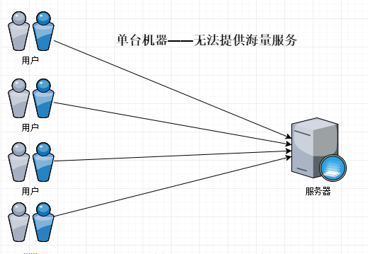
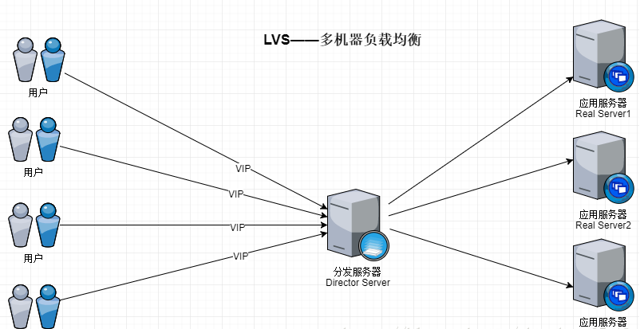
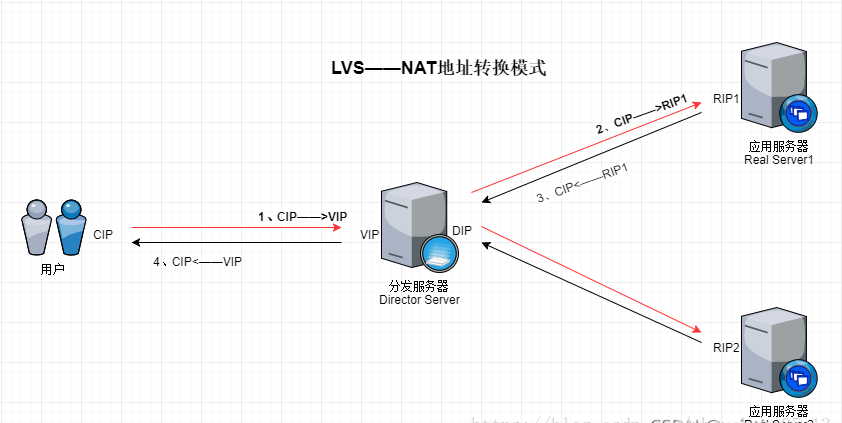
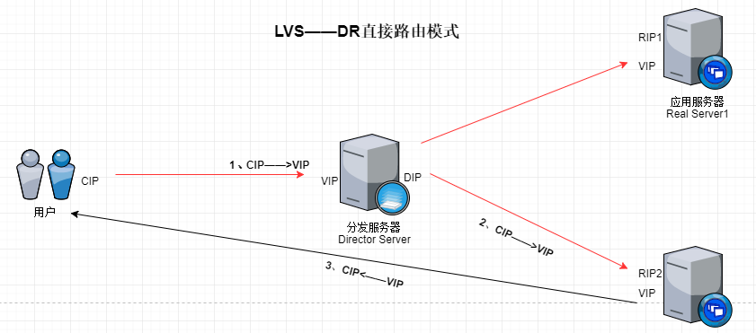
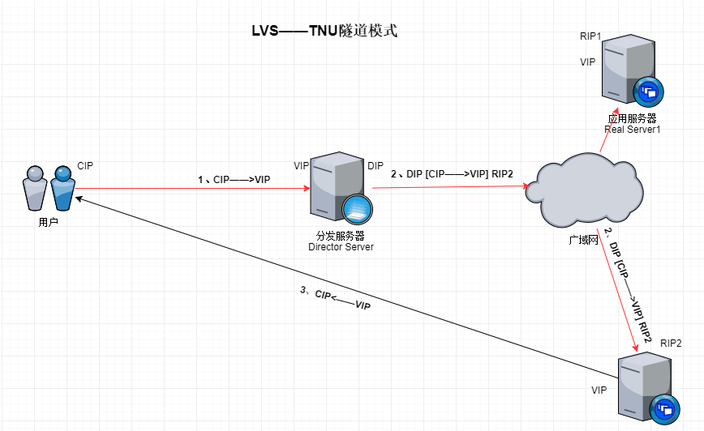

LVS（Linux Virtual Server），是一个极好的负载均衡解决方案，它将一个真实服务器集群虚拟成一台服务器来对外提供服务，同时在真实服务器集群中实现了负载均衡，从linux2.4开始已经被收录到linux核心中。

<!--more-->

### LVS有什么用

随着互联网在人们生活中的普及，企业级应用迎来了海量数据的冲击，如微信、美团外卖、微信支付等应用每天的使用人数都在千万以上，仅靠单台机器提供服务已经行不通了。



我们可以使用多台服务器分摊这些压力，当一定数量的服务器作为一个整体对外提供服务，并且分摊压力时，我们可以称这些服务器为“负载均衡集群”。LVS就是一个优秀的负载均衡集群方案，它理论上能够无限水平扩展，使得服务能够应对海量数据的冲击。

 

### LVS的原理是什么

首先描述一下LVS中的一些术语：

VS：Virtual Server 虚拟服务器，通常是分发器
RS：Real Server 实际提供服务器的真实服务器
CIP：Client IP 客户的客户端IP
VIP：Virtual Server IP 虚拟服务器的IP
RIP：Real Server IP 真实服务器的IP
DIP：Director IP 分发器的IP
CIP <–> VIP == DIP <–> RIP 客户端访问VIP，DIP将请求转发到RIP
LVS的原理如下图所示




分发服务器以VIP对外提供服务器，当接收到客户端服务请求时，便根据预定的分发策略（例如轮询）将请求分发到Real Server中，由Real Server做实际的业务处理。当Real Server处理完成后，根据不同的模式，会使用不同的方式返回请求结果。

###  LVS的3种工作模式

根据服务返回方式和集群分布的不同，LVS有3中不同的工作模式，他们分别是：NAT（地址转换）模式、DR（直接路由）模式和TUN（隧道）模式。

#### NAT地址转换模式

NAT地址转换模式是最为简单的一种模式，它的原理如下图所示（为了简洁，用户只画了一个）：




NAT其实就是通过网络地址转换来实现负载均衡的，下面是它的请求流程：

1.分发服务器Director Server（后面简称DS）接受到请求后，通过分发策略得出要将此请求分发到Real Server1。于是将请求报文的目的地址改为RIP1，发送出去。
2.Real Server1收到一个目标地址为自己的数据包，于是接受并进行处理。
3.处理完成后，Real Server1将RIP1——>CIP的数据包发送出去。
4.DS接收到RIP1——>CIP的数据包后，将源地址改为VIP，然后发送出去：VIP——>CIP。 这个过程中，DS仅仅起到一个地址转换和分发的作用。在NAT模式中，请求和响应报文都要通过DS，当真实服务器的数量越来越多时，分发器DS将会成为整个集群系统的性能瓶颈。下面的DR模式解决这个问题。

#### DR直接路由模式

互联网应用中存在一个规律：请求报文较短而响应报文往往包含大量的数据。如果能将请求和响应分开处理，即在负载调度器(Director)中只负责调度请求而响应直接由RealServer返回给客户，将极大地提高整个集群系统的吞吐量。这就是DR的实现原理，原理图如下所示：


在DR模型中，只有在请求的时候会经过DR，响应的数据包由Real Server直接返回给用户，该模式是3中模式中最常用的。它的请求过程如下所示：

 

1.DR接受到请求后，通过分发策略得出要将此请求分发到Real Server2。DS就将数据帧中的目标MAC地址修改为Real Server2的MAC地址,然后再将数据帧发送出去。（为什么要用MAC地址？因为此时Real Server也有配置有VIP）
2.当Real Server2 收到一个源地址为CIP目标地址为VIP的数据包时,Real Server2发现目标地址为VIP,而VIP是自己,于是接受数据包并给予处理。
3.Real Server2处理完成后，会将一个源地址为VIP而目标地址为CIP的数据包发送出去，此时的响应请求就不会再经过DS，而是直接响应给用户了。
4.在这个过程中存在一个问题，由于RealServer也配置了VIP，那么当CIP——>VIP的数据包到达服务局域网，进行广播时，所有的服务器都会进行应答，此时先应答的服务器就会收到数据包，这样就失去了负载均衡的能力。因此在使用DR模式时，通常会采用一些方式来确保请求数据包只会由DS接收，例如抑制Real Server对广播的应答，或者直接在路由器中对DS进行绑定等。

#### TNU隧道模式

TNU模式与DR模式非常相似，它同样是只有请求信息会经过DS，应答信息由Real Server直接返回给用户。不过DR模式中，要求DS和所有的Real Server必须在一个局域网中，而TNU模式去掉了这个限制。

TNU模式原理图如下所示：


在TNU模式中，DS与Real Server不必在一个网络中。DS在接到请求报文之后，在报文的上面再加一层源地址为DIP，目的地址为RIP2的IP首部，然后通过广域网发送到Real Server2。
Real Server2收到报文，拆掉报文以后发现了里面还有一个封装，它就知道了，这就是隧道。后续的过程就与DR一样了。

###  LVS的调度算法

LVS的调度算法是指LVS对于请求的分发方式。DS在向Real Server分发请求实现负载均衡时，有10种不同的算法：

```
轮询（Round Robin，rr）：在Real Server之间轮流分配请求。
加权轮询（Weighted Round Robin，wrr）：有权重地进行轮询。
最少链接（Least Connnections，lc）：将请求发送给连接数最少的RS。
加权最少链接（Weighted Least Connnections，wlc）：分发给基于权重的最少链接。
基于局部性的最少链接（Locality-Based Least Connections，lblc）：首先根据目标IP地址找出最近使用的服务器，如果该服务器可用且没有超载（一半的工作负荷），则将请求发送到该服务器。否则，使用“最少链接”原则。
带复制的基于局部性最少链接（Locality-Based Least Connections with
Replication，lblcr）：它与lblc的不同之处是它要维护从一个目标IP到一组服务器的映射，而lblc值维护从一个目标IP到一台服务器的映射。
目标地址散列（Destination Hashing，dh）：使用请求的目标IP地址作为散列键，从静态分配的散列表找出对应的服务器，若该服务器可用且未超载，则转发请求，否则返回空。
源地址散列（Source Hashing，sh）：使用请求的源IP地址作为散列键，从静态分配的散列表找出对应的服务器，若该服务器可用且未超载，则转发请求，否则返回空。
最短期望延迟（Shortest Expecte Delay，sed）：“最短的期望的延迟”是基于WLC算法的，只是其计算方法不同。具体算法如下：（active+1)*256/weight
最少队列调度（Never Queue Scheduling）：无需队列。如果有台
realserver的连接数＝0就直接分配过去，不需要在进行SED运算。如果没有服务器连接数为空闲，则使用SED算法。
```

### LVS的优缺点是什么

#### LVS的优点

工作在网络层，可以实现高性能、高可用的服务器集群技术。
廉价，可把许多低性能的服务器组合在一起形成一个水平扩展的集群服务器。
易用，配置非常简单，且有多重负载均衡的方法
稳定可靠，即使集群中的一台服务器挂掉，也不影响整体服务效果。
可扩展性好，可以用户透明地进行水平扩展，加减机器非常方便。

#### LVS的缺点

由于是通用组件，因此不能对特定业务进行针对优化。
对于长连接无法进行负载均衡。
自身没有健康状态检查，需要结合脚本或者Keepalived等软件实现。
LVS （Linux Virtual Server）跟SLB(Server Load Balancing)最大的区别就是，LVS是在网络层起作用的，而SLB是在应用层起作用的。

