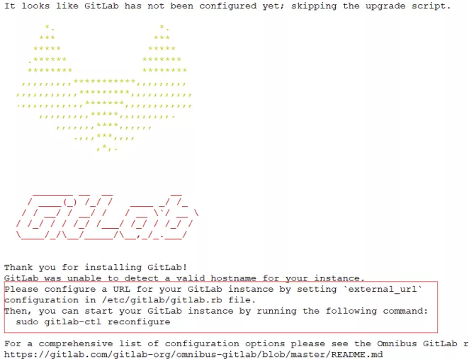

GitLab是一个用于仓库管理系统的开源项目。使用Git作为代码管理工具，并在此基础上搭建起来的Web服务。可通过Web界面进行访问公开的或者私人项目。它拥有GitHub类似的功能，能够浏览源代码，管理缺陷和注释。可以管理团队对仓库的访问，它非常易于浏览提交过的版本并提供一个文件历史库。团队成员可以利用内置的简单聊天程序（Wall）进行交流。它还提供了一个代码片段收集功能可以轻松实现代码复用。

<!--more-->

常用的网站：

官网： https://about.gitlab.com/

国内镜像： https://mirrors.tuna.tsinghua.edu.cn/gitlab-ce/yum/

Gitlab相关操作及说明：

```
/etc/gitlab/gitlab.rb          #gitlab配置文件
/opt/gitlab                    #gitlab的程序安装目录
/var/opt/gitlab                #gitlab目录数据目录
/var/opt/gitlab/git-data       #存放仓库数据
gitlab-ctl reconfigure         #重新加载配置
gitlab-ctl status              #查看当前gitlab所有服务运行状态
gitlab-ctl stop                #停止gitlab服务
gitlab-ctl stop nginx          #单独停止某个服务
gitlab-ctl tail                #查看所有服务的日志

Gitlab的服务构成：
nginx：                 静态web服务器
gitlab-workhorse        轻量级反向代理服务器
logrotate              日志文件管理工具
postgresql             数据库
redis                  缓存数据库
sidekiq                用于在后台执行队列任务（异步执行）
```

安装环境：：
（1）CentOS 6或者7 （此处使用7）
（2）2G内存（实验）生产（至少4G），不然会很卡
（3）安装包：gitlab-ce-10.2.2-ce
（4）禁用防火墙，关闭selinux

安装步骤：

（1）安装软件

```
[root@gitlab ~]# yum install -y curl policycoreutils-python openssh-server        #安装依赖
[root@gitlab ~]# wget https://mirrors.tuna.tsinghua.edu.cn/gitlab-ce/yum/el7/gitlab-ce-10.2.2-ce.0.el7.x86_64.rpm        #下载软件包
[root@gitlab ~]# rpm -ivh gitlab-ce-10.2.2-ce.0.el7.x86_64.rpm    #安装gitlab
```



（2）根据安装完成提示界面进行访问URL更改及重新加载配置文件 更改次选项为自己的域名或者IP

external_url ‘ http://gitlab.example.com’

```
[root@gitlab ~]# vim /etc/gitlab/gitlab.rb      #编辑配置文件  
external_url 'http://192.168.1.21'        #改为自己的IP地址
[root@gitlab ~]# gitlab-ctl reconfigure    #重新加载配置文件
```

（3）重装完成访问http://192.168.1.21，会首先叫更改密码（root用户），改完后登录。如下界面：


（4）汉化
1、下载汉化补丁

```
[root@gitlab ~]# git clone https://gitlab.com/xhang/gitlab.git
[root@gitlab ~]# cd gitlab    
```

2、查看全部分支版本

```
[root@gitlab ~]# git branch -a
```

3、对比版本、生成补丁包

```
[root@gitlab ~]# git diff remotes/origin/10-2-stable remotes/origin/10-2-stable-zh > /tmp/10.2.2-zh.diff
```

4、停止服务器

```
[root@gitlab ~]# gitlab-ctl stop
```

5、打补丁

```
[root@gitlab ~]# patch -d /opt/gitlab/embedded/service/gitlab-rails -p1 < /tmp/10.2.2-zh.diff
```

6、启动和重新配置

```
[root@gitlab ~]# gitlab-ctl start
[root@gitlab ~]# gitlab-ctl reconfigure
```

说明：这里如果使用的同样是gitlab10.2.2，下载汉化较慢的话，可以直接在这里下载10.2.2-zh.diff： https://pan.baidu.com/share/init?surl=wsUy66e4JW1wwEu7irYTSg 提取码：kaiw

汉化完成后再次刷新页面如下：


