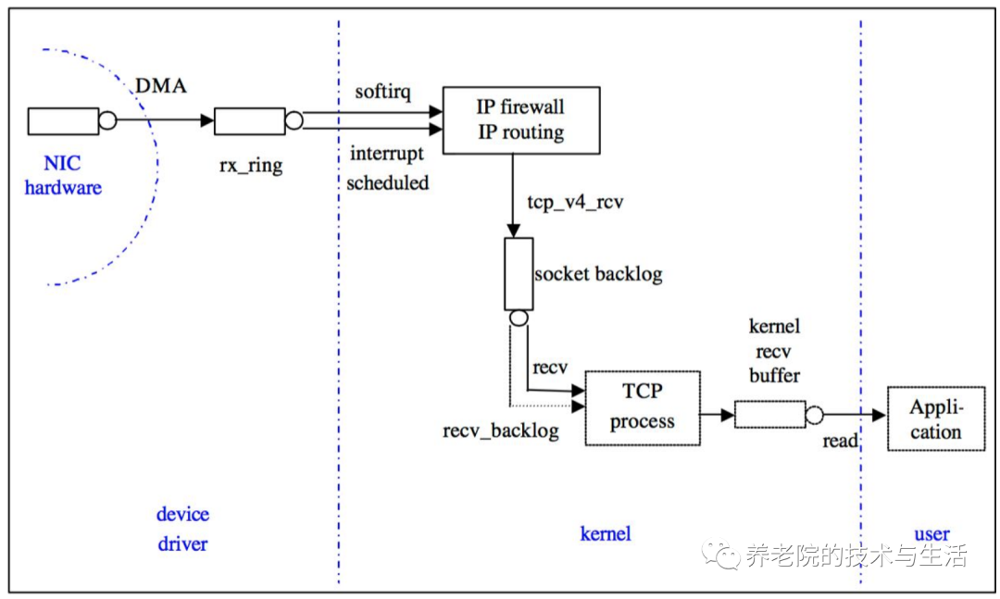
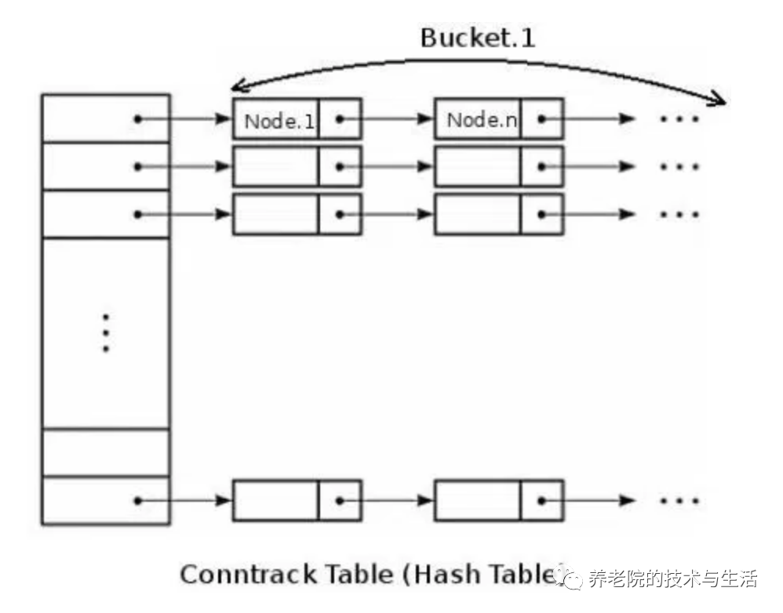
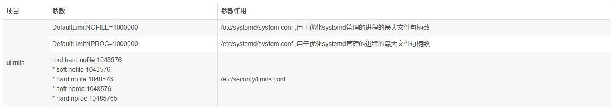

调优是一件因地制宜的事情，生搬硬套可能适得其反。互联网企业，生产环境大多数都是linux操作系统，Linux服务器性能调优，是一个重要的课题。linux有成百上千的参数可以调整，对这些参数的理解，可以帮助我们更好的理解服务器工作的原理，帮助更快的找到瓶颈和解决问题。

<!--more-->

为了帮助理解，先上一个Linux网络收包图：



 

DMA：是一种无需CPU的参与就可以让外设和系统内存之间进行双向数据传输的硬件机制。使用DMA可以使系统CPU从实际的I/O数据传输过程中摆脱出来，从而大大提高系统的吞吐率

中断：在传统模式下，收到一个网络包，CPU会产生一次硬中断，切换上下文来处理网络包。但是过多的中断会影响CPU的执行效率，所以就有来类似于中断聚合的机制或者软中断方式来处理，来提高效率。

一般在硬件drvier层面作为应用运维基本上做不了优化，本文探讨的核心是kernel这个层面。

特别注意，我们今天不讲TCP相关的原理，具体的细节可以自行google，我们直接上实战参数。

**backlog**

backlog其实是一个连接队列，backlog大小包括半连接状态和全连接状态两种队列大小

**net.core.netdev_max_backlog**

上图中的 recv_backlog，进入网卡还没被内核协议栈处理的报文最大长度。所有网络协议栈的收包队列，网卡收到的所有报文都在 netdev backlog 队列中等待软中断处理，和中断频率一起影响收包速度从而影响收包带宽，以 netdev_backlog=400, 中断频率=100HZ 为例：

```cobol
400    *        100             =     40000
packets     HZ(Timeslice freq)         packets/s
40000   *       1000             =      40 M
packets     average(Bytes/packet)   throughput Bytes/s
```

**net.ipv4.tcp_max_syn_backlog**

tcp_max_syn_backlog 是内核保持的未被 ACK 的 SYN 包最大队列长度，超过这个数值后，多余的请求会被丢弃。对于服务器而言默认值不够大（通常为128），高并发服务有必要将netdev_max_backlog和此参数调整到比较大的值。

**net.core.somaxconn**

somaxconn 是一个 socket 上等待应用程序 accept() 的最大队列长度，默认值通常为128。在一个 socket 进行 listen(int sockfd, int backlog) 时需要指定 backlog 值作为参数，如果这个 backlog 值大于 somaxconn 的值，最大队列长度将以 somaxconn 为准，多余的连接请求将被放弃，此时客户端可能收到一个 ECONNREFUSED 或忽略此连接并重传。

将此参数调大可以一定程度上避免高并发服务遇到突发流量导致丢包，但是如果应用程序处理速度跟不上收包速度，调大 somaxconn 是没有意义的，只会导致 client 端虽然不会因为拥塞而被断开连接，但是请求依旧没有被处理，某些情况下甚至会造成反效果（如负载均衡器后的一台后端遇到瓶颈无法处理更多请求时，应该快速将连接断开使客户端重连到其他后端，而不是将请求堆积在这台满载的后端上）

**TIME_WAIT**

TIME_WAIT 状态原本是为避免连接没有可靠断开而和后续新建的连接的数据混淆，TIME_WAIT 中的 peer 会给所有来包回 RST，对于 Windows，TIME_WAIT 状态持续的 2MSL 可以通过注册表配置，而 Linux 则是写死在内核源码里的60秒。

这个参数也不是盲目的改，要结合具体的场景。对于会主动关闭请求的服务端（典型应用：non-keepalive HTTP，服务端发送所有数据后直接关闭连接），实际上并不会出现在主动关闭之后再向那个客户端发包的情况，所以 TIME_WAIT 会出现在服务端的80端口上，正常情况下，由于客户端的（source IP, source port）二元组在短时间内几乎不会重复，因此这个 TIME_WAIT 的累积基本不会影响后续连接的建立。有些例外情况如压力测试且客户端只有少数几台机器的时候，连接建立和断开过快会导致客户端二元组在短时间内循环，若此时服务器端口上的 socket 仍处于 TIME_WAIT 状态则会无法建立连接 。所以，对于一些生产环境中的服务器应用，出现大量TIME_WAIT不必太过担心。

但在反向代理中，TIME_WAIT 问题则会非常明显，如 nginx 默认行为下会对于 client 传来的每一个 request 都向 upstream server 打开一个新连接，高 QPS 的反向代理将会快速积累 TIME_WAIT 状态的 socket，直到没有可用的本地端口，无法继续向 upstream 打开连接，此时服务将不可用。

实践中，服务端使用 RST 关闭连接可以避免服务端积累 TIME_WAIT，但更优的设计是服务端告知客户端什么时候应该关闭连接，然后由客户端主动关闭。

**net.ipv4.tcp_max_tw_buckets**

此数值定义系统在同一时间最多能有多少 TIME_WAIT 状态，当超过这个值时，系统会直接删掉这个 socket 而不会留下 TIME_WAIT 的状态。

**net.ipv4.tcp_tw_reuse**

依赖 TCP 时间戳，即 net.ipv4.tcp_timestamps = 1，tw_reuse 会根据 TCP 时间戳决定是否复用 TIME_WAIT socket，在 tw_buckets 满的时候，会根据 TCP 时间戳决定是否复用 TIME WAIT socket，选取一个已经持续1秒以上的连接，复用这个五元组，这个选项只对客户端（反代服务器连接 upstream 时也可认为是客户端）有效。

**net.ipv4.ip_local_port_range**

TCP 建立连接时 client 会随机从该参数定义的端口范围中选择一个作为源端口，这个端口范围一般被称作临时端口（ephemeral ports）或动态端口（dynamic ports），更具体地说，是以下几种情况之一会分配一个临时端口，如果不可用临时端口，下述系统调用将返回错误

**TCP keepalive 相关**

TCP keepalive 是建立 TCP 连接是分配一个计数器，当计数器归零时，发送一个空 ACK（dup ack 是被允许的），主要有两大目的：

1. 探测对端存活
2. 避免网络 idle 超时

**net.ipv4.tcp_keepalive_time**

最大闲置时间，从最后一个 data packet（空 ACK 不算 data）之后多长时间开始发送探测包，单位是秒

**net.ipv4.tcp_keepalive_intvl**

发送探测包的时间间隔，在此期间连接上传输了任何内容都不影响探测的发送，单位是秒

**net.ipv4.tcp_keepalive_probes**

最大失败次数，超过此值后将通知应用层连接失效

**nf_conntrack**



 

连接跟踪表：nf_conntrack，是一个链表。系统最大允许连接跟踪数= 连接跟踪表大小(HASHSIZE) * Bucket大小(bucket size)

该模块并不是所有 Linux 内核都会加载，最常见是使用了 iptables、lvs 等内核态 NAT/防火墙导致内核需要对连接表进行追踪，iptable_nat、ip_vs 等多个内核模块都依赖 nf_conntrack， 但是 nf_conntrack 的存在会影响高并发下的内核收包性能

连接跟踪表获取bucket是hash操作时间很短，而遍历bucket相对费时，因此为了conntrack性能考虑，bucket size越小越好，设置为8或者4。同时设定了 conntrack_max 和 hashsize 时，bucket_size会调整为其比值

关于Linux内核方面的一些知识就罗列完了，对于一些TCP窗口相关的，也不太清楚里面的细节，所以下面就结合调研的情况，补充一些其他参数。

**文件相关**

\#系统所有进程能打开的最大文件数量

```
fs.file-max = 11000000
```

\# 单个进程最大文件数

```
fs.nr_open = 10000000
```

\#同一用户同时可以添加的watch数目（watch一般是针对目录，决定了同时同一用户可以监控的目录数量)

```
fs.inotify.max_user_watches = 1048576
```


**TCP参数**

\# 是否忽略ICMP_ECHO requests，简单理解就是是否禁止ping，0不禁止

```
net.ipv4.icmp_echo_ignore_all = 0
```

\# 开启TCP转发

```
net.ipv4.ip_forward = 1
```

\#过载之后是否关闭端口发送RST，0表示不关闭

```
net.ipv4.tcp_abort_on_overflow = 0
```


**TCP窗口相关**

\#用于计算读缓冲区中应用缓存的大小

\# 方法就是 应用缓存大小 = （读缓冲区大小）* (1-2^ tcp_adv_win_scale)

\# 配置为1的话就表示有一半的读缓冲区大小用于存放应用缓存

```
net.ipv4.tcp_adv_win_scale = 1
```

\#tcp缓冲区相关,读写缓冲区的设置，通常无需配置，而且发现线上环境设置得较大了一些。

\#单位是页，在Linux上就是4k

分别是无压力模式，压力模式，最大值，超过最大值，系统将不能分配出内存用于TCP连接

```
net.ipv4.tcp_mem = 764346 1019129 1528692
```

\#TCP拥塞控制相关，最好开启BBR算法

```
net.ipv4.tcp_allowed_congestion_control = bbr cubic reno #支持的拥塞控制算法
net.ipv4.tcp_available_congestion_control = bbr cubic reno
net.ipv4.tcp_congestion_control = bbr
```

\#实际应用的拥塞控制算法，默认是开启BBR算法，线上内核版本超过4.9，可以开启。

\#是否开启窗口扩大因子选项，默认开启

```
net.ipv4.tcp_window_scaling = 1
```

用于解决默认窗口最大只有65535字节的问题。在三次握手的时候会协商双方的窗口扩大因子，实际窗口=window_size*2^窗口扩大因子，例如下面窗口扩大因子是7，如果对方tcp window_size=235,那么对方的接收窗口实际上就是235*2^7=235*128=30080,在wireshark中，也会显示窗口大小和计算出的实际窗口大小。

**TCP缓冲区**

\#读缓冲区，最大值覆盖下面的值，单位字节

```
net.ipv4.tcp_rmem = 4096 87380 33554432
net.core.rmem_max = 16777216
```

\#写缓冲区，覆盖下面的值，单位字节

```
net.ipv4.tcp_wmem = 4096 65536 33554432
net.core.wmem_max = 16777216
```


**TCP重传**

\#FIN-WAIT-1 -> FIN-WAIT-2 之间超时时间，15s是合适的，不是MSL的值

```
net.ipv4.tcp_fin_timeout = 15
```

\#选择性确认，以支持选择性重传，即接收端在一段失序报文中确认收到的报文段，发送端只发送丢失的报文段，而不是基于悲观态度全部重传，提高重传效率。开启，默认开启

```
net.ipv4.tcp_sack = 1
```

\#这个值表示超过次数之后需要更新路由表

```
net.ipv4.tcp_retries1 = 3
```

\#这个值表示超过次数之后会断开连接，不再进行重试，建议改成5，及时释放连接。

```
net.ipv4.tcp_retries2 = 15
```

\# 主动连接方syn的重试次数，3较为合适，默认是6，内网环境下建议配置较少以便及时暴露问题。3次retries表示加上第一次一共四次，时间间隔分别按照1，2，4 ，8...指数倍递增，3次也就是间隔15s会放弃重传（实际时间可能稍高，因为需要包括报文传输和处理的时间）

```
net.ipv4.tcp_syn_retries = 3
```

\# 被连接方synack的重试次数，时间间隔计算同上。2也较为合适。

```
net.ipv4.tcp_synack_retries = 2
```

\#是否开启tcp_syncookies 这个在syn_backlog队列满了之后才会触发，但是由于会占用tcp options（因为options部分最大长度是40字节）导致一些其他的重要的options选项无法使用。且需要耗费cpu资源计算cookie，是否开启有待商榷，建议关闭

```
net.ipv4.tcp_syncookies = 1
```

\#是否开启tcp timestamp选项，通常需要开启，用于精确计算RTT，避免序列号回绕时序列号碰撞而产生错误，而且tw_reuse也是需要基于tcp timestamp开启来使用。

```
net.ipv4.tcp_timestamps = 1
```

**内核参数列表**

最后奉上我们调整过后的调优内核参数列表，将如下内容写入：/etc/sysctl.conf

```cobol
kernel.core_pattern=/home/cores/core.%P.%e.%t
net.ipv4.tcp_tw_reuse = 1
fs.inotify.max_user_watches = 1000000
net.ipv4.tcp_max_tw_buckets = 1000000
net.ipv4.tcp_max_syn_backlog=262144
net.core.somaxconn=163840
net.ipv4.tcp_syn_retries=3
net.core.netdev_max_backlog=163840
net.ipv4.tcp_timestamps=1
net.ipv4.tcp_keepalive_time = 1200
fs.file-max=11000000
fs.nr_open=10000000
net.ipv4.icmp_echo_ignore_all=0
net.ipv4.ip_forward=1
net.ipv4.tcp_moderate_rcvbuf=1
net.ipv4.tcp_fin_timeout=15
net.ipv4.tcp_sack=1
net.ipv4.tcp_retries1=3
net.ipv4.tcp_retries2=5
net.ipv4.tcp_synack_retries=2
net.ipv4.tcp_window_scaling=1
net.ipv4.tcp_adv_win_scale=1
net.ipv4.tcp_mem=764346        1019129        1528692
net.ipv4.tcp_rmem=4096        87380        33554432
net.ipv4.tcp_wmem=4096        65536        3355443
```

**Limit参数**

这部分参数关系到systemd和用户相关管理进程的文件具柄，防止too many files错误



**总结**

内核参数千千万，不能盲目的一键配置，可能会适得其反。大多数情况下，高并发的场景还是很少的。对于业务层面的SRE来说，熟悉一些常见的TCP相关的参数，以及文件limit就足够解决大部分问题了。
