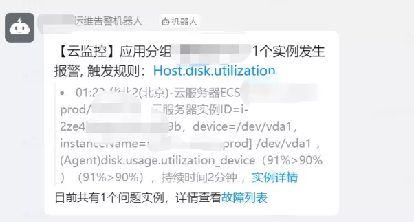
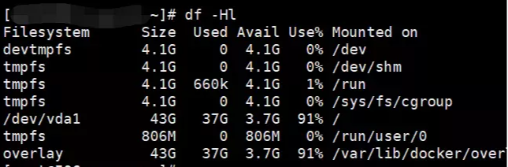
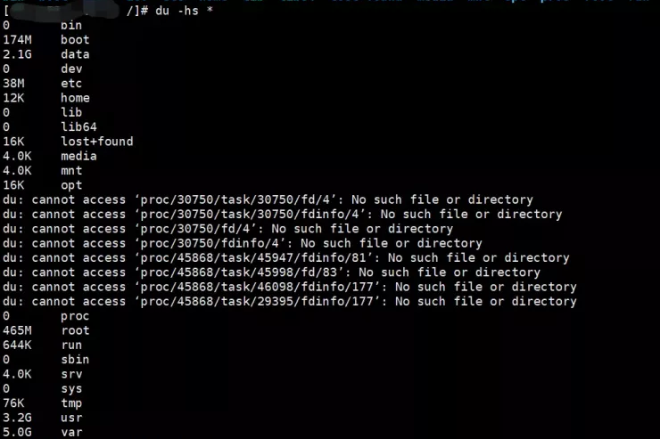
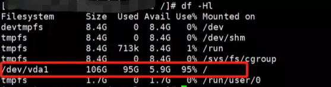
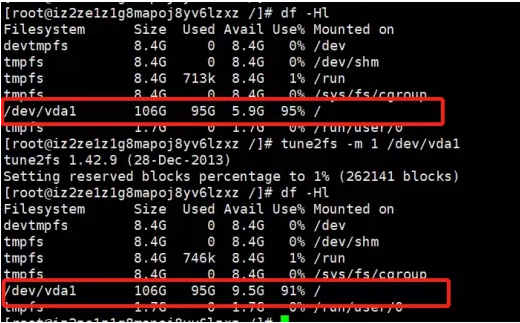

在服务器运维过程中，我们时常会遇到这样的情况，收到服务器磁盘空间告警。

<!--more-->



登录服务器，通过 df -Hl 查看:



和告警信息一致，接着我们就是要找到导致磁盘空间满的目录或文件。

**如何找到占用空间大的目录或文件？**
一种比较笨的方法是，在根目录下，通过 du -hs 命令，列出各目录所占空间大小：



之后再用同样的方法继续到对应目录下去找。

再相对高效一点的方法是通过 du的 -d 参数，或--max-depth，设置查询的目录深度，目录深度增加，所查询的目录，展示出来会很多，这个时候可以通过 grep 进行过滤，通过这样的方式，可以搜出以G或者T为单位的占用磁盘空间的大目录，并排序。

或者可以通过find来查询

```
find / -type f -size +1G -exec du -h {} \;
```

从效率上来说，find要比du要更快速、灵活通过这两种方法，我们可以快速找到占用磁盘空间的罪魁祸首你以为就这么简单？很多时候，你会发现，通过find或du查半天，发现所有加起来的占用空间，和df看到的磁盘空间占用，相差很大，就比如我上面的两张图通过df查看，磁盘使用37G，但是在根目录下通过du -hs 查看，总共加起来差不多10G，没有隐藏目录，那空间被谁吃了？很明显，有空间被已删除文件占用，文件删除了，但是资源没释放之前介绍过一个很好用的命令：lsof，我们可以通过以下命令去查看

```
lsof +L1
```

或者

```
lsof |grep delete
```

从结果可以看出，有一个 28G 左右的大日志文件，删除了，但是空间没释放，这可能是由于没停止服务，就把对应的文件删除了，导致空间没释放。

对应的解决方法就是，重启 tomcat 应用，释放空间

或者直接kill掉进程。

**磁盘空间莫名被吃？**

还有一种经常有人问的问题，就是，通过df查看到的磁盘



会发现，Used 和 Avail 加起来不够 Size，莫名被吃掉一部分其实这是 Linux 文件系统的一种安全策略，它默认会为 root 用户保留 5% 的磁盘空间，留作紧急情况使用。这样能保证有些关键应用（比如数据库）在硬盘满的时候有点余地，不至于马上就 crash。

我们可以通过 tune2fs 修改预留空间的比例：

```
tune2fs -m 1 /dev/vda1
```

通过下图可以看到前后对比图片



这样被吃掉的空间，就吐出来了。
