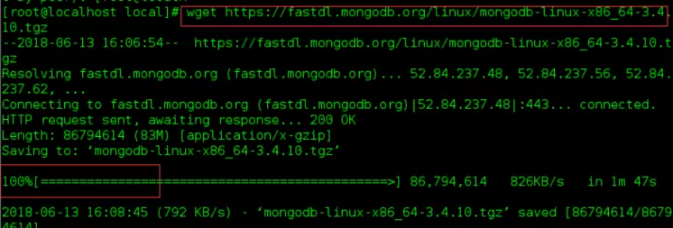
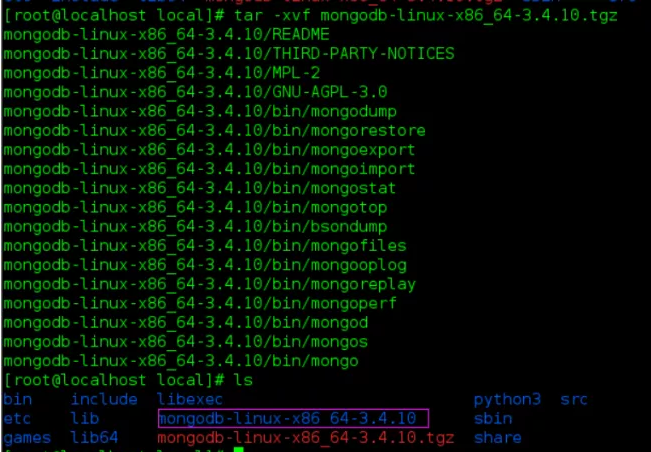
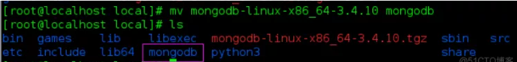
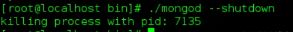
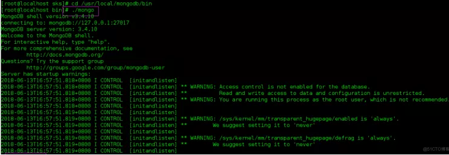
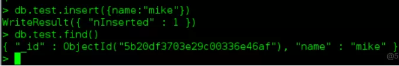
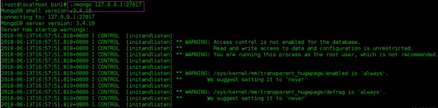

MongoDB 是由C++语言编写的，是一个基于分布式文件存储的开源数据库系统。

在高负载的情况下，添加更多的节点，可以保证服务器性能。

MongoDB 旨在为WEB应用提供可扩展的高性能数据存储解决方案。

MongoDB 将数据存储为一个文档，数据结构由键值(key=>value)对组成。MongoDB 文档类似于 JSON 对象。字段值可以包含其他文档，数组及文档数组。

<!--more-->

1、下载完安装包，并解压 tgz（以下演示的是 64 位 Linux上的安装）

```
wget https://fastdl.mongodb.org/linux/mongodb-linux-x86_64-3.4.10.tgz
tar -zxvf mongodb-linux-x86_64-3.4.10.tgz
```






将Mongodb文件夹命名为mongdb文件夹

```
mv mongodb-linux-x86_64-3.4.10 mongodb
```



MongoDB 的可执行文件位于 bin 目录下，所以可以将其添加到 PATH 路径中：

打开/etc/profile文件，添加以下内容：

```
export PATH=<mongodb-install-directory>/bin:$PATH
```

<mongodb-install-directory> 为你 MongoDB 的安装路径。如本文的 /usr/local/mongodb。

```
export PATH=/usr/local/mongodb/bin:$PATH
```

保存后执行以下命令生效：

```
source /etc/profile
```

2、创建数据库目录

MongoDB的数据存储在data目录的db目录下，但是这个目录在安装过程不会自动创建，所以你需要手动创建data目录，并在data目录中创建db目录。

以下实例中我们将data目录创建于根目录下(/)。

注意：/data/db 是 MongoDB 默认的启动的数据库路径(--dbpath)。

创建目录树：

```
mkdir -p /data/db
```

3、命令行中运行 MongoDB 服务

你可以在命令行中执行mongo安装目录中的bin目录执行mongod命令来启动mongdb服务。

```
./mongod --dbpath /data/db  --fork
```

关闭服务：

```
./mongod --dbpath /data/db  --shutdown
```



也可以在 mongo 的命令出口中实现：

```
> use admin
switched to db admin
> db.shutdownServer()
```

4、MongoDB后台管理 Shell

　　　　如果你需要进入MongoDB后台管理，你需要先打开mongodb装目录的下的bin目录，然后执行mongo命令文件。

　　　　MongoDB Shell是MongoDB自带的交互式Javascript shell,用来对MongoDB进行操作和管理的交互式环境。

　　　　当你进入mongoDB后台后，它默认会链接到 test 文档（数据库）



插入一些简单的数据，并对插入的数据进行检索：



5、创建用户和密码

进入bin目录下，  输入./mongo 127.0.0.1:27017 连接到mongodb中



建立系统管理员用户

```
use admin
db.createUser(
  {
    user: "myAdmin",
    pwd: "admin123",
    roles: [ { role: "userAdminAnyDatabase", db: "admin" } ]
  }
)
```

mongod的启动和关闭 :
mogodb 启动：

1.缺省的启动方式

```
./mongod  
```

缺省的启动方式，数据存储目录里是/data/db，监听端口是27017

2.带基本参数的启动方式

```
./mongod --port 51017 --dbpath /home/mongo/data --logpath /home/mongo/log/log.log --logappend --fork --journal 1000 
```

```
基本参数：
-f                      指定配置文件 （参考： http://www.mongodb.org/display/DOCS/File+Based+Configuration）
--port                  指定端口，默认是27017
--dbpath                数据目录路径
--logpath               日志文件路径
--logappend             日志append而不是overwrite
--fork                  以创建子进程的方式运行
--journal               日志提交间隔，默认100ms
--nojournal             关闭日志功能，2.0版本以上是默认开启的
```

mongodb关闭：

```
> use admin
> db.shutdownServer()
> db.shutdownServer({force : true})   强制关闭Mongod，应对副本集中主从时间差超过10s时不允许关闭主库的情况
```

不要使用kill直接杀mongo进程的方式关闭数据节点，会造成数据损坏。
