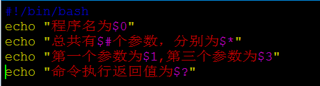
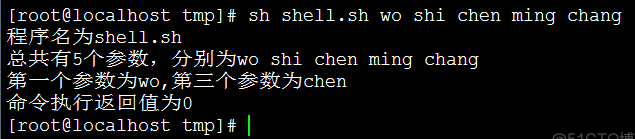

Linux系统中的Shell脚本语言内设了用于接收参数的变量，变量之间可以使用空格间隔。

<!--more-->

0对应的是当前Shell脚本程序的名称，#对应的是总共有几个参数，*对应的是所有位置的参数值，∗对应的是所有位置的参数值，?对应的是显示上一次命令的执行返回值，而$1、$2、$3……则分别对应着第N个位置的参数值。

下面进行一个简单的小脚本编写：

```
[root@localhost tmp]# vim shell.sh
```



编写完成后执行一下脚本：

```
[root@localhost tmp]# sh shell.sh wo shi chen ming chang
```



上面的“wo shi chen ming chang”是我们执行脚本时输入的5个参数，最后一个命令执行返回值为0表示命令执行成功。
