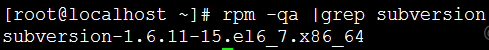
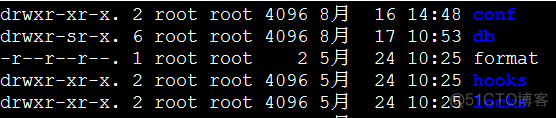

SVN是Subversion的简称，是一个开放源代码的版本控制系统，用于多个人共同开发同一个项目，共用资源的目的。

<!-- more-->

环境：CentOs6.1

查看是否安装了svn工具：rpm -qa | grep subversion (查看版本：svnserve --version)



（未安装的可以用yum install subversion 安装）
1、建立SVN的根目录

```bash
mkdir -p /opt/svn/tshop/
```

2、建立一个产品仓库

```bash
svnadmin create /opt/svn/tshop/
```

如果你们的研发中心有多个产品组，每个产品组可以建立一个SVN仓库



目录用途说明：

```
hooks目录：放置hook脚本文件的目录
locks目录：用来放置subversion的db锁文件和db_logs锁文件的目录，用来追踪存取文件库的客户端
format文件：是一个文本文件，里面只放了一个整数，表示当前文件库配置的版本号
conf目录：是这个仓库的配置文件（仓库的用户访问账号、权限等）
```

3、修改版本配置库文件

```bash
vi /opt/svn/tshop/conf/svnserve.conf
anon-access = none # 注意这里必须设置，否则所有用户不用密码就可以访问
auth-access = write
password-db = passwd
authz-db = authz
realm = tshop
```

对用户配置文件的修改是立即生效的，不必重启svn。

4、开始设置passwd用户账号信息

```bash
vi /opt/svn/tshop/conf/passwd
```

```bash
[users]
#harry = harryssecret
#sally = sallyssecret
###===下面是我添加的用户信息#######
chenmingchang = 123456
svntest = 123456
```

5、开始设置authz. 用户访问权限

```bash
vi /opt/svn/tshop/conf/authz
```

```bash
[groups]
devteam = chenmingchang, svntest #devteam组包括两个用户

[/]
chenmingchang = rw
svntest = r


[tshop:/tb2c]
@devteam = rw
svntest =

[tshop:/tb2b2c]
@devteam = rw
chenmingchang = r
```

6、注意：

权限配置文件中出现的用户名必须已在用户配置文件中定义。
对权限配置文件的修改立即生效，不必重启svn。
用户组格式：
[groups]
= ,
其中，1个用户组可以包含1个或多个用户，用户间以逗号分隔。
版本库目录格式：
[<版本库>:/项目/目录]
@<用户组名> = <权限>
<用户名> = <权限>

其中，方框号内部分可以有多种写法:

- [/],表示根目录及以下，根目录是svnserve启动时指定的，我们指定为/opt/svn/tshop，[/]就是表示对全部版本库设置权限。
- [tshop:/] 表示对版本库tshop设置权限；
- [tshop:/abc] 表示对版本库tshop中的abc项目设置权限；
- [tshop:/abc/aaa] 表示对版本库tshop中的abc项目的aaa目录设置权限；
- 权限主体可以是用户组、用户或*，用户组在前面加@，*表示全部用户。
- 权限可以是w、r、wr和空，空表示没有任何权限。

7、启动svn：

```bash
svnserve -d -r /opt/svn/tshop #默认的启动端口号为3690
```

8、检查是否启动：

```bash
netstat -tunlp | grep svn 
```

或

```bash
ps –ef | grep svn
```


9、将svn加入到开机启动
编辑rc.local文件：

```bash
vi /etc/rc.d/rc.local
```

加入并保存如下启动命令：

```bash
/usr/local/svn/bin/svnserve –d --listen-port 3690 -r /opt/svn/tshop
```

10、如果想停止svn，则使用如下命令：

```
killall svnserve 
```

或

```
pkill svn
```

11、如果想将svn作为服务：
在/etc/rc.d/init.d/目录下新建名为svn的文件:

```
touch /etc/rc.d/init.d/svn
```

并设置权限为755：

```
chmod 755 /etc/rc.d/init.d/svn
```

编辑svn文件：

```
vi /etc/rc.d/init.d/svn
```

在里面添加如下代码：

```bash
#!/bin/bash
#build this file in /etc/rc.d/init.d/svn
#chmod 755 /etc/rc.d/init.d/svn
#centos下可以用如下命令管理svn: service svn start(restart/stop)
SVN_HOME=/opt/svn/tshop
if [ ! -f “/usr/local/svn/bin/svnserve” ]
then
echo “svnserver startup: cannot start”
exit
fi
case “$1” in
start)
echo “Starting svnserve…”
/usr/local/svn/bin/svnserve -d --listen-port 9999 -r $SVN_HOME
echo “Finished!”
;;
stop)
echo “Stoping svnserve…”
killall svnserve
echo “Finished!”
;;
restart)
$0 stop
$0 start
;;
*)
echo "Usage: svn { start | stop | restart } "
exit 1
esac
```

保存，之后便可以以service svn start(restart/stop)方式启动SVN。

至此，svn服务器配置完毕。

下一篇将讲解如何在客户端上使用svn。
