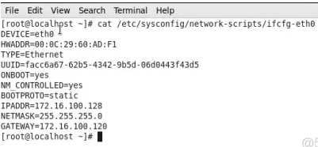
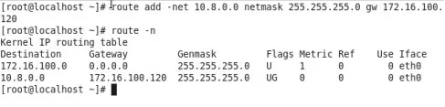

上一章已经部署了open服务，但那仅仅只能访问部署了open server的服务器，要想同时也能访问同网段的其他机器，还需配置一下。

<!--more-->

目前客户端都已经可以ping通OpenVPN Server的内网IP，那么想要和同在一个网段的其他地址通信，貌似只需要加一条路由就可以了，下面讨论一下让客户端可以同内网服务器IP段通信的方法：

方法1、将内网的其他服务器的网关设置为OpenVPN Server的内网IP，即172.16.100.120



Windows客户端可以ping通172.16.100.128：


方法2、在OpenVPN Server上配置NAT转换，将到10.8.0.0/24的访问都转换为172.16.100.120

在Open××× Server上添加一条防火墙规则：

```
/sbin/iptables -t nat -A POSTROUTING -s 10.8.0.0/24 -o eth1 -j SNAT --to-source 172.16.100.120
iptables save
```

Windows客户端可以ping通172.16.100.128：


方法3、在需要访问的内网服务器上配置一条到10.8.0.0段的静态路由：



Windows客户端也可以ping通172.16.100.128：


可以看到，这种方法也可以实现需求，但是不方便的是每一台内网服务器上都需要添加这样一条路由，操作起来可能稍显麻烦。
