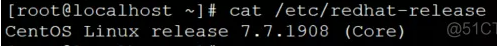

由于在家办公需要访问公司内网，故记录一下部署openVPN服务过程。

<!--more-->

环境：




开始部署：

```
mkdir -p /opt/tools
cd /opt/tools/
yum install openssl openssl-devel gcc -y
# 因为openVPN依赖于openssl，所以这里需要安装openssl和openssl-devel
```

安装lzo，lzo用于压缩隧道通信数据以加快传输速度

```
wget http://www.oberhumer.com/opensource/lzo/download/lzo-2.03.tar.gz   #下载lzo包
mkdir -p /usr/local/lzo
tar -zxf lzo-2.03.tar.gz
cd lzo-2.03
./configure --prefix=/usr/local/lzo/
make && make install
```

开始安装openVPN-2.0.9
下载链接：链接:  https://pan.baidu.com/s/1XD_pja7Cj4umOJngN92eIQ 提取码: m7dy

```
tar -zxf openvpn-2.0.9.tar.gz
cd openvpn-2.0.9
./configure --with-lzo-headers=/usr/local/lzo/include --with-lzo-lib=/usr/local/lzo/lib --enable-password-save
make && make install
```

Open安装完成，下面开始配置openVPN：
1、建立CA的相关信息

在open的源代码目录下有一个/easy-rsa/2.0目录，我的环境是/opt/tools/open-2.0.9/easy-rsa/2.0/，里面有一个vars文件存有CA的详细信息，这里需要编辑并修改相关配置。

```
cd /opt/tools/openvpn-2.0.9/easy-rsa/2.0/
vim vars #编辑vars修改为你自己的配置信息
tail -5 vars #下面是我的配置信息
export KEY_COUNTRY="CN"       #定义你所在的国家
export KEY_PROVINCE="GD"      #定义你所在的省份
export KEY_CITY="Shenzhen"     #定义你所在的城市
export KEY_ORG="contoso.com"    #表示你所在的组织
export KEY_EMAIL="admin@contoso.com"  #表示你的邮件地址
source vars
./clean-all  #初始化keys目录，会删除里面的所有文件
```

2、创建根CA证书

```
[root@mylinux1 2.0]# ./build-ca 
Generating a 1024 bit RSA private key
......++++++
............++++++

writing new private key to 'ca.key'
-----

You are about to be asked to enter information that will be incorporated
into your certificate request.
What you are about to enter is what is called a Distinguished Name or a DN.
There are quite a few fields but you can leave some blank
For some fields there will be a default value,

If you enter '.', the field will be left blank.
-----

Country Name (2 letter code) [CN]:
State or Province Name (full name) [GD]:
Locality Name (eg, city) [Shenzhen]:
Organization Name (eg, company) [contoso.com]:
Organizational Unit Name (eg, section) []:Tech
Common Name (eg, your name or your server's hostname) [contoso.com CA]:
Email Address [admin@contoso.com]:
[root@mylinux1 2.0]# ll keys/
total 12
-rw-r--r-- 1 root root 1298 Sep  3 14:50 ca.crt
-rw------- 1 root root  916 Sep  3 14:50 ca.key
-rw-r--r-- 1 root root    0 Sep  3 14:45 index.txt
-rw-r--r-- 1 root root    3 Sep  3 14:45 serial
```

3、创建Diffie-Hellman（dh）文件

```
[root@mylinux1 2.0]# ./build-dh 
Generating DH parameters, 1024 bit long safe prime, generator 2
This is going to take a long time
..........+...............+........................................................+..................................................+.......+....................................................................+...+......................+....................................+...+.............................................+................................................................+...+..........+................+.....+..................................+.....................................................................+..................+....+...........................................+..............+...+.........................................................................................................................................................................................................................................+...................+.................+......................+...............................................................................................................................................+..............................................................................................................+..............................+..............................................................................+...............+................................+.......................................................................+...................................................+......................+.........................................+........................+..............................................+.........+............................................................................+....................................+.........................................................+.......+.............................+......................................................................+........................................................................................................................................................................................+.....................................................................................................................+................+.......+..........................+..........+................................................................................................................................................................................................+...................+.........................................................................+.............................................................................................................................................+..................................+...........................................................+............................................................................................................................+...........+.................................+.....+........................................................................................................................+........................+............................+..................+..............+...........................................................+.......................................................................................+........................+.................................................................................................................................+.......+................................+...+........................+...............................................................................................+...................................................................+...................+...........+.............................................................................................+..............................................................+.+.......+..+................+..............................................+................................+....+.....................................+..+.......................+............................................++*++*++*
[root@mylinux1 2.0]# ll keys/dh*
-rw-r--r-- 1 root root  245 Sep  3 14:51 dh1024.pem
[root@mylinux1 2.0]# cat keys/dh1024.pem 
-----BEGIN DH PARAMETERS-----
MIGHAoGBAO5vwKo4atqlMpkJfiJhpm2vgHApCiIWLkQAz+m8rj8B6QI+Lu6piSFP
dAZ5drGmAZMhErx0zusS8IZRCQnw7kO7E+RTqw93T5PC3QjZhZNXc6RRpFOjLlkX
6s+TjnNZS6EIP459i8TorZEVdwLD552duvaks21pLlJI8nOTEQyzAgEC
-----END DH PARAMETERS-----
```

4、为服务器生成证书和密钥

```
[root@mylinux1 2.0]# ./build-key-server server
Generating a 1024 bit RSA private key
..........++++++
......++++++

writing new private key to 'server.key'
-----

You are about to be asked to enter information that will be incorporated
into your certificate request.
What you are about to enter is what is called a Distinguished Name or a DN.
There are quite a few fields but you can leave some blank
For some fields there will be a default value,

If you enter '.', the field will be left blank.
-----

Country Name (2 letter code) [CN]:
State or Province Name (full name) [GD]:
Locality Name (eg, city) [Shenzhen]:
Organization Name (eg, company) [contoso.com]:
Organizational Unit Name (eg, section) []:Tech
Common Name (eg, your name or your server's hostname) [server]:
Email Address [admin@contoso.com]:
Please enter the following 'extra' attributes
to be sent with your certificate request
A challenge password []:123456
An optional company name []:contoso.com
Using configuration from /opt/tools/open***-2.0.9/easy-rsa/2.0/openssl.cnf
Check that the request matches the signature
Signature ok
The Subject's Distinguished Name is as follows
countryName           :PRINTABLE:'CN'
stateOrProvinceName   :PRINTABLE:'GD'
localityName          :PRINTABLE:'Shenzhen'
organizationName      :PRINTABLE:'contoso.com'
organizationalUnitName:PRINTABLE:'Tech'
commonName            :PRINTABLE:'server'
emailAddress          :IA5STRING:'admin@contoso.com'
Certificate is to be certified until Sep  1 06:54:39 2026 GMT (3650 days)
Sign the certificate? [y/n]:y
1 out of 1 certificate requests certified, commit? [y/n]y
Write out database with 1 new entries
Data Base Updated
[root@mylinux1 2.0]# ll keys/
total 44
-rw-r--r-- 1 root root 3972 Sep  3 14:54 01.pem
-rw-r--r-- 1 root root 1298 Sep  3 14:50 ca.crt
-rw------- 1 root root  916 Sep  3 14:50 ca.key
-rw-r--r-- 1 root root  245 Sep  3 14:51 dh1024.pem
-rw-r--r-- 1 root root  114 Sep  3 14:54 index.txt
-rw-r--r-- 1 root root   21 Sep  3 14:54 index.txt.attr
-rw-r--r-- 1 root root    0 Sep  3 14:45 index.txt.old
-rw-r--r-- 1 root root    3 Sep  3 14:54 serial
-rw-r--r-- 1 root root    3 Sep  3 14:45 serial.old
-rw-r--r-- 1 root root 3972 Sep  3 14:54 server.crt
-rw-r--r-- 1 root root  761 Sep  3 14:54 server.csr
-rw------- 1 root root  916 Sep  3 14:54 server.key
```

5、为客户端生成客户端证书文件

```
[root@mylinux1 2.0]# ./build-key tom
Generating a 1024 bit RSA private key
.............++++++
...................++++++

writing new private key to 'tom.key'
-----

You are about to be asked to enter information that will be incorporated
into your certificate request.
What you are about to enter is what is called a Distinguished Name or a DN.
There are quite a few fields but you can leave some blank
For some fields there will be a default value,

If you enter '.', the field will be left blank.
-----

Country Name (2 letter code) [CN]:
State or Province Name (full name) [GD]:
Locality Name (eg, city) [Shenzhen]:
Organization Name (eg, company) [contoso.com]:
Organizational Unit Name (eg, section) []:Tech
Common Name (eg, your name or your server's hostname) [tom]:
Email Address [admin@contoso.com]:tom@contoso.com
Please enter the following 'extra' attributes
to be sent with your certificate request
A challenge password []:123456
An optional company name []:contoso.com
Using configuration from /opt/tools/open***-2.0.9/easy-rsa/2.0/openssl.cnf
Check that the request matches the signature
Signature ok
The Subject's Distinguished Name is as follows
countryName           :PRINTABLE:'CN'
stateOrProvinceName   :PRINTABLE:'GD'
localityName          :PRINTABLE:'Shenzhen'
organizationName      :PRINTABLE:'contoso.com'
organizationalUnitName:PRINTABLE:'Tech'
commonName            :PRINTABLE:'tom'
emailAddress          :IA5STRING:'tom@contoso.com'
Certificate is to be certified until Sep  1 07:03:30 2026 GMT (3650 days)
Sign the certificate? [y/n]:y
1 out of 1 certificate requests certified, commit? [y/n]y
Write out database with 1 new entries
Data Base Updated
[root@mylinux1 2.0]# ll keys/
total 68
-rw-r--r-- 1 root root 3972 Sep  3 14:54 01.pem
-rw-r--r-- 1 root root 3838 Sep  3 15:03 02.pem
-rw-r--r-- 1 root root 1298 Sep  3 14:50 ca.crt
-rw------- 1 root root  916 Sep  3 14:50 ca.key
-rw-r--r-- 1 root root  245 Sep  3 14:51 dh1024.pem
-rw-r--r-- 1 root root  223 Sep  3 15:03 index.txt
-rw-r--r-- 1 root root   21 Sep  3 15:03 index.txt.attr
-rw-r--r-- 1 root root   21 Sep  3 14:54 index.txt.attr.old
-rw-r--r-- 1 root root  114 Sep  3 14:54 index.txt.old
-rw-r--r-- 1 root root    3 Sep  3 15:03 serial
-rw-r--r-- 1 root root    3 Sep  3 14:54 serial.old
-rw-r--r-- 1 root root 3972 Sep  3 14:54 server.crt
-rw-r--r-- 1 root root  761 Sep  3 14:54 server.csr
-rw------- 1 root root  916 Sep  3 14:54 server.key
-rw-r--r-- 1 root root 3838 Sep  3 15:03 tom.crt
-rw-r--r-- 1 root root  753 Sep  3 15:03 tom.csr
-rw------- 1 root root  916 Sep  3 15:03 tom.key
```

另外，上面帮Tom生产的客户端证书文件时不含密码的，也即用户通过该证书登录openVPN时不需要输入密码即可拨入，当然我们在/easy-rsa/2.0目录下看到除了build-key命令外，还有一个build-key-pass，这个就是生成带密码的客户端证书文件，例如我们需要为jerry创建一个带密码的客户端证书，方法如下：

```
[root@mylinux1 2.0]# ./build-key-pass jerry
Generating a 1024 bit RSA private key
...........................................................++++++
........++++++
writing new private key to 'jerry.key'
Enter PEM pass phrase:

Verifying - Enter PEM pass phrase:
-----

You are about to be asked to enter information that will be incorporated
into your certificate request.
What you are about to enter is what is called a Distinguished Name or a DN.
There are quite a few fields but you can leave some blank
For some fields there will be a default value,

If you enter '.', the field will be left blank.
-----

Country Name (2 letter code) [CN]:
State or Province Name (full name) [GD]:
Locality Name (eg, city) [Shenzhen]:
Organization Name (eg, company) [contoso.com]:
Organizational Unit Name (eg, section) []:Tech
Common Name (eg, your name or your server's hostname) [jerry]:
Email Address [admin@contoso.com]:jerry@contoso.com
Please enter the following 'extra' attributes
to be sent with your certificate request
A challenge password []:123456
An optional company name []:contoso.com
Using configuration from /opt/tools/open***-2.0.9/easy-rsa/2.0/openssl.cnf
Check that the request matches the signature
Signature ok
The Subject's Distinguished Name is as follows
countryName           :PRINTABLE:'CN'
stateOrProvinceName   :PRINTABLE:'GD'
localityName          :PRINTABLE:'Shenzhen'
organizationName      :PRINTABLE:'contoso.com'
organizationalUnitName:PRINTABLE:'Tech'
commonName            :PRINTABLE:'jerry'
emailAddress          :IA5STRING:'jerry@contoso.com'
Certificate is to be certified until Sep  1 07:07:40 2026 GMT (3650 days)
Sign the certificate? [y/n]:y
1 out of 1 certificate requests certified, commit? [y/n]y
Write out database with 1 new entries
Data Base Updated
[root@mylinux1 2.0]# ll keys/
total 84
-rw-r--r-- 1 root root 3972 Sep  3 14:54 01.pem
-rw-r--r-- 1 root root 3838 Sep  3 15:03 02.pem
-rw-r--r-- 1 root root 3850 Sep  3 15:07 03.pem
-rw-r--r-- 1 root root 1298 Sep  3 14:50 ca.crt
-rw------- 1 root root  916 Sep  3 14:50 ca.key
-rw-r--r-- 1 root root  245 Sep  3 14:51 dh1024.pem
-rw-r--r-- 1 root root  336 Sep  3 15:07 index.txt
-rw-r--r-- 1 root root   21 Sep  3 15:07 index.txt.attr
-rw-r--r-- 1 root root   21 Sep  3 15:03 index.txt.attr.old
-rw-r--r-- 1 root root  223 Sep  3 15:03 index.txt.old
-rw-r--r-- 1 root root 3850 Sep  3 15:07 jerry.crt
-rw-r--r-- 1 root root  761 Sep  3 15:07 jerry.csr
-rw------- 1 root root 1041 Sep  3 15:07 jerry.key
-rw-r--r-- 1 root root    3 Sep  3 15:07 serial
-rw-r--r-- 1 root root    3 Sep  3 15:03 serial.old
-rw-r--r-- 1 root root 3972 Sep  3 14:54 server.crt
-rw-r--r-- 1 root root  761 Sep  3 14:54 server.csr
-rw------- 1 root root  916 Sep  3 14:54 server.key
-rw-r--r-- 1 root root 3838 Sep  3 15:03 tom.crt
-rw-r--r-- 1 root root  753 Sep  3 15:03 tom.csr
-rw------- 1 root root  916 Sep  3 15:03 tom.key
```

6、编辑Open×××服务器配置文件/etc/server.conf

```
cat /opt/tools/open***-2.0.9/sample-config-files/server.conf|egrep -v ";|#|^$" >/tmp/temp
cp /tmp/temp /etc/server.conf
vi /etc/server.conf
[root@mylinux1 2.0]# cat /etc/server.conf
port 1194    #端口
proto udp    #协议
dev tun
ca   /opt/tools/open***-2.0.9/easy-rsa/2.0/keys/ca.crt
cert /opt/tools/open***-2.0.9/easy-rsa/2.0/keys/server.crt
key  /opt/tools/open***-2.0.9/easy-rsa/2.0/keys/server.key
dh   /opt/tools/open***-2.0.9/easy-rsa/2.0/keys/dh1024.pem
server 10.8.0.0 255.255.255.0
push "route 172.16.0.0 255.255.255.0"   #你办公室内网的网段
ifconfig-pool-persist ipp.txt
keepalive 10 120
comp-lzo
persist-key
persist-tun
status open***-status.log
verb 5
```

7、启动OpenVPN服务

1）首先检查iptables是否关闭，SELinux是否禁用，以免对OpenVPN造成干扰

2）开启系统自身的IP转发功能
临时：

```
echo "1" >/proc/sys/net/ipv4/ip_forward
```

永久：

```
/etc/sysctl.conf 中添加/修改:net.ipv4.ip_forward = 1
```

3）启动Open***服务

```
[root@mylinux1 2.0]# /usr/local/sbin/openvpn --config /etc/server.conf &
Sat Sep  3 17:31:22 2016 us=753145 Current Parameter Settings:
Sat Sep  3 17:31:22 2016 us=753266   config = '/etc/server.conf'
Sat Sep  3 17:31:22 2016 us=753279   mode = 1
Sat Sep  3 17:31:22 2016 us=753287   persist_config = DISABLED
Sat Sep  3 17:31:22 2016 us=753296   persist_mode = 1
Sat Sep  3 17:31:22 2016 us=753303   show_ciphers = DISABLED
Sat Sep  3 17:31:22 2016 us=753311   show_digests = DISABLED
Sat Sep  3 17:31:22 2016 us=753319   show_engines = DISABLED
Sat Sep  3 17:31:22 2016 us=753326   genkey = DISABLED
Sat Sep  3 17:31:22 2016 us=753334   key_pass_file = '[UNDEF]'
Sat Sep  3 17:31:22 2016 us=753341   show_tls_ciphers = DISABLED
Sat Sep  3 17:31:22 2016 us=753349   proto = 1
Sat Sep  3 17:31:22 2016 us=753357   local = '192.168.100.120'
Sat Sep  3 17:31:22 2016 us=753365   remote_list = NULL
Sat Sep  3 17:31:22 2016 us=753381   remote_random = DISABLED
Sat Sep  3 17:31:22 2016 us=753391   local_port = 1194
Sat Sep  3 17:31:22 2016 us=753399   remote_port = 1194
Sat Sep  3 17:31:22 2016 us=753406   remote_float = DISABLED
Sat Sep  3 17:31:22 2016 us=753414   ipchange = '[UNDEF]'
Sat Sep  3 17:31:22 2016 us=753422   bind_local = ENABLED
Sat Sep  3 17:31:22 2016 us=753429   dev = 'tun'
Sat Sep  3 17:31:22 2016 us=753437   dev_type = '[UNDEF]'
Sat Sep  3 17:31:22 2016 us=753445   dev_node = '[UNDEF]'
Sat Sep  3 17:31:22 2016 us=753452   tun_ipv6 = DISABLED
Sat Sep  3 17:31:22 2016 us=753460   ifconfig_local = '10.8.0.1'
Sat Sep  3 17:31:22 2016 us=753470   ifconfig_remote_netmask = '10.8.0.2'
Sat Sep  3 17:31:22 2016 us=753478   ifconfig_noexec = DISABLED
Sat Sep  3 17:31:22 2016 us=753485   ifconfig_nowarn = DISABLED
Sat Sep  3 17:31:22 2016 us=753493   shaper = 0
Sat Sep  3 17:31:22 2016 us=753501   tun_mtu = 1500
Sat Sep  3 17:31:22 2016 us=753509   tun_mtu_defined = ENABLED
Sat Sep  3 17:31:22 2016 us=753517   link_mtu = 1500
Sat Sep  3 17:31:22 2016 us=753524   link_mtu_defined = DISABLED
Sat Sep  3 17:31:22 2016 us=753532   tun_mtu_extra = 0
Sat Sep  3 17:31:22 2016 us=753539   tun_mtu_extra_defined = DISABLED
Sat Sep  3 17:31:22 2016 us=753547   fragment = 0
Sat Sep  3 17:31:22 2016 us=753555   mtu_discover_type = -1
Sat Sep  3 17:31:22 2016 us=753562   mtu_test = 0
Sat Sep  3 17:31:22 2016 us=753570   mlock = DISABLED
Sat Sep  3 17:31:22 2016 us=753578   keepalive_ping = 10
Sat Sep  3 17:31:22 2016 us=753585   keepalive_timeout = 120
Sat Sep  3 17:31:22 2016 us=753593   inactivity_timeout = 0
Sat Sep  3 17:31:22 2016 us=753600   ping_send_timeout = 10
Sat Sep  3 17:31:22 2016 us=753608   ping_rec_timeout = 240
Sat Sep  3 17:31:22 2016 us=753616   ping_rec_timeout_action = 2
Sat Sep  3 17:31:22 2016 us=753623   ping_timer_remote = DISABLED
Sat Sep  3 17:31:22 2016 us=753631   remap_sigusr1 = 0
Sat Sep  3 17:31:22 2016 us=753639   explicit_exit_notification = 0
Sat Sep  3 17:31:22 2016 us=753646   persist_tun = ENABLED
Sat Sep  3 17:31:22 2016 us=753654   persist_local_ip = DISABLED
Sat Sep  3 17:31:22 2016 us=753661   persist_remote_ip = DISABLED
Sat Sep  3 17:31:22 2016 us=753669   persist_key = ENABLED
Sat Sep  3 17:31:22 2016 us=753676   mssfix = 1450
Sat Sep  3 17:31:22 2016 us=753684   passtos = DISABLED
Sat Sep  3 17:31:22 2016 us=753692   resolve_retry_seconds = 1000000000
Sat Sep  3 17:31:22 2016 us=753700   connect_retry_seconds = 5
Sat Sep  3 17:31:22 2016 us=753707   username = '[UNDEF]'
Sat Sep  3 17:31:22 2016 us=753715   groupname = '[UNDEF]'
Sat Sep  3 17:31:22 2016 us=753722   chroot_dir = '[UNDEF]'
Sat Sep  3 17:31:22 2016 us=753730   cd_dir = '[UNDEF]'
Sat Sep  3 17:31:22 2016 us=753737   writepid = '[UNDEF]'
Sat Sep  3 17:31:22 2016 us=753745   up_script = '[UNDEF]'
Sat Sep  3 17:31:22 2016 us=753752   down_script = '[UNDEF]'
Sat Sep  3 17:31:22 2016 us=753760   down_pre = DISABLED
Sat Sep  3 17:31:22 2016 us=753768   up_restart = DISABLED
Sat Sep  3 17:31:22 2016 us=753775   up_delay = DISABLED
Sat Sep  3 17:31:22 2016 us=753782   daemon = DISABLED
Sat Sep  3 17:31:22 2016 us=753790   inetd = 0
Sat Sep  3 17:31:22 2016 us=753798   log = DISABLED
Sat Sep  3 17:31:22 2016 us=753805   suppress_timestamps = DISABLED
Sat Sep  3 17:31:22 2016 us=753813   nice = 0
Sat Sep  3 17:31:22 2016 us=753820   verbosity = 5
Sat Sep  3 17:31:22 2016 us=753828   mute = 0
Sat Sep  3 17:31:22 2016 us=753835   gremlin = 0
Sat Sep  3 17:31:22 2016 us=753844   status_file = 'open***-status.log'
Sat Sep  3 17:31:22 2016 us=753851   status_file_version = 1
Sat Sep  3 17:31:22 2016 us=753859   status_file_update_freq = 60
Sat Sep  3 17:31:22 2016 us=753867   occ = ENABLED
Sat Sep  3 17:31:22 2016 us=753874   rcvbuf = 65536
Sat Sep  3 17:31:22 2016 us=753882   sndbuf = 65536
Sat Sep  3 17:31:22 2016 us=753890   socks_proxy_server = '[UNDEF]'
Sat Sep  3 17:31:22 2016 us=753897   socks_proxy_port = 0
Sat Sep  3 17:31:22 2016 us=753909   socks_proxy_retry = DISABLED
Sat Sep  3 17:31:22 2016 us=753918   fast_io = DISABLED
Sat Sep  3 17:31:22 2016 us=753926   comp_lzo = ENABLED
Sat Sep  3 17:31:22 2016 us=753933   comp_lzo_adaptive = ENABLED
Sat Sep  3 17:31:22 2016 us=753947   route_script = '[UNDEF]'
Sat Sep  3 17:31:22 2016 us=753956   route_default_gateway = '[UNDEF]'
Sat Sep  3 17:31:22 2016 us=753964   route_noexec = DISABLED
Sat Sep  3 17:31:22 2016 us=753972   route_delay = 0
Sat Sep  3 17:31:22 2016 us=753980   route_delay_window = 30
Sat Sep  3 17:31:22 2016 us=753988   route_delay_defined = DISABLED
Sat Sep  3 17:31:22 2016 us=753997   route 10.8.0.0/255.255.255.0/nil/nil
Sat Sep  3 17:31:22 2016 us=754005   management_addr = '[UNDEF]'
Sat Sep  3 17:31:22 2016 us=754013   management_port = 0
Sat Sep  3 17:31:22 2016 us=754021   management_user_pass = '[UNDEF]'
Sat Sep  3 17:31:22 2016 us=754029   management_log_history_cache = 250
Sat Sep  3 17:31:22 2016 us=754037   management_echo_buffer_size = 100
Sat Sep  3 17:31:22 2016 us=754045   management_query_passwords = DISABLED
Sat Sep  3 17:31:22 2016 us=754053   management_hold = DISABLED
Sat Sep  3 17:31:22 2016 us=754061   shared_secret_file = '[UNDEF]'
Sat Sep  3 17:31:22 2016 us=754069   key_direction = 0
Sat Sep  3 17:31:22 2016 us=754078   ciphername_defined = ENABLED
Sat Sep  3 17:31:22 2016 us=754086   ciphername = 'BF-CBC'
Sat Sep  3 17:31:22 2016 us=754094   authname_defined = ENABLED
Sat Sep  3 17:31:22 2016 us=754102   authname = 'SHA1'
Sat Sep  3 17:31:22 2016 us=754110   keysize = 0
Sat Sep  3 17:31:22 2016 us=754118   engine = DISABLED
Sat Sep  3 17:31:22 2016 us=754126   replay = ENABLED
Sat Sep  3 17:31:22 2016 us=754134   mute_replay_warnings = DISABLED
Sat Sep  3 17:31:22 2016 us=754142   replay_window = 0
Sat Sep  3 17:31:22 2016 us=754150   replay_time = 0
Sat Sep  3 17:31:22 2016 us=754158   packet_id_file = '[UNDEF]'
Sat Sep  3 17:31:22 2016 us=754166   use_iv = ENABLED
Sat Sep  3 17:31:22 2016 us=754174   test_crypto = DISABLED
Sat Sep  3 17:31:22 2016 us=754182   tls_server = ENABLED
Sat Sep  3 17:31:22 2016 us=754753   tls_client = DISABLED
Sat Sep  3 17:31:22 2016 us=754766   key_method = 2
Sat Sep  3 17:31:22 2016 us=754774   ca_file = '/opt/tools/open***-2.0.9/easy-rsa/2.0/keys/ca.crt'
Sat Sep  3 17:31:22 2016 us=754783   dh_file = '/opt/tools/open***-2.0.9/easy-rsa/2.0/keys/dh1024.pem'
Sat Sep  3 17:31:22 2016 us=754791   cert_file = '/opt/tools/open***-2.0.9/easy-rsa/2.0/keys/server.crt'
Sat Sep  3 17:31:22 2016 us=754800   priv_key_file = '/opt/tools/open***-2.0.9/easy-rsa/2.0/keys/server.key'
Sat Sep  3 17:31:22 2016 us=754808   pkcs12_file = '[UNDEF]'
Sat Sep  3 17:31:22 2016 us=754817   cipher_list = '[UNDEF]'
Sat Sep  3 17:31:22 2016 us=754824   tls_verify = '[UNDEF]'
Sat Sep  3 17:31:22 2016 us=754832   tls_remote = '[UNDEF]'
Sat Sep  3 17:31:22 2016 us=754840   crl_file = '[UNDEF]'
Sat Sep  3 17:31:22 2016 us=754848   ns_cert_type = 0
Sat Sep  3 17:31:22 2016 us=754856   tls_timeout = 2
Sat Sep  3 17:31:22 2016 us=754864   renegotiate_bytes = 0
Sat Sep  3 17:31:22 2016 us=754872   renegotiate_packets = 0
Sat Sep  3 17:31:22 2016 us=754880   renegotiate_seconds = 3600
Sat Sep  3 17:31:22 2016 us=754888   handshake_window = 60
Sat Sep  3 17:31:22 2016 us=754896   transition_window = 3600
Sat Sep  3 17:31:22 2016 us=754904   single_session = DISABLED
Sat Sep  3 17:31:22 2016 us=754913   tls_exit = DISABLED
Sat Sep  3 17:31:22 2016 us=754920   tls_auth_file = '[UNDEF]'
Sat Sep  3 17:31:22 2016 us=754930   server_network = 10.8.0.0
Sat Sep  3 17:31:22 2016 us=754939   server_netmask = 255.255.255.0
Sat Sep  3 17:31:22 2016 us=754948   server_bridge_ip = 0.0.0.0
Sat Sep  3 17:31:22 2016 us=754957   server_bridge_netmask = 0.0.0.0
Sat Sep  3 17:31:22 2016 us=754965   server_bridge_pool_start = 0.0.0.0
Sat Sep  3 17:31:22 2016 us=754974   server_bridge_pool_end = 0.0.0.0
Sat Sep  3 17:31:22 2016 us=754982   push_list = 'route 172.16.100.0 255.255.255.0,route 10.8.0.1,ping 10,ping-restart 120'
Sat Sep  3 17:31:22 2016 us=754991   ifconfig_pool_defined = ENABLED
Sat Sep  3 17:31:22 2016 us=754999   ifconfig_pool_start = 10.8.0.4
Sat Sep  3 17:31:22 2016 us=755008   ifconfig_pool_end = 10.8.0.251
Sat Sep  3 17:31:22 2016 us=755017   ifconfig_pool_netmask = 0.0.0.0
Sat Sep  3 17:31:22 2016 us=755025   ifconfig_pool_persist_filename = 'ipp.txt'
Sat Sep  3 17:31:22 2016 us=755033   ifconfig_pool_persist_refresh_freq = 600
Sat Sep  3 17:31:22 2016 us=755041   ifconfig_pool_linear = DISABLED
Sat Sep  3 17:31:22 2016 us=755049   n_bcast_buf = 256
Sat Sep  3 17:31:22 2016 us=755057   tcp_queue_limit = 64
Sat Sep  3 17:31:22 2016 us=755065   real_hash_size = 256
Sat Sep  3 17:31:22 2016 us=755073   virtual_hash_size = 256
Sat Sep  3 17:31:22 2016 us=755085   client_connect_script = '[UNDEF]'
Sat Sep  3 17:31:22 2016 us=755094   learn_address_script = '[UNDEF]'
Sat Sep  3 17:31:22 2016 us=755102   client_disconnect_script = '[UNDEF]'
Sat Sep  3 17:31:22 2016 us=755110   client_config_dir = '[UNDEF]'
Sat Sep  3 17:31:22 2016 us=755118   ccd_exclusive = DISABLED
Sat Sep  3 17:31:22 2016 us=755126   tmp_dir = '[UNDEF]'
Sat Sep  3 17:31:22 2016 us=755134   push_ifconfig_defined = DISABLED
Sat Sep  3 17:31:22 2016 us=755143   push_ifconfig_local = 0.0.0.0
Sat Sep  3 17:31:22 2016 us=755151   push_ifconfig_remote_netmask = 0.0.0.0
Sat Sep  3 17:31:22 2016 us=755160   enable_c2c = DISABLED
Sat Sep  3 17:31:22 2016 us=755168   duplicate_cn = DISABLED
Sat Sep  3 17:31:22 2016 us=755175   cf_max = 0
Sat Sep  3 17:31:22 2016 us=755184   cf_per = 0
Sat Sep  3 17:31:22 2016 us=756792   max_clients = 1024
Sat Sep  3 17:31:22 2016 us=756814   max_routes_per_client = 256
Sat Sep  3 17:31:22 2016 us=756833   client_cert_not_required = DISABLED
Sat Sep  3 17:31:22 2016 us=756851   username_as_common_name = DISABLED
Sat Sep  3 17:31:22 2016 us=756869   auth_user_pass_verify_script = '[UNDEF]'
Sat Sep  3 17:31:22 2016 us=756887   auth_user_pass_verify_script_via_file = DISABLED
Sat Sep  3 17:31:22 2016 us=756904   client = DISABLED
Sat Sep  3 17:31:22 2016 us=756921   pull = DISABLED
Sat Sep  3 17:31:22 2016 us=756939   auth_user_pass_file = '[UNDEF]'
Sat Sep  3 17:31:22 2016 us=756959 Open××× 2.0.9 x86_64-unknown-linux [SSL] [LZO] [EPOLL] built on Sep  3 2016
Sat Sep  3 17:31:22 2016 us=760411 Diffie-Hellman initialized with 1024 bit key
Sat Sep  3 17:31:22 2016 us=762382 TLS-Auth MTU parms [ L:1544 D:140 EF:40 EB:0 ET:0 EL:0 ]
Sat Sep  3 17:31:22 2016 us=766494 TUN/TAP device tun0 opened
Sat Sep  3 17:31:22 2016 us=770382 TUN/TAP TX queue length set to 100
Sat Sep  3 17:31:22 2016 us=770482 /sbin/ifconfig tun0 10.8.0.1 pointopoint 10.8.0.2 mtu 1500
Sat Sep  3 17:31:22 2016 us=779535 /sbin/route add -net 10.8.0.0 netmask 255.255.255.0 gw 10.8.0.2
Sat Sep  3 17:31:22 2016 us=796985 Data Channel MTU parms [ L:1544 D:1450 EF:44 EB:135 ET:0 EL:0 AF:3/1 ]
Sat Sep  3 17:31:22 2016 us=797059 Listening for incoming TCP connection on 192.168.100.120:1194
Sat Sep  3 17:31:22 2016 us=797140 Socket Buffers: R=[87380->131072] S=[16384->131072]
Sat Sep  3 17:31:22 2016 us=797201 TCPv4_SERVER link local (bound): 192.168.100.120:1194
Sat Sep  3 17:31:22 2016 us=797250 TCPv4_SERVER link remote: [undef]
Sat Sep  3 17:31:22 2016 us=797269 MULTI: multi_init called, r=256 v=256
Sat Sep  3 17:31:22 2016 us=797313 IFCONFIG POOL: base=10.8.0.4 size=62
Sat Sep  3 17:31:22 2016 us=797355 IFCONFIG POOL LIST
Sat Sep  3 17:31:22 2016 us=797366 tom,10.8.0.4
Sat Sep  3 17:31:22 2016 us=797397 MULTI: TCP INIT maxclients=1024 maxevents=1028
Sat Sep  3 17:31:22 2016 us=797419 Initialization Sequence Completed
```

看到“Initialization Sequence Completed”字样，说明OpenVPN启动成功。

```
[root@mylinux1 2.0]# ps -ef|grep openvpn
root      25318    922  0 17:31 pts/0    00:00:00 /usr/local/sbin/open*** --config /etc/server.conf
root      25360   3091  0 19:47 pts/1    00:00:00 grep open***
[root@mylinux1 2.0]# netstat -lnt|grep 1194
tcp        0      0 192.168.100.120:1194        0.0.0.0:*                   LISTEN      
[root@mylinux1 2.0]# lsof -i :1194
COMMAND   PID USER   FD   TYPE DEVICE SIZE/OFF NODE NAME
open*** 25318 root    5u  IPv4  28576      0t0  TCP mylinux.contoso.com:open*** (LISTEN)
```

通过上面的命令，也可以说明OpenVPN服务已经在运行中了，至此，安装部署结束。
