当我们在同一个局域网中有多台电脑，我们需要访问其他电脑上的文件的时候，我们就可以使用文件共享的功能。

<!--more-->

1.打开mac，新建一个文件夹专门用于存放需要共享的文件

2.点击左上角苹果图标>系统偏好设置，如下图：

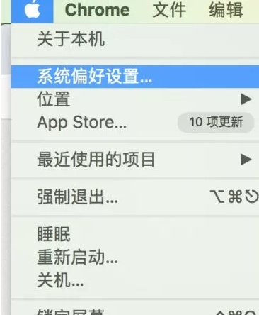

3.点击用户与群组，如下图：

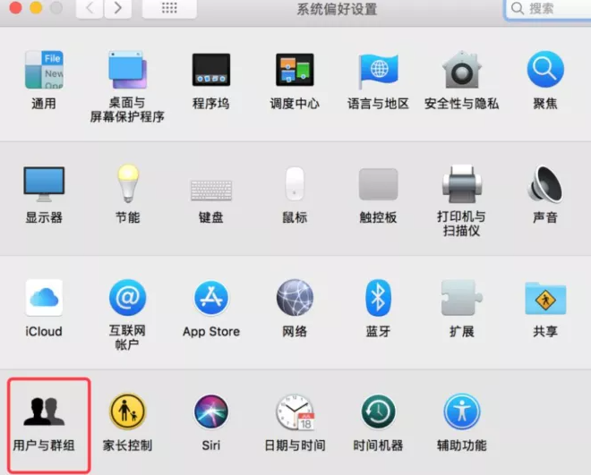

4.点击左下角锁头按钮，在弹出的窗口中输入本机密码，并确认以解锁，如下图：

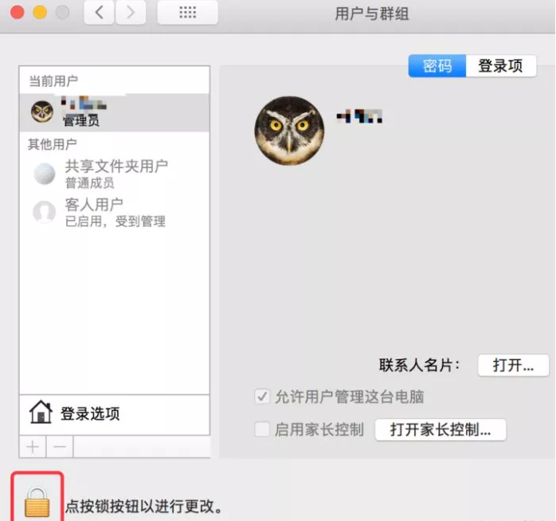

5.单击左下角的+，弹出创建用户窗口，输入用户名和密码后，单击创建用户，如下图：

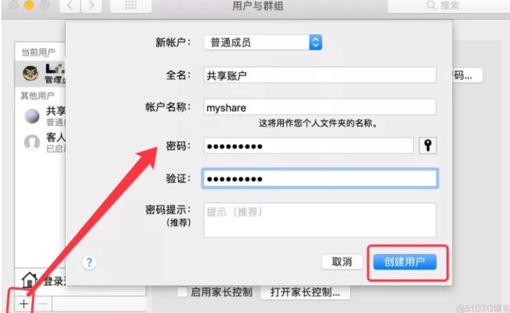

6.稍等一会就会看到新创建的用户了，如下图：

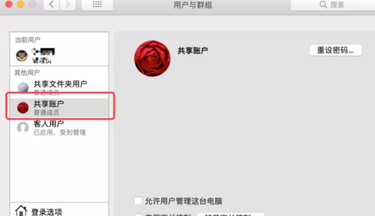

7.单击左上角的 < 按钮返回，单击共享，如下图：

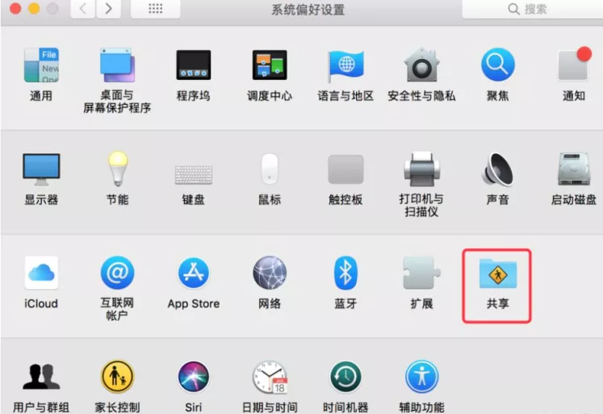

8.勾选左边的文件共享，如下图：

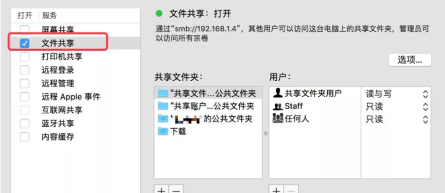

9.在共享文件夹下单击+，选择之前设置好的共享文件夹添加进来，如下图：

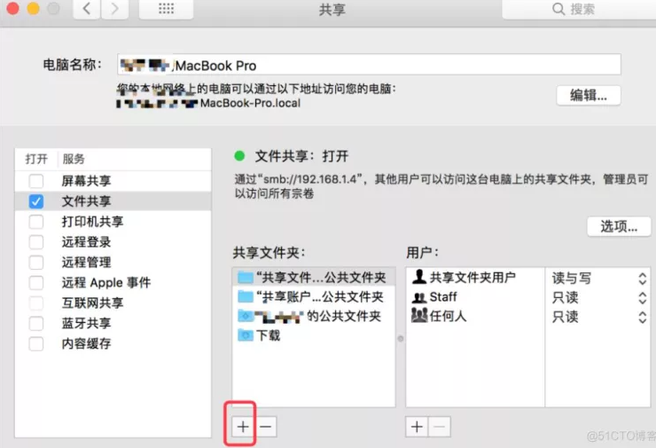

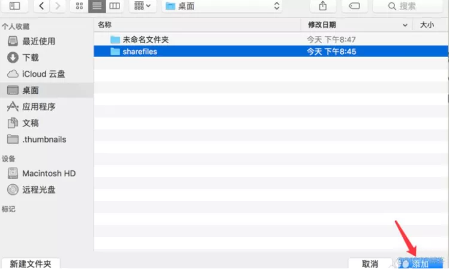

10.单击用户下的+，弹出添加用户窗口，选择步骤5-6创建的用户选择进来，如下图：

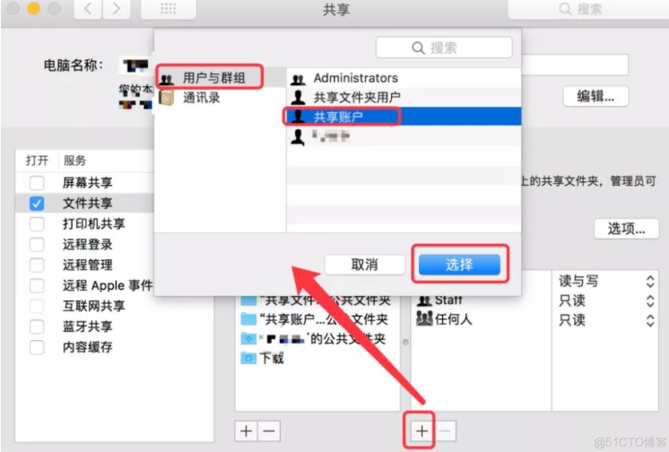

11.点击窗口右边的选项，勾选使用SMB来共享文件和文件夹，勾选要共享的账户，弹出输入共享账户密码窗口，输入密码后单击完成，则该共享账户拥有了权限。如下图：

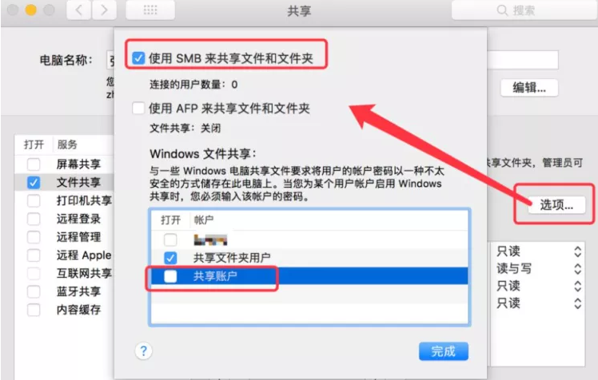

12.打开terminal，输入ifconfig，记录本机IP地址，如下图：

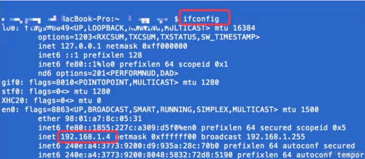

13.此时可以告知使用win的同事，在他们的电脑上按住Windows+R，输入共享目录IP地址：\192.168.X.X（替换为共享文件所在mac的IP地址即可）回车，输入共享账号及其密码，点击确定即可进入共享目录，如下图：

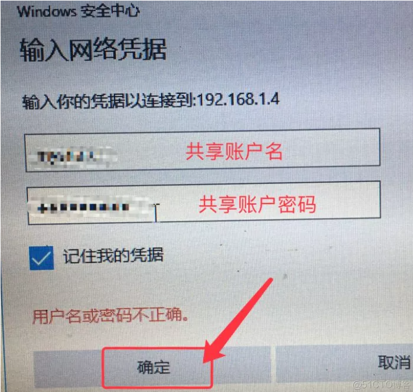

