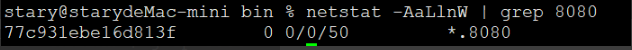
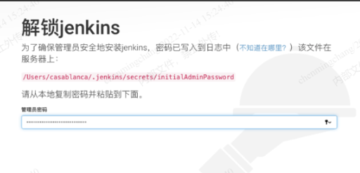
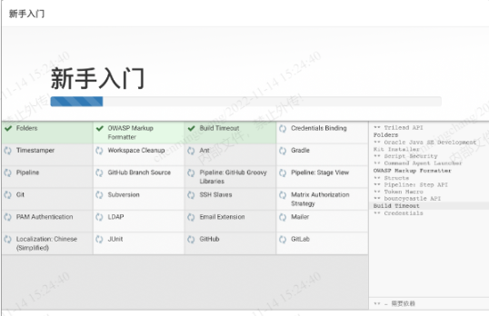
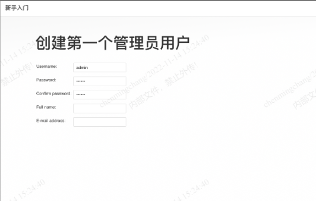
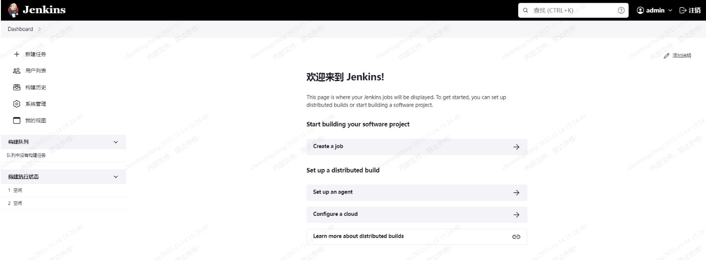
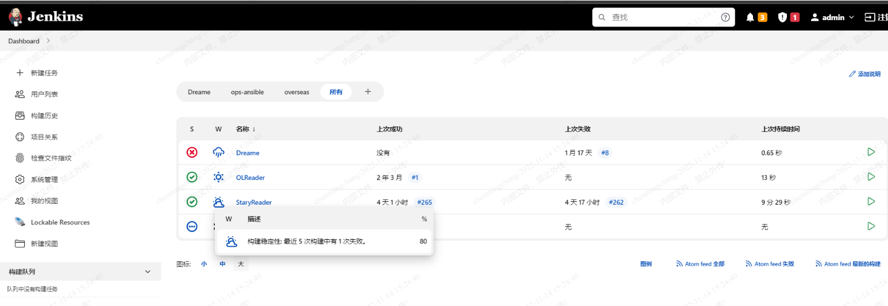

由于老的Jenkins服务器配置跟不上时代的发展了，需要把服务迁移至新Macmini机器上。

<!--more-->

通过brew安装，首先安装brew：

```
/bin/zsh -c "$(curl -fsSL https://gitee.com/cunkai/HomebrewCN/raw/master/Homebrew.sh)"
```

安装好brew后，用brew命令安装Jenkins：

```
brew install jenkins
```

安装完成后使用一下命令启动Jenkins：

```
/opt/homebrew/opt/jenkins/bin/jenkins --httpListenAddress=0.0.0.0 --httpPort=8080
```

可用以下命令查看端口是否在监听：

```
netstat -AaLlnW | grep 8080
```



或者：

```
sudo lsof -nP |grep LISTEN
```

打开浏览器，IP+8080访问：

找到页面提示的路径中的文件，输入文件中的密码信息：



勾选需要安装的插件，等待配置：



来到创建用户的界面，设置管理员用户名和密码：



按照提示继续，就能来到这个界面啦：



至此，Jenkins服务器部署好了，需要把旧服务器数据迁移过来，把Jenkins整个目录拷贝过来就行：

备份.jenkins目录：

```
mv .jenkins .jenkins.bak
```

拷贝目录：

```
scp -r ./.jenkins/ stary@172.22.13.45:/Users/stary/
```

重启Jenkins即可：


