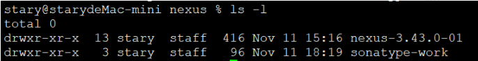
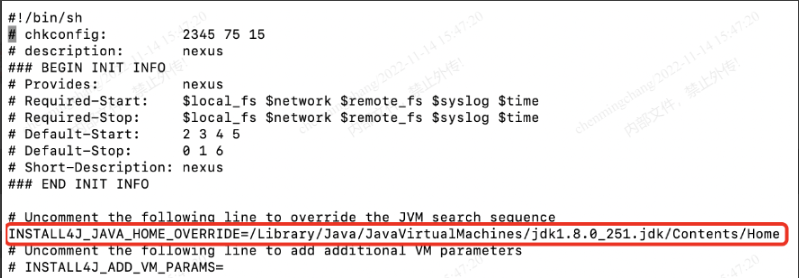
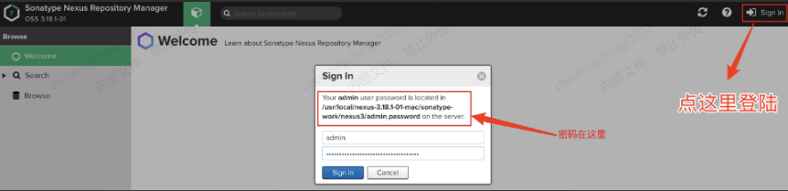
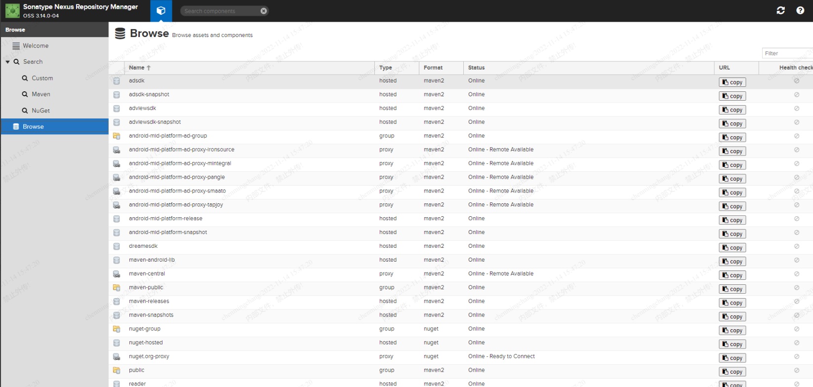

旧的nexus服务器机器配置不行，顺便和Jenkins一起迁移至新的macmini机器上。

<!--more-->

下载nexus并解压，官网地址：https://www.sonatype.com/download-oss-sonatype

解压后有两个目录：



`nexus` 基础命令：

命令行进入本地`nexus-3.43.0-01`的`bin`目录，然后使用以下命令：

```
$ ./nexus start 启动
$ ./nexus stop 停止
$ ./nexus restart 重启
```

启动 `nexus` 时报错：

```
No suitable Java Virtual Machine could be found on your system.
The version of the JVM must be 1.8.
Please define INSTALL4J_JAVA_HOME to point to a suitable JVM.
```

错误原因：当前 `nexus` 要求使用 `JVM` 1.8;但是当前系统 `jdk` 环境配置不是1.8版本；

解决方法：

- 下载 `jdk` 8并安装；
  官方下载地址：`https://www.oracle.com/java/technologies/javase/javase-jdk8-downloads.html`
- 安装后 `jdk` 目录为：

```
/Library/Java/JavaVirtualMachines/jdk1.8.0_251.jdk/Contents/Home
```

进入`nexus-3.24.0-02` 的 `bin` 目录下，修改其中的 `nexus` 文件:

```
$ vim nexus
```

取消`INSTALL4J_JAVA_HOME_OVERRIDE`的注释，并填入`jdk` 1.8的环境目录：



保存并退出，重新启动nexus即可：

```
./nexus start
```




至此，nexus服务已部署完成，需要把原来nexus服务器的仓库迁移过来：

把sonatype-work目录备份：

```
mv sonatype-work sonatype-work.bak
```

把原来服务器上的sonatype-work目录拷贝过来就行：

```
scp -r /data/src/sonatype-work/ stary@172.22.13.45:/Users/stary/nexus/
```

把nexus服务重启即可：


