MongoDB是一个基于分布式文件存储的数据库。由`C++`语言编写。旨在为WEB应用提供可扩展的高性能数据存储解决方案。

MongoDB是一个介于关系数据库和非关系数据库之间的产品，是非关系数据库当中功能最丰富，最像关系数据库的。

它支持的数据结构非常松散，是类似`json`的`bson`格式，因此可以存储比较复杂的数据类型。Mongo最大的特点是它支持的查询语言非常强大，其语法有点类似于面向对象的查询语言，几乎可以实现类似关系数据库单表查询的绝大部分功能，而且还支持对数据建立索引。

<!--more-->

#### MongoDB集群简介

> mongodb 集群搭建的方式有三种：

1. 主从备份（Master - Slave）模式，或者叫主从复制模式。
2. 副本集（Replica Set）模式
3. 分片（Sharding）模式

> 其中，第一种方式基本没什么意义，官方也不推荐这种方式搭建。另外两种分别就是副本集和分片的方式。

#### Mongo分片高可用集群搭建

##### 概述

 为解决mongodb在replica set每个从节点上面的数据库均是对数据库的全量拷贝，从节点压力在高并发大数据量的场景下存在很大挑战，同时考虑到后期mongodb集群的在数据压力巨大时的扩展性，应对海量数据引出了分片机制。

###### 什么是分片

 分片是将数据库进行拆分，将其分散在不同的机器上的过程，无需功能强大的服务器就可以存储更多的数据，处理更大的负载，在总数据中，将集合切成小块，将这些块分散到若干片中，每个片只负载总数据的一部分，通过一个知道数据与分片对应关系的组件mongos的路由进程进行操作。

###### 基础组件

> 其利用到了四个组件：mongos，config server，shard，replica set

###### mongos

 数据库集群请求的入口，所有请求需要经过mongos进行协调，无需在应用层面利用程序来进行路由选择，mongos其自身是一个请求分发中心，负责将外部的请求分发到对应的shard服务器上，mongos作为统一的请求入口，为防止mongos单节点故障，一般需要对其做HA（高可用，Highly Available缩写）。

###### config server

 配置服务器，存储所有数据库元数据（分片，路由）的配置。mongos本身没有物理存储分片服务器和数据路由信息，只是缓存在内存中来读取数据，mongos在第一次启动或后期重启时候，就会从config server中加载配置信息，如果配置服务器信息发生更新会通知所有的mongos来更新自己的状态，从而保证准确的请求路由，生产环境中通常也需要多个config server，防止配置文件存在单节点丢失问题。

###### shard

 在传统意义上来讲，如果存在海量数据，单台服务器存储1T压力非常大，考虑到数据库的硬盘，网络IO，还有CPU，内存的瓶颈，如果多台进行分摊1T的数据，到每台上就是可估量的较小数据，在mongodb集群只要设置好分片规则，通过mongos操作数据库，就可以自动把对应的操作请求转发到对应的后端分片服务器上。

###### replica set

 在总体mongodb集群架构中，对应的分片节点，如果单台机器下线，对应整个集群的数据就会出现部分缺失，这是不能发生的，因此对于shard节点需要replica set来保证数据的可靠性，生产环境通常为2个副本+1个仲裁。

##### 整体架构

> 整体架构涉及到15个节点，我们这里使用Docker容器进行部署
>
> 那么我们先来总结一下我们搭建一个高可用集群需要多少个Mongo

- mongos： 3台
- configserver ： 3台
- shard ： 3片； 每个分片由三个节点构成

###### 容器部署情况

| 角色           | 端口  | 暴漏端口 | 描述       | 角色     |
| -------------- | ----- | -------- | ---------- | -------- |
| config-server1 | 27017 | –        | 配置节点1  | –        |
| config-server2 | 27017 | –        | 配置节点2  | –        |
| config-server3 | 27017 | –        | 配置节点3  | –        |
| mongos-server1 | 27017 | 30001    | 路由节点1  | –        |
| mongos-server2 | 27017 | 30002    | 路由节点2  | –        |
| mongos-server3 | 27017 | 30003    | 路由节点3  | –        |
| shard1-server1 | 27017 | –        | 分片1节点1 | Primary  |
| shard1-server2 | 27017 | –        | 分片1节点2 | Secondry |
| shard1-server3 | 27017 | –        | 分片1节点3 | Arbiter  |
| shard2-server1 | 27017 | –        | 分片2节点1 | Primary  |
| shard2-server2 | 27017 | –        | 分片2节点2 | Secondry |
| shard2-server3 | 27017 | –        | 分片2节点3 | Arbiter  |
| shard3-server1 | 27017 | –        | 分片3节点1 | Primary  |
| shard3-server2 | 27017 | –        | 分片3节点2 | Secondry |
| shard3-server3 | 27017 | –        | 分片3节点3 | Arbiter  |

###### 整体架构预览

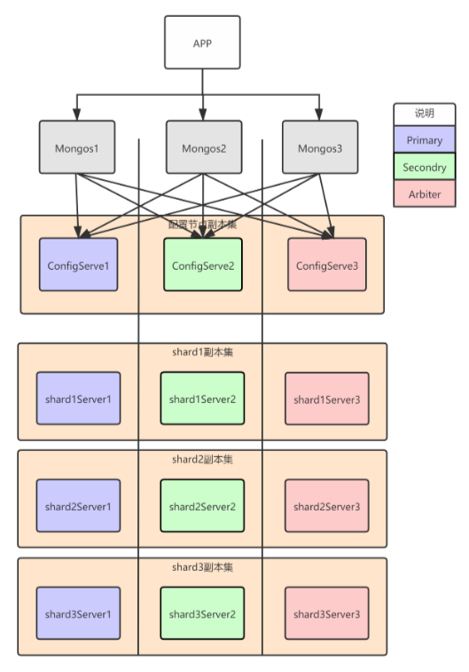

##### 基础环境准备

###### 安装Docker

> 本次使用Docker环境进行搭建，需要提前准备好Docker环境

###### 创建Docker网络

> 因为需要使用Docker搭建MongoDB集群，所以先创建Docker网络

```shell
docker network create mongo-cluster
docker network ls 
```

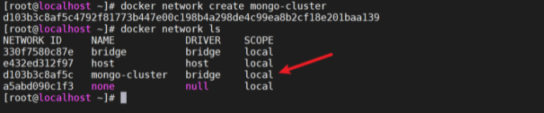

##### 搭建ConfigServer副本集

> 我们先来搭建ConfigServer的副本集，这里面涉及到三个节点，我们需要创建配置文件以及启动容器

###### 创建挂载目录

> 我们需要创建对应的挂载目录来存储配置文件以及日志文件

```shell
# 创建配置文件目录
mkdir -p /tmp/mongo-cluster/config-server/conf
# 创建数据文件目录
mkdir -p /tmp/mongo-cluster/config-server/data/{1..3}
# 创建日志文件目录
mkdir -p /tmp/mongo-cluster/config-server/logs/{1..3}
```

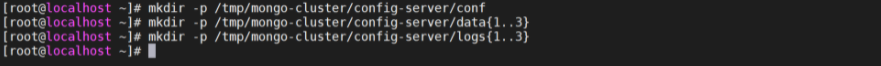

###### 创建密钥文件

> 因为我们知道搭建的话一定要高可用，而且一定要权限，这里mongo之间通信采用秘钥文件，所以我们先进行生成密钥文件

```shell
# 创建密钥文件
openssl rand -base64 756 > /tmp/mongo-cluster/config-server/conf/mongo.key
# 设置
chmod 600  /tmp/mongo-cluster/config-server/conf/mongo.key
```

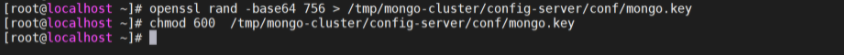

###### 创建配置文件

> 因为由多个容器，配置文件是一样的，我们只需要创建一个配置文件，其他的容器统一读取该配置文件即可

```shell
echo "
# 日志文件
storage:
  # mongod 进程存储数据目录，此配置仅对 mongod 进程有效
  dbPath: /data/db
systemLog:
  destination: file
  logAppend: true
  path: /data/logs/mongo.log

#  网络设置
net:
  port: 27017  #端口号
#  bindIp: 127.0.0.1    #绑定ip
replication:
  replSetName: configsvr #副本集名称
sharding:
  clusterRole: configsvr # 集群角色，这里配置的角色是配置节点
security:
  authorization: enabled #是否开启认证
  keyFile: /data/configdb/conf/mongo.key #keyFile路径
"  > /tmp/mongo-cluster/config-server/conf/mongo.conf
```

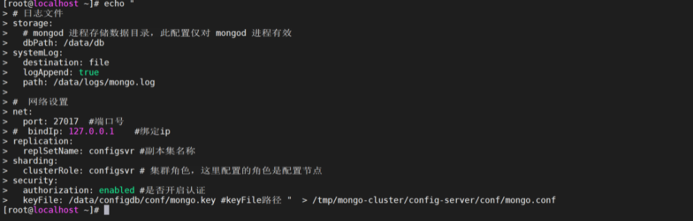

###### 启动容器

###### 启动config-server1

```shell
docker run --name config-server1 -d \
--net=mongo-cluster \
--privileged=true \
-v /tmp/mongo-cluster/config-server:/data/configdb \
-v /tmp/mongo-cluster/config-server/data/1:/data/db \
-v /tmp/mongo-cluster/config-server/logs/1:/data/logs \
mongo --config /data/configdb/conf/mongo.conf
```

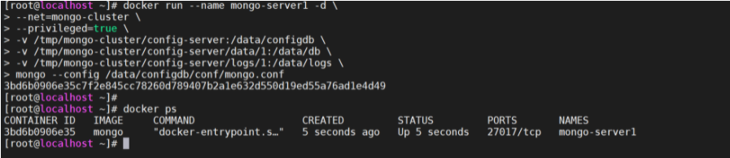

###### 启动config-server2

```shell
docker run --name config-server2 -d \
--net=mongo-cluster \
--privileged=true \
-v /tmp/mongo-cluster/config-server:/data/configdb \
-v /tmp/mongo-cluster/config-server/data/2:/data/db \
-v /tmp/mongo-cluster/config-server/logs/2:/data/logs \
mongo --config /data/configdb/conf/mongo.conf
```

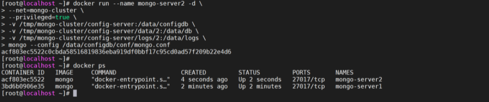

###### 启动config-server3

```shell
docker run --name config-server3 -d \
--net=mongo-cluster \
--privileged=true \
-v /tmp/mongo-cluster/config-server:/data/configdb \
-v /tmp/mongo-cluster/config-server/data/3:/data/db \
-v /tmp/mongo-cluster/config-server/logs/3:/data/logs \
mongo --config /data/configdb/conf/mongo.conf
```

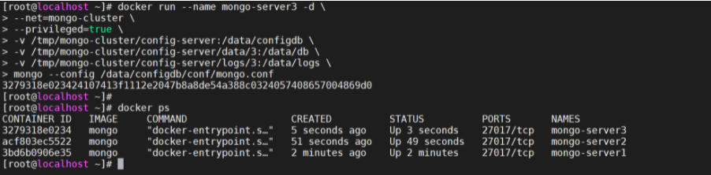

###### 初始化config-server

###### 登录容器

> 进入第一台容器

```shell
docker exec -it config-server1 bash
mongo -port 27017
```

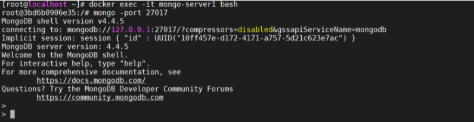

###### 执行命令

> 执行以下命令进行MongoDB容器的初始化

```shell
rs.initiate(
  {
    _id: "configsvr",
    members: [
      { _id : 1, host : "config-server1:27017" },
      { _id : 2, host : "config-server2:27017" },
      { _id : 3, host : "config-server3:27017" }
    ]
  }
)
```

> 如果出现`OK`表示MongoDB配置服务器已经初始化成功

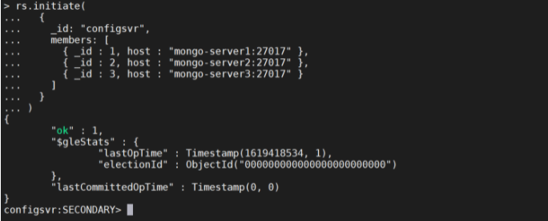

###### 创建用户

> 因为我们需要对用户进行权限管理，我们需要创建用户，这里为了演示，我们创建超级用户 权限是`root`

```shell
use admin
db.createUser({user:"root",pwd:"root",roles:[{role:'root',db:'admin'}]})
```

> 这样就在MongoDB的`admin`数据库添加了一个用户名为root 密码是root的用户

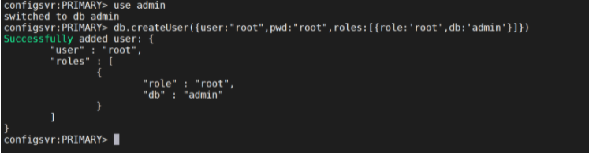

##### 搭建Shard分片组

> 由于mongos是客户端，所以我们先搭建好config以及shard之后再搭建mongos。

###### 创建挂载目录

> 我们先创建挂载目录

```shell
# 创建配置文件目录
mkdir -p /tmp/mongo-cluster/shard{1..3}-server/conf
# 创建数据文件目录
mkdir -p /tmp/mongo-cluster/shard{1..3}-server/data/{1..3}
# 创建日志文件目录
mkdir -p /tmp/mongo-cluster/shard{1..3}-server/logs/{1..3}
```

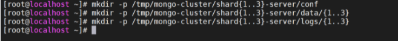

###### 搭建shard1分片组

> 在同一台服务器上初始化一组分片

###### 创建密钥文件

> 因为集群只需要一个密钥文件，我们可以将`config-server`中的密钥文件复制过来

```shell
cp /tmp/mongo-cluster/config-server/conf/mongo.key /tmp/mongo-cluster/shard1-server/conf/
```

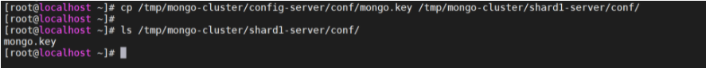

###### 配置配置文件

> 因为有多个容器，配置文件是一样的，我们只需要创建一个配置文件，其他的容器统一读取该配置文件即可

```shell
echo "
# 日志文件
storage:
  # mongod 进程存储数据目录，此配置仅对 mongod 进程有效
  dbPath: /data/db
systemLog:
  destination: file
  logAppend: true
  path: /data/logs/mongo.log

#  网络设置
net:
  port: 27017  #端口号
#  bindIp: 127.0.0.1    #绑定ip
replication:
  replSetName: shard1 #复制集名称是 shardsvr
sharding:
  clusterRole: shardsvr # 集群角色，这里配置的角色是分片节点
security:
  authorization: enabled #是否开启认证
  keyFile: /data/configdb/conf/mongo.key #keyFile路径
"  > /tmp/mongo-cluster/shard1-server/conf/mongo.conf
```

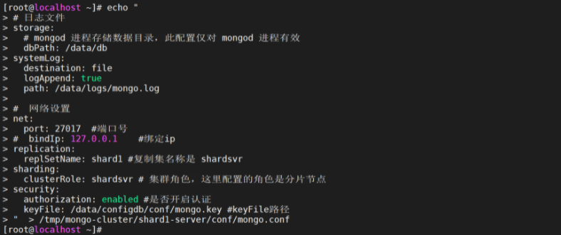

###### 启动shard1-server1

```shell
docker run --name shard1-server1 -d \
--net=mongo-cluster \
--privileged=true \
-v /tmp/mongo-cluster/shard1-server:/data/configdb \
-v /tmp/mongo-cluster/shard1-server/data/1:/data/db \
-v /tmp/mongo-cluster/shard1-server/logs/1:/data/logs \
mongo --config /data/configdb/conf/mongo.conf
```

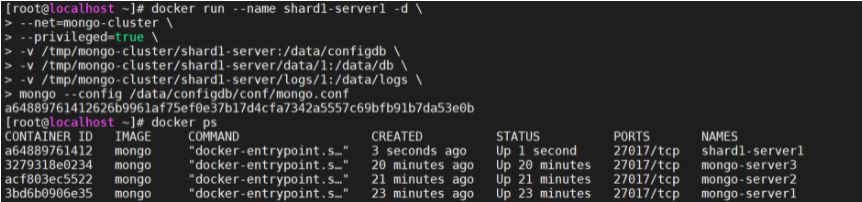

###### 启动shard1-server2

```shell
docker run --name shard1-server2 -d \
--net=mongo-cluster \
--privileged=true \
-v /tmp/mongo-cluster/shard1-server:/data/configdb \
-v /tmp/mongo-cluster/shard1-server/data/2:/data/db \
-v /tmp/mongo-cluster/shard1-server/logs/2:/data/logs \
mongo --config /data/configdb/conf/mongo.conf
```

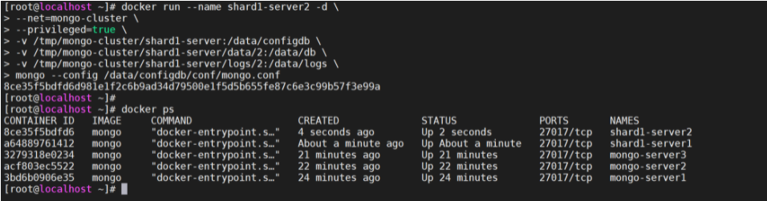

###### 启动shard1-server3

```shell
docker run --name shard1-server3 -d \
--net=mongo-cluster \
--privileged=true \
-v /tmp/mongo-cluster/shard1-server:/data/configdb \
-v /tmp/mongo-cluster/shard1-server/data/3:/data/db \
-v /tmp/mongo-cluster/shard1-server/logs/3:/data/logs \
mongo --config /data/configdb/conf/mongo.conf
```

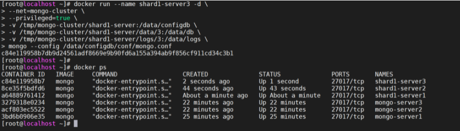

###### 初始化shard1分片组

> 并且制定第三个副本集为仲裁节点

```shell
 docker exec  -it shard1-server1 bin/bash
 mongo -port 27017
```

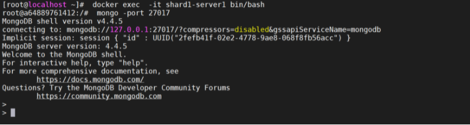

> 登录后进行初始化节点，这里面`arbiterOnly:true`是设置为仲裁节点

```json
#进行副本集配置
rs.initiate(
     {
         _id : "shard1",
         members: [
             { _id : 0, host : "shard1-server1:27017" },
             { _id : 1, host : "shard1-server2:27017" },
             { _id : 2, host : "shard1-server3:27017",arbiterOnly:true }
        ]
    }
);
```

> 显示OK即副本集创建成功

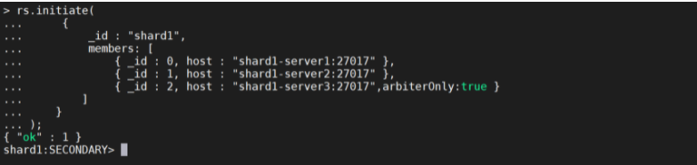

###### 创建用户

> 因为我们需要对用户进行权限管理，我们需要创建用户，这里为了演示，我们创建超级用户 权限是`root`

```shell
use admin
db.createUser({user:"root",pwd:"root",roles:[{role:'root',db:'admin'}]})
```

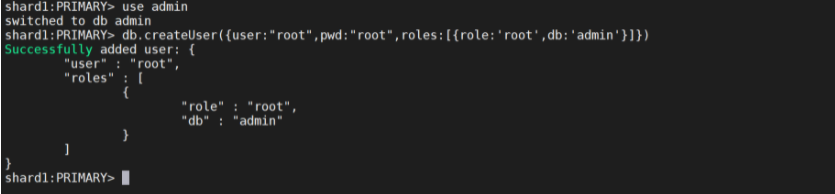

###### 查看节点信息

```shell
rs.isMaster()
```

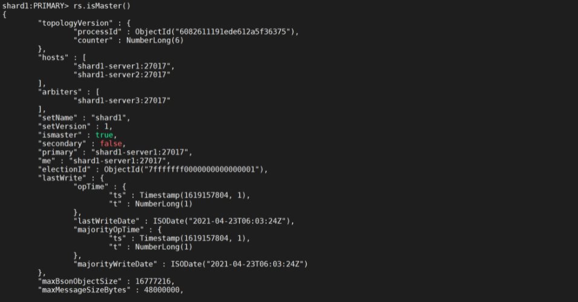

###### 搭建shard2分片组

###### 创建密钥文件

> 因为集群只需要一个密钥文件，我们可以将`config-server`中的密钥文件复制过来

```shell
cp /tmp/mongo-cluster/config-server/conf/mongo.key /tmp/mongo-cluster/shard2-server/conf/
```

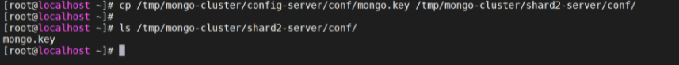

###### 配置配置文件

> 因为有多个容器，配置文件是一样的，我们只需要创建一个配置文件，其他的容器统一读取该配置文件即可

```shell
echo "
# 日志文件
storage:
  # mongod 进程存储数据目录，此配置仅对 mongod 进程有效
  dbPath: /data/db
systemLog:
  destination: file
  logAppend: true
  path: /data/logs/mongo.log

#  网络设置
net:
  port: 27017  #端口号
#  bindIp: 127.0.0.1    #绑定ip
replication:
  replSetName: shard2 #复制集名称是 shard2
sharding:
  clusterRole: shardsvr # 集群角色，这里配置的角色是分片节点
security:
  authorization: enabled #是否开启认证
  keyFile: /data/configdb/conf/mongo.key #keyFile路径
"  > /tmp/mongo-cluster/shard2-server/conf/mongo.conf
```

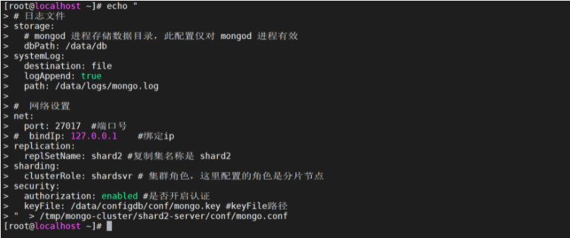

###### 启动shard2-server1

```shell
docker run --name shard2-server1 -d \
--net=mongo-cluster \
--privileged=true \
-v /tmp/mongo-cluster/shard2-server:/data/configdb \
-v /tmp/mongo-cluster/shard2-server/data/1:/data/db \
-v /tmp/mongo-cluster/shard2-server/logs/1:/data/logs \
mongo --config /data/configdb/conf/mongo.conf
```

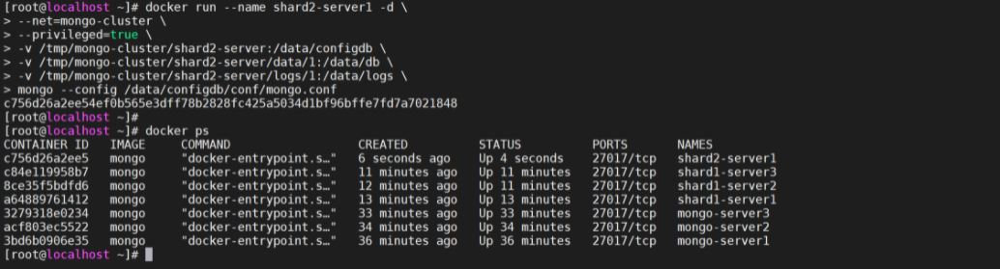

###### 启动shard2-server2

```shell
docker run --name shard2-server2 -d \
--net=mongo-cluster \
--privileged=true \
-v /tmp/mongo-cluster/shard2-server:/data/configdb \
-v /tmp/mongo-cluster/shard2-server/data/2:/data/db \
-v /tmp/mongo-cluster/shard2-server/logs/2:/data/logs \
mongo --config /data/configdb/conf/mongo.conf
```

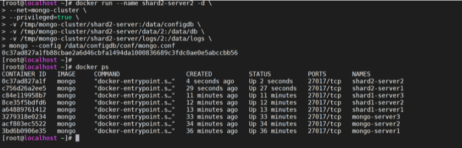

###### 启动shard2-server3

```shell
docker run --name shard2-server3 -d \
--net=mongo-cluster \
--privileged=true \
-v /tmp/mongo-cluster/shard2-server:/data/configdb \
-v /tmp/mongo-cluster/shard2-server/data/3:/data/db \
-v /tmp/mongo-cluster/shard2-server/logs/3:/data/logs \
mongo --config /data/configdb/conf/mongo.conf
```

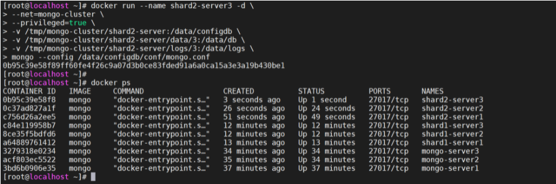

###### 初始化shard2分片组

> 登录节点后进行初始化分片2

```shell
 docker exec -it shard2-server1 bin/bash
 mongo -port 27017
```

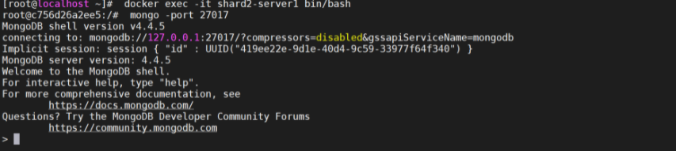

> 执行下面的命令进行初始化分片2，`arbiterOnly:true`参数是设置为仲裁节点

```shell
#进行副本集配置
rs.initiate(
     {
         _id : "shard2",
         members: [
             { _id : 0, host : "shard2-server1:27017" },
             { _id : 1, host : "shard2-server2:27017" },
             { _id : 2, host : "shard2-server3:27017",arbiterOnly:true }
        ]
    }
);
```

> 返回`ok`就表示

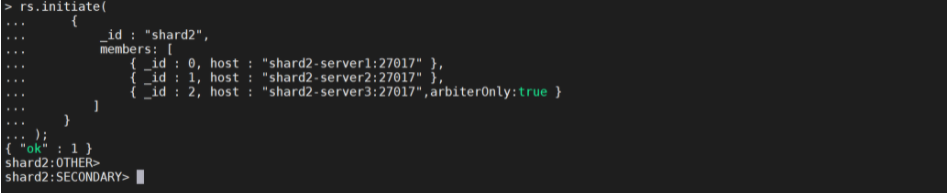

###### 创建用户

> 因为我们需要对用户进行权限管理，我们需要创建用户，这里为了演示，我们创建超级用户 权限是`root`

```shell
use admin
db.createUser({user:"root",pwd:"root",roles:[{role:'root',db:'admin'}]})
```

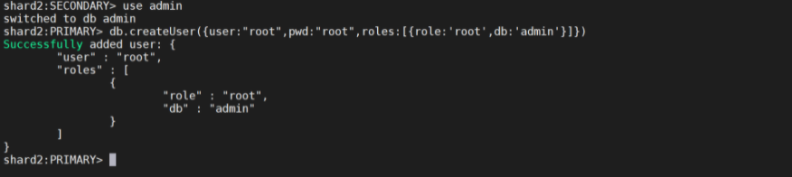

###### 搭建shard3分片组

###### 创建密钥文件

> 因为集群只需要一个密钥文件，我们可以将`config-server`中的密钥文件复制过来

```shell
cp /tmp/mongo-cluster/config-server/conf/mongo.key /tmp/mongo-cluster/shard3-server/conf/
```


###### 配置配置文件

> 因为有多个容器，配置文件是一样的，我们只需要创建一个配置文件，其他的容器统一读取该配置文件即可

```shell
echo "
# 日志文件
storage:
  # mongod 进程存储数据目录，此配置仅对 mongod 进程有效
  dbPath: /data/db
systemLog:
  destination: file
  logAppend: true
  path: /data/logs/mongo.log

#  网络设置
net:
  port: 27017  #端口号
#  bindIp: 127.0.0.1    #绑定ip
replication:
  replSetName: shard3 #复制集名称是 shard3
sharding:
  clusterRole: shardsvr # 集群角色，这里配置的角色是分片节点
security:
  authorization: enabled #是否开启认证
  keyFile: /data/configdb/conf/mongo.key #keyFile路径
"  > /tmp/mongo-cluster/shard3-server/conf/mongo.conf
```

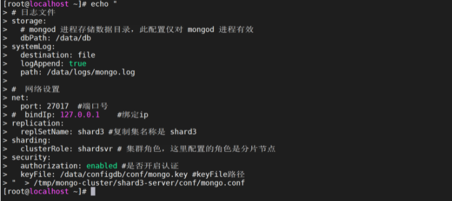

###### 启动shard3-server1

```shell
docker run --name shard3-server1 -d \
--net=mongo-cluster \
--privileged=true \
-v /tmp/mongo-cluster/shard3-server:/data/configdb \
-v /tmp/mongo-cluster/shard3-server/data/1:/data/db \
-v /tmp/mongo-cluster/shard3-server/logs/1:/data/logs \
mongo --config /data/configdb/conf/mongo.conf
```

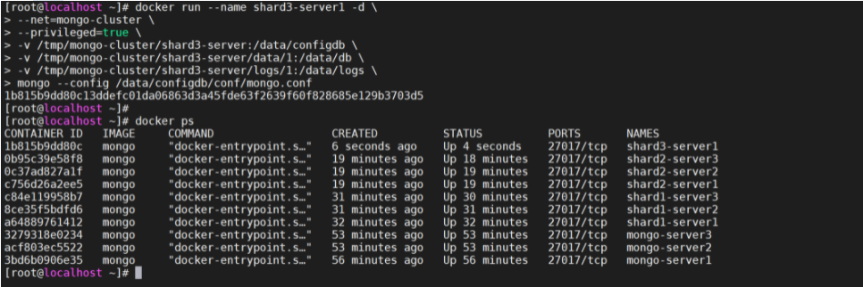

###### 启动shard3-server2

```shell
docker run --name shard3-server2 -d \
--net=mongo-cluster \
--privileged=true \
-v /tmp/mongo-cluster/shard3-server:/data/configdb \
-v /tmp/mongo-cluster/shard3-server/data/2:/data/db \
-v /tmp/mongo-cluster/shard3-server/logs/2:/data/logs \
mongo --config /data/configdb/conf/mongo.conf
```

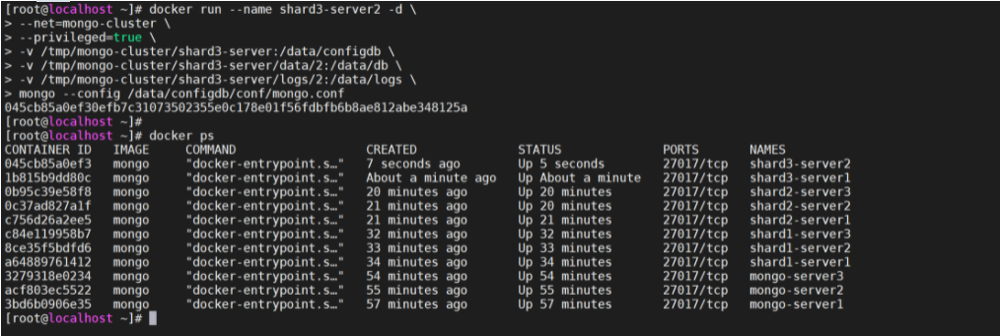

###### 启动shard3-server3

```shell
docker run --name shard3-server3 -d \
--net=mongo-cluster \
--privileged=true \
-v /tmp/mongo-cluster/shard3-server:/data/configdb \
-v /tmp/mongo-cluster/shard3-server/data/3:/data/db \
-v /tmp/mongo-cluster/shard3-server/logs/3:/data/logs \
mongo --config /data/configdb/conf/mongo.conf
```

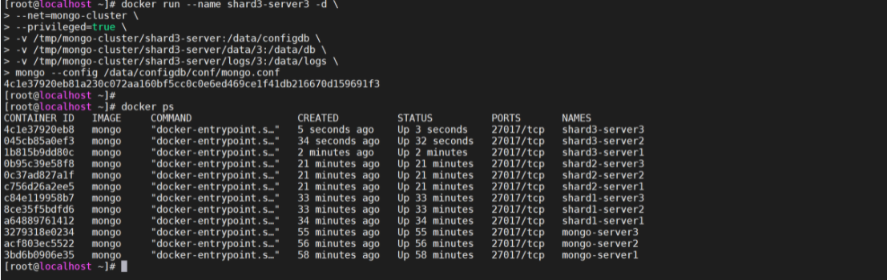

###### 初始化shard3分片组

> 登录节点后进行初始化分片2

```shell
 docker exec -it shard3-server1 bin/bash
 mongo -port 27017
```

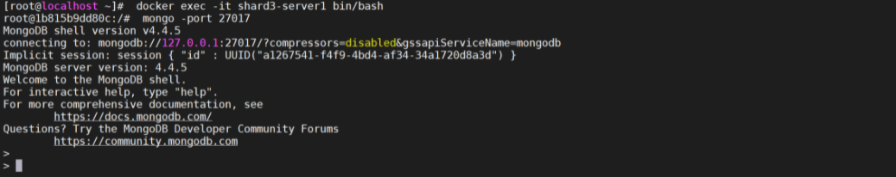

> 执行下面的命令进行初始化分片3，`arbiterOnly:true`参数是设置为仲裁节点

```shell
#进行副本集配置
rs.initiate(
     {
         _id : "shard3",
         members: [
             { _id : 0, host : "shard3-server1:27017" },
             { _id : 1, host : "shard3-server2:27017" },
             { _id : 2, host : "shard3-server3:27017",arbiterOnly:true }
        ]
    }
);
```

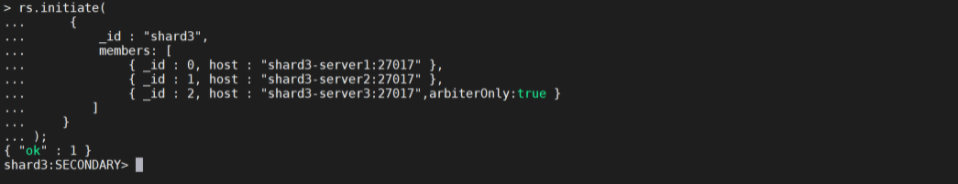

###### 创建用户

> 因为我们需要对用户进行权限管理，我们需要创建用户，这里为了演示，我们创建超级用户 权限是`root`

```shell
use admin
db.createUser({user:"root",pwd:"root",roles:[{role:'root',db:'admin'}]})
```

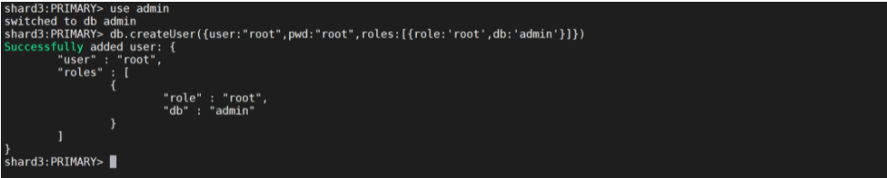

##### 搭建Mongos

> mongos负责查询与数据写入的路由，是实例访问的统一入口，是一个无状态的节点，每一个节点都可以从`config-server`节点获取到配置信息

###### 创建挂载目录

> 我们需要创建对应的挂载目录来存储配置文件以及日志文件

```shell
# 创建配置文件目录
mkdir -p /tmp/mongo-cluster/mongos-server/conf
# 创建数据文件目录
mkdir -p /tmp/mongo-cluster/mongos-server/data/{1..3}
# 创建日志文件目录
mkdir -p /tmp/mongo-cluster/mongos-server/logs/{1..3}
```

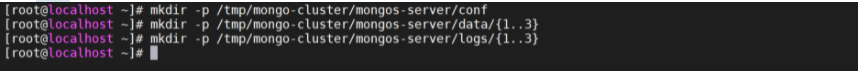

###### 创建密钥文件

> 因为集群只需要一个密钥文件，我们可以将`config-server`中的密钥文件复制过来

```shell
cp /tmp/mongo-cluster/config-server/conf/mongo.key /tmp/mongo-cluster/mongos-server/conf/
```


###### 创建配置文件

> 因为有多个容器，配置文件是一样的，我们只需要创建一个配置文件，其他的容器统一读取该配置文件即可,因为Mongos只负责路由，就不需要数据文件了，并且mongos服务是不负责认证的，需要将`authorization`配置项删除

```shell
echo "
# 日志文件
systemLog:
  destination: file
  logAppend: true
  path: /data/logs/mongo.log

#  网络设置
net:
  port: 27017  #端口号
#  bindIp: 127.0.0.1    #绑定ip
# 配置分片，这里面配置的是需要读取的配置节点的信息
sharding:
  configDB: configsvr/config-server1:27017,config-server2:27017,config-server3:27017
security:
  keyFile: /data/configdb/conf/mongo.key #keyFile路径
"  > /tmp/mongo-cluster/mongos-server/conf/mongo.conf
```

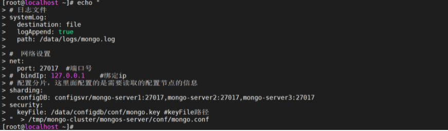

###### 启动mongos集群

###### 启动mongos1

```shell
docker run --name mongos-server1 -d \
-p 30001:27017 \
--net=mongo-cluster \
--privileged=true \
--entrypoint "mongos" \
-v /tmp/mongo-cluster/mongos-server:/data/configdb \
-v /tmp/mongo-cluster/mongos-server/logs/1:/data/logs \
mongo --config /data/configdb/conf/mongo.conf
```

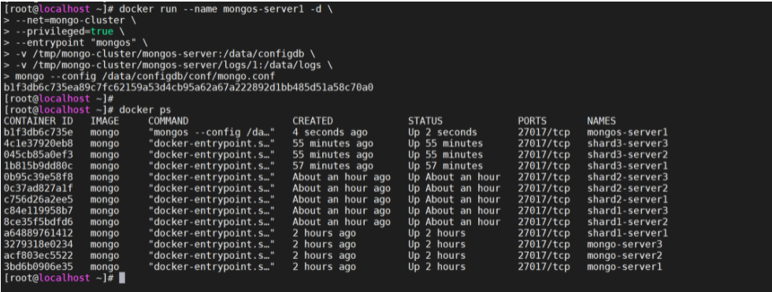

###### 启动mongos2

```shell
docker run --name mongos-server2 -d \
-p 30002:27017 \
--net=mongo-cluster \
--privileged=true \
--entrypoint "mongos" \
-v /tmp/mongo-cluster/mongos-server:/data/configdb \
-v /tmp/mongo-cluster/mongos-server/logs/2:/data/logs \
mongo --config /data/configdb/conf/mongo.conf
```

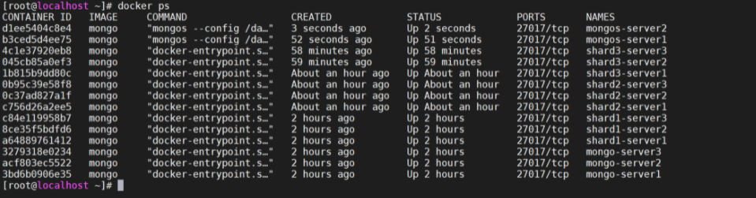

###### 启动mongos3

```shell
docker run --name mongos-server3 -d \
-p 30003:27017 \
--net=mongo-cluster \
--privileged=true \
--entrypoint "mongos" \
-v /tmp/mongo-cluster/mongos-server:/data/configdb \
-v /tmp/mongo-cluster/mongos-server/logs/3:/data/logs \
mongo --config /data/configdb/conf/mongo.conf
```

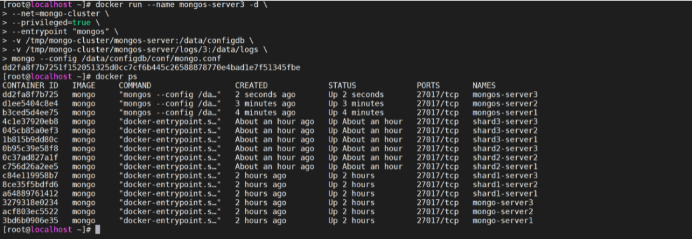

###### 配置mongos-server1

> 因为`mongos`是无中心的配置，所以每一台都需要进行分片配置

###### 进入容器

```shell
docker exec -it mongos-server1 /bin/bash
mongo -port 27017
```

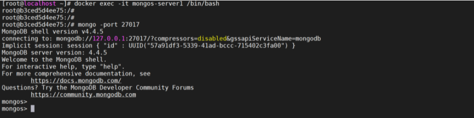

###### 登录Mongos

> 使用前面设置的root用户密码

```shell
use admin;
db.auth("root","root");
```

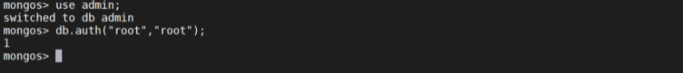

###### 配置分片

> 进行配置分片信息

```shell
sh.addShard("shard1/shard1-server1:27017,shard1-server2:27017,shard1-server3:27017")
sh.addShard("shard2/shard2-server1:27017,shard2-server2:27017,shard2-server3:27017")
sh.addShard("shard3/shard3-server1:27017,shard3-server2:27017,shard3-server3:27017")
```

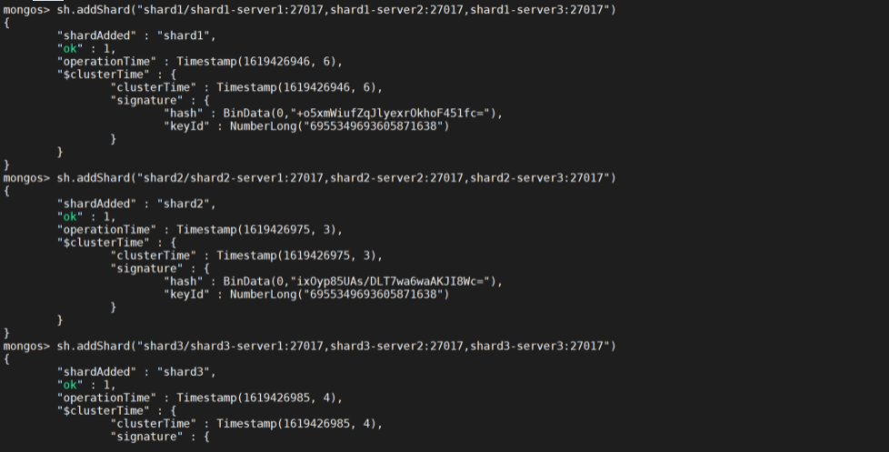

###### 配置mongos-server2

> 因为`mongos`是无中心的配置，所以每一台都需要进行分片配置

###### 进入容器

```shell
docker exec -it mongos-server2 /bin/bash
mongo -port 27017
```

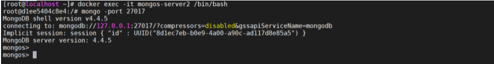

###### 登录Mongos

> 使用前面设置的root用户密码

```shell
use admin;
db.auth("root","root");
```

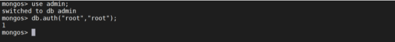

###### 配置分片

> 进行配置分片信息

```shell
sh.addShard("shard1/shard1-server1:27017,shard1-server2:27017,shard1-server3:27017")
sh.addShard("shard2/shard2-server1:27017,shard2-server2:27017,shard2-server3:27017")
sh.addShard("shard3/shard3-server1:27017,shard3-server2:27017,shard3-server3:27017")
```

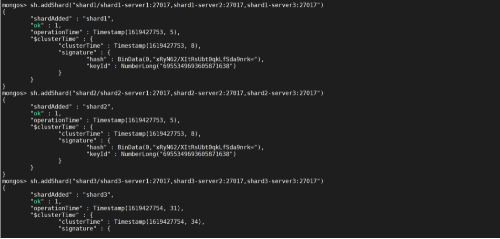

###### 配置mongos-server3

> 因为`mongos`是无中心的配置，所以每一台都需要进行分片配置

###### 进入容器

```shell
docker exec -it mongos-server3 /bin/bash
mongo -port 27017
```

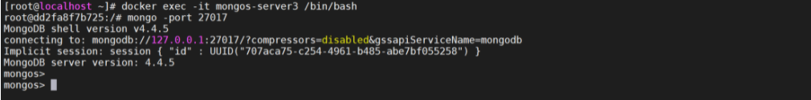

###### 登录Mongos

> 使用前面设置的root用户密码

```shell
use admin;
db.auth("root","root");
```

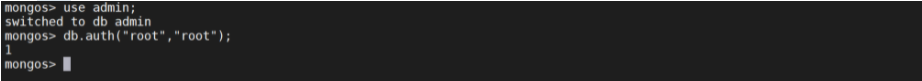

###### 配置分片

> 进行配置分片信息

```shell
sh.addShard("shard1/shard1-server1:27017,shard1-server2:27017,shard1-server3:27017")
sh.addShard("shard2/shard2-server1:27017,shard2-server2:27017,shard2-server3:27017")
sh.addShard("shard3/shard3-server1:27017,shard3-server2:27017,shard3-server3:27017")
```

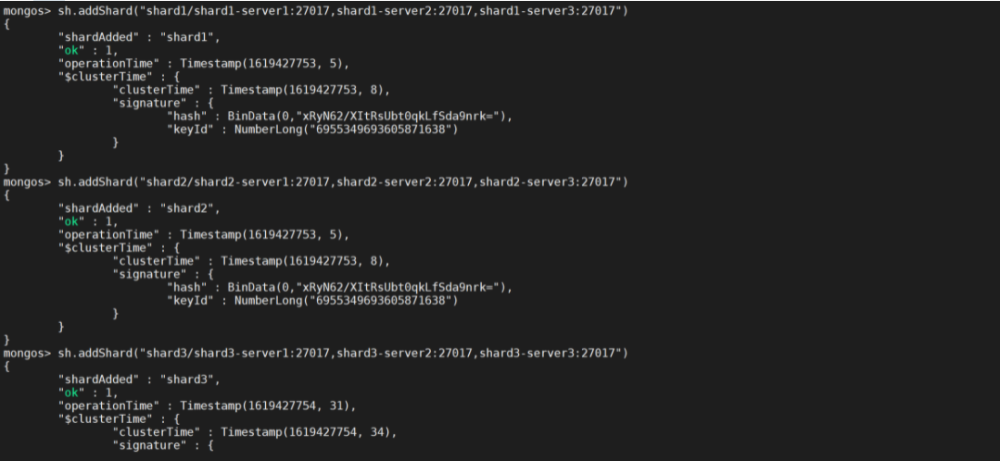

#### Docker-compose方式搭建

##### 环境准备

###### 初始化目录脚本

```shell
# 创建config-server 目录
# 创建配置文件目录
mkdir -p /tmp/mongo-cluster/config-server/conf
# 创建数据文件目录
mkdir -p /tmp/mongo-cluster/config-server/data/{1..3}
# 创建日志文件目录
mkdir -p /tmp/mongo-cluster/config-server/logs/{1..3}

# 创建shard-server 目录
# 创建配置文件目录
mkdir -p /tmp/mongo-cluster/shard{1..3}-server/conf
# 创建数据文件目录
mkdir -p /tmp/mongo-cluster/shard{1..3}-server/data/{1..3}
# 创建日志文件目录
mkdir -p /tmp/mongo-cluster/shard{1..3}-server/logs/{1..3}

# 创建mongos-server 目录
# 创建配置文件目录
mkdir -p /tmp/mongo-cluster/mongos-server/conf
# 创建数据文件目录
mkdir -p /tmp/mongo-cluster/mongos-server/data/{1..3}
# 创建日志文件目录
mkdir -p /tmp/mongo-cluster/mongos-server/logs/{1..3}
```


###### 生成密钥文件

```shell
# 创建密钥文件
openssl rand -base64 756 > /tmp/mongo-cluster/config-server/conf/mongo.key
# 设置
chmod 600  /tmp/mongo-cluster/config-server/conf/mongo.key

cp /tmp/mongo-cluster/config-server/conf/mongo.key /tmp/mongo-cluster/shard1-server/conf/

cp /tmp/mongo-cluster/config-server/conf/mongo.key /tmp/mongo-cluster/shard2-server/conf/

cp /tmp/mongo-cluster/config-server/conf/mongo.key /tmp/mongo-cluster/shard3-server/conf/

cp /tmp/mongo-cluster/config-server/conf/mongo.key /tmp/mongo-cluster/mongos-server/conf/
```

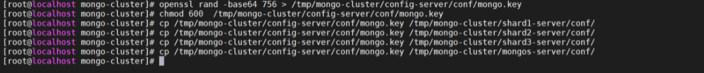

###### 创建配置文件

```shell
echo "
# 日志文件
storage:
  # mongod 进程存储数据目录，此配置仅对 mongod 进程有效
  dbPath: /data/db
systemLog:
  destination: file
  logAppend: true
  path: /data/logs/mongo.log

#  网络设置
net:
  port: 27017  #端口号
#  bindIp: 127.0.0.1    #绑定ip
replication:
  replSetName: configsvr #副本集名称
sharding:
  clusterRole: configsvr # 集群角色，这里配置的角色是配置节点
security:
  authorization: enabled #是否开启认证
  keyFile: /data/configdb/conf/mongo.key #keyFile路径
"  > /tmp/mongo-cluster/config-server/conf/mongo.conf


echo "
# 日志文件
storage:
  # mongod 进程存储数据目录，此配置仅对 mongod 进程有效
  dbPath: /data/db
systemLog:
  destination: file
  logAppend: true
  path: /data/logs/mongo.log

#  网络设置
net:
  port: 27017  #端口号
#  bindIp: 127.0.0.1    #绑定ip
replication:
  replSetName: shard1 #复制集名称是 shardsvr
sharding:
  clusterRole: shardsvr # 集群角色，这里配置的角色是分片节点
security:
  authorization: enabled #是否开启认证
  keyFile: /data/configdb/conf/mongo.key #keyFile路径
"  > /tmp/mongo-cluster/shard1-server/conf/mongo.conf


echo "
# 日志文件
storage:
  # mongod 进程存储数据目录，此配置仅对 mongod 进程有效
  dbPath: /data/db
systemLog:
  destination: file
  logAppend: true
  path: /data/logs/mongo.log

#  网络设置
net:
  port: 27017  #端口号
#  bindIp: 127.0.0.1    #绑定ip
replication:
  replSetName: shard2 #复制集名称是 shard2
sharding:
  clusterRole: shardsvr # 集群角色，这里配置的角色是分片节点
security:
  authorization: enabled #是否开启认证
  keyFile: /data/configdb/conf/mongo.key #keyFile路径
"  > /tmp/mongo-cluster/shard2-server/conf/mongo.conf


echo "
# 日志文件
storage:
  # mongod 进程存储数据目录，此配置仅对 mongod 进程有效
  dbPath: /data/db
systemLog:
  destination: file
  logAppend: true
  path: /data/logs/mongo.log

#  网络设置
net:
  port: 27017  #端口号
#  bindIp: 127.0.0.1    #绑定ip
replication:
  replSetName: shard3 #复制集名称是 shard3
sharding:
  clusterRole: shardsvr # 集群角色，这里配置的角色是分片节点
security:
  authorization: enabled #是否开启认证
  keyFile: /data/configdb/conf/mongo.key #keyFile路径
"  > /tmp/mongo-cluster/shard3-server/conf/mongo.conf


echo "
# 日志文件
systemLog:
  destination: file
  logAppend: true
  path: /data/logs/mongo.log

#  网络设置
net:
  port: 27017  #端口号
  bindIp: 0.0.0.0    #绑定ip
# 配置分片，这里面配置的是需要读取的配置节点的信息
sharding:
  configDB: configsvr/config-server1:27017,config-server2:27017,config-server3:27017
security:
  keyFile: /data/configdb/conf/mongo.key #keyFile路径
"  > /tmp/mongo-cluster/mongos-server/conf/mongo.conf
```

##### 启动服务

###### docker-compos配置文件

> 使用docker-compos方式启动Docker容器

```yaml
version: '2'
services:
  config-server1:
    image: mongo
    container_name: config-server1
    privileged: true
    networks:
      - mongo-cluster-network
    command: --config /data/configdb/conf/mongo.conf
    volumes:
      - /etc/localtime:/etc/localtime
      - /tmp/mongo-cluster/config-server:/data/configdb
      - /tmp/mongo-cluster/config-server/data/1:/data/db
      - /tmp/mongo-cluster/config-server/logs/1:/data/logs

  config-server2:
    image: mongo
    container_name: config-server2
    privileged: true
    networks:
      - mongo-cluster-network
    command: --config /data/configdb/conf/mongo.conf
    volumes:
      - /etc/localtime:/etc/localtime
      - /tmp/mongo-cluster/config-server:/data/configdb
      - /tmp/mongo-cluster/config-server/data/2:/data/db
      - /tmp/mongo-cluster/config-server/logs/2:/data/logs

  config-server3:
    image: mongo
    container_name: config-server3
    privileged: true
    networks:
      - mongo-cluster-network
    command: --config /data/configdb/conf/mongo.conf
    volumes:
      - /etc/localtime:/etc/localtime
      - /tmp/mongo-cluster/config-server:/data/configdb
      - /tmp/mongo-cluster/config-server/data/3:/data/db
      - /tmp/mongo-cluster/config-server/logs/3:/data/logs

  shard1-server1:
    image: mongo
    container_name: shard1-server1
    privileged: true
    networks:
      - mongo-cluster-network
    command: --config /data/configdb/conf/mongo.conf
    volumes:
      - /etc/localtime:/etc/localtime
      - /tmp/mongo-cluster/shard1-server:/data/configdb
      - /tmp/mongo-cluster/shard1-server/data/1:/data/db
      - /tmp/mongo-cluster/shard1-server/logs/1:/data/logs

  shard1-server2:
    image: mongo
    container_name: shard1-server2
    privileged: true
    networks:
      - mongo-cluster-network
    command: --config /data/configdb/conf/mongo.conf
    volumes:
      - /etc/localtime:/etc/localtime
      - /tmp/mongo-cluster/shard1-server:/data/configdb
      - /tmp/mongo-cluster/shard1-server/data/2:/data/db
      - /tmp/mongo-cluster/shard1-server/logs/2:/data/logs

  shard1-server3:
    image: mongo
    container_name: shard1-server3
    privileged: true
    networks:
      - mongo-cluster-network
    command: --config /data/configdb/conf/mongo.conf
    volumes:
      - /etc/localtime:/etc/localtime
      - /tmp/mongo-cluster/shard1-server:/data/configdb
      - /tmp/mongo-cluster/shard1-server/data/3:/data/db
      - /tmp/mongo-cluster/shard1-server/logs/3:/data/logs

  shard2-server1:
    image: mongo
    container_name: shard2-server1
    privileged: true
    networks:
      - mongo-cluster-network
    command: --config /data/configdb/conf/mongo.conf
    volumes:
      - /etc/localtime:/etc/localtime
      - /tmp/mongo-cluster/shard2-server:/data/configdb
      - /tmp/mongo-cluster/shard2-server/data/1:/data/db
      - /tmp/mongo-cluster/shard2-server/logs/1:/data/logs

  shard2-server2:
    image: mongo
    container_name: shard2-server2
    privileged: true
    networks:
      - mongo-cluster-network
    command: --config /data/configdb/conf/mongo.conf
    volumes:
      - /etc/localtime:/etc/localtime
      - /tmp/mongo-cluster/shard2-server:/data/configdb
      - /tmp/mongo-cluster/shard2-server/data/2:/data/db
      - /tmp/mongo-cluster/shard2-server/logs/2:/data/logs

  shard2-server3:
    image: mongo
    container_name: shard2-server3
    privileged: true
    networks:
      - mongo-cluster-network
    command: --config /data/configdb/conf/mongo.conf
    volumes:
      - /etc/localtime:/etc/localtime
      - /tmp/mongo-cluster/shard2-server:/data/configdb
      - /tmp/mongo-cluster/shard2-server/data/3:/data/db
      - /tmp/mongo-cluster/shard2-server/logs/3:/data/logs

  shard3-server1:
    image: mongo
    container_name: shard3-server1
    privileged: true
    networks:
      - mongo-cluster-network
    command: --config /data/configdb/conf/mongo.conf
    volumes:
      - /etc/localtime:/etc/localtime
      - /tmp/mongo-cluster/shard3-server:/data/configdb
      - /tmp/mongo-cluster/shard3-server/data/1:/data/db
      - /tmp/mongo-cluster/shard3-server/logs/1:/data/logs

  shard3-server2:
    image: mongo
    container_name: shard3-server2
    privileged: true
    networks:
      - mongo-cluster-network
    command: --config /data/configdb/conf/mongo.conf
    volumes:
      - /etc/localtime:/etc/localtime
      - /tmp/mongo-cluster/shard3-server:/data/configdb
      - /tmp/mongo-cluster/shard3-server/data/2:/data/db
      - /tmp/mongo-cluster/shard3-server/logs/2:/data/logs

  shard3-server3:
    image: mongo
    container_name: shard3-server3
    privileged: true
    networks:
      - mongo-cluster-network
    command: --config /data/configdb/conf/mongo.conf
    volumes:
      - /etc/localtime:/etc/localtime
      - /tmp/mongo-cluster/shard3-server:/data/configdb
      - /tmp/mongo-cluster/shard3-server/data/3:/data/db
      - /tmp/mongo-cluster/shard3-server/logs/3:/data/logs

  mongos-server1:
    image: mongo
    container_name: mongos-server1
    privileged: true
    entrypoint: "mongos"
    networks:
      - mongo-cluster-network
    command: --config /data/configdb/conf/mongo.conf
    ports:
      - "30001:27017"
    volumes:
      - /etc/localtime:/etc/localtime
      - /tmp/mongo-cluster/mongos-server:/data/configdb
      - /tmp/mongo-cluster/mongos-server/logs/1:/data/logs
    command: --config /data/configdb/conf/mongo.conf

  mongos-server2:
    image: mongo
    container_name: mongos-server2
    privileged: true
    entrypoint: "mongos"
    networks:
      - mongo-cluster-network
    ports:
      - "30002:27017"
    volumes:
      - /etc/localtime:/etc/localtime
      - /tmp/mongo-cluster/mongos-server:/data/configdb
      - /tmp/mongo-cluster/mongos-server/logs/2:/data/logs
    command: --config /data/configdb/conf/mongo.conf

  mongos-server3:
    image: mongo
    container_name: mongos-server3
    privileged: true
    entrypoint: "mongos"
    networks:
      - mongo-cluster-network
    ports:
      - "30003:27017"
    volumes:
      - /etc/localtime:/etc/localtime
      - /tmp/mongo-cluster/mongos-server:/data/configdb
      - /tmp/mongo-cluster/mongos-server/logs/3:/data/logs
    command: --config /data/configdb/conf/mongo.conf

networks:
  mongo-cluster-network:
    driver: bridge
```

###### 启动服务

```shell
docker-compose up -d
```

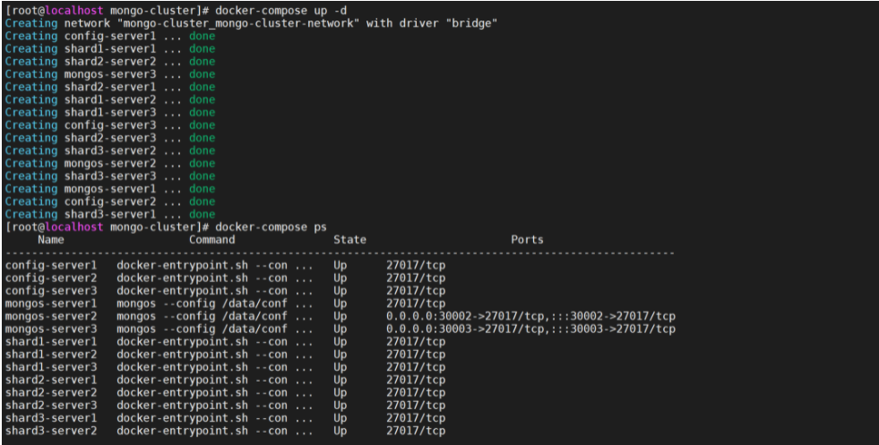

###### 初始化文件

> 执行下面脚本进行容器初始化

```shell
docker exec -it config-server1 bash
mongo -port 27017
rs.initiate(
  {
    _id: "configsvr",
    members: [
      { _id : 1, host : "config-server1:27017" },
      { _id : 2, host : "config-server2:27017" },
      { _id : 3, host : "config-server3:27017" }
    ]
  }
)
use admin
db.createUser({user:"root",pwd:"root",roles:[{role:'root',db:'admin'}]})
db.auth("root","root")
db.createUser({user:"test",pwd:"test",roles:[{role:'readWrite',db:'test'}]})

docker exec  -it shard1-server1 bin/bash
mongo -port 27017
#进行副本集配置
rs.initiate(
     {
         _id : "shard1",
         members: [
             { _id : 0, host : "shard1-server1:27017" },
             { _id : 1, host : "shard1-server2:27017" },
             { _id : 2, host : "shard1-server3:27017",arbiterOnly:true }
        ]
    }
);
use admin
db.createUser({user:"root",pwd:"root",roles:[{role:'root',db:'admin'}]})
db.auth("root","root")
db.createUser({user:"test",pwd:"test",roles:[{role:'readWrite',db:'test'}]})

docker exec  -it shard2-server1 bin/bash
mongo -port 27017
#进行副本集配置
rs.initiate(
     {
         _id : "shard2",
         members: [
             { _id : 0, host : "shard2-server1:27017" },
             { _id : 1, host : "shard2-server2:27017" },
             { _id : 2, host : "shard2-server3:27017",arbiterOnly:true }
        ]
    }
);
use admin
db.createUser({user:"root",pwd:"root",roles:[{role:'root',db:'admin'}]})
db.auth("root","root")
db.createUser({user:"test",pwd:"test",roles:[{role:'readWrite',db:'test'}]})


docker exec  -it shard3-server1 bin/bash
mongo -port 27017
#进行副本集配置
rs.initiate(
     {
         _id : "shard3",
         members: [
             { _id : 0, host : "shard3-server1:27017" },
             { _id : 1, host : "shard3-server2:27017" },
             { _id : 2, host : "shard3-server3:27017",arbiterOnly:true }
        ]
    }
);
use admin
db.createUser({user:"root",pwd:"root",roles:[{role:'root',db:'admin'}]})
db.auth("root","root")
db.createUser({user:"test",pwd:"test",roles:[{role:'readWrite',db:'test'}]})
```

###### 初始化分片

```shell
docker exec -it mongos-server1 /bin/bash
mongo -port 27017
use admin;
db.auth("root","root");
sh.addShard("shard1/shard1-server1:27017,shard1-server2:27017,shard1-server3:27017")
sh.addShard("shard2/shard2-server1:27017,shard2-server2:27017,shard2-server3:27017")
sh.addShard("shard3/shard3-server1:27017,shard3-server2:27017,shard3-server3:27017")

docker exec -it mongos-server2 /bin/bash
mongo -port 27017
use admin;
db.auth("root","root");
sh.addShard("shard1/shard1-server1:27017,shard1-server2:27017,shard1-server3:27017")
sh.addShard("shard2/shard2-server1:27017,shard2-server2:27017,shard2-server3:27017")
sh.addShard("shard3/shard3-server1:27017,shard3-server2:27017,shard3-server3:27017")


docker exec -it mongos-server3 /bin/bash
mongo -port 27017
use admin;
db.auth("root","root");
sh.addShard("shard1/shard1-server1:27017,shard1-server2:27017,shard1-server3:27017")
sh.addShard("shard2/shard2-server1:27017,shard2-server2:27017,shard2-server3:27017")
sh.addShard("shard3/shard3-server1:27017,shard3-server2:27017,shard3-server3:27017")
```
