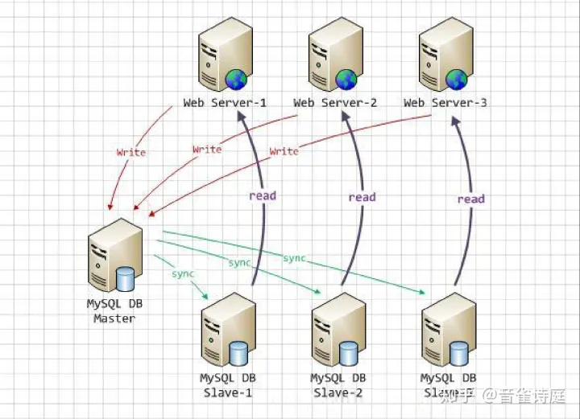
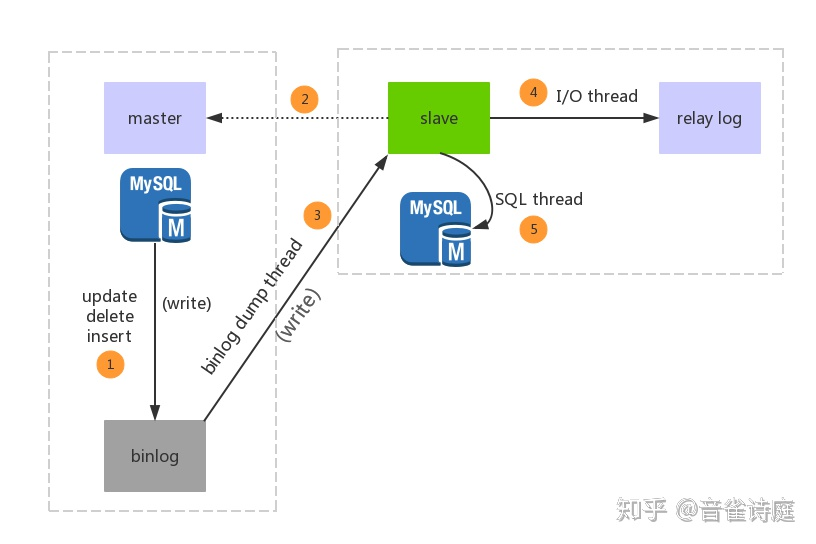
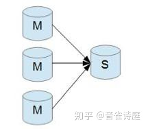
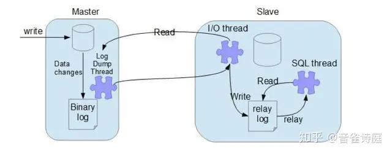
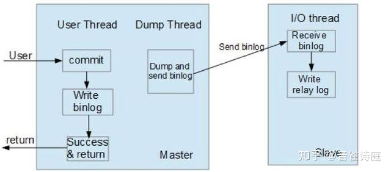
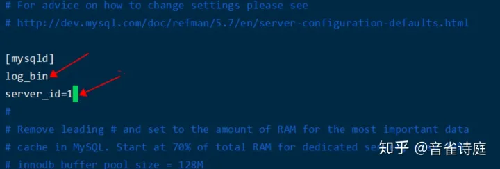
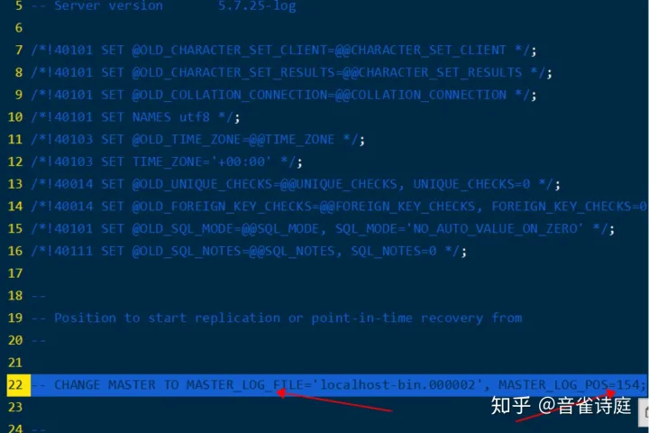
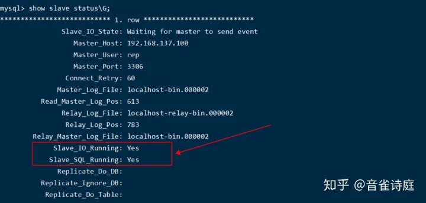
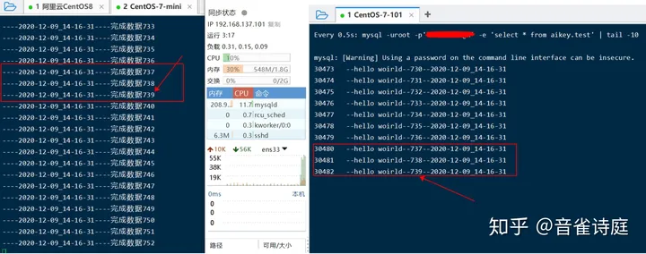

MySQL数据库自身提供的主从复制功能可以方便的实现数据的多处自动备份，实现数据库的拓展。多个数据备份不仅可以加强数据的安全性，通过实现读写分离还能进一步提升数据库的负载性能。

<!--more-->

下图就描述了一个多个数据库间主从复制与读写分离的模型。web服务器(tomcat,apache,iis,weblogic等)从多个slave数据库进行读操作，从master数据库进行写操作，如图：





## 第一部分【原理解析】

在一主多从的数据库体系中，多个从服务器采用异步的方式更新主数据库的变化，业务服务器在执行写或者相关修改数据库的操作是在主服务器上进行的，读操作则是在各从服务器上进行。

### MySQL主从复制原理

### 为什么要做主从复制

1. 在业务复杂的系统中，有这么一个情景，有一句sql语句需要锁表，导致暂时不能使用读的服务，那么就很影响运行中的业务，使用主从复制，让主库负责写，从库负责读，这样，即使主库出现了锁表的情景，通过读从库也可以保证业务的正常运行。
2. 做数据的热备，主库宕机后能够及时替换主库，保证业务可用性。
3. 架构的扩展。业务量越来越大，I/O访问频率过高，单机无法满足，此时做多库的存储，降低磁盘I/O访问的频率，提高单个机器的I/O性能。

### MySQL主从复制的流程





1. 主库db的更新事件(update、insert、delete)被写到binlog
2. 主库创建一个binlog dump thread，把binlog的内容发送到从库
3. 从库启动并发起连接，连接到主库
4. 从库启动之后，创建一个I/O线程，读取主库传过来的binlog内容并写入到relay log
5. 从库启动之后，创建一个SQL线程，从relay log里面读取内容，从Exec_Master_Log_Pos位置开始执行读取到的更新事件，将更新内容写入到slave的db

> 注：上述流程为相对流程，并非绝对流程

### **MySQL 主从复制主要用途**

**读写分离**

在开发工作中，有时候会遇见某个sql 语句需要锁表，导致暂时不能使用读的服务，这样就会影响现有业务，使用主从复制，让主库负责写，从库负责读，这样，即使主库出现了锁表的情景，通过读从库也可以保证业务的正常运作。

**数据实时备份，当系统中某个节点发生故障时，可以方便的故障切换**

**高可用HA**

**架构扩展**

随着系统中业务访问量的增大，如果是单机部署数据库，就会导致I/O访问频率过高。有了主从复制，增加多个数据存储节点，将负载分布在多个从节点上，降低单机磁盘I/O访问的频率，提高单个机器的I/O性能。

### **MySQL 主从形式**

**一主一从**


**一主多从，提高系统的读性能**


一主一从和一主多从是最常见的主从架构，实施起来简单并且有效，不仅可以实现HA，而且还能读写分离，进而提升集群的并发能力。

**多主一从 （从5.7开始支持）**





多主一从可以将多个mysql数据库备份到一台存储性能比较好的服务器上。

**双主复制**


双主复制，也就是互做主从复制，每个master既是master，又是另外一台服务器的slave。这样任何一方所做的变更，都会通过复制应用到另外一方的数据库中。

**级联复制**


级联复制模式下，部分slave的数据同步不连接主节点，而是连接从节点。因为如果主节点有太多的从节点，就会损耗一部分性能用于replication，那么我们可以让3~5个从节点连接主节点，其它从节点作为二级或者三级与从节点连接，这样不仅可以缓解主节点的压力，并且对数据一致性没有负面影响。

**MySQL 主从复制原理详解**

MySQL主从复制涉及到三个线程，一个运行在主节点（log dump thread），其余两个(I/O thread, SQL thread)运行在从节点，如下图所示:





**主节点 binary log dump 线程**

当从节点连接主节点时，主节点会创建一个log dump 线程，用于发送bin-log的内容。在读取bin-log中的操作时，此线程会对主节点上的bin-log加锁，当读取完成，甚至在发动给从节点之前，锁会被释放。

**从节点I/O线程**

当从节点上执行`start slave`命令之后，从节点会创建一个I/O线程用来连接主节点，请求主库中更新的bin-log。I/O线程接收到主节点binlog dump 进程发来的更新之后，保存在本地relay-log中。

**从节点SQL线程**

SQL线程负责读取relay log中的内容，解析成具体的操作并执行，最终保证主从数据的一致性。

对于每一个主从连接，都需要三个进程来完成。当主节点有多个从节点时，主节点会为每一个当前连接的从节点建一个binary log dump 进程，而每个从节点都有自己的I/O进程，SQL进程。从节点用两个线程将从主库拉取更新和执行分成独立的任务，这样在执行同步数据任务的时候，不会降低读操作的性能。比如，如果从节点没有运行，此时I/O进程可以很快从主节点获取更新，尽管SQL进程还没有执行。如果在SQL进程执行之前从节点服务停止，至少I/O进程已经从主节点拉取到了最新的变更并且保存在本地relay日志中，当服务再次起来之后，就可以完成数据的同步。

要实施复制，首先必须打开Master 端的binary log（bin-log）功能，否则无法实现。

因为整个复制过程实际上就是Slave 从Master 端获取该日志然后再在自己身上完全顺序的执行日志中所记录的各种操作。如下图所示：


复制的基本过程如下：

- 从节点上的I/O 进程连接主节点，并请求从指定日志文件的指定位置（或者从最开始的日志）之后的日志内容；

- 主节点接收到来自从节点的I/O请求后，通过负责复制的I/O进程根据请求信息读取指定日志指定位置之后的日志信息，返回给从节点。返回信息中除了日志所包含的信息之外，还包括本次返回的信息的bin-log file 的以及bin-log position；从节点的I/O进程接收到内容后，将接收到的日志内容更新到本机的relay log中，并将读取到的binary log文件名和位置保存到master-info 文件中，以便在下一次读取的时候能够清楚的告诉Master“我需要从某个bin-log 的哪个位置开始往后的日志内容，请发给我”；

- Slave 的 SQL线程检测到relay-log 中新增加了内容后，会将relay-log的内容解析成在祝节点上实际执行过的操作，并在本数据库中执行。

  

  ### **MySQL 主从复制模式**

MySQL 主从复制默认是异步的模式。MySQL增删改操作会全部记录在binary log中，当slave节点连接master时，会主动从master处获取最新的bin log文件。并把bin log中的sql relay。

**异步模式（mysql async-mode）**

异步模式如下图所示，这种模式下，主节点不会主动push bin log到从节点，这样有可能导致failover的情况下，也许从节点没有即时地将最新的bin log同步到本地。





**半同步模式(mysql semi-sync)**

这种模式下主节点只需要接收到其中一台从节点的返回信息，就会commit；否则需要等待直到超时时间然后切换成异步模式再提交；这样做的目的可以使主从数据库的数据延迟缩小，可以提高数据安全性，确保了事务提交后，binlog至少传输到了一个从节点上，不能保证从节点将此事务更新到db中。性能上会有一定的降低，响应时间会变长。如下图所示：


半同步模式不是mysql内置的，从mysql 5.5开始集成，需要master 和slave 安装插件开启半同步模式。

**全同步模式**

全同步模式是指主节点和从节点全部执行了commit并确认才会向客户端返回成功。

### **binlog记录格式**

MySQL 主从复制有三种方式：
基于SQL语句的复制（statement-based replication，SBR），
基于行的复制（row-based replication，RBR)，
混合模式复制（mixed-based replication,MBR)。
对应的binlog文件的格式也有三种：STATEMENT,ROW,MIXED。

Statement-base Replication (SBR)就是记录sql语句在bin log中，Mysql 5.1.4 及之前的版本都是使用的这种复制格式。优点是只需要记录会修改数据的sql语句到binlog中，减少了binlog日质量，节约I/O，提高性能。缺点是在某些情况下，会导致主从节点中数据不一致（比如sleep(),now()等）。

Row-based Relication(RBR)是mysql master将SQL语句分解为基于Row更改的语句并记录在bin log中，也就是只记录哪条数据被修改了，修改成什么样。优点是不会出现某些特定情况下的存储过程、或者函数、或者trigger的调用或者触发无法被正确复制的问题。缺点是会产生大量的日志，尤其是修改table的时候会让日志暴增,同时增加bin log同步时间。也不能通过bin log解析获取执行过的sql语句，只能看到发生的data变更。

Mixed-format Replication(MBR)，MySQL NDB cluster 7.3 和7.4 使用的MBR。是以上两种模式的混合，对于一般的复制使用STATEMENT模式保存到binlog，对于STATEMENT模式无法复制的操作则使用ROW模式来保存，MySQL会根据执行的SQL语句选择日志保存方式。


### **GTID复制模式**

在传统的复制里面，当发生故障，需要主从切换，需要找到binlog和pos点，然后将主节点指向新的主节点，相对来说比较麻烦，也容易出错。在MySQL 5.6里面，不用再找binlog和pos点，我们只需要知道主节点的ip，端口，以及账号密码就行，因为复制是自动的，MySQL会通过内部机制GTID自动找点同步。

@ 多线程复制（基于库），在MySQL 5.6以前的版本，slave的复制是单线程的。一个事件一个事件的读取应用。而master是并发写入的，所以延时是避免不了的。唯一有效的方法是把多个库放在多台slave，这样又有点浪费服务器。在MySQL 5.6里面，我们可以把多个表放在多个库，这样就可以使用多线程复制。

**基于GTID复制实现的工作原理**

- 主节点更新数据时，会在事务前产生GTID，一起记录到binlog日志中。

- 从节点的I/O线程将变更的bin log，写入到本地的relay log中。

- SQL线程从relay log中获取GTID，然后对比本地binlog是否有记录（所以MySQL从节点必须要开启binary log）。

- 如果有记录，说明该GTID的事务已经执行，从节点会忽略。

- 如果没有记录，从节点就会从relay log中执行该GTID的事务，并记录到bin log。

- 在解析过程中会判断是否有主键，如果没有就用二级索引，如果有就用全部扫描。

  **总结**
  Mysql 主从复制是mysql 高可用，高性能的基础，有了这个基础，mysql 的部署会变得简单、灵活并且具有多样性，从而可以根据不同的业务场景做出灵活的调整。

## 第二部分【主从同步部署设置详解】

### MySQL数据库主从同步配置详解

**一：准备事项**

两台服务器，mysql版本必须一致，不然会出现问题

注意：在进行主从同步之前先确保要备份的数据库和表在从库存在，主从复制不会创建库和表，如果没有会出现不能同步的错误，可以自己通过mysqldump进行数据导出，然后再用source进行数据恢复到从库中去。

实验环境：centos7-2003 64位，mysql5.7.25-el7

**【一主一从-主从同步配置，手动指定二进制文件位置】**

**主服务器配置：**

**1 安装mysql数据库【本文使用的是mysql5.7.25版本】**

**2 操作一些数据到mysql数据库**

**3 vim /etc/my.cnf -------修改my.cnf文件配置以下参数**

[mysqld]

log_bin ------开启二进制日志 server_id=1 -----设置服务器id，这个id是唯一，不能跟别的服务器重复





```bash
[root@mysql51 ~]# vim /etc/my.cnf
[mysqld]
log_bin                 # 开启二进制日志
server_id=1             # 设置服务器id
[root@localhost tmp]# systemctl restart mysqld    # 重启mysql使设置生效
```

**4 备份数据库**

```bash
[root@localhost tmp]#  mysqldump -u'root' -p'123456' --all-databases --single-transaction --master-data=2 --flush-logs > /tmp/mysqlbackup/`date +%F_%H-%M-%S`-mysql-all.sql   # 备份数据库

# 下面的命令是发送数据备份文件到从服务器的/tmp/目录下
[root@localhost tmp]# scp /tmp/2020-12-09_13-18-55-mysql-all.sql 192.168.137.101:/tmp/
The authenticity of host '192.168.137.101 (192.168.137.101)' can't be established.
ECDSA key fingerprint is SHA256:XGNB4Tf/YmQOhuzY8BXxSIEbRbKli30IAJLfR5UM4VI.
ECDSA key fingerprint is MD5:96:ef:27:6c:35:16:f0:99:5c:4b:1d:4c:27:b1:56:bf.
Are you sure you want to continue connecting (yes/no)? yes        # 这里输入yes表示需要连接
Warning: Permanently added '192.168.137.101' (ECDSA) to the list of known hosts.
root@192.168.137.101's password:    # 这里输入从服务器密码
2020-12-09_13-18-55-mysql-all.sql         100%  777KB  89.1MB/s   00:00    # 看到100%说明传输成功
[root@localhost tmp]#
```

参数说明：

mysqldump --------mysql自带的备份数据库命令

-u'root' --------------登陆用户名（实验用的是root用户，生产环境下只能用普通用户）

-p'123456'-----------登陆密码

--all-databases -------备份所有库 （如果只是备份单独一个数据库，写数据库名即可）

 （如果备份多个数据库 --databases database1 database2 database3 ）

--single-transaction -------- 一致性服务可用性，锁表机制 , 热备份

--master-data=2------该选项将会记录binlog的日志位置与文件名，可以选择1或者2，效果一样

--flush-logs--------------自动刷新日志

**5 在主服务器上创建并授权从服务器使用的mysql同步数据使用的mysql账户**

mysql -u'root' -p'123456' ---登陆主服务器mysql数据库

mysql> create user 'rep'@'%' identified by '1234567'; ----创建从服务器同步用的mysql用户

mysql> grant replication slave,replication client on *.* to 'rep'@'%'; ----授权创建的用户权限

```bash
[root@localhost tmp]# mysql -uroot -p'123456'    # 登陆mysql
mysql: [Warning] Using a password on the command line interface can be insecure.
Welcome to the MySQL monitor.  Commands end with ; or \g.
Your MySQL connection id is 3
Server version: 5.7.25-log MySQL Community Server (GPL)

Copyright (c) 2000, 2019, Oracle and/or its affiliates. All rights reserved.

Oracle is a registered trademark of Oracle Corporation and/or its
affiliates. Other names may be trademarks of their respective
owners.

Type 'help;' or '\h' for help. Type '\c' to clear the current input statement.

mysql>  create user 'rep'@'%' identified by 'test@A123456';  # 创建rep用户
Query OK, 0 rows affected (0.00 sec)

mysql> grant replication slave,replication client on *.* to 'rep'@'%'; # 授权rep权限
Query OK, 0 rows affected (0.01 sec)
```

**从服务器配置：**

1 安装mysql数据库（mysql版本必须跟主服务器版本一致）

2 测试rep远程登录是否可用 mysql -h 192.168.137.100 -u'rep' -p'1234567' 能登陆到mysql说明测试ok

```bash
# 远程登陆主服务器mysql测试rep账户可用
[root@localhost tmp]# mysql  -h'192.168.137.100'  -u'rep' -p'test@A123456' 
mysql: [Warning] Using a password on the command line interface can be insecure.
Welcome to the MySQL monitor.  Commands end with ; or \g.
Your MySQL connection id is 4
Server version: 5.7.25-log MySQL Community Server (GPL)

Copyright (c) 2000, 2019, Oracle and/or its affiliates. All rights reserved.

Oracle is a registered trademark of Oracle Corporation and/or its
affiliates. Other names may be trademarks of their respective
owners.

Type 'help;' or '\h' for help. Type '\c' to clear the current input statement.

mysql>
```

3 vim /etc/my.cnf 设置mysql文件

 [mysqld]

server_id=2 设置服务器id，注意id的唯一性


4 重启mysql 执行命令 systemctl restart mysqld

```bash
[root@localhost tmp]# systemctl restart mysqld
```

5 手动同步数据 把上面使用mysqldump备份的sql文件导入到从服务器mysql数据库

执行命令 mysql -u'root' -p'数据库密码' < /tmp/2020-12-09_13-18-55-mysql-all.sql

```bash
[root@localhost tmp]# mysql -uroot -p'123456' < /tmp/2020-12-09_13-18-55-mysql-all.sql 
mysql: [Warning] Using a password on the command line interface can be insecure.
[root@localhost tmp]#
```

6 登陆mysql设置主从关系

```
mysql -u'root' -p'数据库密码'
```

```mysql
mysql> change master to master_host='192.168.137.100',master_user='rep',master_password='test@A123456',master_log_file='localhost-bin.000002',master_log_pos=154;
```





```bash
22 -- CHANGE MASTER TO MASTER_LOG_FILE='localhost-bin.000002', MASTER_LOG_POS=154;
说明：这里的MASTER_LOG_FILE及MASTER_LOG_POS参数的来源就是上面2020-12-09_13-18-55-mysql-all.sql文件里的  
使用vim 2020-12-09_13-18-55-mysql-all.sql找到第22行就能看到
这里是我们自己手动指定文件位置，【这个位置也可以设置成自动的，下面的内容还会单独列出来】
```

参数解释：

MASTER_HOST : 设置要连接的主服务器的ip地址 　　　　

MASTER_USER : 设置要连接的主服务器的用户名 　　　　

MASTER_PASSWORD : 设置要连接的主服务器的密码 　　　

MASTER_LOG_FILE : 设置要连接的主服务器的bin日志的日志名称，即第5步得到的信息 　

MASTER_LOG_POS : 设置要连接的主服务器的bin日志的记录位置，即第5步得到的信息，（这里注意，最后一项不需要加引号。否则配置失败）

7 启动从服务器 mysql>start slave;

```mysql
mysql> start slave;
Query OK, 0 rows affected (0.00 sec)
```

8 查看启动状态 mysql>show slave status\G;

```text
# 下面两项必须都是yes才表示配置成功，否则必须stop slave 检查配置修改正确后再次start slave
# 直到都是yes为止

Slave_IO_Running: Yes       
Slave_SQL_Running: Yes
```




```mysql
mysql> show slave status\G;
*************************** 1. row ***************************
               Slave_IO_State: Waiting for master to send event
                  Master_Host: 192.168.137.100
                  Master_User: rep
                  Master_Port: 3306
                Connect_Retry: 60
              Master_Log_File: localhost-bin.000002
          Read_Master_Log_Pos: 613
               Relay_Log_File: localhost-relay-bin.000002
                Relay_Log_Pos: 783
        Relay_Master_Log_File: localhost-bin.000002
             Slave_IO_Running: Yes
            Slave_SQL_Running: Yes
              Replicate_Do_DB: 
          Replicate_Ignore_DB: 
           Replicate_Do_Table: 
       Replicate_Ignore_Table: 
      Replicate_Wild_Do_Table: 
  Replicate_Wild_Ignore_Table: 
                   Last_Errno: 0
                   Last_Error: 
                 Skip_Counter: 0
          Exec_Master_Log_Pos: 613
              Relay_Log_Space: 994
              Until_Condition: None
               Until_Log_File: 
                Until_Log_Pos: 0
           Master_SSL_Allowed: No
           Master_SSL_CA_File: 
           Master_SSL_CA_Path: 
              Master_SSL_Cert: 
            Master_SSL_Cipher: 
               Master_SSL_Key: 
        Seconds_Behind_Master: 0
Master_SSL_Verify_Server_Cert: No
                Last_IO_Errno: 0
                Last_IO_Error: 
               Last_SQL_Errno: 0
               Last_SQL_Error: 
  Replicate_Ignore_Server_Ids: 
             Master_Server_Id: 1
                  Master_UUID: d4194c0e-35e2-11eb-a021-000c291c0d9f
             Master_Info_File: /var/lib/mysql/master.info
                    SQL_Delay: 0
          SQL_Remaining_Delay: NULL
      Slave_SQL_Running_State: Slave has read all relay log; waiting for more updates
           Master_Retry_Count: 86400
                  Master_Bind: 
      Last_IO_Error_Timestamp: 
     Last_SQL_Error_Timestamp: 
               Master_SSL_Crl: 
           Master_SSL_Crlpath: 
           Retrieved_Gtid_Set: 
            Executed_Gtid_Set: 
                Auto_Position: 0
         Replicate_Rewrite_DB: 
                 Channel_Name: 
           Master_TLS_Version: 
1 row in set (0.00 sec)
```

**注意事项：如果主库里面有初始化数据，那么在主从复制前需要把数据先导入到从库以保证初始一致性！**

**【关于验证主从复制是否有效，方法是，往主服务器mysql里写数据，然后在从服务器查询数据】**




左边是主服务器插入数据，右边是从服务同步写入并查询数据


上面的日志文件位置是需要手动指定的，实际生产环境中可能出现二进制文件非常多的情况，再用手动指定会很不方便下面介绍如自动指定文件位置

**【一主一从-主从同步配置，自动指定二进制文件位置】**

操作步骤跟上一致，只是参数有所变化，主从服务同时开启gtid模式

从MySQL 5.6.5 开始新增了一种基于 GTID 的复制方式。通过 GTID 保证了每个在主库上提交的事务在集群中有一个唯一的ID。这种方式强化了数据库的主备一致性，故障恢复以及容错能力。

GTID (Global Transaction ID)是全局事务ID,当在主库上提交事务或者被从库应用时，可以定位和追踪每一个事务，对DBA来说意义就很大了，我们可以适当的解放出来，不用手工去可以找偏移量的值了，而是通过CHANGE MASTER TO MASTER_HOST='xxx', MASTER_AUTO_POSITION=1的即可方便的搭建从库，在故障修复中也可以采用MASTER_AUTO_POSITION=‘X’的方式。

可能大多数人第一次听到GTID的时候会感觉有些突兀，但是从架构设计的角度，GTID是一种很好的分布式ID实践方式，通常来说，分布式ID有两个基本要求：

1）全局唯一性

2）趋势递增

这个ID因为是全局唯一，所以在分布式环境中很容易识别，因为趋势递增，所以ID是具有相应的趋势规律，在必要的时候方便进行顺序提取，行业内适用较多的是基于Twitter的ID生成算法snowflake,所以换一个角度来理解GTID，其实是一种优雅的分布式设计。

1.如何开启GTID

如何开启GTID呢，我们先来说下基础的内容，然后逐步深入，通常来说，需要在my.cnf中配置如下的几个参数：

server_id=1

①log-bin

②gtid_mode=ON

③enforce_gtid_consistency=1

### GTID工作原理简单介绍

1.master更新数据的时候，会在事务前产生GTID，一同记录到binlog日志中。

2.slave端的io线程将binlog写入到本地relay log中。

3.然后SQL线程从relay log中读取GTID，设置gtid_next的值为该gtid，然后对比slave端的binlog是否有记录

4.如果有记录的话，说明该GTID的事务已经运行，slave会忽略

5.如果没有记录的话，slave就会执行该GTID对应的事务，并记录到binlog中

### GTID工作原理深入理解

gtid在master和slave上持久化保存，即使删除了日志，也会记录到previous_gtid中。

**1.**binlog文件中记录的格式是先记录gtid，然后再记录事务相关的操作。

**2**.gtid_next 是基于会话的，不同会话的gtid_next不同。

**3.**如果mysql是5.6版本，那么主从必须开启log_slave_updates参数，此时slave对比自己的binlog查看是否有记录。如果mysql是5.7版本，那么主从不需要开启此参数（级联主从除外），mysql5.7提供了gtid_excuted系统表来记录复制的信息，以此减少从库的压力。

**主服务器配置gtid操作**


```mysql
[root@localhost tmp]# vim /etc/my.cnf  # 编辑配置文件
[mysqld]
log_bin
server_id=1
gtid_mode=ON
enforce_gtid_consistency=1

[root@localhost tmp]# systemctl restart mysqld    # 重启mysql生效
```

**从服务器配置gtid操作** 同主服务器

```mysql
[root@localhost tmp]# vim /etc/my.cnf  # 编辑配置文件
[mysqld]
# log_bin          # 从服务器log_bin可开可不开，不影响复制功能
server_id=2      # 注意id的唯一性
gtid_mode=ON
enforce_gtid_consistency=1

[root@localhost tmp]# systemctl restart mysqld    # 重启mysql生效
```

设置从服务器主从关系

```
change master to master_host='192.168.137.100',master_user='rep',master_password='test@A123456',master_auto_position=1; 
```

二进制文件位置由master_auto_position=1参数自动确定

```mysql
mysql> change master to master_host='192.168.137.100',master_user='rep',master_password='test@A123456',master_auto_position=1;
Query OK, 0 rows affected, 2 warnings (0.00 sec)

mysql> start slave;
Query OK, 0 rows affected (0.00 sec)

mysql> show slave status\G;
*************************** 1. row ***************************
               Slave_IO_State: Waiting for master to send event
                  Master_Host: 192.168.137.100
                  Master_User: rep
                  Master_Port: 3306
                Connect_Retry: 60
              Master_Log_File: localhost-bin.000003
          Read_Master_Log_Pos: 154
               Relay_Log_File: localhost-relay-bin.000002
                Relay_Log_Pos: 375
        Relay_Master_Log_File: localhost-bin.000003
             Slave_IO_Running: Yes
            Slave_SQL_Running: Yes
              Replicate_Do_DB: 
          Replicate_Ignore_DB: 
           Replicate_Do_Table: 
       Replicate_Ignore_Table: 
      Replicate_Wild_Do_Table: 
  Replicate_Wild_Ignore_Table: 
                   Last_Errno: 0
                   Last_Error: 
                 Skip_Counter: 0
          Exec_Master_Log_Pos: 154
              Relay_Log_Space: 586
              Until_Condition: None
               Until_Log_File: 
                Until_Log_Pos: 0
           Master_SSL_Allowed: No
           Master_SSL_CA_File: 
           Master_SSL_CA_Path: 
              Master_SSL_Cert: 
            Master_SSL_Cipher: 
               Master_SSL_Key: 
        Seconds_Behind_Master: 0
Master_SSL_Verify_Server_Cert: No
                Last_IO_Errno: 0
                Last_IO_Error: 
               Last_SQL_Errno: 0
               Last_SQL_Error: 
  Replicate_Ignore_Server_Ids: 
             Master_Server_Id: 1
                  Master_UUID: d4194c0e-35e2-11eb-a021-000c291c0d9f
             Master_Info_File: /var/lib/mysql/master.info
                    SQL_Delay: 0
          SQL_Remaining_Delay: NULL
      Slave_SQL_Running_State: Slave has read all relay log; waiting for more updates
           Master_Retry_Count: 86400
                  Master_Bind: 
      Last_IO_Error_Timestamp: 
     Last_SQL_Error_Timestamp: 
               Master_SSL_Crl: 
           Master_SSL_Crlpath: 
           Retrieved_Gtid_Set: 
            Executed_Gtid_Set: 
                Auto_Position: 1
         Replicate_Rewrite_DB: 
                 Channel_Name: 
           Master_TLS_Version: 
1 row in set (0.00 sec)
```

以上是一主一从的配置方法及操作流程

=================================================================================

**下面介绍一下多主一从，从服务器的配置参数**

从服务器 配置my.cnf文件

```bash
[root@localhost tmp]# vim /etc/my.cnf  # 编辑配置文件
[mysql]
server_id=6
gtid_mode=ON
enforce_gtid_consiscenty=1
master-info-repository=TABLE
relay-log-info-repository=TABLE

[root@localhost tmp]# systemctl restart mysqld    # 重启mysql生效
```

配置从服务器主从关系

```mysql
[root@localhost tmp]# mysql -uroot -p'123456'
mysql> change master to master_host='192.168.137.88',master_user='rep',master_password='test@A123456',master_auto_position=1 for channel '192.168.137.88'
# 注意语法for channel '192.168.137.88'  是设置192.168.137.88为主服务器
Query OK, 0 rows affected, 2 warnings (0.00 sec)

mysql> change master to master_host='192.168.137.89',master_user='rep',master_password='test@A123456',master_auto_position=1 for channel '192.168.137.89'
# 注意语法for channel '192.168.137.89'  是设置192.168.137.89为主服务器
Query OK, 0 rows affected, 2 warnings (0.00 sec)

mysql> change master to master_host='192.168.137.90',master_user='rep',master_password='test@A123456',master_auto_position=1 for channel '192.168.137.90'
# 注意语法for channel '192.168.137.90'  是设置192.168.137.90为主服务器
Query OK, 0 rows affected, 2 warnings (0.00 sec)

mysql> start slave;  # 启动slave服务
Query OK, 0 rows affected (0.00 sec)

mysql> show slave status\G;  # 查看状态  
【下面这个两个参数有三对，必须都是yes才配置成功】
Slave_IO_Running: Yes    
Slave_SQL_Running: Yes
下面是成功配置后的部分复制内容

*************************** 1. row ***************************
               Slave_IO_State: Waiting for master to send event
                  Master_Host: 192.168.137.88
                  Master_User: rep
                  Master_Port: 3306
                Connect_Retry: 60
              Master_Log_File: localhost-bin.000003
          Read_Master_Log_Pos: 154
               Relay_Log_File: localhost-relay-bin.000002
                Relay_Log_Pos: 375
        Relay_Master_Log_File: localhost-bin.000003
             Slave_IO_Running: Yes
            Slave_SQL_Running: Yes


*************************** 2. row ***************************
               Slave_IO_State: Waiting for master to send event
                  Master_Host: 192.168.137.89
                  Master_User: rep
                  Master_Port: 3306
                Connect_Retry: 60
              Master_Log_File: localhost-bin.000003
          Read_Master_Log_Pos: 154
               Relay_Log_File: localhost-relay-bin.000002
                Relay_Log_Pos: 375
        Relay_Master_Log_File: localhost-bin.000003
             Slave_IO_Running: Yes
            Slave_SQL_Running: Yes


*************************** 3. row ***************************
               Slave_IO_State: Waiting for master to send event
                  Master_Host: 192.168.137.90
                  Master_User: rep
                  Master_Port: 3306
                Connect_Retry: 60
              Master_Log_File: localhost-bin.000003
          Read_Master_Log_Pos: 154
               Relay_Log_File: localhost-relay-bin.000002
                Relay_Log_Pos: 375
        Relay_Master_Log_File: localhost-bin.000003
             Slave_IO_Running: Yes
            Slave_SQL_Running: Yes
```

关于多主多从的配置，实际上就是主服务器之间互相配置主从，然后从服务器配置主服务器即可，如果看到这里你能够配置一主多从，那么多主多从就不是问题了


第三部分-拓展【mysql一键安装脚本】可复制直接用

以下是一个mysql的一键安装脚本，可以直接在CentOS-7上直接使用

```bash
#!/bin/bash
#这是一个在centOS 7 2003版本上配置mysql5.7.25版本全自动脚本  
#在centOS 8 2004版本也可以完成

###安装mysql后设置的新密码
newpsd="test@A123456"
###安装mysql后设置的新密码

# 进入脚本运行的目录并打印路径
basedir=`dirname $0`
cd $basedir
echo `pwd`

##------下载mysql四个基本rpm包到脚本运行目录下-----------##

##------下载mysql四个基本rpm包-----------##
#mysql-community-client-5.7.25-1.el7.x86_64.rpm
#mysql-community-common-5.7.25-1.el7.x86_64.rpm
#mysql-community-libs-5.7.25-1.el7.x86_64.rpm
#mysql-community-server-5.7.25-1.el7.x86_64.rpm

#将下载的包名放到数组，通过循环遍历检测是否下载成功
packge=(mysql-community-client-5.7.25-1.el7.x86_64.rpm mysql-community-common-5.7.25-1.el7.x86_64.rpm mysql-community-libs-5.7.25-1.el7.x86_64.rpm mysql-community-server-5.7.25-1.el7.x86_64.rpm mysql-community-libs-compat-5.7.25-1.el7.x86_64.rpm)
commurl="http://mirrors.ustc.edu.cn/mysql-repo/yum/mysql-5.7-community/el/7/x86_64/"

##------构建函数判断下载包是否成功------##
jud () {
for i in $*
do
    if [ ! -f ${i}  ]
    then
        echo "${i}未下载，即将下载，请稍等..."
        wget ${commurl}${i} 
    #else
    fi
done

}
##------构建函数判断下载包是否成功------##

##------构建函数判断yum安装状态是否成功------##
yumisntalljud (){
if [ $? -eq 0 ]
    then
        echo "已安装成功"
    #else
fi
}

##------构建函数判断yum安装是否成功------##


#1 执行函数下载mysql包
jud ${packge[*]}
while : 
    do
    l=0
    k=0
    packge2=()
        for pac in ${packge[*]}
        do
            if [ -f ${pac} ]
                then
                    packge2[++n]=${pac} 
                else
                    echo "正在下载${pac}请稍后.....`date`"
                    wget ${commurl}${pac}
            fi
        done

##--------------判断包是否都下载好了-----------------------## 
        for x in in ${packge2[*]}
        do
            let l++
        done

        if [ ${l} -ge 4 ]
            then
                for pac2 in ${packge2[*]}
                do
                    let k++
                    echo "${k}: ${pac2}已下载"
                done

                echo "共安下载了${k}个包`date`"
                break
            #else
        fi

    done


#2 安装依赖包
yum install -y net-tools.x86_64 libaio.x86_64 perl.x86_64
yumisntalljud

#3 删除冲突包
yum remove -y postfix.x86_64  mariadb-libs.x86_64 
yumisntalljud

#4 安装mysql包
yum install -y mysql-community*
yumisntalljud

#5 启动mysql
systemctl start mysqld
if [ $? -eq 0  ]
    then
        echo "mysql启动成功"
    else
        echo "mysql启动失败"
fi


#6 mysql加入开机启动
systemctl enable mysqld
if [ $? -eq 0  ]
    then
        echo "已设置mysql开机启动"
    else
        echo "开始启动设置失败"
fi

#7 搜索mysql初始密码并赋值给psd变量
#特征文字2020-09-26T05:52:07.040901Z 1 [Note] A temporary password is generated for root@localhost: qCpjvSsj!3No
psd=`grep 'password' /var/log/mysqld.log | sed -r 's/.*root@localhost/initialpassword/' | awk '{print $2}'`


#8 设置mysql初始密码
mysqladmin -uroot -p${psd} password ${newpsd}

#9 自动查询数据库信息
mysql -uroot -p${newpsd} mysql -e "show databases;"
if [ $? -eq  0   ]
    then
        echo "mysql安装成功"
    else
        echo "设置出错或者安装失败，请检查......"
fi
```

转载自：[MySQL主从同步详解与配置 - 知乎 (zhihu.com)](https://zhuanlan.zhihu.com/p/335142300)

