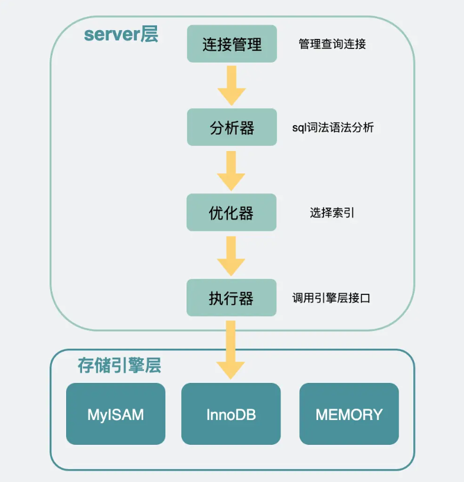
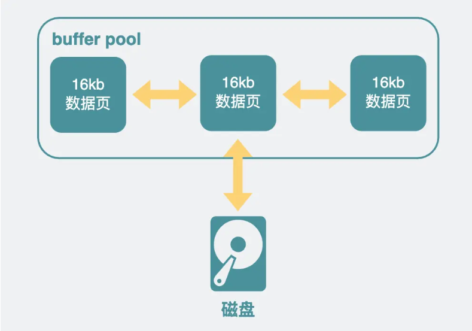
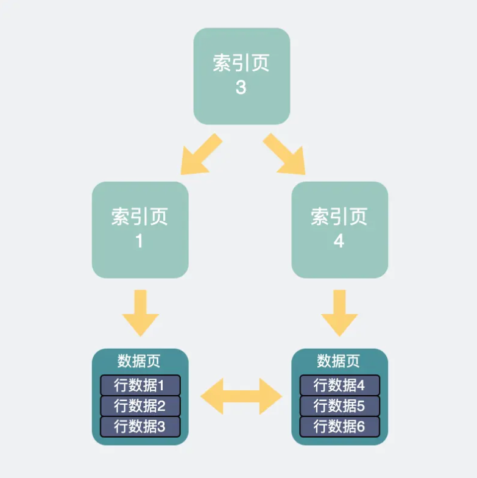
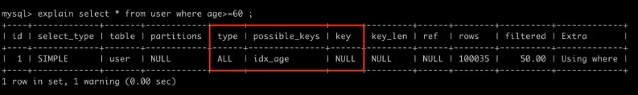
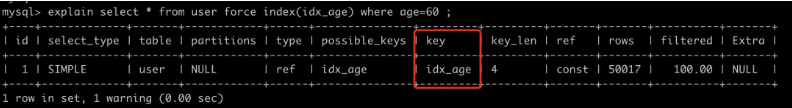
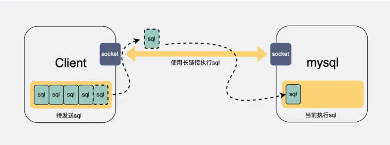
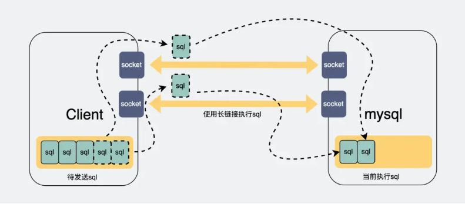
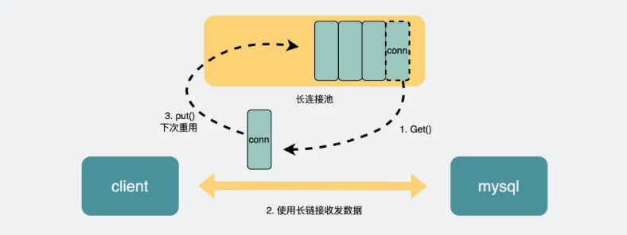
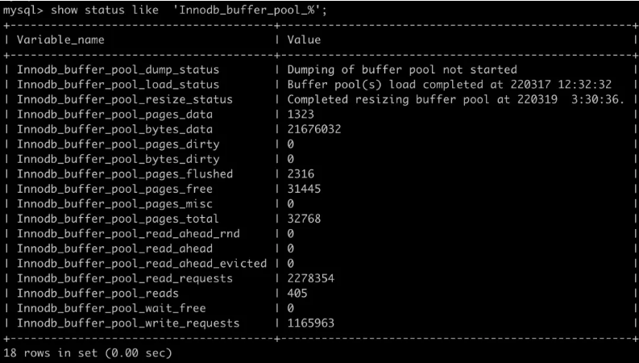
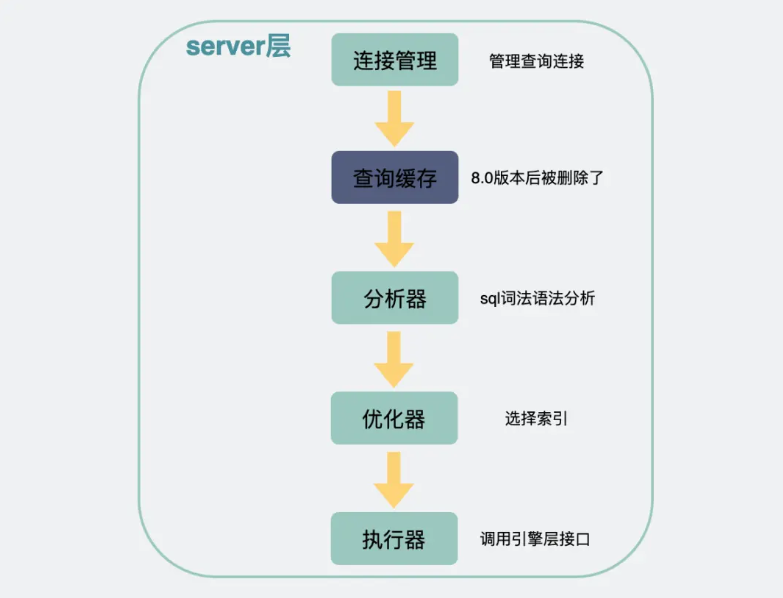

mysql查询为什么会慢，遇到这种问题，我们一般会想到是因为索引。

<!--more-->

那除开索引之外，还有哪些因素会导致数据库查询变慢呢？有哪些操作，可以提升mysql的查询能力呢？

今天来聊聊会导致数据库查询变慢的场景有哪些，并给出原因和解决方案。

### 数据库查询流程

先来看下，一条查询语句下来，会经历哪些流程。

比如我们有一张数据库表

```pgsql
TABLE `user` (
  `id` int(10) unsigned NOT NULL AUTO_INCREMENT COMMENT '主键',
  `name` varchar(100) NOT NULL DEFAULT '' COMMENT '名字',
  `age` int(11) NOT NULL DEFAULT '0' COMMENT '年龄',
  `gender` int(8) NOT NULL DEFAULT '0' COMMENT '性别',
  PRIMARY KEY (`id`),
  KEY `idx_age` (`age`),
  KEY `idx_gender` (`gender`)
) ENGINE=InnoDB DEFAULT CHARSET=utf8;
```

我们平常写的应用代码（go或C++之类的），这时候就叫**客户端**了。

客户端底层会带着账号密码，尝试向mysql建立一条TCP长链接。

mysql的**连接管理模块**会对这条连接进行管理。

建立连接后，客户端执行一条查询sql语句。比如：

```n1ql
select * from user where gender = 1 and age = 100;
```

客户端会将sql语句通过网络连接给mysql。

mysql收到sql语句后，会在**分析器**中先判断下SQL语句有没有语法错误，比如select，如果少打一个`l`，写成`slect`，则会报错`You have an error in your SQL syntax;`。

接下来是**优化器**，在这里会**根据一定的规则选择该用什么索引**。

之后，才是通过**执行器**去调用**存储引擎**的接口函数。



**存储引擎**类似于一个个组件，它们才是mysql真正获取一行行数据并返回数据的地方，存储引擎是可以替换更改的，既可以用不支持事务的MyISAM，也可以替换成支持事务的Innodb。这个可以在建表的时候指定。比如

```sql
CREATE TABLE `user` (  ...) ENGINE=InnoDB;
```

现在最常用的是**InnoDB**。

我们就重点说这个。

InnoDB中，因为直接操作磁盘会比较慢，所以加了一层内存提提速，叫**buffer pool**，这里面，放了很多内存页，每一页16KB，有些内存页放的是数据库表里看到的那种一行行的数据，有些则是放的索引信息。



查询SQL到了InnoDB中。会根据前面优化器里计算得到的索引，去查询相应的索引页，如果不在buffer pool里则从磁盘里加载索引页。再通过索引页加速查询，得到数据页的具体位置。如果这些数据页不在buffer pool中，则从磁盘里加载进来。

这样我们就得到了我们想要的一行行数据。



最后将得到的数据结果返回给客户端。

### 慢查询分析

如果上面的流程比较慢的话，我们可以通过开启`profiling`看到流程慢在哪。

```asciidoc
mysql> set profiling=ON;
Query OK, 0 rows affected, 1 warning (0.00 sec)

mysql> show variables like 'profiling';
+---------------+-------+
| Variable_name | Value |
+---------------+-------+
| profiling     | ON    |
+---------------+-------+
1 row in set (0.00 sec)
```

然后正常执行sql语句。

这些SQL语句的执行时间都会被记录下来，此时你想查看有哪些语句被记录下来了，可以执行 `show profiles;`

```asciidoc
mysql> show profiles;
+----------+------------+---------------------------------------------------+
| Query_ID | Duration   | Query                                             |
+----------+------------+---------------------------------------------------+
|        1 | 0.06811025 | select * from user where age>=60                  |
|        2 | 0.00151375 | select * from user where gender = 2 and age = 80  |
|        3 | 0.00230425 | select * from user where gender = 2 and age = 60  |
|        4 | 0.00070400 | select * from user where gender = 2 and age = 100 |
|        5 | 0.07797650 | select * from user where age!=60                  |
+----------+------------+---------------------------------------------------+
5 rows in set, 1 warning (0.00 sec)
```

关注下上面的`query_id`，比如`select * from user where age>=60`对应的query_id是1，如果你想查看这条SQL语句的具体耗时，那么可以执行以下的命令。

```gherkin
mysql> show profile for query 1;
+----------------------+----------+
| Status               | Duration |
+----------------------+----------+
| starting             | 0.000074 |
| checking permissions | 0.000010 |
| Opening tables       | 0.000034 |
| init                 | 0.000032 |
| System lock          | 0.000027 |
| optimizing           | 0.000020 |
| statistics           | 0.000058 |
| preparing            | 0.000018 |
| executing            | 0.000013 |
| Sending data         | 0.067701 |
| end                  | 0.000021 |
| query end            | 0.000015 |
| closing tables       | 0.000014 |
| freeing items        | 0.000047 |
| cleaning up          | 0.000027 |
+----------------------+----------+
15 rows in set, 1 warning (0.00 sec)
```

通过上面的各个项，大家就可以看到具体耗时在哪。比如从上面可以看出Sending data的耗时最大，这个是指执行器开始查询数据并将数据发送给客户端的耗时，因为我的这张表符合条件的数据有好几万条，所以这块耗时最大，也符合预期。

一般情况下，我们开发过程中，耗时大部分时候都在`Sending data`阶段，而这一阶段里如果慢的话，最容易想到的还是索引相关的原因。

### 索引相关原因

索引相关的问题，一般能用explain命令帮助分析。通过它能看到用了哪些索引，大概会扫描多少行之类的信息。

mysql会在优化器阶段里看下选择哪个索引，查询速度会更快。

一般主要考虑几个因素，比如：

- 选择这个索引大概要扫描多少行（rows）
- 为了把这些行取出来，需要读多少个16kb的页
- 走普通索引需要回表，主键索引则不需要，回表成本大不大？

回到show profile中提到的sql语句，我们使用`explain select * from user where age>=60` 分析一下。



上面的这条语句，使用的`type`为ALL，意味着是全表扫描，`possible_keys`是指可能用得到的索引，这里可能使用到的索引是为age建的普通索引，但实际上数据库使用的索引是在`key`那一列，是`NULL`。也就是说这句sql不走索引，全表扫描。

这个是因为数据表里，符合条件的数据行数（`rows`）太多，如果使用age索引，那么需要将它们从age索引中读出来，并且age索引是普通索引，还需要回表找到对应的主键才能找到对应的数据页。算下来还不如直接走主键划算。于是最终选择了全表扫描。

当然上面只是举了个例子，实际上，mysql执行sql时，不用索引或者用的索引不符合我们预期这件事经常发生，索引失效的场景有很多，比如用了不等号，隐式转换等。

聊两个生产中容易遇到的问题吧。

#### 索引不符合预期

实际开发中有些情况比较特殊，比如有些数据库表一开始数据量小，索引少，执行sql时，确实使用了符合你预期的索引。但随时时间边长，开发的人变多了，数据量也变大了，甚至还可能会加入一些其他重复多余的索引，就有可能出现用着用着，用到了不符合你预期的其他索引了。从而导致查询突然变慢。

这种问题，也好解决，可以通过`force index`。比如



通过`explain`可以看出，加了force index之后，sql就选用了idx_age这个索引了。

#### 走了索引还是很慢

有些sql，用`explain`命令看，明明是走索引的，但还是很慢。一般是两种情况：

第一种是索引区分度太低，比如网页全路径的url链接，这拿来做索引，一眼看过去全都是同一个域名，如果前缀索引的长度建得不够长，那这走索引跟走全表扫描似的，正确姿势是尽量让索引的区分度更高，比如域名去掉，只拿后面URI部分去做索引。


第二种是索引中匹配到的数据太大，这时候需要关注的是explain里的rows字段了。

它是用于预估这个查询语句需要查的行数的，它不一定完全准确，但可以体现个大概量级。

当它很大时，一般常见的是下面几种情况。

- 如果这个字段具有唯一的属性，比如电话号码等，一般是不应该有大量重复的，那可能是你代码逻辑出现了大量重复插入的操作，你需要检查下代码逻辑，或者需要加个唯一索引限制下。
- 如果这个字段下的数据就是会很大，是否需要全部拿？如果不需要，加个`limit`限制下。如果确实要拿全部，那也不能一次性全拿，今天你数据量小，可能一次取一两万都没啥压力，万一哪天涨到了十万级别，那一次性取就有点吃不消了。你可能需要分批次取，具体操作是先用`order by id`排序一下，拿到一批数据后取`最大id`作为下次取数据的起始位置。

### 连接数过小

索引相关的原因我们聊完了，我们来聊聊，除了索引之外，还有哪些因素会限制我们的查询速度的。

我们可以看到，mysql的server层里有个连接管理，它的作用是管理客户端和mysql之间的长连接。

正常情况下，客户端与server层如果只有一条连接，那么在执行sql查询之后，只能阻塞等待结果返回，如果有大量查询同时并发请求，那么后面的请求都需要等待前面的请求执行完成后，才能开始执行。



因此很多时候我们的应用程序，比如go或java这些，会打印出sql执行了几分钟的日志，但实际上你把这条语句单独拎出来执行，却又是毫秒级别的。这都是因为这些sql语句在等待前面的sql执行完成。

怎么解决呢？

如果我们能多建几条连接，那么请求就可以并发执行，后面的连接就不用等那么久了。



而连接数过小的问题，**受数据库和客户端两侧同时限制**。

#### 数据库连接数过小

Mysql的最大连接数默认是`100`, 最大可以达到`16384`。

可以通过设置mysql的`max_connections`参数，更改数据库的最大连接数。

```asciidoc
mysql> set global max_connections= 500;
Query OK, 0 rows affected (0.00 sec)

mysql> show variables like 'max_connections';
+-----------------+-------+
| Variable_name   | Value |
+-----------------+-------+
| max_connections | 500   |
+-----------------+-------+
1 row in set (0.00 sec)
```

上面的操作，就把最大连接数改成了500。

#### 应用侧连接数过小

数据库连接大小是调整过了，但貌似问题还是没有变化？还是有很多sql执行达到了几分钟，甚至超时？

那有可能是因为你应用侧（go，java写的应用，也就是mysql的客户端）的连接数也过小。

应用侧与mysql底层的连接，是基于TCP协议的长链接，而TCP协议，需要经过三次握手和四次挥手来实现建连和释放。如果我每次执行sql都重新建立一个新的连接的话，那就要不断握手和挥手，这很耗时。所以一般会建立一个长连接池，连接用完之后，塞到连接池里，下次要执行sql的时候，再从里面捞一条连接出来用，非常环保。



我们一般写代码的时候，都会通过第三方的**orm库**来对数据库进行操作，而成熟的orm库，百分之一千万都会有个连接池。

而这个连接池，一般会有个大小。这个大小就控制了你的连接数最大值，如果说你的连接池太小，都还没有数据库的大，那调了数据库的最大连接数也没啥作用。

一般情况下，可以翻下你使用的orm库的文档，看下怎么设置这个连接池的大小，就几行代码的事情，改改就好。比如go语言里的`gorm`里是这么设置的

```stata
func Init() {
  db, err := gorm.Open(mysql.Open(conn), config)
    sqlDB, err := db.DB()
    // SetMaxIdleConns 设置空闲连接池中连接的最大数量
    sqlDB.SetMaxIdleConns(200)
    // SetMaxOpenConns 设置打开数据库连接的最大数量
    sqlDB.SetMaxOpenConns(1000)
```

### buffer pool太小

连接数是上去了，速度也提升了。

我们在前面的数据库查询流程里，提到了进了innodb之后，会有一层内存buffer pool，用于将磁盘数据页加载到内存页中，只要查询到buffer pool里有，就可以直接返回，否则就要走磁盘IO，那就慢了。

也就是说，**如果我的buffer pool 越大，那我们能放的数据页就越多，相应的，sql查询时就更可能命中buffer pool，那查询速度自然就更快了。**

可以通过下面的命令查询到buffer pool的大小，单位是`Byte`。

```asciidoc
mysql> show global variables like 'innodb_buffer_pool_size';
+-------------------------+-----------+
| Variable_name           | Value     |
+-------------------------+-----------+
| innodb_buffer_pool_size | 134217728 |
+-------------------------+-----------+
1 row in set (0.01 sec)
```

也就是`128Mb`。

如果想要调大一点。可以执行

```asciidoc
mysql> set global innodb_buffer_pool_size = 536870912;
Query OK, 0 rows affected (0.01 sec)

mysql> show global variables like 'innodb_buffer_pool_size';
+-------------------------+-----------+
| Variable_name           | Value     |
+-------------------------+-----------+
| innodb_buffer_pool_size | 536870912 |
+-------------------------+-----------+
1 row in set (0.01 sec)
```

这样就把buffer pool增大到512Mb了。

但是吧，如果buffer pool大小正常，只是别的原因导致的查询变慢，那改buffer pool毫无意义。

#### 怎么知道buffer pool是不是太小了？

这个我们可以看buffer pool的缓存命中率。



通过 `show status like 'Innodb_buffer_pool_%';`可以看到跟buffer pool有关的一些信息。

`Innodb_buffer_pool_read_requests`表示读请求的次数。

`Innodb_buffer_pool_reads` 表示从物理磁盘中读取数据的请求次数。

所以buffer pool的命中率就可以这样得到：

```apache
buffer pool 命中率 = 1 - (Innodb_buffer_pool_reads/Innodb_buffer_pool_read_requests) * 100%
```

比如我上面截图里的就是，1 - (405/2278354) = 99.98%。可以说命中率非常高了。

一般情况下**buffer pool命中率**都在`99%`以上，如果低于这个值，才需要考虑加大innodb buffer pool的大小。

当然，还可以把这个命中率做到监控里，这样半夜sql变慢了，早上上班还能定位到原因，就很舒服。

### 还有哪些骚操作？

前面提到的是在存储引擎层里加入了buffer pool用于缓存内存页，这样可以加速查询。

那同样的道理，server层也可以加个缓存，直接将第一次查询的结果缓存下来，这样下次查询就能立刻返回，听着挺美的。

按道理，如果命中缓存的话，确实是能为查询加速的。但这个功能限制很大，其中最大的问题是只要数据库表被更新过，表里面的**所有缓存都会失效**，数据表频繁的更新，就会带来频繁的缓存失效。所以这个功能只适合用于那些不怎么更新的数据表。

另外，这个功能在`8.0版本`之后，就被干掉了。所以这功能用来聊聊天可以，没必要真的在生产中使用啊。



### 总结

- 数据查询过慢一般是索引问题，可能是因为选错索引，也可能是因为查询的行数太多。
- 客户端和数据库连接数过小，会限制sql的查询并发数，增大连接数可以提升速度。
- innodb里会有一层内存buffer pool用于提升查询速度，命中率一般>99%，如果低于这个值，可以考虑增大buffer pool的大小，这样也可以提升速度。
- 查询缓存（query cache）确实能为查询提速，但一般不建议打开，因为限制比较大，并且8.0以后的Mysql里已经将这个功能干掉了。