Prometheus 最开始是由 SoundCloud 开发的开源监控告警系统，是 Google BorgMon 监控系统的开源版本。在 2016 年，Prometheus 加入 CNCF，成为继 Kubernetes 之后第二个被 CNCF 托管的项目。随着 Kubernetes 在容器编排领头羊地位的确立，Prometheus 也成为 Kubernetes 容器监控的标配。本文接下来将会对 Prometheus 做一个介绍。

<!--more-->

### 简介

#### 特性

- 通过指标名称和标签(key/value对）区分的多维度、时间序列数据模型
- 灵活的查询语法 PromQL
- 不需要依赖额外的存储，一个服务节点就可以工作
- 利用http协议，通过pull模式来收集时间序列数据
- 需要push模式的应用可以通过中间件gateway来实现
- 监控目标支持服务发现和静态配置
- 支持各种各样的图表和监控面板组件

#### 核心组件

整个Prometheus生态包含多个组件，除了Prometheus server组件其余都是可选的

- **Prometheus Server**：主要的核心组件，用来收集和存储时间序列数据。
- **Client Library:**：客户端库，为需要监控的服务生成相应的 metrics 并暴露给 Prometheus server。当 Prometheus server 来 pull 时，直接返回实时状态的 metrics。
- **push gateway**：主要用于短期的 jobs。由于这类 jobs 存在时间较短，可能在 Prometheus 来 pull 之前就消失了。为此，这次 jobs 可以直接向 Prometheus server 端推送它们的 metrics。这种方式主要用于服务层面的 metrics，对于机器层面的 metrices，需要使用 node exporter。
- **Exporters**: 用于暴露已有的第三方服务的 metrics 给 Prometheus。
- **Alertmanager**: 从 Prometheus server 端接收到 alerts 后，会进行去除重复数据，分组，并路由到对收的接受方式，发出报警。常见的接收方式有：电子邮件，pagerduty，OpsGenie, webhook 等。
- 各种支持工具。

#### Prometheus 框架图

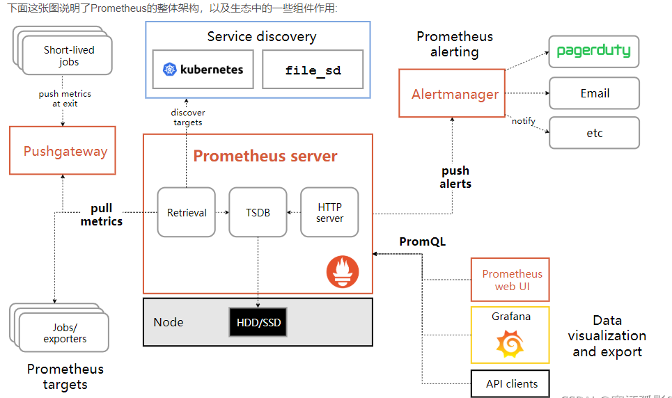

我们从上面的架构图可以看出 Prometheus 的主要模块包含:Server, Exporters, Pushgateway, PromQL, Alertmanager, WebUI 等。我们逐一认识一下各个模块的功能作用。

**模块介绍**

- **Retrieval**是负责定时去暴露的目标页面上去抓取采样指标数据。
- **Storage** 是负责将采样数据写入指定的时序数据库存储。
- **PromQL** 是Prometheus提供的查询语言模块。可以和一些webui比如grfana集成。
- **Jobs / Exporters**:Prometheus 可以从 Jobs 或 Exporters 中拉取监控数据。Exporter 以 Web API 的形式对外暴露数据采集接口。
- **Prometheus Server**:Prometheus 还可以从其他的 Prometheus Server 中拉取数据。
- **Pushgateway**:对于一些以临时性 Job 运行的组件，Prometheus 可能还没有来得及从中 pull 监控数据的情况下，这些 Job 已经结束了，Job 运行时可以在运行时将监控数据推送到 Pushgateway 中，Prometheus 从 Pushgateway 中拉取数据，防止监控数据丢失。
- **Service discovery**:是指 Prometheus 可以动态的发现一些服务，拉取数据进行监控，如从DNS，Kubernetes，Consul 中发现, file_sd 是静态配置的文件。
- **AlertManager**:是一个独立于 Prometheus 的外部组件，用于监控系统的告警，通过配置文件可以配置一些告警规则，Prometheus 会把告警推送到 AlertManager。

#### 工作流程

大概的工作流程如下：

- Prometheus server 定期从配置好的 jobs 或者 exporters 中拉 metrics，或者接收来自 Pushgateway 发过来的 metrics，或者从其他的 Prometheus server 中拉 metrics。
- Prometheus server 在本地存储收集到的 metrics，并运行已定义好的 alert.rules，记录新的时间序列或者向 Alertmanager 推送警报。
- Alertmanager 根据配置文件，对接收到的警报进行处理，发出告警。
- 在图形界面中，可视化采集数据。


### Prometheus相关概念

#### 内部存储机制

> Prometheus有着非常高效的时间序列数据存储方法，每个采样数据仅仅占用3.5byte左右空间，上百万条时间序列，30秒间隔，保留60天，大概花了200多G（引用官方PPT）。

Prometheus内部主要分为三大块：

- **Retrieval**是负责定时去暴露的目标页面上去抓取采样指标数据
- **Storage**是负责将采样数据写磁盘
- **PromQL**是Prometheus提供的查询语言模块。

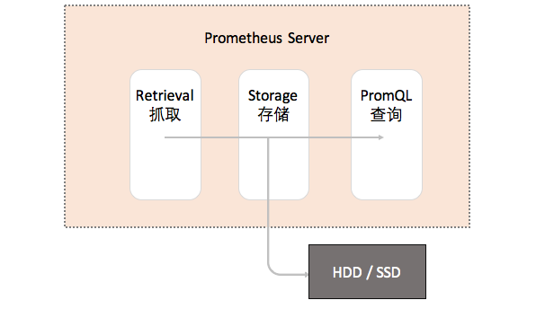

#### 数据模型

> Prometheus 存储的所有数据都是**时间序列数据**（**Time Serie Data**，简称时序数据）。时序数据是具有时间戳的数据流，该数据流属于某个度量指标（Metric）和该度量指标下的多个标签（Label）。

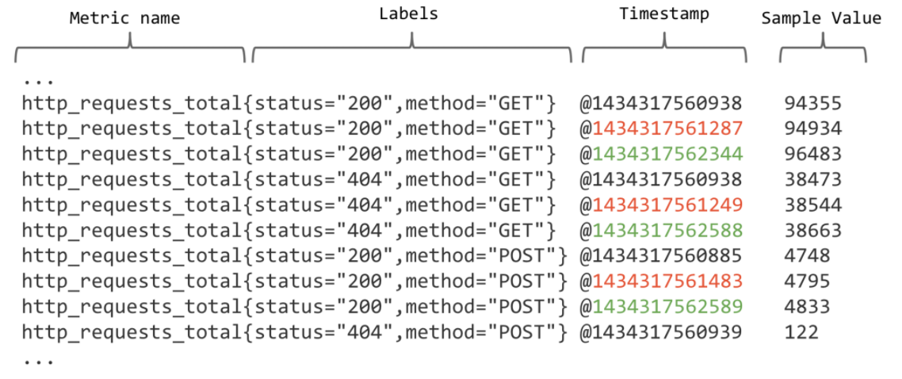

> 每个Metric name代表了一类的指标，他们可以携带不同的Labels，每个Metric name + Label组合成代表了一条时间序列的数据。

> 在Prometheus的世界里面，所有的数值都是64bit的。每条时间序列里面记录的其实就是**64bit timestamp(时间戳) + 64bit value(采样值)**。

- **Metric name（指标名称）**：该名字应该具有语义，一般用于表示 metric 的功能，例如：http_requests_total, 表示 http 请求的总数。其中，metric 名字由 ASCII 字符，数字，下划线，以及冒号组成，且必须满足正则表达式 a-zA-Z_:*。
- **Lables（标签）**：使同一个时间序列有了不同维度的识别。例如 http_requests_total{method=“Get”} 表示所有 http 请求中的 Get 请求。当 method=“post” 时，则为新的一个 metric。标签中的键由 ASCII 字符，数字，以及下划线组成，且必须满足正则表达式 a-zA-Z_:*。
- **timestamp(时间戳)**：数据点的时间，表示数据记录的时间。
- **Sample Value（采样值）**：实际的时间序列，每个序列包括一个 float64 的值和一个毫秒级的时间戳。

例如图上的数据：

```bash
http_requests_total{status="200",method="GET"}
http_requests_total{status="404",method="GET"}
```

根据上面的分析，时间序列的存储似乎可以设计成key-value存储的方式（基于BigTable）。

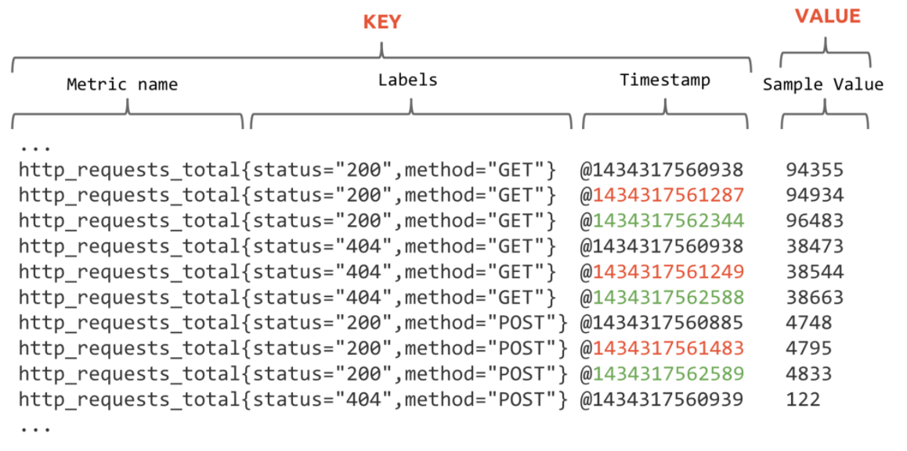

进一步拆分，可以像下面这样子：

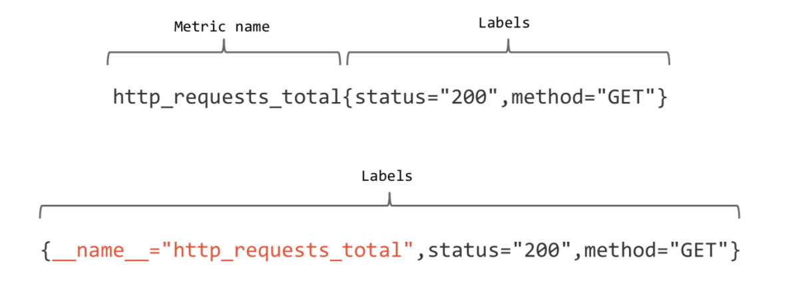

上图的第二条样式就是现在Prometheus内部的表现形式了，__name__是特定的label标签，代表了metric name。

再回顾一下Prometheus的整体流程：

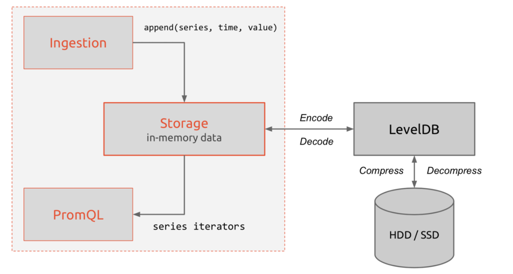

#### Metric类型

> Prometheus定义了4种不同的指标类型(metric type)：Counter（计数器）、Gauge（仪表盘）、Histogram（直方图）、Summary（摘要）

**1、Counter（计数器）**

- 一种**累加的 metric**，典型的应用如：请求的个数，结束的任务数， 出现的错误数等等。

> 【例如】查询 http_requests_total{method=“get”, job=“Prometheus”, handler=“query”} 返回 8，10 秒后，再次查询，则返回 14。

**2、Gauge（仪表盘）**

- 数据是一个**瞬时值**，如果当前内存用量，它随着时间变化忽高忽低。

> 【例如】go_goroutines{instance=“172.17.0.2”, job=“Prometheus”} 返回值 147，10 秒后返回 124。

**3、Histogram（直方图）**

- Histogram 取样观测的结果（一般是请求持续时间或响应大小）并在一个可配置的分布区间（bucket）内计算这些结果。其也提供所有观测结果的总和。
- Histogram 有一个基本 metric名称 <basename>，在一次抓取中展现多个时间序列：
  1. 累加的 counter，代表观测区间：<basename>_bucket{le=""}
  2. 所有观测值的总数：<basename>_sum
  3. 观测到的事件数量：<basenmae>_count

> 例如 Prometheus server 中**prometheus_local_storage_series_chunks_persisted**, 表示 Prometheus 中每个时序需要存储的 chunks 数量，我们可以用它计算待持久化的数据的分位数。

**4、Summary（摘要）**

- 和 histogram 相似，summary 取样观测的结果（一般是请求持续时间或响应大小）。但是它还提供观测的次数和所有值的总和，它通过一个滑动的时间窗口计算可配置的分位数。
- Summary 有一个基本的 metric名称 <basename>，在一次抓取中展现多个时间序列：
  1. 观测事件的流式φ-分位数（0 ≤ φ ≤ 1）：{quantile="φ"}
  2. 所有观测值的总和：<basename>_sum
  3. 观测的事件数量：<basename>_count

> 例如 Prometheus server 中 **prometheus_target_interval_length_seconds**。

#### Histogram 和Summary的对比

| 序号                                           | histogram                    | Summary                |
| ---------------------------------------------- | ---------------------------- | ---------------------- |
| 配置                                           | 区间配置                     | 分位数和滑动窗口       |
| 客户端性能                                     | 只需增加counters代价小       | 需要流式计算代价高     |
| 服务端性能                                     | 计算分位数消耗大，可能会耗时 | 无需计算，代价小       |
| 时序数量                                       | _sum、_count、bucket         | _sum、_count、quantile |
| 分位数误差                                     | bucket的大小有关             | φ的配置有关            |
| φ和滑动窗口                                    | Prometheus 表达式设置        | 客户端设置             |
| 聚合                                           | 根据表达式聚合               | 一般不可聚合           |
| 以下是类型为histogram和summary的样本输出示例： |                              |                        |

```bash
# A histogram, which has a pretty complex representation in the text format:
# HELP http_request_duration_seconds A histogram of the request duration.
# TYPE http_request_duration_seconds histogram
http_request_duration_seconds_bucket{le="0.05"} 24054
http_request_duration_seconds_bucket{le="0.1"} 33444
http_request_duration_seconds_bucket{le="0.2"} 100392
http_request_duration_seconds_bucket{le="+Inf"} 144320
http_request_duration_seconds_sum 53423
http_request_duration_seconds_count 144320
# Finally a summary, which has a complex representation, too:
# HELP rpc_duration_seconds A summary of the RPC duration in seconds.
# TYPE rpc_duration_seconds summary
rpc_duration_seconds{quantile="0.01"} 3102
rpc_duration_seconds{quantile="0.05"} 3272
rpc_duration_seconds{quantile="0.5"} 4773
rpc_duration_seconds_sum 1.7560473e+07
rpc_duration_seconds_count 2693
```

#### 任务（JOBS）与实例（INSTANCES）

- 用Prometheus术语来说，可以抓取的端点称为instance，通常对应于单个进程。
- 具有相同目的的instances 的集合（例如，出于可伸缩性或可靠性而复制的过程）称为job。

------

例如，一个具有四个复制实例的API服务器作业:

- job: api-server
  1. instance 1: 1.2.3.4:5670
  2. instance 2: 1.2.3.4:5671
  3. instance 3: 5.6.7.8:5670
  4. instance 4: 5.6.7.8:5671

------

- instance: 一个单独 scrape 的目标， 一般对应于一个进程。:
- jobs: 一组同种类型的 instances（主要用于保证可扩展性和可靠性）

#### Node exporter

> Node exporter 主要用于暴露 metrics 给 Prometheus，其中 metrics 包括：cpu 的负载，内存的使用情况，网络等。

#### Pushgateway

Pushgateway 是 Prometheus 生态中一个重要工具，使用它的原因主要是：

- Prometheus 采用 pull 模式，可能由于不在一个子网或者防火墙原因，导致Prometheus 无法直接拉取各个 target数据。
- 在监控业务数据的时候，需要将不同数据汇总, 由 Prometheus 统一收集。

由于以上原因，不得不使用 pushgateway，但在使用之前，有必要了解一下它的一些弊端：

- 将多个节点数据汇总到 pushgateway, 如果 pushgateway 挂了，受影响比多个 target 大。
- Prometheus 拉取状态 up 只针对 pushgateway, 无法做到对每个节点有效。
- Pushgateway 可以持久化推送给它的所有监控数据。因此，即使你的监控已经下线，prometheus 还会拉取到旧的监控数据，需要手动清理 pushgateway 不要的数据。

### TSDB简介

> **TSDB(Time Series Database)时序列数据库**，我们可以简单的理解为一个优化后用来处理时间序列数据的软件，并且数据中的数组是由时间进行索引的。

#### 时间序列数据库的特点

- 大部分时间都是写入操作。
- 写入操作几乎是顺序添加，大多数时候数据到达后都以时间排序。
- 写操作很少写入很久之前的数据，也很少更新数据。大多数情况在数据被采集到数秒或者数分钟后就会被写入数据库。
- 删除操作一般为区块删除，选定开始的历史时间并指定后续的区块。很少单独删除某个时间或者分开的随机时间的数据。
- 基本数据大，一般超过内存大小。一般选取的只是其一小部分且没有规律，缓存几乎不起任何作用。
- 读操作是十分典型的升序或者降序的顺序读。
- 高并发的读操作十分常见。

#### 常见的时间序列数据库

| TSDB项目   | 官网                           |
| ---------- | ------------------------------ |
| influxDB   | https://influxdata.com/        |
| RRDtool    | http://oss.oetiker.ch/rrdtool/ |
| Graphite   | http://graphiteapp.org/        |
| OpenTSDB   | http://opentsdb.net/           |
| Kdb+       | http://kx.com/                 |
| Druid      | http://druid.io/               |
| KairosDB   | http://kairosdb.github.io/     |
| Prometheus | https://prometheus.io/         |

### PromQL查询表达式

PromQL的四种数据类型：

- **即时向量（Instant vector）** ：包含每个时间序列单个样品的一组时间序列，共享相同的时间戳
- **范围向量（Range vector）** ：包含一个范围内数据点的一组时间序列
- **标量（Scalar）** ： 一个简单的数字浮点值
- **字符串（String）** ：一个简单的字符串值；当前未使用

#### 即时矢量选择器

即时向量选择器允许选择一组时间序列，或者某个给定的时间戳的样本数据。下面这个例子选择了具有http_requests_total的时间序列：

> http_requests_total

你可以通过附加一组标签，并用{}括起来，来进一步筛选这些时间序列。下面这个例子只选择有http_requests_total名称的、有prometheus工作标签的、有canary组标签的时间序列：

> http_requests_total

另外，也可以也可以将标签值反向匹配，或者对正则表达式匹配标签值。下面列举匹配操作符：

- =：选择正好相等的字符串标签
- !=：选择不相等的字符串标签
- =~：选择匹配正则表达式的标签（或子标签）
- !~：选择不匹配正则表达式的标签（或子标签）

例如，选择staging、testing、development环境下的，GET之外的HTTP方法的http_requests_total的时间序列：

> http_requests_total

#### 范围矢量选择器

范围向量表达式正如即时向量表达式一样运行，但是前者返回从当前时刻开始的一定时间范围的时间序列集合回来。语法是，在一个向量表达式之后添加[]来表示时间范围，持续时间用数字表示，后接下面单元之一：

- s：seconds
- m：minutes
- h：hours
- d：days
- w：weeks
- y：years

在下面这个例子中，我们选择最后5分钟的记录，metric名称为http_requests_total、作业标签为prometheus的时间序列的所有值：

> http_requests_total{job="prometheus"}[5m]

#### 偏移量修改器

所述offset可以改变时间为查询中的个别时刻和范围矢量偏移。例如，以下表达式返回http_requests_total相对于当前查询评估时间的过去5分钟值 ：

> http_requests_total offset 5m

同样适用于范围向量。这将返回http_requests_total一周前的5分钟费率 ：

> rate(http_requests_total[5m] offset 1w)

更多**操作符**，请参考[官方文档](https://prometheus.io/docs/prometheus/latest/querying/operators/)

#### 使用聚合操作

> PromQL提供的聚合操作可以用来对这些时间序列进行处理，形成一条新的时间序列

```bash
# 查询系统所有http请求的总量
sum(http_request_total)

# 按照mode计算主机CPU的平均使用时间
avg(node_cpu) by (mode)

# 按照主机查询各个主机的CPU使用率
sum(sum(irate(node_cpu{mode!='idle'}[5m]))  / sum(irate(node_cpu[5m]))) by (instance)
```

常见的聚合函数

> sum (求和)
> min (最小值)
> max (最大值)
> avg (平均值)
> stddev (标准差)
> stdvar (标准方差)
> count (计数)
> count_values (对value进行计数)
> bottomk (后n条时序)
> topk (前n条时序)
> quantile (分位数)

更多**函数**，请参考[官方文档](https://prometheus.io/docs/prometheus/latest/querying/functions/)

### Exporter介绍

> Exporter是prometheus监控中重要的组成部分，**负责数据指标的采集**。广义上讲所有**可以向Prometheus提供监控样本数据的程序都可以被称为一个Exporter**。而Exporter的一个实例称为target。官方给出的插件有**blackbox_exporter、node_exporter、mysqld_exporter、snmp_exporter等**，第三方的插件有redis_exporter，cadvisor等。

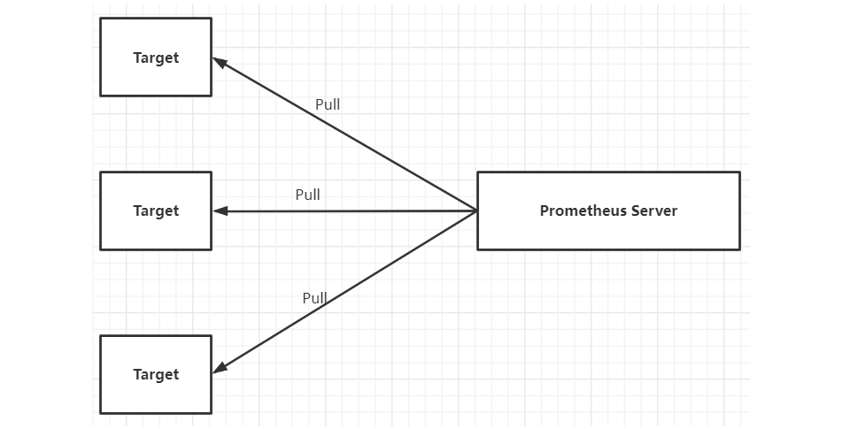

官方和一些社区提供好多exproter, 我们可以直接拿过来采集我们的数据。 官方的exporter地址： https://prometheus.io/docs/instrumenting/exporters/

#### 常见的Exporter简介

##### blackbox_exporter

GitHub地址：https://github.com/prometheus/blackbox_exporter

> bloackbox exporter是prometheus社区提供的黑盒监控解决方案，运行用户通过HTTP、HTTPS、DNS、TCP以及ICMP的方式对网络进行探测。这里通过blackbox对我们的站点信息进行采集。

##### node_exporter

GitHub地址：https://github.com/prometheus/node_exporter

> node_exporter主要用来采集机器的性能指标数据，包括cpu，内存，磁盘，io等基本信息。

##### mysqld_exporter

> mysql_exporter是用来收集MysQL或者Mariadb数据库相关指标的，mysql_exporter需要连接到数据库并有相关权限。

GitHub地址：https://github.com/prometheus/mysqld_exporter

##### snmp_exporter

> SNMP Exporter 从 SNMP 服务中采集信息提供给 Promethers 监控系统使用。

GitHub地址：https://github.com/prometheus/snmp_exporter

#### Exporter的来源

从Exporter的来源上来讲，主要分为两类：

##### 社区提供

> Prometheus社区提供了丰富的Exporter实现，涵盖了从基础设施，中间件以及网络等各个方面的监控功能。这些Exporter可以实现大部分通用的监控需求。下表列举一些社区中常用的Exporter：

| 范围     | 常用Exporter                                                 |
| -------- | ------------------------------------------------------------ |
| 数据库   | MySQL Exporter, Redis Exporter, MongoDB Exporter, MSSQL Exporter等 |
| 硬件     | Apcupsd Exporter，IoT Edison Exporter， IPMI Exporter, Node Exporter等 |
| 消息队列 | Beanstalkd Exporter, Kafka Exporter, NSQ Exporter, RabbitMQ Exporter等 |
| 存储     | Ceph Exporter, Gluster Exporter, HDFS Exporter, ScaleIO Exporter等 |
| HTTP服务 | Apache Exporter, HAProxy Exporter, Nginx Exporter等          |
| API服务  | AWS ECS Exporter， Docker Cloud Exporter, Docker Hub Exporter, GitHub Exporter等 |
| 日志     | Fluentd Exporter, Grok Exporter等                            |
| 监控系统 | Collectd Exporter, Graphite Exporter, InfluxDB Exporter, Nagios Exporter, SNMP Exporter等 |
| 其它     | Blockbox Exporter, JIRA Exporter, Jenkins Exporter， Confluence Exporter等 |

##### 用户自定义

> 除了直接使用社区提供的Exporter程序以外，用户还可以基于Prometheus提供的Client Library创建自己的Exporter程序，目前Promthues社区官方提供了对以下编程语言的支持：Go、Java/Scala、Python、Ruby。同时还有第三方实现的如：Bash、C++、Common Lisp、Erlang,、Haskeel、Lua、Node.js、PHP、Rust等。

#### Exporter的运行方式

从Exporter的运行方式上来讲，又可以分为：

##### 独立运行

> 由于操作系统本身并不直接支持Prometheus，同时用户也无法通过直接从操作系统层面上提供对Prometheus的支持。因此，用户只能通过独立运行一个程序的方式，通过操作系统提供的相关接口，将系统的运行状态数据转换为可供Prometheus读取的监控数据。 除了Node Exporter以外，比如MySQL Exporter、Redis Exporter等都是通过这种方式实现的。 这些**Exporter程序扮演了一个中间代理人的角色（数据转换）**。

##### 集成到应用中（推荐）

> 为了能够更好的监控系统的内部运行状态，有些开源项目如Kubernetes，ETCD等直接在代码中使用了Prometheus的Client Library，提供了对Prometheus的直接支持。这种方式打破的监控的界限，让应用程序可以直接将内部的运行状态暴露给Prometheus，适合于一些需要更多自定义监控指标需求的项目。

#### Exporter规范

所有的Exporter程序都需要按照Prometheus的规范，返回监控的样本数据。以Node Exporter为例，当访问/metrics地址时会返回以下内容：

直接curl拿不到数据，就得授权

```bash
# 取前面10行
$ curl -s -k --header "Authorization: Bearer $TOKEN" https://192.168.0.113:6443/metrics|head -10
```

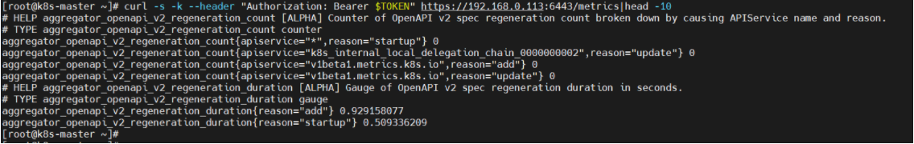

```yaml
# HELP aggregator_openapi_v2_regeneration_count [ALPHA] Counter of OpenAPI v2 spec regeneration count broken down by causing APIService name and reason.
# TYPE aggregator_openapi_v2_regeneration_count counter
aggregator_openapi_v2_regeneration_count{apiservice="*",reason="startup"} 0
aggregator_openapi_v2_regeneration_count{apiservice="k8s_internal_local_delegation_chain_0000000002",reason="update"} 0
aggregator_openapi_v2_regeneration_count{apiservice="v1beta1.metrics.k8s.io",reason="add"} 0
aggregator_openapi_v2_regeneration_count{apiservice="v1beta1.metrics.k8s.io",reason="update"} 0
# HELP aggregator_openapi_v2_regeneration_duration [ALPHA] Gauge of OpenAPI v2 spec regeneration duration in seconds.
# TYPE aggregator_openapi_v2_regeneration_duration gauge
aggregator_openapi_v2_regeneration_duration{reason="add"} 0.929158077
aggregator_openapi_v2_regeneration_duration{reason="startup"} 0.509336209
```

Exporter返回的样本数据，主要由三个部分组成：**样本的一般注释信息（HELP），样本的类型注释信息（TYPE）和样本**。

Prometheus会对Exporter响应的内容逐行解析：

- 如果当前行以# HELP开始，Prometheus将会按照以下规则对内容进行解析，得到当前的指标名称以及相应的说明信息：

> \# HELP <metrics_name> <doc_string>

- 如果当前行以# TYPE开始，Prometheus会按照以下规则对内容进行解析，得到当前的指标名称以及指标类型:

> \# TYPE <metrics_name> <metrics_type>

- TYPE注释行必须出现在指标的第一个样本之前。如果没有明确的指标类型需要返回为untyped。 除了# 开头的所有行都会被视为是监控样本数据。 每一行样本需要满足以下格式规范:

> metric_name [
> "{" label_name "=" `"` label_value `"` { "," label_name "=" `"` label_value `"` } [ "," ] "}"
> ] value [ timestamp ]

### node-exporter简介

> **Exporter是Prometheus的指标数据收集组件**。它负责从目标Jobs收集数据，并把收集到的数据转换为Prometheus支持的时序数据格式。 和传统的指标数据收集组件不同的是，他只负责收集，并不向Server端发送数据，而是**等待Prometheus Server 主动抓取**。

- node-exporter用于采集node的运行指标，包括node的cpu、load、filesystem、meminfo、network等基础监控指标，类似于zabbix监控系统的的zabbix-agent

原理图如下：

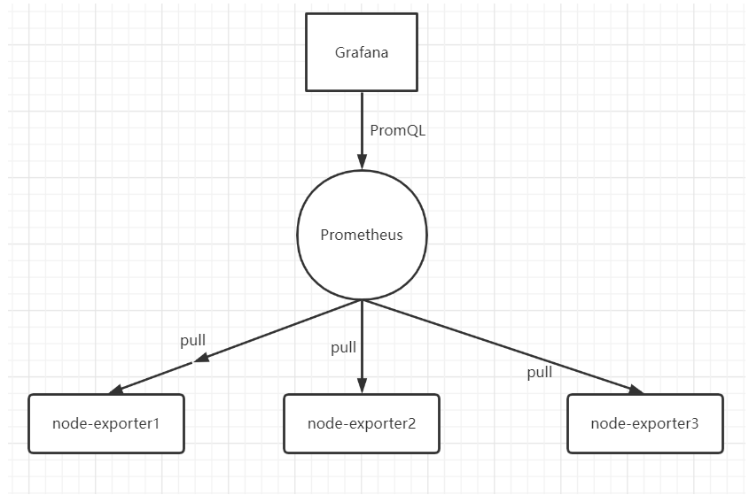

#### 检查node-exporter服务

```bash
$ kubectl get pods -n monitoring -o wide|grep node-exporter
# 查看pod内的node_exporter进程
$ kubectl exec -it node-exporter-dc65j -n monitoring -- ps -ef|grep node_exporter
# 获取容器ID
$ docker ps |grep node_exporter
# 查看docker 容器的pid
$ docker inspect -f {{.State.Pid}} 8b3f0c3ea055
# 再通过pid进入命名空间
$ nsenter -n -t8303
# 再查看进程
$ ps -ef|grep node_exporter
# 退出当前命名空间
$ exit
```

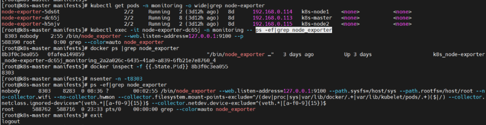

设计到yaml文件

```yaml
node-exporter-clusterRoleBinding.yaml # 角色绑定
node-exporter-clusterRole.yaml # 角色
node-exporter-daemonset.yaml # daemonset，容器配置，node-exporter配置
node-exporter-prometheusRule.yaml # 采集规则
node-exporter-serviceAccount.yaml # 服务账号
# K8s集群内的Prometheus抓取监测数据是通过servicemonitor这个crd来完成的。
# 每个servicemonitor对应Prometheus中的一个target。
# 每个servicemonitor对应一个或多个service，负责获取这些service上指定端口暴露的监测数据，并向Prometheus上报。
node-exporter-serviceMonitor.yaml 
node-exporter-service.yaml # 服务
```

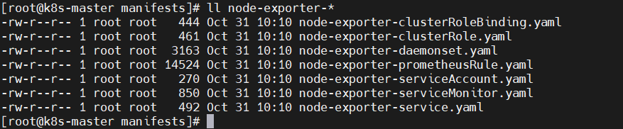

#### 服务自动发现

> 任何被监控的目标都需要事先纳入到监控系统中才能进行时序数据采集、存储、告警和展示，监控目标可以通过配置信息以**静态形式指定**，也可以让Prometheus通过**服务发现**的机制进行动态管理。

讲服务发现之前，先来讲一下**传统配置方式**

1. 首先需要安装node-exporter，获取node metrics，并且暴露一个端口；
2. 然后去Prometheus Server的prometheus.yaml文件中在scarpe_config中添加node-exporter的job，配置node-exporter的地址和端口等信息；
3. 再然后，**需要重启Prometheus服务**；
4. 最后等待prometheus服务来拉取监控信息，就完成添加一个node-exporter监控的任务。

示例配置如下（prometheus.yml）：

```yaml
 - job_name: 'node-exporter'
    static_configs:
    - targets: ['192.168.0.113:9090']   #这里我修改了端口为9090
```

重启服务

```bash
$ systemctl restart prometheus
```

**kube-prometheus服务自动发现**

1. 首先第一步和传统方式一样，部署一个node-exporter来获取监控项；
2. 然后编写一个ServiceMonitor通过labelSelector选择刚才部署的node-exporter，由于Operator在部署Prometheus的时候默认指定了Prometheus选择label为：prometheus: kube-prometheus的ServiceMonitor，所以只需要在ServiceMonitor上打上prometheus: kube-prometheus标签就可以被Prometheus选择了；
3. 完成以上两步就完成了对主机资源的监控，不需要改Prometheus配置文件，也**不需要重启Prometheus服务**，是不是很方便，Operator观察到ServiceMonitor发生变化，会动态生成Prometheus配置文件，并保证配置文件实时生效。

### 添加k8s外部监控

#### 配置过程

> 一个项目开始可能很难实现全部容器化，比如数据库、CDH集群。但是我们依然需要监控他们，如果分成两套prometheus不利于管理，所以我们统一添加这些监控到kube-prometheus中。

关于 additionalScrapeConfigs 属性的具体介绍，我们可以使用 kubectl explain 命令来了解详细信息：

```bash
$ kubectl explain prometheus.spec.additionalScrapeConfigs
```

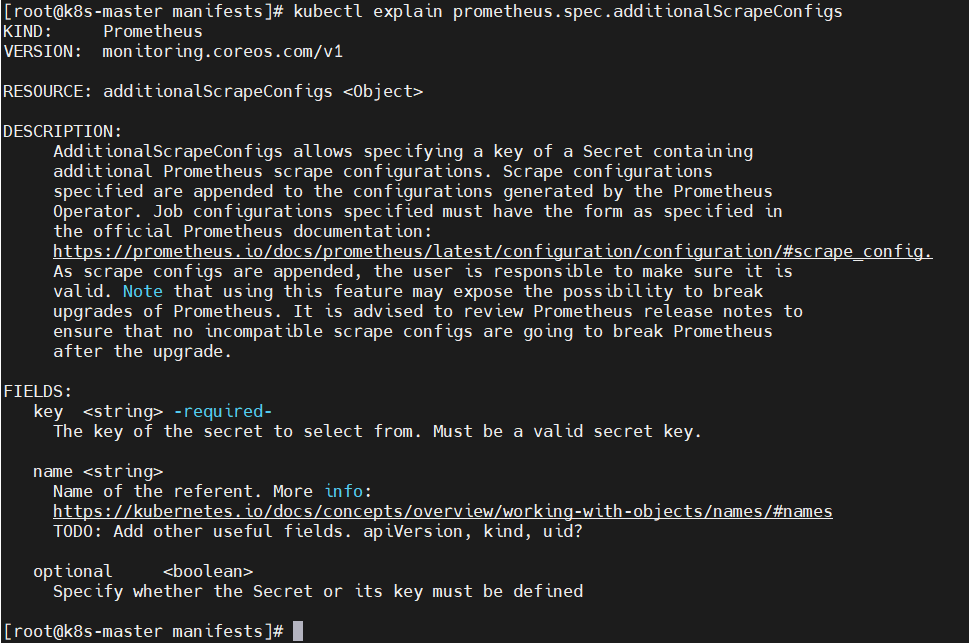

那么接下来我们**新建 prometheus-additional.yaml** 文件，添加额外监控组件配置scrape_configs。

```bash
$ cat << EOF > prometheus-additional.yaml
- job_name: 'node-exporter-others'
  static_configs:
    - targets:
      - *.*.*.113:31190
      - *.*.*.114:31190
      - *.*.*.115:31190

- job_name: 'mysql-exporter'
  static_configs:
    - targets:
      - *.*.*.104:9592
      - *.*.*.125:9592
      - *.*.*.128:9592

- job_name: 'nacos-exporter'
  metrics_path: '/nacos/actuator/prometheus'
  static_configs:
    - targets:
      - *.*.*.113:8848
      - *.*.*.114:8848
      - *.*.*.115:8848

- job_name: 'elasticsearch-exporter'
  static_configs:
  - targets:
    - *.*.*.113:9597
    - *.*.*.114:9597
    - *.*.*.115:9597

- job_name: 'zookeeper-exporter'
  static_configs:
  - targets:
    - *.*.*.113:9595
    - *.*.*.114:9595
    - *.*.*.115:9595

- job_name: 'nginx-exporter'
  static_configs:
  - targets:
    - *.*.*.113:9593
    - *.*.*.114:9593
    - *.*.*.115:9593

- job_name: 'redis-exporter'
  static_configs:
  - targets:
    - *.*.*.113:9594

- job_name: 'redis-exporter-targets'
  static_configs:
    - targets:
      - redis://*.*.*.113:7090
      - redis://*.*.*.114:7090
      - redis://*.*.*.115:7091
  metrics_path: /scrape
  relabel_configs:
    - source_labels: [__address__]
      target_label: __param_target
    - source_labels: [__param_target]
      target_label: instance
    - target_label: __address__
      replacement: *.*.*.113:9594
EOF
```

然后我们需要将这些监控配置以secret资源类型存储到k8s集群中。

```bash
$ kubectl create secret generic additional-scrape-configs --from-file=prometheus-additional.yaml -n monitoring
```

#### 修改 prometheus 文件

> additionalScrapeConfigs：增加额外监控项配置，具体配置查看“添加k8s外部监控”。

```bash
$ vi prometheus-prometheus.yaml
```

添加如下内容

```yaml
additionalScrapeConfigs:
    name: additional-scrape-configs
    key: prometheus-additional.yaml
```

检查

```bash
$ grep -n -C5 'additionalScrapeConfigs' prometheus-prometheus.yaml
```

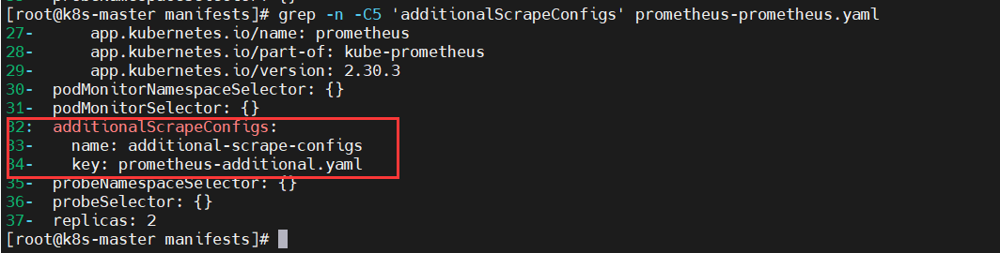

是配置生效

```bash
$ kubectl apply -f prometheus-prometheus.yaml
```

### Pushgateway 简介

Pushgateway 是 Prometheus 生态中一个重要工具，使用它的原因主要是：

- Prometheus 采用 pull 模式，可能由于不在一个子网或者防火墙原因，导致Prometheus 无法直接拉取各个 target 数据。
- 在监控业务数据的时候，需要将不同数据汇总, 由 Prometheus 统一收集。

由于以上原因，不得不使用 pushgateway，但在使用之前，有必要了解一下它的一些**弊端**：

- 将多个节点数据汇总到 pushgateway, 如果 pushgateway 挂了，受影响比多个 target 大。
- Prometheus 拉取状态 up 只针对 pushgateway, 无法做到对每个节点有效。
- Pushgateway 可以持久化推送给它的所有监控数据。
- 即使你的监控已经下线，prometheus 还会拉取到旧的监控数据，需要手动清理 pushgateway 不要的数据。

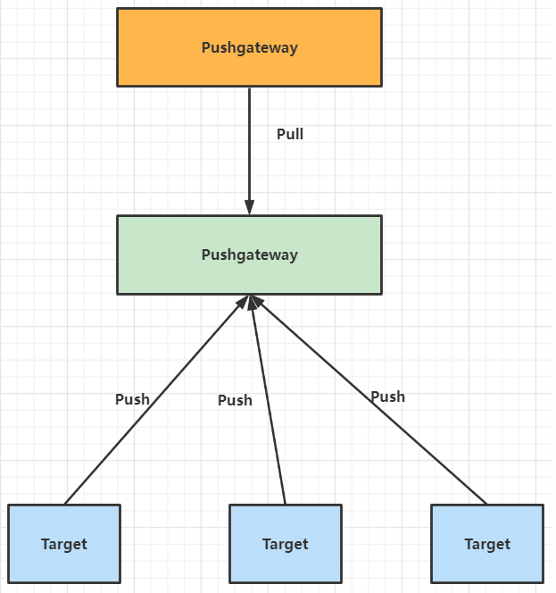

