搭建好监控环境并且监控了服务器、数据库、应用，运维人员可以实时了解当前被监控对象的运行情况，但是他们不可能时时坐在电脑边上盯着DashBoard，这就需要一个告警功能，当服务器或应用指标异常时发送告警，通过邮件或者短信的形式告诉运维人员及时处理。接下来就来介绍非常重要的功能——告警。

<!--more-->

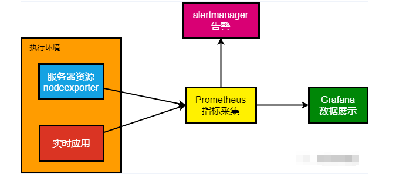

### 告警的实现方式

Prometheus将数据采集和告警分成了两个模块。报警规则配置在Prometheus Servers上，然后发送报警信息到AlertManger等告警系统，然后在告警系统管理这些报警信息、聚合报警信息、然后通过email、短信等方式发送消息告警。目前，实现告警功能主要有以下几种方式：

- 使用prometheus提供的Alertmanager告警组件（功能全面，告警规则配置比较复杂）。
- OneAlert等其他第三方组件（配置简单，可以实现短信、电话、微信等多种告警方式，但是依赖第三方平台，而且是收费的）
- Grafana 等自带的告警功能（配置简单）

相比于Grafana的图形化界面，Alertmanager需要依靠配置文件实现，虽然配置比较繁琐，但是胜在功能强大灵活。接下来我们就使用Alertmanager一步一步实现告警通知。

### Grafana告警

新版本的Grafana提供了告警配置，直接在dashboard监控panel中设置告警即可。Grafana 支持多种告警方式，这里以邮件为例，演示Grafana如何设置邮件告警功能。

#### 配置邮件服务

**step1**：要启用 email 报警需要在启动配置文件中 /conf/default.ini开启 SMTP 服务，具体配置如下：

```javascript
[smtp]
enabled = true
host = smtp.163.com:25
user = xxx@163.com  # 邮件地址
# If the password contains # or ; you have to wrap it with triple quotes. Ex """#password;"""
password = xxx    # 授权码
cert_file =
key_file =
skip_verify = true
from_address = xxx@163.com  # 发件人地址
from_name = Grafana
ehlo_identity = dashboard.example.com

[emails]
welcome_email_on_sign_up = false
templates_pattern = emails/*.html
content_types = text/html
```

这里的邮箱服务使用的是163的邮箱服务，需要提前打开邮箱的SMTP服务并申请授权码，示例中的邮箱地址和密码请换成自己的邮箱和授权码。

**step2**：重启Grafana，验证邮件是否配置成功，点击页面上的 Alerting | Contact points 添加Contact Points。

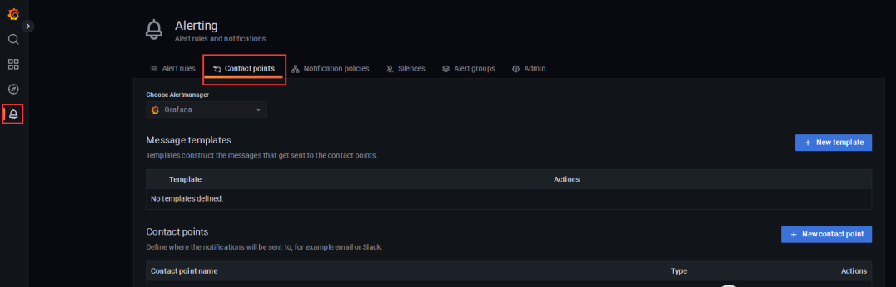

点击页面上的 New contact point 按钮，添加一个邮件通知渠道。

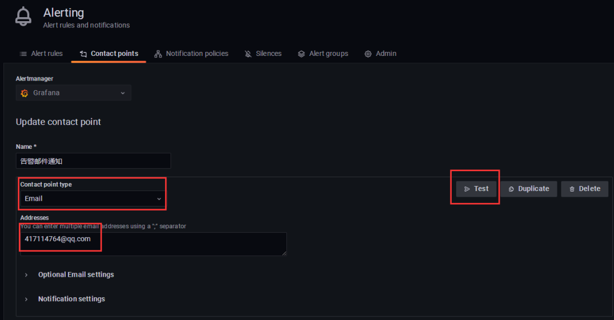

选择邮件方式，并输入收件人的邮箱后保存即可，验证邮箱是否配置成功，点击 Test 按钮，Grafana 会发送一封测试邮件到收件人邮箱。如果能收到邮件，说明配置成功。

#### 配置告警规则

配置好邮件发送和接收的Contact Points 之后，接下来我们配置Grafana的告警规则。

**step1**：创建告警告警规则，首先在某个Panel 上的下拉箭头中，选择 Edit | Alert。

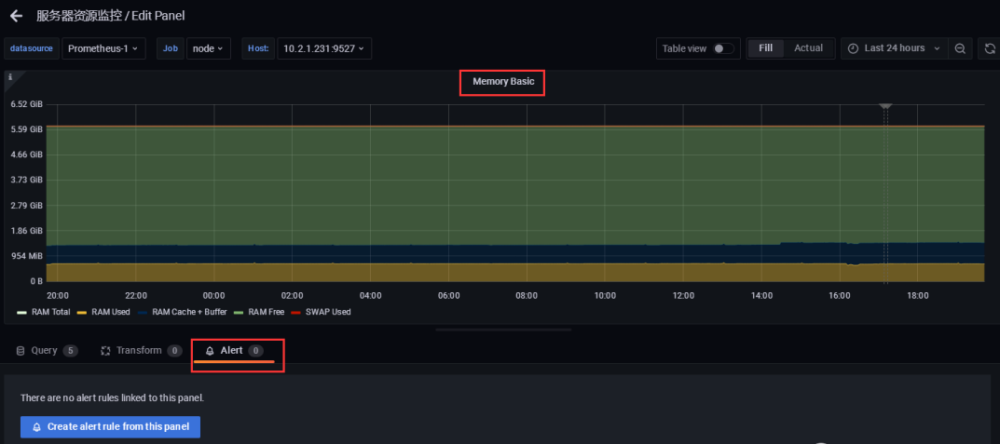

**step2**：接下来点击 Create alert from this panel 按钮，给此panel 创建告警规则。

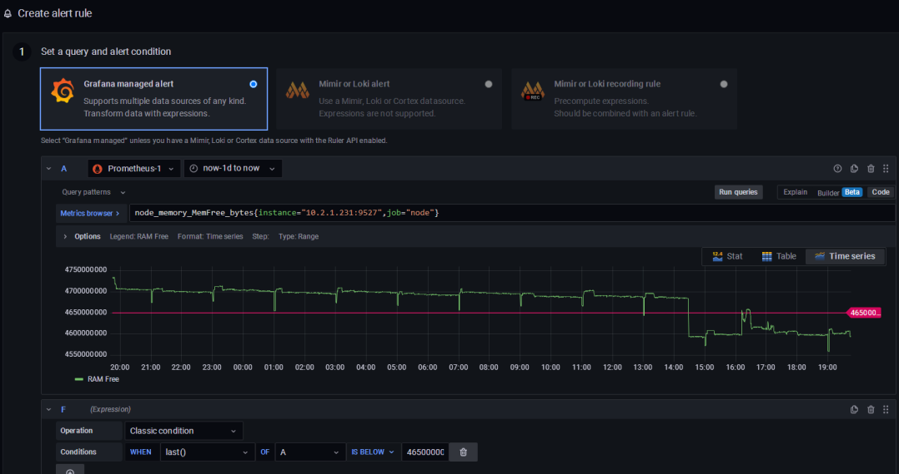

如上图所示，我们以`node_memory_MemFree_bytes` （服务器可用内存）指标为例，设置告警规则：当服务器可用内存低于4.65G 时告警。

**step3**：告警名称，间隔时间等设置。

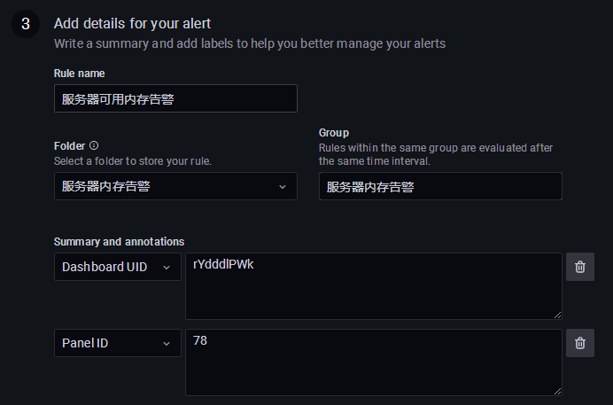

**step4**：设置完其他相关的参数之后，点击Save 保存，即可查看告警的情况。

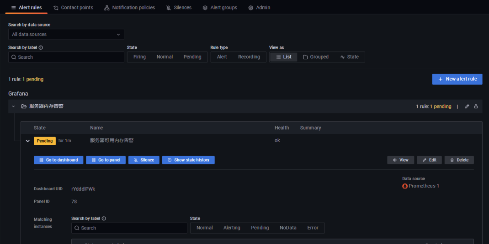

如上图所示，Grafana已经产生了一条Pending状态的告警的记录，当此记录变为Firing状态就说明已经告警成功，并发送了邮件通知。

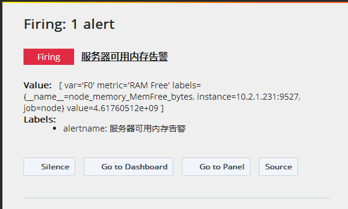

以上，我们把Grafana的告警功能介绍完了，Grafana虽然比较直观，但是相比Alertmanager而言不够灵活，不支持变量，如果系统不复杂的话，可以考虑使用Grafana。

### Alertmanager

#### 告警类型

Alertmanager提供了以下两种告警方式： 

- 邮件接收器 email_config，发送邮件通知；
- Webhook接收器 webhook_config，使用post方式向配置的url地址发送数据请求。

####  安装alertmanager

**step1**：安装Alertmanager

首先在prometheus官网，下载Alertmanager组件，并上传到服务器解压即可。

```javascript
# 解压到/usr/local/prometheus目录下：
tar -zxvf alertmanager-0.24.0.linux-amd64.tar.gz -C /usr/local/prometheus
# 修改目录名：
cd /usr/local/prometheus
mv alertmanager-0.24.0.linux-amd64 alertmanager-0.24.0
```

**step 2**：配置Alertmanager

修改alertmanager.yml 文件，增加Email等相关配置，具体如下：

```javascript
global:
  resolve_timeout: 5m  # alertmanager在持续多久没有收到新告警后标记为resolved
  smtp_from: 'xxx@163.com' # 发件人邮箱地址
  smtp_smarthost: 'smtp.163.com:25' # 邮箱smtp地址
  smtp_auth_username: 'xxx@163.com' # 发件人的登陆用户名，默认和发件人地址一致
  smtp_auth_password: 'xxx'  # 发件人的登陆密码，有时候是授权码
  smtp_hello: '163.com'
  smtp_require_tls:  # 是否需要tls协议。默认是true
  
route:
  group_by: [alertname] # 通过alertname的值对告警进行分类
  group_wait: 10s # 一组告警第一次发送之前等待的时延，即产生告警10s将组内新产生的消息合并发送，通常是0s~几分钟（默认是30s）
  group_interval: 2m # 一组已发送过初始告警通知的告警，接收到新告警后，下次发送通知前等待时延，通常是5m或更久（默认是5m）
  repeat_interval: 5m # 一组已经发送过通知的告警，重复发送告警的间隔，通常设置为3h或者更久（默认是4h）
  receiver: 'default-receiver' # 设置告警接收人

receivers:
- name: 'default-receiver'
  email_configs:
  - to: 'xxx@163.com'
    send_resolved: true # 发送恢复告警通知
    
inhibit_rules: # 抑制规则
  - source_match:  # 源匹配级别，当匹配成功发出通知，其他级别产生告警将被抑制
      severity: 'critical' # 告警时间级别（告警级别根据规则自定义）
    target_match: 
      severity: 'warning' # 匹配目标成功后，新产生的目标告警为'warning'将被抑制
    equal: ['alertname','dev','instance'] # 基于这些标签抑制匹配告警的级别
```

这里的邮箱服务使用的是163的邮箱服务，需要提前打开邮箱的SMTP服务并申请授权码，示例中的邮箱地址和密码请换成自己的邮箱和授权码。

配置文件比较复杂，可以使用`./amtool check-config alertmanager.yml` 命令校验文件是否正确。

**step 3**：启动运行

配置文件修改完成后，接下来我们将Alertmanager运行起来，具体命令如下：

```javascript
#alertmanager
cd /usr/local/prometheus/alertmanager-0.24.0
#执行启动命令，指定数据访问的url
alertmanager --config.file=/usr/local/prometheus/alertmanager-0.24.0/alertmanager.y
```

命令执行成功后，在浏览器中访问：http://10.2.1.231:9093/ 默认端口9093

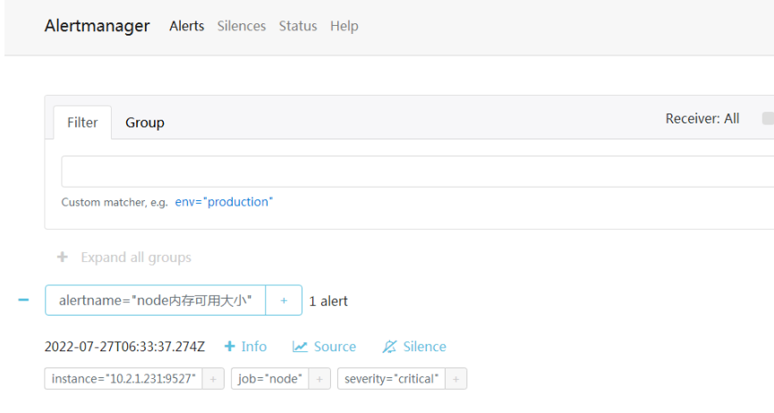

如上图所示，我们成功打开Alertmanager 管理页面，说明Alertmanager配置、启动成功。

#### 将Alertmanager添加到Prometheus

前面我们说了，告警规则是配置在Prometheus Servers上，然后发送报警信息到AlertManger中的，那么接下来我们把Alertmanager添加到Prometheus中。

**step1**：Prometheus告警配置

修改prometheus.yml 配置文件，增加告警地址和告警规则，具体配置如下：

```javascript
# Alertmanager configuration
alerting:
  alertmanagers:
    - static_configs:
        - targets: [10.2.1.231:9093]

# Load rules once and periodically evaluate them according to the global 'evaluation_interval'.
# 加载指定的规则文件
rule_files:
  - "first.rules"
  - "rules/*.yml"
```

上面的配置，主要是配置Alertmanager的地址和规则文件加载路径。告警规则读取prometheus目录的rule下的所有以yml结尾的文件。

**step2**：配置告警规则

前面在prometheus.yml 中配置了规则的路径，所以，接下来在prometheus的根目录下创建rules目录。这里以服务器资源状态状态为例，制定cpu、内存、磁盘的告警。创建pods_rule.yaml文件。具体配置如下：

```javascript
groups:
  - name: alertmanager_pod.rules
    rules:
    - alert: Pod_all_cpu_usage
      expr: (sum by(name)(rate(container_cpu_usage_seconds_total{image!=""}[5m]))*100) > 1
      for: 2m
      labels:
        serverity: critical
        service: pods
      annotations:
        description: 容器 {{ $labels.name }} CPU 资源利用率大于 10% , (current value is {{ $value }})
        summary: Dev CPU 负载告警

    - alert: Pod_all_memory_usage
      expr: sort_desc(avg by(name)(irate(node_memory_MemFree_bytes {name!=""}[5m]))) > 2147483648 # 内存大于2G
      for: 2m
      labels:
        severity: critical
      annotations:
        description: 容器 {{ $labels.name }} Memory 资源利用大于 2G , (current value is {{ $value }})
        summary: Dev Memory 负载告警

    - alert: Pod_all_network_receive_usage
      expr: sum by(name)(irate(container_network_reveive_bytes_total{container_name="POD"}[1m])) > 52428800 # 大于50M
      for: 2m
      labels:
        severity: critical
      annotations:
        description: 容器 {{ $labels.name }} network_receive 资源利用大于 50M , (current value is {{ $value }})

    - alert: node内存可用大小
      expr: node_memory_MemFree_bytes < 5368709120  # 内存小于5G
      for: 2m
      labels:
        severity: critical
      annotations:
        description: node可用内存小于5G
```

**step3**：重启Prometheus

配置完成后重启Prometheus，访问Prometheus查看告警配置。在浏览器中输入：http://10.2.1.231:9090/alerts 查看告警配置是否成功。

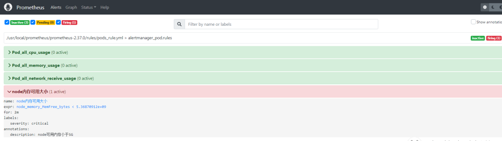

如上图所示，我们在Prometheus的Alerts下可以看到对应的告警配置。FIRING说明告警已成功。

此时Alertmanager应该相关的告警数据。打开http://10.2.1.231:9093/#/alerts 查看报警情况。

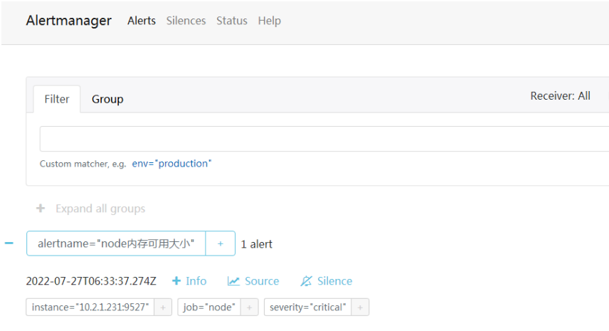

如上图所示，Alertmanager收到了Prometheus发过来的告警消息，前面我们在Alertmanager中配置了邮件地址，可以去邮箱中查看是否收到邮件。

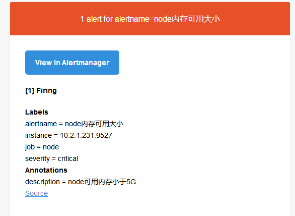

Alertmanager的告警内容支持使用模板配置，可以使用邮件模板进行渲染。
