Prometheus是一个开源系统监控和警报工具包，最初由 SoundCloud构建。自 2012 年启动以来，许多公司和组织都采用了 Prometheus，该项目拥有非常活跃的开发者和用户社区。它现在是一个独立的开源项目，独立于任何公司进行维护。为了强调这一点，并明确项目的治理结构，Prometheus 于 2016 年作为继Kubernetes之后的第二个托管项目加入了云原生计算基金会。

<!--more-->

### 监控方案

Cadvisor + node-exporter + prometheus + grafana

- Cadvisor：数据采集
- node-exporter：汇总
- prometheus：处理、存储
- grafana：展示

### 监控流程

- 容器监控：Prometheus使用cadvisor采集容器监控指标，而`cadvisor集成在K8S的kubelet中所以无需部署`，通过Prometheus进程存储，使用grafana进行展示。
- node节点监控：node端的监控通过`node_exporter`采集当前主机的资源，通过Prometheus进程存储，最后使用grafana进行展示。
- master节点监控：master的监控通过`kube-state-metrics`插件从K8S获取到`apiserver`的相关数据并通过网页页面暴露出来，然后通过Prometheus进程存储，最后使用grafana进行展示

### Kubernetes监控指标

####  K8S自身监控指标

- node资源利用率：监控node节点上的cpu、内存、硬盘等硬件资源
- node数量：监控node数量与资源利用率、业务负载的比例情况，对成本、资源扩展进行评估
- pod数量：监控当负载到一定程度时，node与pod的数量。评估负载到哪个阶段，大约需要多少服务器，以及每个pod的资源占用率，然后进行整体评估
- 资源对象状态：在K8S运行过程中，会创建很多pod、控制器、任务等，这些内容都是由K8S中的资源对象进行维护，所以可以对资源对象进行监控，获取资源对象的状态

#### Pod的监控

- 每个项目中pod的数量：分别监控正常、有问题的pod数量
- 容器资源利用率：统计当前pod的资源利用率，统计pod中的容器资源利用率，结合cpu、网络、内存进行评估
- 应用程序：监控项目中程序的自身情况，例如并发、请求响应等

|  监控指标   |      具体实现      |           案例            |
| :---------: | :----------------: | :-----------------------: |
|   Pod性能   |      cadvisor      |   容器的CPU、内存利用率   |
|  Node性能   |   node-exporter    | node节点的CPU、内存利用率 |
| K8S资源对象 | kube-state-metrics | pod、deployment、service  |

### 服务发现

从k8s的api中发现抓取的目标，并且始终与k8s集群状态保持一致。动态获取被抓取的目标，实时从api中获取当前状态是否存在，此过程为服务发现。

自动发现支持的组件：

- node：自动发现集群中的node节点
- pod：自动发现运行的容器和端口
- service：自动发现创建的serviceIP、端口
- endpoints：自动发现pod中的容器
- ingress：自动发现创建的访问入口和规则

### Prometheus监控Kubernetes部署实践

#### 部署准备

> 案例仅在master节点pull image

```
[root@master ~]# git clone https://github.com/redhatxl/k8s-prometheus-grafana.git  #这个仓库的yaml有几个错误，在本文章末尾已经改过来了，可以直接使用末尾的yaml文件
Cloning into 'k8s-prometheus-grafana'...
remote: Enumerating objects: 21, done.
remote: Total 21 (delta 0), reused 0 (delta 0), pack-reused 21
Unpacking objects: 100% (21/21), done.
[root@master ~]# ll
total 24
drwxr-xr-x  5 root root   94 Jul 12 16:07 k8s-prometheus-grafana   #克隆的目录
#在所有节点提前下载镜像
[root@master ~]# docker pull prom/node-exporter 
[root@master ~]# docker pull prom/prometheus:v2.0.0
[root@master ~]# docker pull grafana/grafana:6.1.4
```


#### 采用daemonset方式部署node-exporter

```shell
[root@master ~]# cd k8s-prometheus-grafana/
[root@master k8s-prometheus-grafana]# ll
total 8
drwxr-xr-x 2 root root  81 Jul 12 16:07 grafana
-rw-r--r-- 1 root root 668 Jul 12 16:07 node-exporter.yaml
drwxr-xr-x 2 root root 106 Jul 12 16:07 prometheus
-rw-r--r-- 1 root root 117 Jul 12 16:07 README.md
```

```
[root@master k8s-prometheus-grafana]# cat node-exporter.yaml
---
apiVersion: apps/v1
kind: DaemonSet
metadata:
  name: node-exporter
  namespace: kube-system
  labels:
    k8s-app: node-exporter
spec:
  selector:
    matchLabels:
      k8s-app: node-exporter
  template:
    metadata:
      labels:
        k8s-app: node-exporter
    spec:
      containers:
      - image: prom/node-exporter
        name: node-exporter
        ports:
        - containerPort: 9100
          protocol: TCP
          name: http
---
apiVersion: v1
kind: Service
metadata:
  labels:
    k8s-app: node-exporter
  name: node-exporter
  namespace: kube-system
spec:
  ports:
  - name: http
    port: 9100
    nodePort: 31672
    protocol: TCP
  type: NodePort
  selector:
    k8s-app: node-exporter
```


```shell
[root@master k8s-prometheus-grafana]# kubectl apply -f node-exporter.yaml
daemonset.apps/node-exporter created
service/node-exporter created

      
[root@master k8s-prometheus-grafana]# kubectl get pods -A
NAMESPACE     NAME                             READY   STATUS              RESTARTS   AGE
default       recycler-for-prometheus-data     0/1     ContainerCreating   0          5m42s
kube-system   coredns-7ff77c879f-m986g         1/1     Running             0          29h
kube-system   coredns-7ff77c879f-xhknw         1/1     Running             0          29h
kube-system   etcd-master                      1/1     Running             0          29h
kube-system   kube-apiserver-master            1/1     Running             0          29h
kube-system   kube-controller-manager-master   1/1     Running             2          29h
kube-system   kube-flannel-ds-ln5f6            1/1     Running             0          26h
kube-system   kube-flannel-ds-zhq42            1/1     Running             0          29h
kube-system   kube-proxy-9bssw                 1/1     Running             0          26h
kube-system   kube-proxy-wcdzk                 1/1     Running             0          29h
kube-system   kube-scheduler-master            1/1     Running             3          29h
kube-system   node-exporter-bnkm8              1/1     Running             0          2m19s #这就是新创建的


[root@master k8s-prometheus-grafana]# kubectl get daemonset -A
NAMESPACE     NAME              DESIRED   CURRENT   READY   UP-TO-DATE   AVAILABLE   NODE SELECTOR            AGE
kube-system   kube-flannel-ds   2         2         2       2            2           <none>                   29h
kube-system   kube-proxy        2         2         2       2            2           kubernetes.io/os=linux   29h
kube-system   node-exporter     1         1         1       1            1           <none>                   2m23s   #这个是新的daemonset

[root@master k8s-prometheus-grafana]# kubectl get service -A
NAMESPACE     NAME            TYPE        CLUSTER-IP      EXTERNAL-IP   PORT(S)                  AGE
default       kubernetes      ClusterIP   172.16.0.1      <none>        443/TCP                  29h
kube-system   kube-dns        ClusterIP   172.16.0.10     <none>        53/UDP,53/TCP,9153/TCP   29h
kube-system   node-exporter   NodePort    172.16.201.35   <none>        9100:31672/TCP           2m29s  #这是新的service
```

#### 部署Prometheus

```shell
[root@master k8s-prometheus-grafana]# cd prometheus/
[root@master prometheus]# ll
total 20
-rw-r--r-- 1 root root 5631 Jul 12 16:07 configmap.yaml
-rw-r--r-- 1 root root 1119 Jul 12 16:07 prometheus.deploy.yml
-rw-r--r-- 1 root root  237 Jul 12 16:07 prometheus.svc.yml
-rw-r--r-- 1 root root  716 Jul 12 16:07 rbac-setup.yaml
      
[root@master prometheus]# kubectl apply -f rbac-setup.yaml
clusterrole.rbac.authorization.k8s.io/prometheus configured
serviceaccount/prometheus configured
clusterrolebinding.rbac.authorization.k8s.io/prometheus configured

[root@master prometheus]# kubectl apply -f configmap.yaml
configmap/prometheus-config configured
      
[root@master prometheus]# kubectl apply -f prometheus.deploy.yml
deployment.apps/prometheus created

[root@master prometheus]# kubectl apply -f prometheus.svc.yml
service/prometheus created
```

#### 部署grafana

```shell
[root@master prometheus]# cd ../grafana/
[root@master grafana]# ll
total 12
-rw-r--r-- 1 root root 1449 Jul 12 16:07 grafana-deploy.yaml
-rw-r--r-- 1 root root  256 Jul 12 16:07 grafana-ing.yaml
-rw-r--r-- 1 root root  225 Jul 12 16:07 grafana-svc.yaml

[root@master grafana]# kubectl apply -f grafana-deploy.yaml
deployment.apps/grafana-core created

[root@master grafana]# kubectl apply -f grafana-svc.yaml
service/grafana created

[root@master grafana]# kubectl apply -f grafana-ing.yaml
ingress.extensions/grafana created
```

#### 校验测试

1）查看pod/svc信息

```shell
[root@master grafana]# kubectl get pods -A
NAMESPACE     NAME                             READY   STATUS              RESTARTS   AGE
default       recycler-for-prometheus-data     0/1     ContainerCreating   0          2m7s
kube-system   coredns-7ff77c879f-m986g         1/1     Running             0          30h
kube-system   coredns-7ff77c879f-xhknw         1/1     Running             0          30h
kube-system   etcd-master                      1/1     Running             0          30h
kube-system   grafana-core-768b6bf79c-wcmk9    1/1     Running             0          2m48s
kube-system   kube-apiserver-master            1/1     Running             0          30h
kube-system   kube-controller-manager-master   1/1     Running             2          30h
kube-system   kube-flannel-ds-ln5f6            1/1     Running             0          26h
kube-system   kube-flannel-ds-zhq42            1/1     Running             0          29h
kube-system   kube-proxy-9bssw                 1/1     Running             0          26h
kube-system   kube-proxy-wcdzk                 1/1     Running             0          30h
kube-system   kube-scheduler-master            1/1     Running             3          30h
kube-system   node-exporter-bnkm8              1/1     Running             0          18m
kube-system   prometheus-7486bf7f4b-f8k6x      1/1     Running             0          7m12s
      
      
[root@master grafana]# kubectl get svc -A
NAMESPACE     NAME            TYPE        CLUSTER-IP       EXTERNAL-IP   PORT(S)                  AGE
default       kubernetes      ClusterIP   172.16.0.1       <none>        443/TCP                  30h
kube-system   grafana         NodePort    172.16.198.56    <none>        3000:30931/TCP           5m15s   #grafana端口30931
kube-system   kube-dns        ClusterIP   172.16.0.10      <none>        53/UDP,53/TCP,9153/TCP   30h
kube-system   node-exporter   NodePort    172.16.201.35    <none>        9100:31672/TCP           22m  #node-exporter端口31672
kube-system   prometheus      NodePort    172.16.176.125   <none>        9090:30003/TCP           9m12s   #prometheus端口30003
```

2）查看页面

访问`http://10.10.11.202:31672/metrics`，这是node-exporter采集的数据。

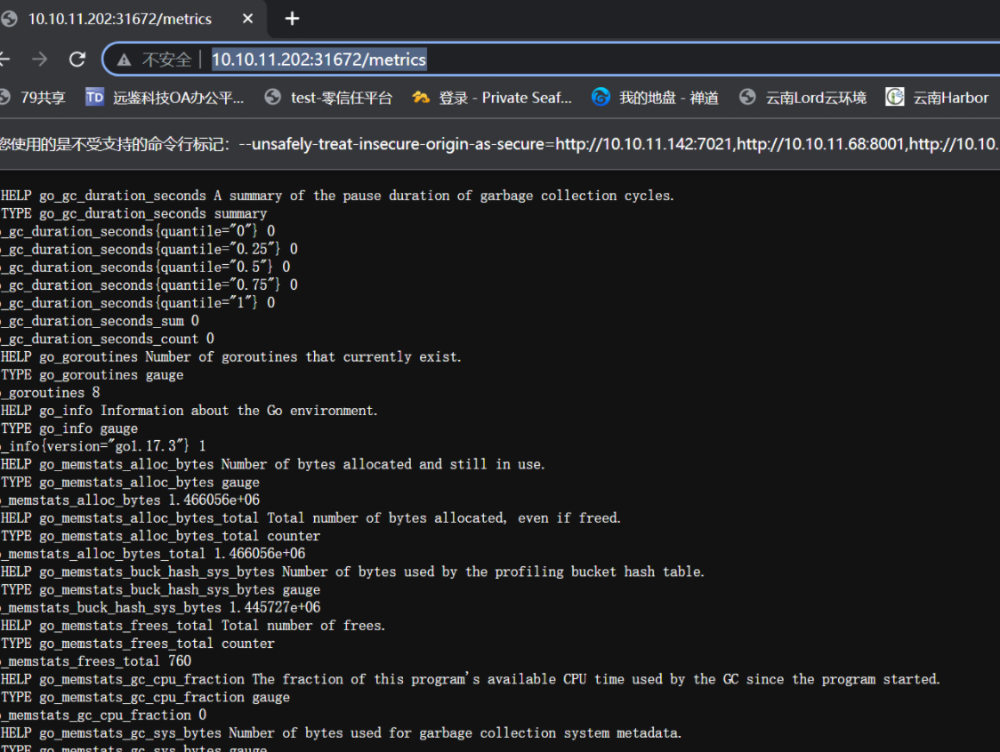

 访问`http://10.10.11.202:30003`，这是Prometheus的页面，依次点击`Status>Targets`可以看到已经成功连接到k8s的apiserver。

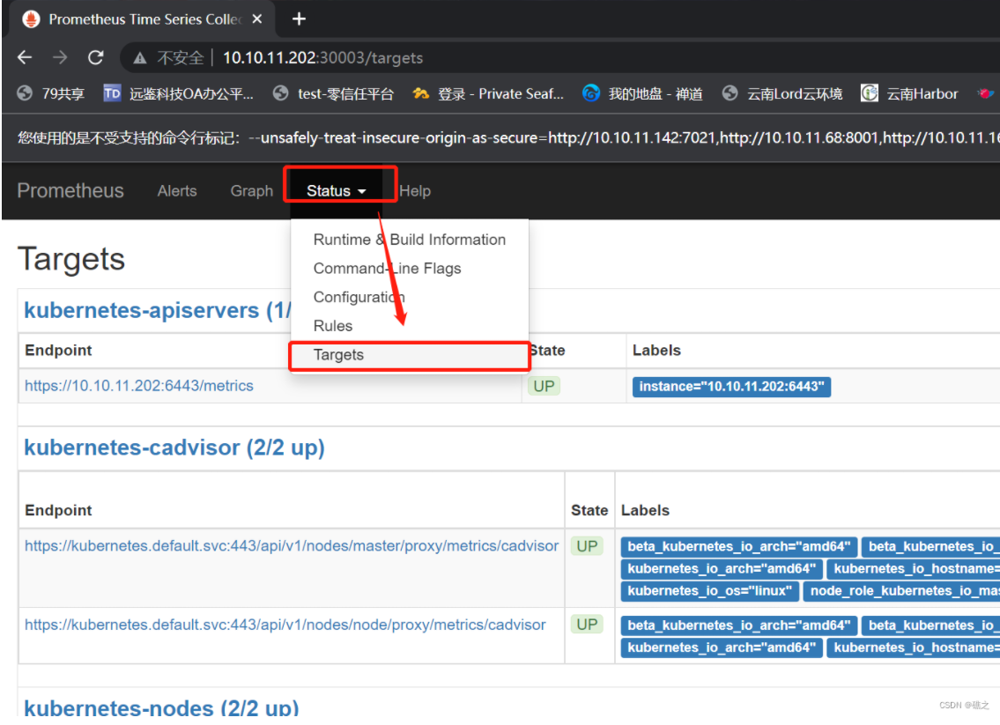

访问`http://10.10.11.202:30931`，这是grafana的页面，账户、密码都是`admin。`

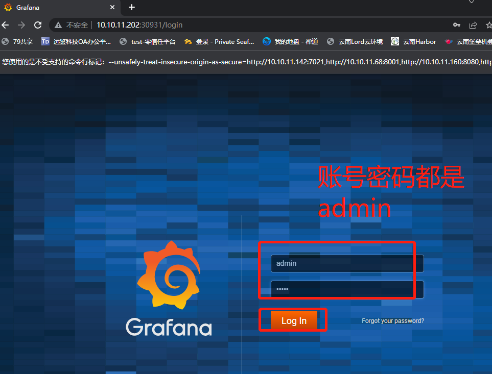

#### grafana模版配置

1）添加数据源，点击add，点击Prometheus

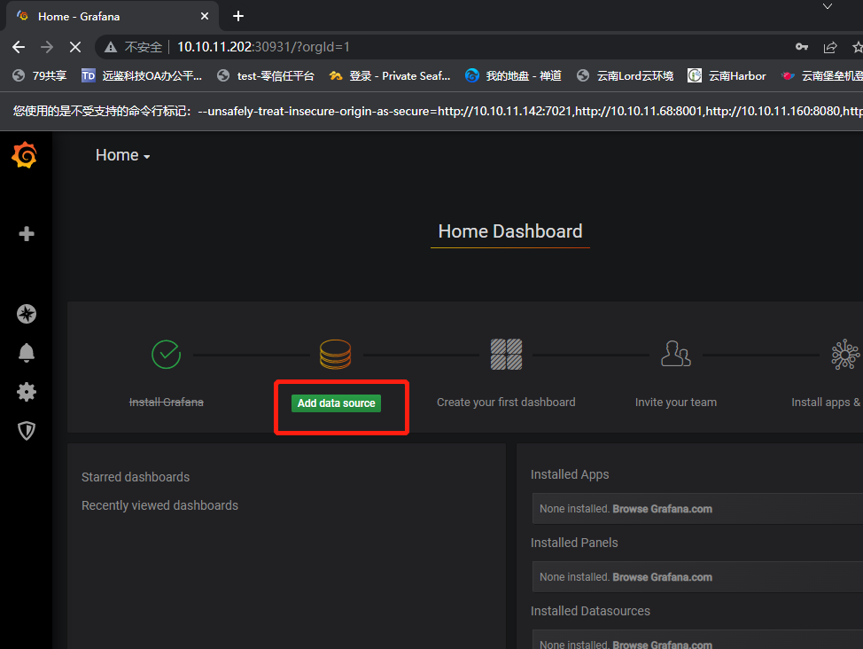

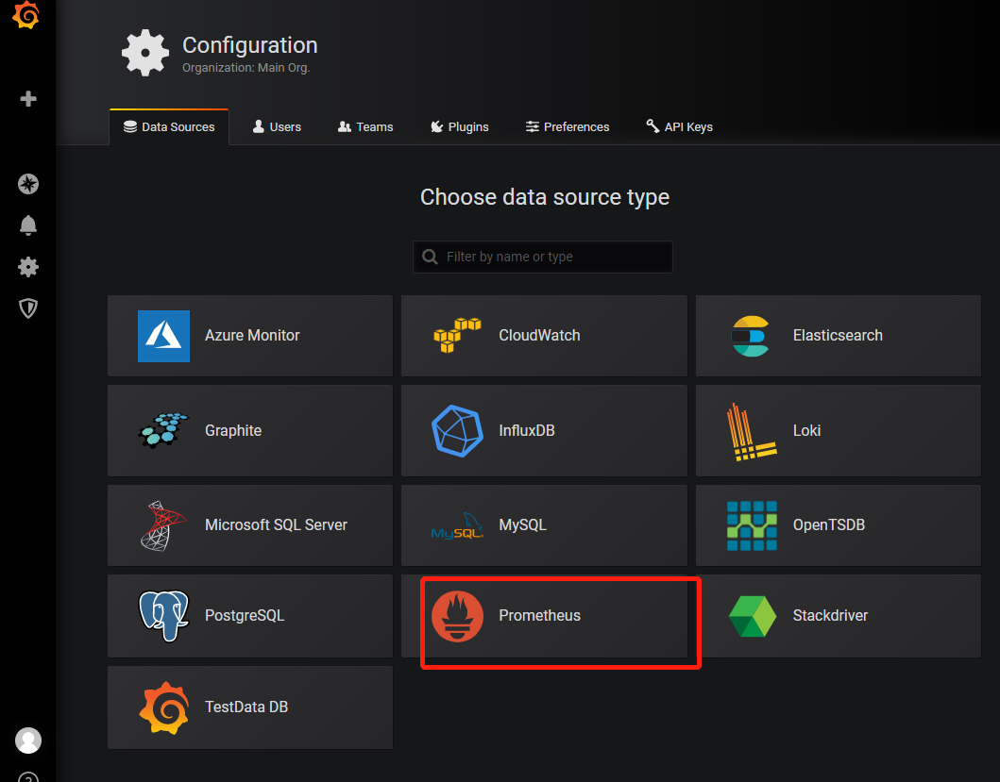 

2)依次进行设置，这里的URL需要注意：

URL需要写成，service.namespace:port 的格式，例如：

```shell
[root@master grafana]# kubectl get svc -A
NAMESPACE     NAME            TYPE        CLUSTER-IP       EXTERNAL-IP   PORT(S)                  AGE
default       kubernetes      ClusterIP   172.16.0.1       <none>        443/TCP                  46h
kube-system   grafana         NodePort    172.16.195.186   <none>        3000:30931/TCP           4m16s
kube-system   kube-dns        ClusterIP   172.16.0.10      <none>        53/UDP,53/TCP,9153/TCP   46h
kube-system   node-exporter   NodePort    172.16.201.35    <none>        9100:31672/TCP           17h
kube-system   prometheus      NodePort    172.16.176.125   <none>        9090:30003/TCP           16h
#以这里为例，namespace是kube-system,service是prometheus，pod端口是9090，那么最后的URL就是；
http://prometheus.kube-system:9090
```

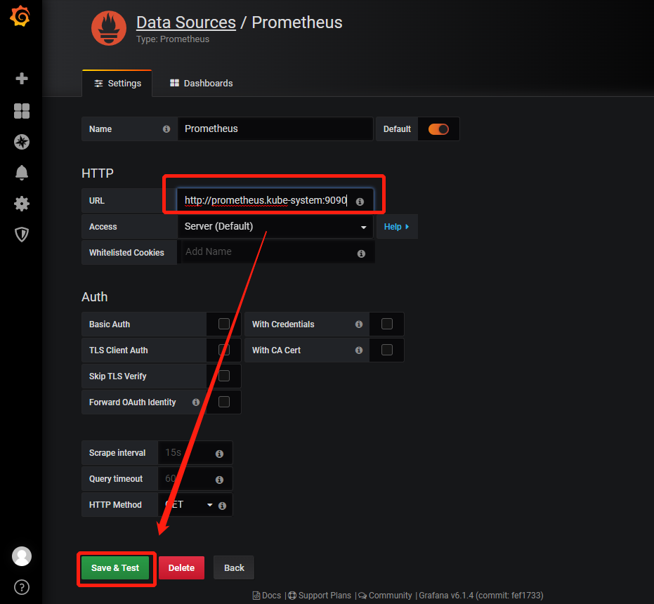

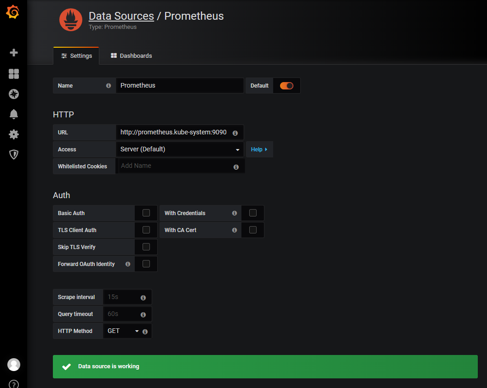


 3)导入K8S Dashboard模板

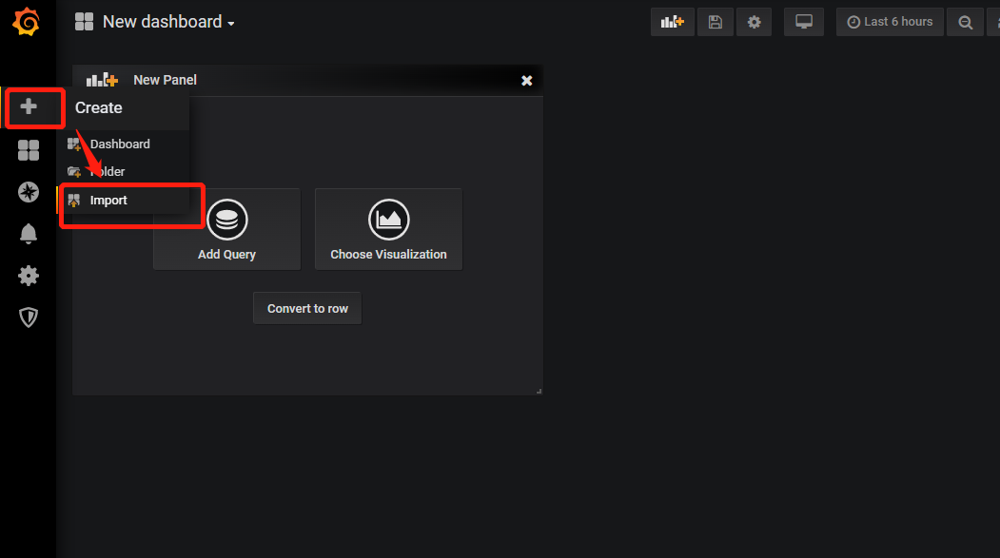

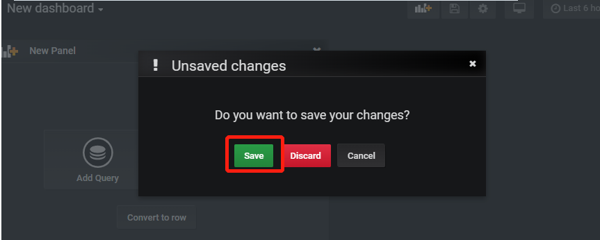 

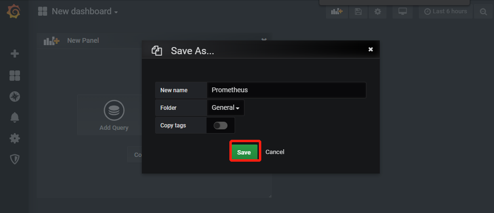 

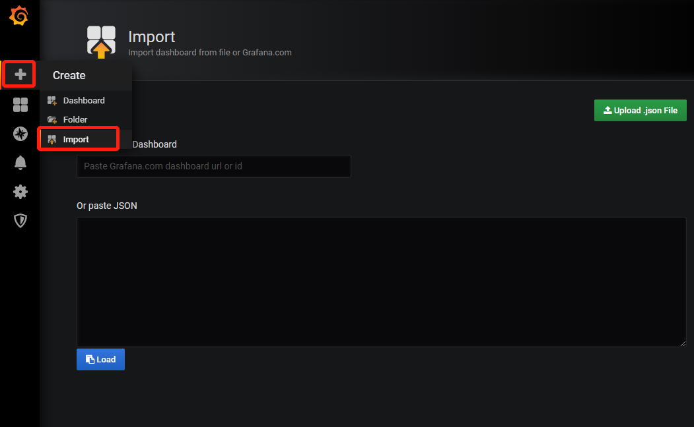

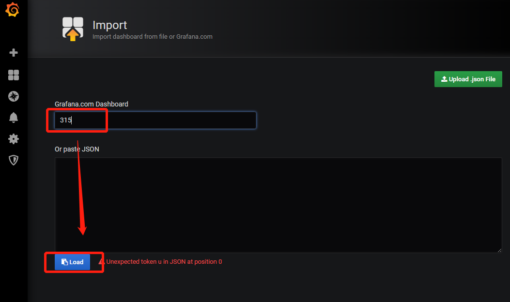 

4)name自定义，uid可以为空，会自己生成，然后选择数据源，选择刚才创建的`Prometheus`，最后点击`import`

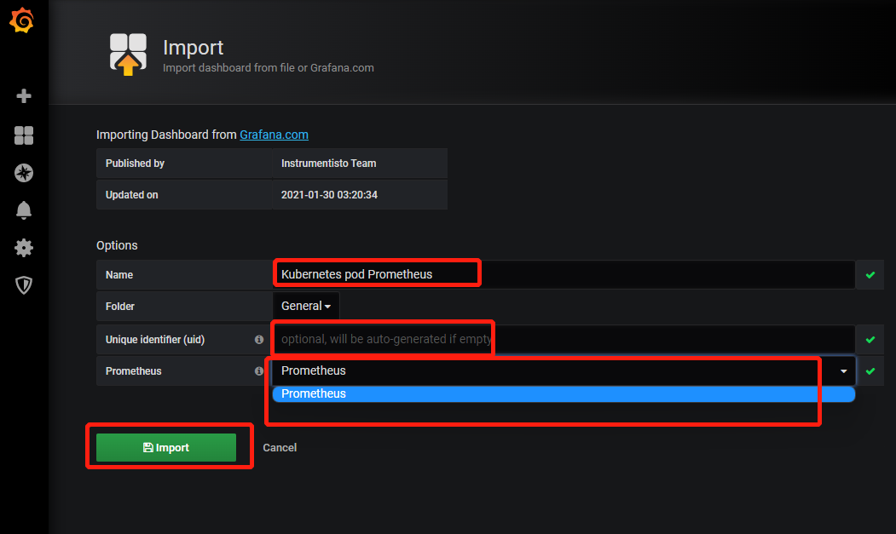

5）效果图展示

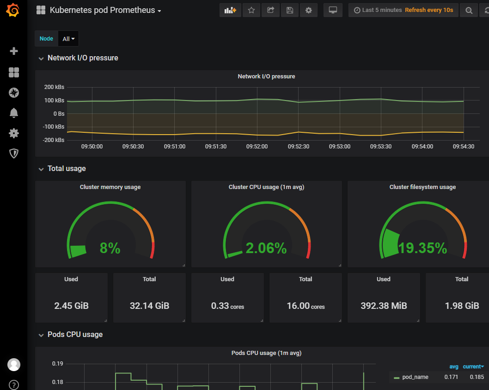

### yaml配置文件

#### node-exporter.yaml

```shell
---
apiVersion: apps/v1
kind: DaemonSet
metadata:
  name: node-exporter
  namespace: kube-system
  labels:
    k8s-app: node-exporter
spec:
  selector:
    matchLabels:
      k8s-app: node-exporter
  template:
    metadata:
      labels:
        k8s-app: node-exporter
    spec:
      containers:
      - image: prom/node-exporter
        name: node-exporter
        ports:
        - containerPort: 9100
          protocol: TCP
          name: http
---
apiVersion: v1
kind: Service
metadata:
  labels:
    k8s-app: node-exporter
  name: node-exporter
  namespace: kube-system
spec:
  ports:
  - name: http
    port: 9100
    nodePort: 31672
    protocol: TCP
  type: NodePort
  selector:
    k8s-app: node-exporter
```

#### rbac-setup.yaml

```shell
apiVersion: rbac.authorization.k8s.io/v1
kind: ClusterRole
metadata:
  name: prometheus
rules:
- apiGroups: [""]
  resources:
  - nodes
  - nodes/proxy
  - services
  - endpoints
  - pods
  verbs: ["get", "list", "watch"]
- apiGroups:
  - extensions
  resources:
  - ingresses
  verbs: ["get", "list", "watch"]
- nonResourceURLs: ["/metrics"]
  verbs: ["get"]
---
apiVersion: v1
kind: ServiceAccount
metadata:
  name: prometheus
  namespace: kube-system
---
apiVersion: rbac.authorization.k8s.io/v1
kind: ClusterRoleBinding
metadata:
  name: prometheus
roleRef:
  apiGroup: rbac.authorization.k8s.io
  kind: ClusterRole
  name: prometheus
subjects:
- kind: ServiceAccount
  name: prometheus
  namespace: kube-system
```


#### configmap.yaml

```shell
apiVersion: v1
kind: ConfigMap
metadata:
  name: prometheus-config
  namespace: kube-system
data:
  prometheus.yml: |
    global:
      scrape_interval:     15s
      evaluation_interval: 15s
    scrape_configs:
 
    - job_name: 'kubernetes-apiservers'
      kubernetes_sd_configs:
      - role: endpoints
      scheme: https
      tls_config:
        ca_file: /var/run/secrets/kubernetes.io/serviceaccount/ca.crt
      bearer_token_file: /var/run/secrets/kubernetes.io/serviceaccount/token
      relabel_configs:
      - source_labels: [__meta_kubernetes_namespace, __meta_kubernetes_service_name, __meta_kubernetes_endpoint_port_name]
        action: keep
        regex: default;kubernetes;https
 
    - job_name: 'kubernetes-nodes'
      kubernetes_sd_configs:
      - role: node
      scheme: https
      tls_config:
        ca_file: /var/run/secrets/kubernetes.io/serviceaccount/ca.crt
      bearer_token_file: /var/run/secrets/kubernetes.io/serviceaccount/token
      relabel_configs:
      - action: labelmap
        regex: __meta_kubernetes_node_label_(.+)
      - target_label: __address__
        replacement: kubernetes.default.svc:443
      - source_labels: [__meta_kubernetes_node_name]
        regex: (.+)
        target_label: __metrics_path__
        replacement: /api/v1/nodes/${1}/proxy/metrics
 
    - job_name: 'kubernetes-cadvisor'
      kubernetes_sd_configs:
      - role: node
      scheme: https
      tls_config:
        ca_file: /var/run/secrets/kubernetes.io/serviceaccount/ca.crt
      bearer_token_file: /var/run/secrets/kubernetes.io/serviceaccount/token
      relabel_configs:
      - action: labelmap
        regex: __meta_kubernetes_node_label_(.+)
      - target_label: __address__
        replacement: kubernetes.default.svc:443
      - source_labels: [__meta_kubernetes_node_name]
        regex: (.+)
        target_label: __metrics_path__
        replacement: /api/v1/nodes/${1}/proxy/metrics/cadvisor
 
    - job_name: 'kubernetes-service-endpoints'
      kubernetes_sd_configs:
      - role: endpoints
      relabel_configs:
      - source_labels: [__meta_kubernetes_service_annotation_prometheus_io_scrape]
        action: keep
        regex: true
      - source_labels: [__meta_kubernetes_service_annotation_prometheus_io_scheme]
        action: replace
        target_label: __scheme__
        regex: (https?)
      - source_labels: [__meta_kubernetes_service_annotation_prometheus_io_path]
        action: replace
        target_label: __metrics_path__
        regex: (.+)
      - source_labels: [__address__, __meta_kubernetes_service_annotation_prometheus_io_port]
        action: replace
        target_label: __address__
        regex: ([^:]+)(?::\d+)?;(\d+)
        replacement: $1:$2
      - action: labelmap
        regex: __meta_kubernetes_service_label_(.+)
      - source_labels: [__meta_kubernetes_namespace]
        action: replace
        target_label: kubernetes_namespace
      - source_labels: [__meta_kubernetes_service_name]
        action: replace
        target_label: kubernetes_name
 
    - job_name: 'kubernetes-services'
      kubernetes_sd_configs:
      - role: service
      metrics_path: /probe
      params:
        module: [http_2xx]
      relabel_configs:
      - source_labels: [__meta_kubernetes_service_annotation_prometheus_io_probe]
        action: keep
        regex: true
      - source_labels: [__address__]
        target_label: __param_target
      - target_label: __address__
        replacement: blackbox-exporter.example.com:9115
      - source_labels: [__param_target]
        target_label: instance
      - action: labelmap
        regex: __meta_kubernetes_service_label_(.+)
      - source_labels: [__meta_kubernetes_namespace]
        target_label: kubernetes_namespace
      - source_labels: [__meta_kubernetes_service_name]
        target_label: kubernetes_name
 
    - job_name: 'kubernetes-ingresses'
      kubernetes_sd_configs:
      - role: ingress
      relabel_configs:
      - source_labels: [__meta_kubernetes_ingress_annotation_prometheus_io_probe]
        action: keep
        regex: true
      - source_labels: [__meta_kubernetes_ingress_scheme,__address__,__meta_kubernetes_ingress_path]
        regex: (.+);(.+);(.+)
        replacement: ${1}://${2}${3}
        target_label: __param_target
      - target_label: __address__
        replacement: blackbox-exporter.example.com:9115
      - source_labels: [__param_target]
        target_label: instance
      - action: labelmap
        regex: __meta_kubernetes_ingress_label_(.+)
      - source_labels: [__meta_kubernetes_namespace]
        target_label: kubernetes_namespace
      - source_labels: [__meta_kubernetes_ingress_name]
        target_label: kubernetes_name
 
    - job_name: 'kubernetes-pods'
      kubernetes_sd_configs:
      - role: pod
      relabel_configs:
      - source_labels: [__meta_kubernetes_pod_annotation_prometheus_io_scrape]
        action: keep
        regex: true
      - source_labels: [__meta_kubernetes_pod_annotation_prometheus_io_path]
        action: replace
        target_label: __metrics_path__
        regex: (.+)
      - source_labels: [__address__, __meta_kubernetes_pod_annotation_prometheus_io_port]
        action: replace
        regex: ([^:]+)(?::\d+)?;(\d+)
        replacement: $1:$2
        target_label: __address__
      - action: labelmap
        regex: __meta_kubernetes_pod_label_(.+)
      - source_labels: [__meta_kubernetes_namespace]
        action: replace
        target_label: kubernetes_namespace
      - source_labels: [__meta_kubernetes_pod_name]
        action: replace
        target_label: kubernetes_pod_name
```

#### prometheus.deploy.yml 

```shell
---
apiVersion: apps/v1
kind: Deployment
metadata:
  labels:
    name: prometheus-deployment
  name: prometheus
  namespace: kube-system
spec:
  replicas: 1
  selector:
    matchLabels:
      app: prometheus
  template:
    metadata:
      labels:
        app: prometheus
    spec:
      containers:
      - image: prom/prometheus:v2.0.0
        name: prometheus
        command:
        - "/bin/prometheus"
        args:
        - "--config.file=/etc/prometheus/prometheus.yml"
        - "--storage.tsdb.path=/prometheus"
        - "--storage.tsdb.retention=24h"
        ports:
        - containerPort: 9090
          protocol: TCP
        volumeMounts:
        - mountPath: "/prometheus"
          name: data
        - mountPath: "/etc/prometheus"
          name: config-volume
        resources:
          requests:
            cpu: 100m
            memory: 100Mi
          limits:
            cpu: 500m
            memory: 2500Mi
      serviceAccountName: prometheus
      volumes:
      - name: data
        emptyDir: {}
      - name: config-volume
        configMap:
          name: prometheus-config
```

#### prometheus.svc.yml 

```shell
---
kind: Service
apiVersion: v1
metadata:
  labels:
    app: prometheus
  name: prometheus
  namespace: kube-system
spec:
  type: NodePort
  ports:
  - port: 9090
    targetPort: 9090
    nodePort: 30003
  selector:
    app: prometheus
```

#### grafana-deploy.yaml 

```shell
apiVersion: apps/v1
kind: Deployment
metadata:
  name: grafana-core
  namespace: kube-system
  labels:
    app: grafana
    component: core
spec:
  replicas: 1
  selector:
    matchLabels:
      app: grafana
  template:
    metadata:
      labels:
        app: grafana
        component: core
    spec:
      containers:
      - image: grafana/grafana:6.1.4
        name: grafana-core
        imagePullPolicy: IfNotPresent
        # env:
        resources:
          # keep request = limit to keep this container in guaranteed class
          limits:
            cpu: 100m
            memory: 100Mi
          requests:
            cpu: 100m
            memory: 100Mi
        env:
          # The following env variables set up basic auth twith the default admin user and admin password.
          - name: GF_AUTH_BASIC_ENABLED
            value: "true"
          - name: GF_AUTH_ANONYMOUS_ENABLED
            value: "false"
          # - name: GF_AUTH_ANONYMOUS_ORG_ROLE
          #   value: Admin
          # does not really work, because of template variables in exported dashboards:
          # - name: GF_DASHBOARDS_JSON_ENABLED
          #   value: "true"
        readinessProbe:
          httpGet:
            path: /login
            port: 3000
          # initialDelaySeconds: 30
          # timeoutSeconds: 1
        #volumeMounts:   #先不进行挂载
        #- name: grafana-persistent-storage
        #  mountPath: /var
      #volumes:
      #- name: grafana-persistent-storage
        #emptyDir: {}
```

####  grafana-svc.yaml

```shell
apiVersion: v1
kind: Service
metadata:
  name: grafana
  namespace: kube-system
  labels:
    app: grafana
    component: core
spec:
  type: NodePort
  ports:
    - port: 3000
  selector:
    app: grafana
    component: core
```

####  grafana-svc.yaml 

```shell
apiVersion: extensions/v1beta1
kind: Ingress
metadata:
   name: grafana
   namespace: kube-system
spec:
   rules:
   - host: k8s.grafana
     http:
       paths:
       - path: /
         backend:
          serviceName: grafana
          servicePort: 3000
```
