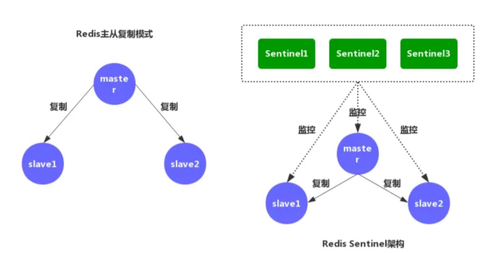
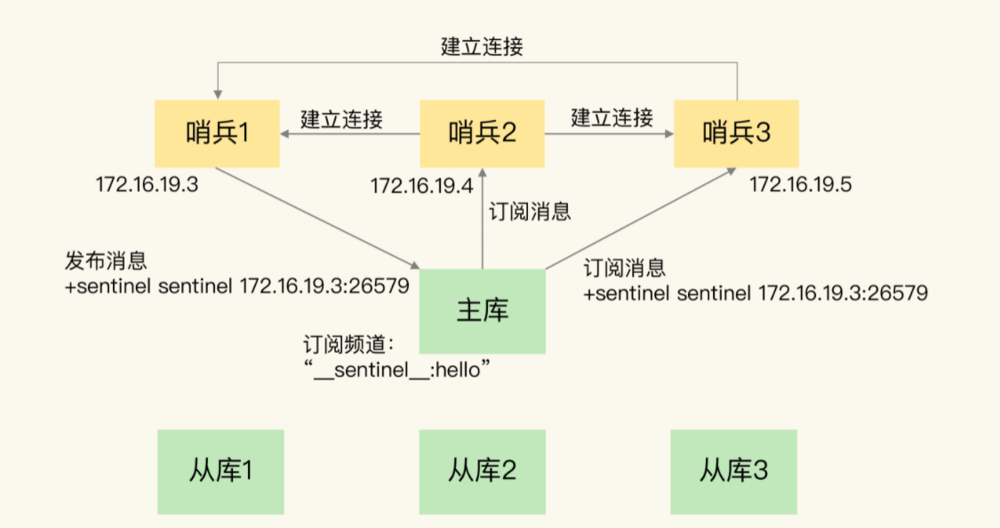
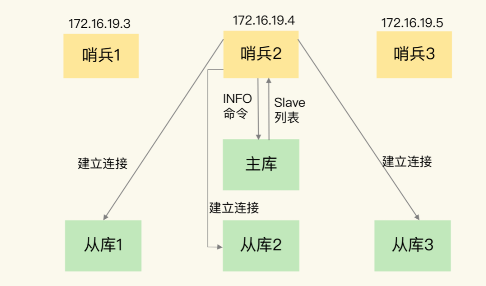
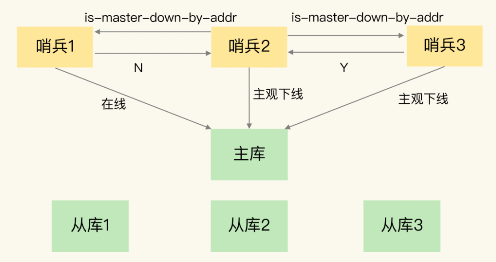
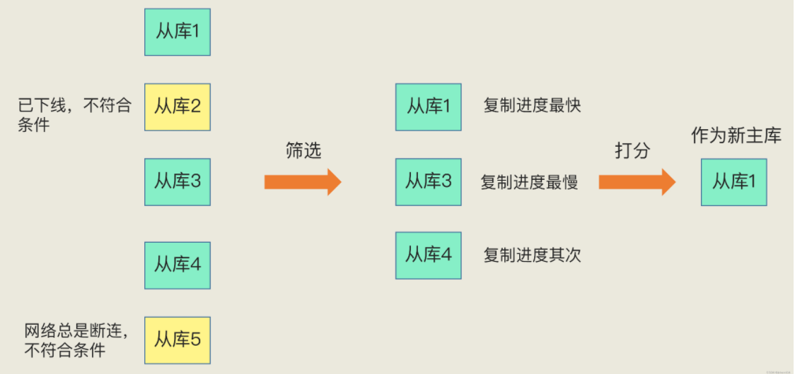
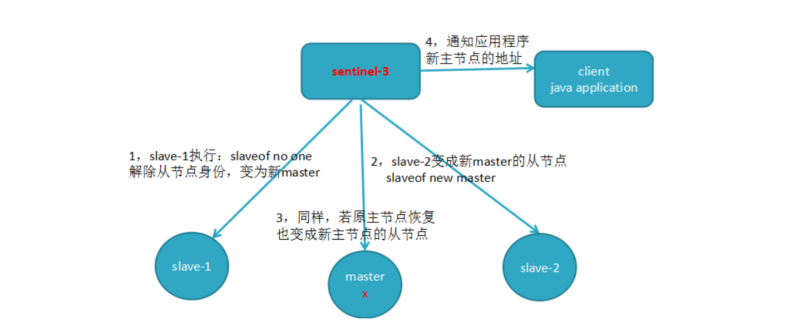
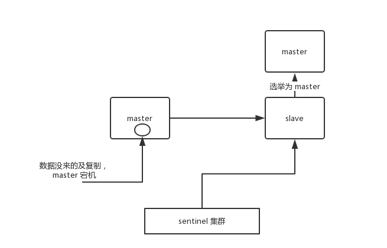
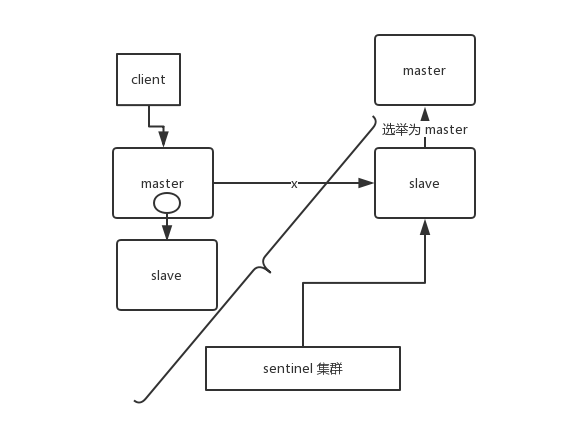

 Redis 的主从复制模式下，一旦主节点由于故障不能提供服务，需要手动将从节点晋升为 主节点，同时还要通知客户端更新主节点地址，这种故障处理方式从一定程度上是无法接受的。Redis 2.8 以后提供了 Redis Sentinel 哨兵机制 来解决这个问题。

<!--more-->

##   哨兵简介

###     哨兵的组成

Redis 哨兵（Sentinel）是由一个或多个 Sentinel 实例组成的 Sentinel 系统，可以监视任意多个主服务器，以及这些主服务器的所有从服务器。

Sentinel 本质上是一个运行在特殊状模式下的 Redis 服务器。Sentinel 模式下 Redis 服务器只支持 PING、SENTINEL、INFO、SUBSCRIBE、UNSUBSCRIBE、PSUBSCRIBE、PUNSUBSCRIBE 七个命令。



###     哨兵的作用

​    Redis官方文档的描述如下：

- 监控（Monitoring）：哨兵会不断地检查主节点和从节点是否运作正常。
- 自动故障转移（Automatic failover）：当主节点不能正常工作时，哨兵会开始自动故障转移操作，它会将失效主节点的其中一个从节点升级为新的主节点，并让其他从节点改为复制新的主节点。
- 配置提供者（Configuration provider）：客户端在初始化时，通过连接哨兵来获得当前Redis服务的主节点地址。
- 通知（Notification）：哨兵可以将故障转移的结果发送给客户端。

​    其中，监控和自动故障转移功能，使得哨兵可以及时发现主节点故障并完成转移；而配置提供者和通知功能，则需要在与客户端的交互中才能体现。


## 哨兵的运行机制

###     哨兵启动

​    当一个 Sentinel 启动时，会创建连向被监视的主服务器的网络连接。它可以向主服务器发送命令，并从命令回复中获取相关的信息。对于每个被 Sentinel 监视的主服务器，Sentinel 会创建两个连向主服务器的异步网络：

​    命令连接：用于向主服务器发送命令（包括ping、info），并接受命令回复，用来获取从节点的信息与Sentinel 、Redis节点的状态信息。
​    订阅连接：用于订阅主服务器的 __sentinel__:hello 频道，用来和其他Sentinel 实例建立连接。

###     订阅频道

​    Sentinel实例会向与其连接的节点（包括主从节点）的 __sentinel__:hello 频道发送消息， 并订阅该频道（SUBSCRIBE __sentinel__:hello）。这样一来，当后续的Sentinel实例与主库建立连接，发送消息时，之前订阅该频道的消息就能够收到新实例加入的消息，然后就可以从这个频道直接获取新实例的信息并建立网络连接。

​    以下图为例，哨兵 1 把自己的 IP（172.16.19.3）和端口（26579）发布到__sentinel__:hello频道上，哨兵 2 和 3 订阅了该频道。那么此时，哨兵 2 和 3 就可以从这个频道直接获取哨兵 1 的 IP 地址和端口号。然后，哨兵 2、3 可以和哨兵 1 建立网络连接。



​    Sentinel 对 __sentinel__:hello 频道的订阅会一直持续到 Sentinel 与服务器断开连接为止。在在此之前Sentinel 会以每两秒一次的频率，通过命令向所有被监视的主服务器和从服务器发送自己的信息及主节点相关的配置。

###     获取服务器信息

​    Sentinel 向服务器（主从节点都有）发送 INFO 命令，获取主服务器及它的从服务器信息。

####     获取主服务器信息     

​    Sentinel 默认会以每十秒一次的频率，通过命令连接向被监视的服务器发送 INFO 命令，并通过分析 INFO 命令的回复来获取主服务器的当前信息。

- 主服务自身信息：包括 run_id 域记录的服务器运行 ID，以及 role 域记录的服务器角色
- 主服务的从服务器信息：包括 IP 地址和端口号

####     获取从服务器信息

​    当 Sentinel 发现主服务器有新的从服务器出现时，Sentinel 除了会为这个新的从服务器创建相应的实例结构之外，Sentinel 还会创建连接到从服务器的命令连接和订阅连接。




###     检测服务器状态    

​    Sentinel 向 Redis 服务器发送PING命令，检查其状态。

​    每个 Sentinel 节点会以每秒一次的频率对 Redis 节点和 其它 的 Sentinel 节点发送 PING 命令，并通过节点的回复来判断节点是否在线。哨兵正是通过这个机制得以判断主节点是否下线，这将涉及到2个新的改变，主观下线与客观下线。

​    注意：一个有效的 PING 回复可以是：+PONG、-LOADING 或者 -MASTERDOWN。如果服务器返回除以上三种回复之外的其他回复，又或者在指定时间内没有回复 PING 命令， 那么 Sentinel 认为服务器返回的回复 无效（non-valid）。


## 故障处理

​    在上文中，我们留了2个概念（主观下线与客观下线）没有解释，这一节我们结合哨兵对故障的处理进行讲解。

###     主库下线判定

####     主观下线

​    主观下线适用于所有主节点和从节点。如果最后一次有效回复PING命令的时间超过 down-after-milliseconds 毫秒，则会判定该节点为主观下线（SDOWN）。

​    注意：主从节点都可能被标记为主观下线，只不过只会对主机节点的客观下线进行下一步判断。在一般情况下，每个 Sentinel 会以每 10 秒一次的频率，向它已知的所有主服务器和从服务器发送 INFO 命令**。**当一个主服务器被 Sentinel 标记为客观下线时，Sentinel 向下线主服务器的所有从服务器发送INFO命令的频率，会从10秒一次改为每秒一次。

####     客观下线

​    客观下线只适用于主节点。当 Sentinel 将一个主服务器判断为主管下线后，为了确认这个主服务器是否真的下线，会向同样监视这一主服务器的其他 Sentinel 询问（ 通过sentinel is-master-down-by-addr指令判断），看它们是否也认为主服务器已经下线。

​    其他哨兵会根据自己和主库的连接情况，做出 Y 或 N 的响应，Y 相当于赞成票，N相当于反对票。如果赞成票数（这里是2）是大于等于哨兵配置文件中的 quorum 配置项（比如quorum=2）, 则可以判定主库客观下线了。当足够数量的 Sentinel 认为主服务器已下线，就判定其为客观下线（ODOWN），并对其执行故障转移操作。



###  哨兵集群的选举

​    当一个主服务器被判断为客观下线时，监视这个下线主服务器的各个 Sentinel 会进行选举，选举出一个领头的 Sentinel，并由领头 Sentinel 对下线主服务器执行故障转移操作。

​    哨兵的选举机制使用Raft[（Raft算法详解）](https://zhuanlan.zhihu.com/p/32052223)选举算法： 

​    每个发现服务客观下线的sentinel，都会要求其他sentinel将自己设置成领头。所有的sentinel都有且只有一次将某个sentinel选举成领头的机会（在一轮选举中），一旦选举某个sentinel为领头，不能更改。领头sentinel是先到先得，一旦当前sentinel设置了领头sentinel，以后要求设置sentinel为领头请求都会被拒绝。

​    成为领头sentinel的条件如下：

- 拿到半数以上的赞成票；
- 拿到的票数同时还需要大于等于哨兵配置文件中的 quorum 值。

​    当有3个哨兵时，quorum 设置为 2，那么，任何一个想成为 Leader 的哨兵只要拿到 2 张赞成票，就可以了。

### 新主库的选出

​    主库被判定为客观下线后，就需要从剩余的从库中选择一个新的主库。

- 过滤列表中所有处于下线或断线状态的从服务器。
- 过滤列表中所有最近五秒没有回复过 Sentinel Leader 的 INFO 命令的从服务器。
- 过滤所有与已下线主服务器连接断开超过 down-after-milliseconds \*10 毫秒的从服务器（down-after-milliseconds 指定了判断主服务器下线所需的时间）。

​    然后， Sentinel Leader 先选出优先级最高的从服务器；如果优先级一样高，再选择复制偏移量最大的从服务器；如果结果还不唯一，则选出运行 ID 最小的从服务器。



###  故障的转移

​    在上文中，Sentinel Leader 已经挑选出了新的主节点，接下来就要进行故障转移了。

​    首先向这个从节点发送 SLAVEOF no one 命令，将其转换为主节点（5.0 中应该是replicaof no one）。然后Sentinel Leader 会向所有从节点发送 SLAVEOF 命令，让所有从节点指向新的主节点并复制新的主节点上的数据，然后通知客户端主节点已更换，最后将旧的主服务器标记为从服务器。当旧的主服务器重新上线，Sentinel Leader 会向它发送 SLAVEOF 命令，让其成为从服务器。

​    



​    **最后，需要注意的是，主从切换并不一定就能完成，下面举个例子，Redis 1主4从，5个哨兵，哨兵配置quorum为2，如果3个哨兵故障，此时主节点宕机。**

​    由于quorum=2，所以当一个哨兵判断主库“主观下线”后，询问另外一个哨兵后也会得到同样的结果，2个哨兵都判定“主观下线”，达到了quorum的值，因此，哨兵集群可以判定主库为“客观下线”。

​    但哨兵不能完成主从切换。哨兵标记主库“客观下线后”，在选举“哨兵领导者”时，一个哨兵必须拿到超过多数的选票(5/2+1=3票)。但目前只有2个哨兵活着，无论怎么投票，一个哨兵最多只能拿到2票，永远无法达到N/2+1选票的结果。

​    当没有足够数量的 Sentinel 同意 主服务器 下线时， 主服务器 的 客观下线状态 就会被移除。当 主服务器 重新向 Sentinel 的 PING 命令返回 有效回复 时，主服务器 的 主观下线状态 就会被移除。同样，从服务器的主观下线状态在PING命令得到有效回复后移除。


## 补充

### 数据丢失问题的产生

​    即使使用了哨兵机制，也并不代表能彻底的解决数据丢失的问题，下面我们看下以下2个问题

#### 异步复制导致的数据丢失

​    因为 master->slave 的复制是异步的，所以可能有部分数据还没复制到 slave，master 就宕机了，此时这部分数据就丢失了。



#### 脑裂导致的数据丢失

​    脑裂，即一个主从关系中出现了2个主节点，例如某个 master 所在机器突然脱离了正常的网络，跟其他 slave 机器不能连接，但是实际上 master 还运行着。此时哨兵可能就会认为 master 宕机了，然后开启选举，将其他 slave 切换成了 master。这个时候，集群里就会有两个 master ，也就是所谓的脑裂。

​    此时虽然某个 slave 被切换成了 master，但是可能 client 还没来得及切换到新的 master，还继续向旧 master 写数据。因此旧 master 再次恢复的时候，会被作为一个 slave 挂到新的 master 上去，自己的数据会清空，重新从新的 master 复制数据。而新的 master 并没有后来 client 写入的数据，因此，这部分数据也就丢失了。



### 数据丢失问题的解决方案

​    以上无论是第一种还是第二种情况，都是因为主从节点间网络通信异常导致，于是我们可以通过对主节点写入数据的条件进行一定的限制：

```bash
min-slaves-to-write 3
min-slaves-max-lag 10
```

​     当从服务器小于 3 个，或三个从服务器的延迟（lag）都大于等于 10 秒时，主服务器将拒绝执行写命令，直至故障恢复。通过对主节点进行限制，能够保证当主节点挂机后丢失的数据尽量少。
