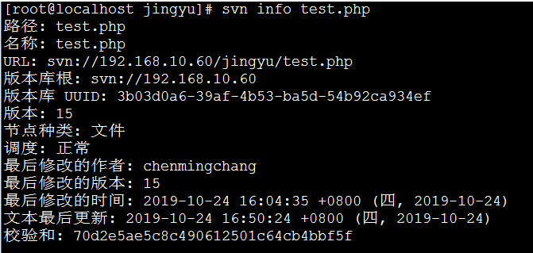

Linux命令行SVN使用教程

<!-- more-->

客户端使用：
(如果是第一次提交文件，很可能会出现“svn：'.'不是工作副本”，即当前目录不是工作副本，这个时候需要用到import)eg：

```bash
svn import . url
```

1、将文件checkout到本地目录

```bash
svn checkout path  #path是服务器上的目录
```

例如：

```
svn checkout svn://192.168.10.60/jingyu
```

简写：

```
svn co
```


2、往版本库中添加新的文件

```
svn add file
```

例如：

```bash
svn add test.php  #添加test.php
```


```bash
svn add *.php  #添加当前目录下所有的php文件
```

3、将改动的文件提交到版本库

```bash
svn commit -m “LogMessage“ [-N] [–no-unlock] PATH  #如果选择了保持锁，就使用–no-unlock开关
```

例如：

```
svn commit -m “add test file for my test“ test.php
```

简写：

```
svn ci
```


4、加锁/解锁

```
svn lock -m “LockMessage“ [–force] PATH
```

例如：

```
svn lock -m “lock test file“ test.php
svn unlock PATH
```

5、更新到某个版本

```
svn update -r m path
```

例如：

```bash
svn update   #如果后面没有接目录，默认将当前目录以及子目录下的所有文件都更新到最新版本。
svn update -r 200 test.php   #将版本库中的文件test.php还原到版本200
svn update test.php  #更新，于版本库同步。如果在提交的时候提示过期的话，是因为冲突，需要先update，修改文件，然后清除 svn resolved，最后再提交commit
```

简写：

```
svn up
```

6、查看文件或者目录状态

```
svn status path
```

（目录下的文件和子目录的状态，正常状态不显示）
【?：不在svn的控制中；M：内容被修改；C：发生冲突；A：预定加入到版本库；K：被锁定】M状态一般比较多

```
svn status -v path
```

(显示文件和子目录状态)
第一列保持相同，第二列显示工作版本号，第三和第四列显示最后一次修改的版本号和修改人。
注：svn status、svn diff和 svn revert这三条命令在没有网络的情况下也可以执行的，原因是svn在本地的.svn中保留了本地版本的原始拷贝。
简写：

```
svn st
```

7、删除文件

```
svn delete path -m “delete test fle“
```

例如：

```
svn delete svn://192.168.10.60/opt/svn/jingyu/test.php -m “delete test file”
```

或者直接svn delete test.php 然后再svn ci -m ‘delete test file‘，推荐使用这种
简写：

```
svn (del, remove, rm)
```

8、查看日志

```
svn log path
```

例如：

```bash
svn log test.php   #显示这个文件的所有修改记录，及其版本号的变化
```


9、查看文件详细信息

```
svn info path
```

例如：

```
svn info test.php
```



10、比较差异

```bash
svn diff path  #将修改的文件与基础版本比较
```

例如：

```
svn diff test.php
```

```bash
svn diff -r m:n path  #对版本m和版本n比较差异
```

例如：

```
svn diff -r 200:201 test.php
```

简写：

```
svn di
```

11、将两个版本之间的差异合并到当前文件

```
svn merge -r m:n path
```

例如：

```bash
svn merge -r 200:205 test.php  #将版本200与205之间的差异合并到当前文件，但是一般都会产生冲突，需要处理一下
```

12、SVN 帮助

```
svn help
svn help ci
```

——————————————————————————
以上是常用命令，下面写几个不经常用的
——————————————————————————

13、版本库下的文件和目录列表

```
svn list path
```

显示path目录下的所有属于版本库的文件和目录
简写：

```
svn ls
```

14、创建纳入版本控制下的新目录

```bash
svn mkdir  #创建纳入版本控制下的新目录
```

用法: 

1、mkdir PATH…

2、mkdir URL…
创建版本控制的目录。
1、每一个以工作副本 PATH 指定的目录，都会创建在本地端，并且加入新增调度，以待下一次的提交。
2、每个以URL指定的目录，都会透过立即提交于仓库中创建。
在这两个情况下，所有的中间目录都必须事先存在。

15、恢复本地修改

```bash
svn revert   #恢复原始未改变的工作副本文件 (恢复大部份的本地修改)
```

用法: revert PATH…
注意: 本子命令不会存取网络，并且会解除冲突的状况。但是它不会恢复
被删除的目录

16、代码库URL变更

```bash
svn switch (sw)  #更新工作副本至不同的URL
```


用法:

 1、switch URL [PATH]
2、switch –relocate FROM TO [PATH…]
1、更新你的工作副本，映射到一个新的URL，其行为跟“svn update”很像，也会将服务器上文件与本地文件合并。这是将工作副本对应到同一仓库中某个分支或者标记的方法。
2、改写工作副本的URL元数据，以反映单纯的URL上的改变。当仓库的根URL变动(比如方案名或是主机名称变动)，但是工作副本仍旧对映到同一仓库的同一目录时使用这个命令更新工作副本与仓库的对应关系。

17、解决冲突

```bash
svn resolved   #移除工作副本的目录或文件的“冲突”状态
```

用法: resolved PATH…
注意: 本子命令不会依语法来解决冲突或是移除冲突标记；它只是移除冲突的相关文件，然后让 PATH 可以再次提交。

18、输出指定文件或URL的内容。

```
svn cat 目标[@版本]…如果指定了版本，将从指定的版本开始查找。
svn cat -r PREV filename > filename (PREV 是上一版本,也可以写具体版本号,这样输出结果是可以提交的)
```

