之前已经出过一篇Linux系统使用SVN的教程，可[点此](https://blog.ybangwl.com/2022/096cbb58b6.html)查看，今天出一下Windows图形界面的教程。需要使用TortoiseSVN软件。

<!--more-->

TortoiseSVN软件下载：https://tortoisesvn.net/downloads.html

1、 根据自己电脑位数下载、安装TortoiseSVN客户端（按提示一步步安装即可）：

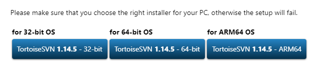

2、安装完成后，新建一个文件夹（你自己想要放文件的地方创建即可）

3、右键上一步创建的文件夹—选择SVN Checkout，输入url，确定，后面根据提示，输账号密码即可（url格式为：svn://ip:端口/目录，如：svn://192.168.0.0:8080/code，其中ip、端口、目录根据自己公司的进行替换）：

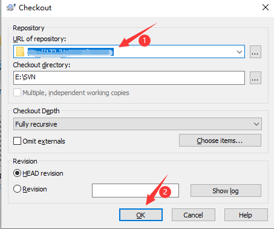

输入账号密码，点击OK：

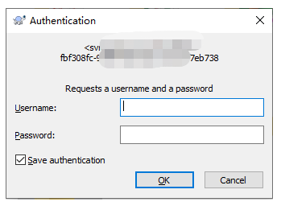

仓库如果有文件的话，会把文件拉到本地，因为我这个是新建的仓库，里面没有东西，所以点击OK后，文件夹是空的：

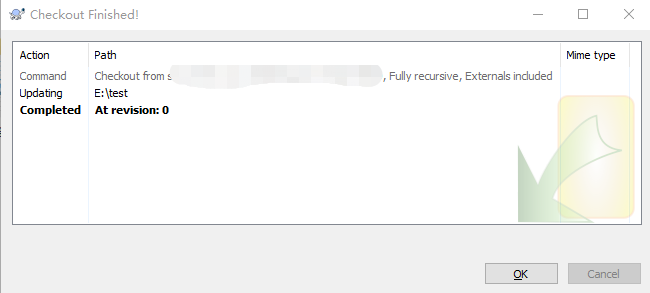

4、进入文件夹，创建你需要上传到仓库的文件（这里我随便复制一个文件过来），然后右键文件，选择TortoiseSVN-Add，然后再右键文件，会多出一个SVN Commit的选项，点击SVN Commit，可以在Message处填写提交的版本信息，备注一下，然后点击OK，就把文件上传到仓库了

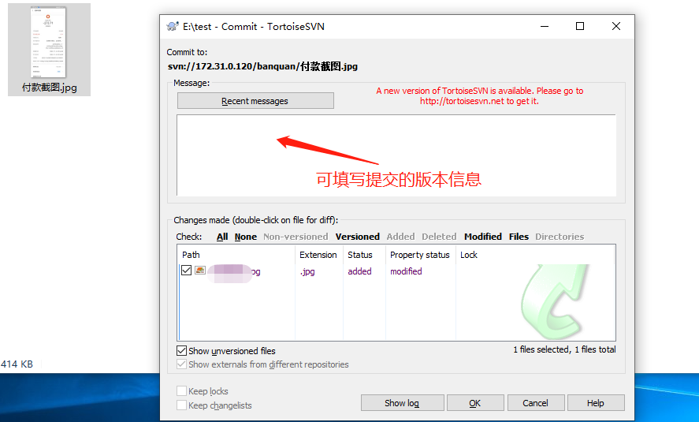

成功提交后，会多出一个绿色的勾：

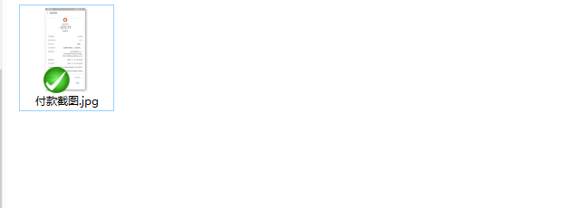

此时，其他有权限的用户就可以把这个文件拉到他们的电脑上了。

如需从仓库删除文件，在电脑上删除文件后，需要commit，不然只是在你电脑本地删除该文件，文件还是存在仓库：

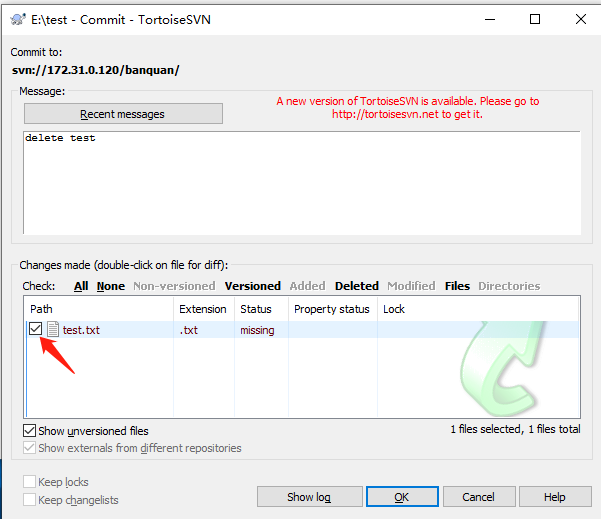

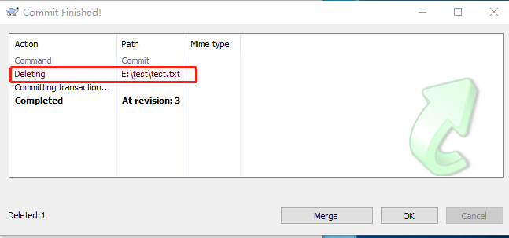

你在电脑上修改了文件的话，文件会出现一个红色感叹号：

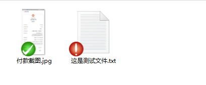

如果在本地更新了文件，需要同步给别人的话，也需要commit到仓库，不然别人拉取的还是旧版本的文件：

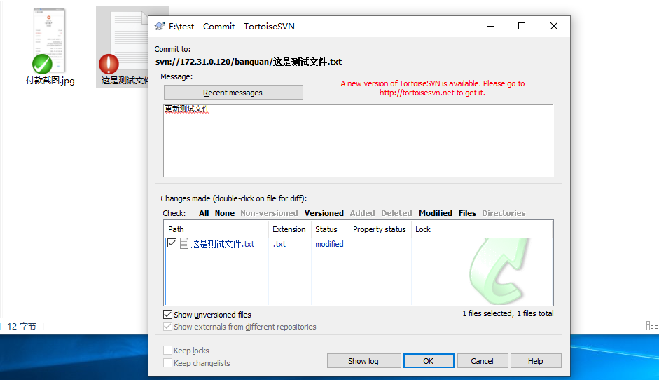

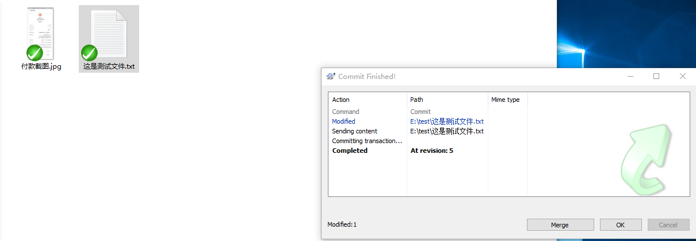

如果你需要拉取别人更新后的文件的话，右键空白处，选择SVN Update即可。

注：每次修改commit前，最好先Update一下（防止多人提交，先把别人提交的更新下来），不然如果你跟别人修改了同一个文件的话，你commit会提示有冲突。
