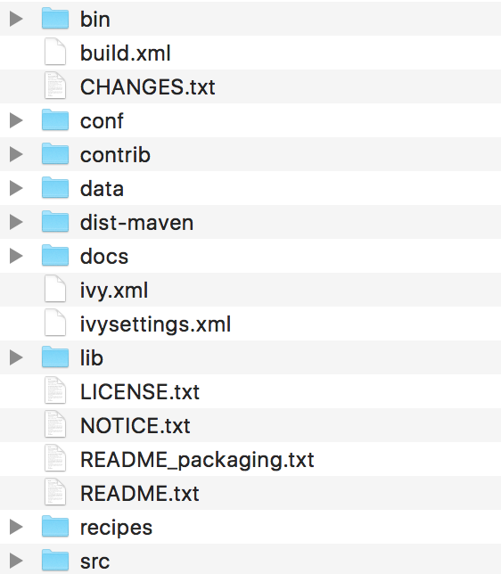

本文讲述如何安装和部署ZooKeeper。

<!--more-->

### 系统要求

ZooKeeper可以运行在多种系统平台上面，表1展示了zk支持的系统平台，以及在该平台上是否支持开发环境或者生产环境。

表1：ZooKeeper支持的运行平台

| 系统    | 开发环境 | 生产环境 |
| ------- | -------- | -------- |
| Linux   | 支持     | 支持     |
| Solaris | 支持     | 支持     |
| FreeBSD | 支持     | 支持     |
| Windows | 支持     | 不支持   |
| MacOS   | 支持     | 不支持   |

ZooKeeper是用Java编写的，运行在Java环境上，因此，在部署zk的机器上需要安装Java运行环境。为了正常运行zk，我们需要JRE1.6或者以上的版本。
对于集群模式下的ZooKeeper部署，3个ZooKeeper服务进程是建议的最小进程数量，而且不同的服务进程建议部署在不同的物理机器上面，以减少机器宕机带来的风险，以实现ZooKeeper集群的高可用。
ZooKeeper对于机器的硬件配置没有太大的要求。例如，在Yahoo!内部，ZooKeeper部署的机器其配置通常如下：双核处理器，2GB内存，80GB硬盘。

### 下载

可以从 https://zookeeper.apache.org/releases.html 下载ZooKeeper，目前最新的稳定版本为 3.4.8 版本，用户可以自行选择一个速度较快的镜像来下载即可。

### 目录

下载并解压ZooKeeper软件压缩包后，可以看到zk包含以下的文件和目录：




- bin目录
  zk的可执行脚本目录，包括zk服务进程，zk客户端，等脚本。其中，.sh是Linux环境下的脚本，.cmd是Windows环境下的脚本。
- conf目录
  配置文件目录。zoo_sample.cfg为样例配置文件，需要修改为自己的名称，一般为zoo.cfg。log4j.properties为日志配置文件。
- lib
  zk依赖的包。
- contrib目录
  一些用于操作zk的工具包。
- recipes目录
  zk某些用法的代码示例

### 单机模式

ZooKeeper的安装包括单机模式安装，以及集群模式安装。

单机模式较简单，是指只部署一个zk进程，客户端直接与该zk进程进行通信。
在开发测试环境下，通过来说没有较多的物理资源，因此我们常使用单机模式。当然在单台物理机上也可以部署集群模式，但这会增加单台物理机的资源消耗。故在开发环境中，我们一般使用单机模式。
但是要注意，生产环境下不可用单机模式，这是由于无论从系统可靠性还是读写性能，单机模式都不能满足生产的需求。

#### 运行配置

上面提到，conf目录下提供了配置的样例zoo_sample.cfg，要将zk运行起来，需要将其名称修改为zoo.cfg。
打开zoo.cfg，可以看到默认的一些配置。

- tickTime
  时长单位为毫秒，为zk使用的基本时间度量单位。例如，1 * tickTime是客户端与zk服务端的心跳时间，2 * tickTime是客户端会话的超时时间。
  tickTime的默认值为2000毫秒，更低的tickTime值可以更快地发现超时问题，但也会导致更高的网络流量（心跳消息）和更高的CPU使用率（会话的跟踪处理）。
- clientPort
  zk服务进程监听的TCP端口，默认情况下，服务端会监听2181端口。
- dataDir
  无默认配置，必须配置，用于配置存储快照文件的目录。如果没有配置dataLogDir，那么事务日志也会存储在此目录。

#### 启动

在Windows环境下，直接双击zkServer.cmd即可。在Linux环境下，进入bin目录，执行命令

```
./zkServer.sh start
```

这个命令使得zk服务进程在后台进行。如果想在前台中运行以便查看服务器进程的输出日志，可以通过以下命令运行：

```
./zkServer.sh start-foreground
```

执行此命令，可以看到大量详细信息的输出，以便允许查看服务器发生了什么。

使用文本编辑器打开zkServer.cmd或者zkServer.sh文件，可以看到其会调用zkEnv.cmd或者zkEnv.sh脚本。zkEnv脚本的作用是设置zk运行的一些环境变量，例如配置文件的位置和名称等。

#### 连接

如果是连接同一台主机上的zk进程，那么直接运行bin/目录下的zkCli.cmd（Windows环境下）或者zkCli.sh（Linux环境下），即可连接上zk。
直接执行zkCli.cmd或者zkCli.sh命令默认以主机号 127.0.0.1，端口号 2181 来连接zk，如果要连接不同机器上的zk，可以使用 -server 参数，例如：

```
bin/zkCli.sh -server 192.168.0.1:2181
```

### 集群模式

单机模式的zk进程虽然便于开发与测试，但并不适合在生产环境使用。在生产环境下，我们需要使用集群模式来对zk进行部署。

> 注意
> 在集群模式下，建议至少部署3个zk进程，或者部署奇数个zk进程。如果只部署2个zk进程，当其中一个zk进程挂掉后，剩下的一个进程并不能构成一个[quorum](http://baike.baidu.com/link?url=pqWrzgH-_VhMLnscR1iRTpPjovfyhxG-8Qs9HxGutiGi5bhnA_lX_pmabLQ-3MiDeigcHRFMYSbFg90RAYVAta)的大多数。因此，部署2个进程甚至比单机模式更不可靠，因为2个进程其中一个不可用的可能性比一个进程不可用的可能性还大。

#### 5. 1 运行配置

在集群模式下，所有的zk进程可以使用相同的配置文件（是指各个zk进程部署在不同的机器上面），例如如下配置：

```
tickTime=2000
dataDir=/home/myname/zookeeper
clientPort=2181
initLimit=5
syncLimit=2
server.1=192.168.229.160:2888:3888
server.2=192.168.229.161:2888:3888
server.3=192.168.229.162:2888:3888
```

- initLimit
  ZooKeeper集群模式下包含多个zk进程，其中一个进程为leader，余下的进程为follower。
  当follower最初与leader建立连接时，它们之间会传输相当多的数据，尤其是follower的数据落后leader很多。initLimit配置follower与leader之间建立连接后进行同步的最长时间。
- syncLimit
  配置follower和leader之间发送消息，请求和应答的最大时间长度。
- tickTime
  tickTime则是上述两个超时配置的基本单位，例如对于initLimit，其配置值为5，说明其超时时间为 2000ms * 5 = 10秒。
- server.id=host:port1:port2
  其中id为一个数字，表示zk进程的id，这个id也是dataDir目录下myid文件的内容。
  host是该zk进程所在的IP地址，port1表示follower和leader交换消息所使用的端口，port2表示选举leader所使用的端口。
- dataDir
  其配置的含义跟单机模式下的含义类似，不同的是集群模式下还有一个myid文件。myid文件的内容只有一行，且内容只能为1 - 255之间的数字，这个数字亦即上面介绍server.id中的id，表示zk进程的id。

> 注意
> 如果仅为了测试部署集群模式而在同一台机器上部署zk进程，server.id=host:port1:port2配置中的port参数必须不同。但是，为了减少机器宕机的风险，强烈建议在部署集群模式时，将zk进程部署不同的物理机器上面。

#### 启动

假如我们打算在三台不同的机器 192.168.229.160，192.168.229.161，192.168.229.162上各部署一个zk进程，以构成一个zk集群。
三个zk进程均使用相同的 zoo.cfg 配置：

```
tickTime=2000
dataDir=/home/myname/zookeeper
clientPort=2181
initLimit=5
syncLimit=2
server.1=192.168.229.160:2888:3888
server.2=192.168.229.161:2888:3888
server.3=192.168.229.162:2888:3888
```

在三台机器dataDir目录（ /home/myname/zookeeper 目录）下，分别生成一个myid文件，其内容分别为1，2，3。然后分别在这三台机器上启动zk进程，这样我们便将zk集群启动了起来。

#### 连接

可以使用以下命令来连接一个zk集群：

```
bin/zkCli.sh -server 192.168.229.160:2181,192.168.229.161:2181,192.168.229.162:2181
```

成功连接后，可以看到如下输出：

```
2016-06-28 19:29:18,074 [myid:] - INFO  [main:ZooKeeper@438] - Initiating client connection, connectString=192.168.229.160:2181,192.168.229.161:2181,192.168.229.162:2181 sessionTimeout=30000 watcher=org.apache.zookeeper.ZooKeeperMain$MyWatcher@770537e4
Welcome to ZooKeeper!
2016-06-28 19:29:18,146 [myid:] - INFO  [main-SendThread(192.168.229.162:2181):ClientCnxn$SendThread@975] - Opening socket connection to server 192.168.229.162/192.168.229.162:2181. Will not attempt to authenticate using SASL (unknown error)
JLine support is enabled
2016-06-28 19:29:18,161 [myid:] - INFO  [main-SendThread(192.168.229.162:2181):ClientCnxn$SendThread@852] - Socket connection established to 192.168.229.162/192.168.229.162:2181, initiating session
2016-06-28 19:29:18,199 [myid:] - INFO  [main-SendThread(192.168.229.162:2181):ClientCnxn$SendThread@1235] - Session establishment complete on server 192.168.229.162/192.168.229.162:2181, sessionid = 0x3557c39d2810029, negotiated timeout = 30000

WATCHER::

WatchedEvent state:SyncConnected type:None path:null
[zk: 192.168.229.160:2181,192.168.229.161:2181,192.168.229.162:2181(CONNECTED) 0]
```

从日志输出可以看到，客户端连接的是192.168.229.162:2181进程（连接上哪台机器的zk进程是随机的），客户端已成功连接上zk集群。
