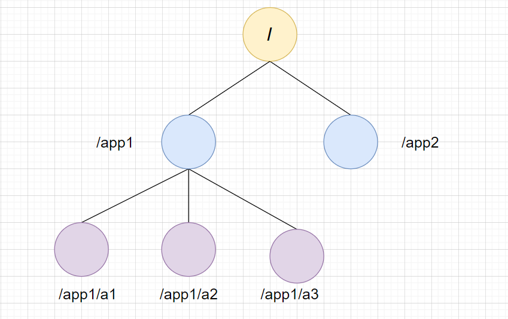
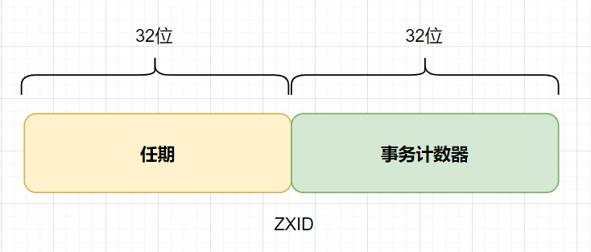
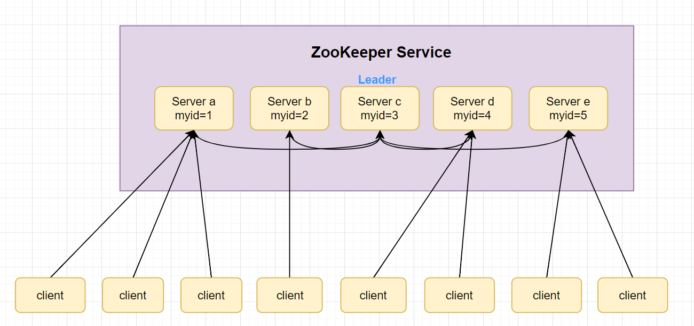
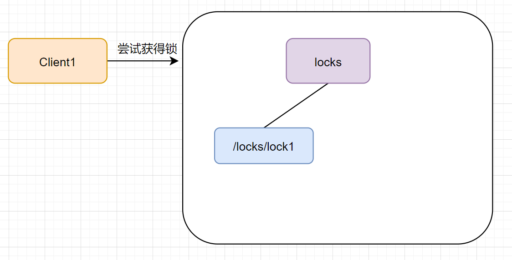
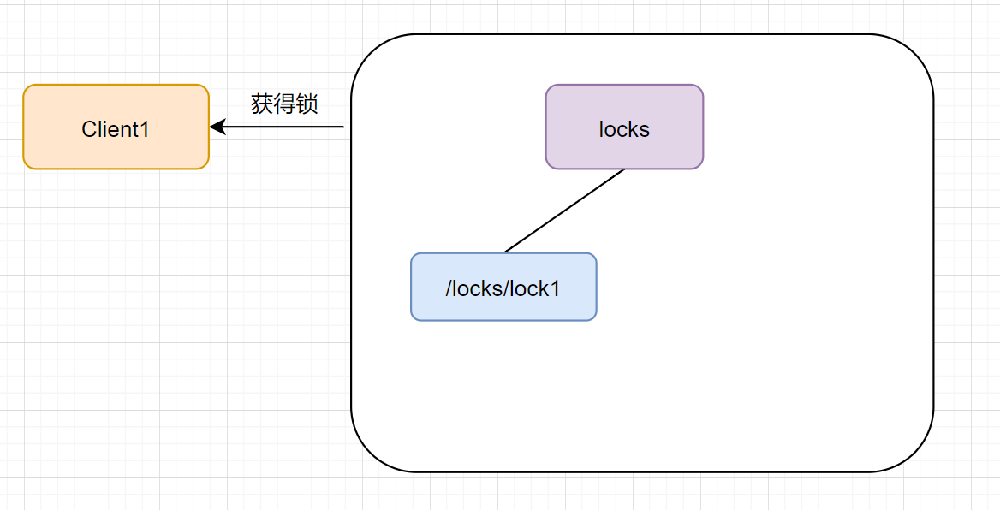
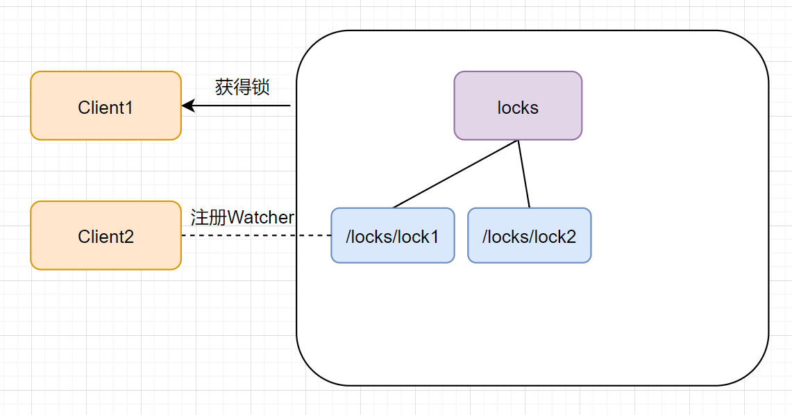
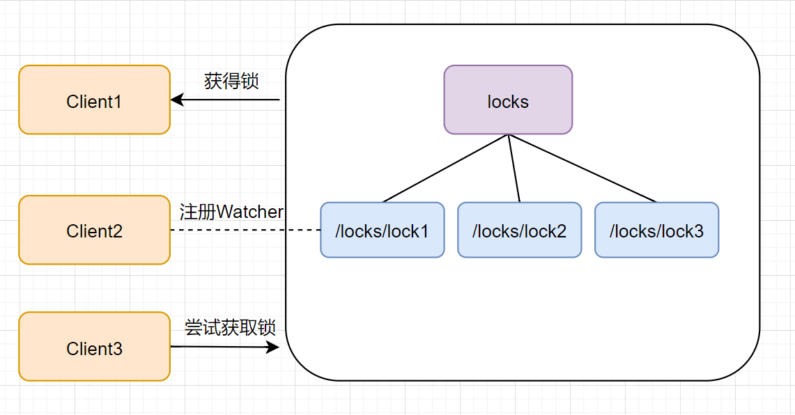
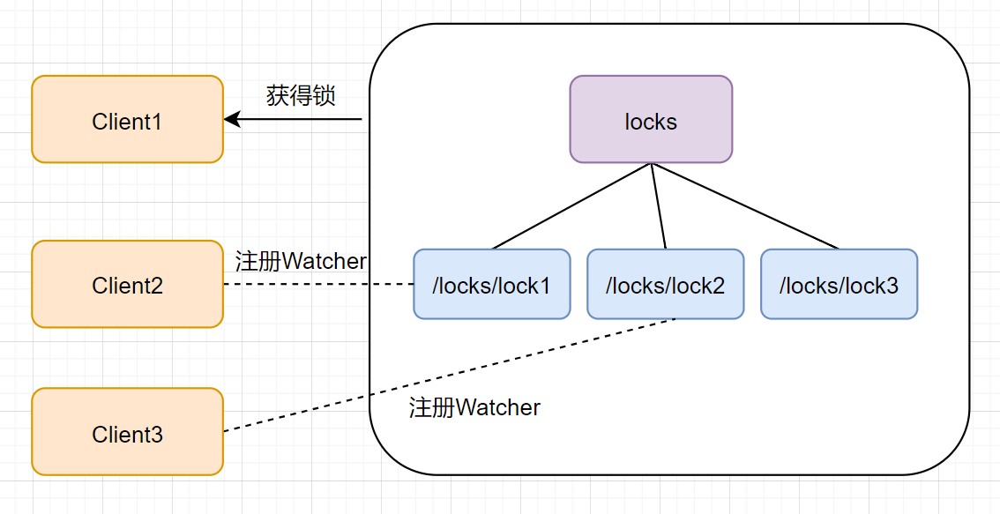
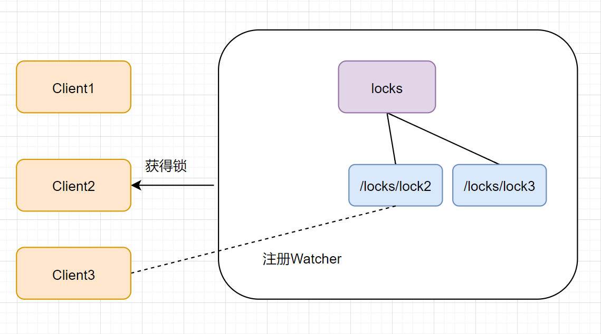

今天聊聊zookeeper的理论知识。

<!--more-->

### zookeeper是什么？有什么用？

- ZooKeeper，它是一个开放源码的**「分布式协调服务」**，它是一个集群的管理者，它将简单易用的接口提供给用户。
- 可以基于Zookeeper 实现诸如数据发布/订阅、负载均衡、命名服务、分布式协调/通知、集群管理、Master 选举、分布式锁和分布式队列等功能。
- Zookeeper的用途：命名服务、配置管理、集群管理、分布式锁、队列管理


### 什么是命名服务，什么是配置管理，什么是集群管理？

- **「命名服务」**：

> 命名服务是指通过**「指定的名字」**来获取资源或者服务地址。Zookeeper可以创建一个**「全局唯一的路径」**，这个路径就可以作为一个名字。被命名的实体可以是**「集群中的机器，服务的地址，或者是远程的对象」**等。一些分布式服务框架（RPC、RMI）中的服务地址列表，通过使用命名服务，客户端应用能够根据特定的名字来获取资源的实体、服务地址和提供者信息等。

- **「配置管理：」** ：

> 实际项目开发中，我们经常使用.properties或者xml需要配置很多信息，如数据库连接信息、fps地址端口等等。因为你的程序一般是分布式部署在不同的机器上（如果你是单机应用当我没说），如果把程序的这些配置信息**「保存在zk的znode节点」**下，当你要修改配置，即znode会发生变化时，可以通过改变zk中某个目录节点的内容，利用**「watcher通知给各个客户端」**，从而更改配置。

- **「集群管理」**

> 集群管理包括集群监控和集群控制，其实就是监控集群机器状态，剔除机器和加入机器。zookeeper可以方便集群机器的管理，它可以实时监控znode节点的变化，一旦发现有机器挂了，该机器就会与zk断开连接，对用的临时目录节点会被删除，其他所有机器都收到通知。新机器加入也是类似酱紫，所有机器收到通知：有新兄弟目录加入啦。


### zookeeper的数据模型是怎样的？znode有几种类型？

#### zookeeper的数据模型

ZooKeeper的视图数据结构，很像Unix文件系统，也是树状的，这样可以确定每个路径都是唯一的。zookeeper的节点统一叫做**「znode」**，它是可以通过**「路径来标识」**，结构图如下：



#### znode的4种类型

根据节点的生命周期，znode可以分为4种类型，分别是持久节点（PERSISTENT）、持久顺序节点（PERSISTENT_SEQUENTIAL）、临时节点（EPHEMERAL）、临时顺序节点（EPHEMERAL_SEQUENTIAL）

- 持久节点（PERSISTENT）

> 这类节点被创建后，就会一直存在于Zk服务器上。直到手动删除。

- 持久顺序节点（PERSISTENT_SEQUENTIAL）

> 它的基本特性同持久节点，不同在于增加了顺序性。父节点会维护一个自增整性数字，用于子节点的创建的先后顺序。

- 临时节点（EPHEMERAL）

> 临时节点的生命周期与客户端的会话绑定，一旦客户端会话失效（非TCP连接断开），那么这个节点就会被自动清理掉。zk规定临时节点只能作为叶子节点。

- 临时顺序节点（EPHEMERAL_SEQUENTIAL）

> 基本特性同临时节点，添加了顺序的特性。


### znode节点里面存储的是什么？每个节点的数据最大不能超过多少？

#### znode节点里面存储的是什么？

Znode数据节点的代码如下

```typescript
public class DataNode implements Record {
    byte data[];                    
    Long acl;                       
    public StatPersisted stat;       
    private Set<String> children = null; 
}
```

Znode包含了**「存储数据、访问权限、子节点引用、节点状态信息」**，如图：


- **「data:」** znode存储的业务数据信息
- **「ACL:」** 记录客户端对znode节点的访问权限，如IP等。
- **「child:」** 当前节点的子节点引用
- **「stat:」** 包含Znode节点的状态信息，比如**「事务id、版本号、时间戳」**等等。

#### 每个节点的数据最大不能超过多少？

为了保证高吞吐和低延迟，以及数据的一致性，znode只适合存储非常小的数据，不能超过1M，最好都小于1K。


### znode节点上的监听机制

#### Watcher监听机制

Zookeeper 允许客户端向服务端的某个Znode注册一个Watcher监听，当服务端的一些指定事件触发了这个Watcher，服务端会向指定客户端发送一个事件通知来实现分布式的通知功能，然后客户端根据 Watcher通知状态和事件类型做出业务上的改变。

> 可以把Watcher理解成客户端注册在某个Znode上的触发器，当这个Znode节点发生变化时（增删改查），就会触发Znode对应的注册事件，注册的客户端就会收到异步通知，然后做出业务的改变。


#### Watcher监听机制的工作原理


- ZooKeeper的Watcher机制主要包括客户端线程、客户端 WatcherManager、Zookeeper服务器三部分。
- 客户端向ZooKeeper服务器注册Watcher的同时，会将Watcher对象存储在客户端的WatchManager中。
- 当zookeeper服务器触发watcher事件后，会向客户端发送通知， 客户端线程从 WatcherManager 中取出对应的 Watcher 对象来执行回调逻辑。

#### Watcher特性总结

- **「一次性:」** 一个Watch事件是一个一次性的触发器。一次性触发，客户端只会收到一次这样的信息。
- **「异步的：」** Zookeeper服务器发送watcher的通知事件到客户端是异步的，不能期望能够监控到节点每次的变化，Zookeeper只能保证最终的一致性，而无法保证强一致性。
- **「轻量级：」** Watcher 通知非常简单，它只是通知发生了事件，而不会传递事件对象内容。
- **「客户端串行：」** 执行客户端 Watcher 回调的过程是一个串行同步的过程。
- 注册 watcher用getData、exists、getChildren方法
- 触发 watcher用create、delete、setData方法


### Zookeeper的特性

Zookeeper 保证了如下分布式一致性特性：

- **「顺序一致性」**：从同一客户端发起的事务请求，最终将会严格地按照顺序被应用到 ZooKeeper 中去。
- **「原子性」**：所有事务请求的处理结果在整个集群中所有机器上的应用情况是一致的，也就是说，要么整个集群中所有的机器都成功应用了某一个事务，要么都没有应用。
- **「单一视图」**：无论客户端连到哪一个 ZooKeeper 服务器上，其看到的服务端数据模型都是一致的。
- **「可靠性：」** 一旦服务端成功地应用了一个事务，并完成对客户端的响应，那么该事务所引起的服务端状态变更将会被一直保留下来。
- **「实时性（最终一致性）：」** Zookeeper 仅仅能保证在一定的时间段内，客户端最终一定能够从服务端上读取到最新的数据状态。


### zookeeper是如何保证事务的顺序一致性？

> 需要了解事务ID，即zxid。ZooKeeper的在选举时通过比较各结点的zxid和机器ID选出新的主结点的。zxid由Leader节点生成，有新写入事件时，Leader生成新zxid并随提案一起广播，每个结点本地都保存了当前最近一次事务的zxid，zxid是递增的，所以谁的zxid越大，就表示谁的数据是最新的。

ZXID的生成规则如下：



ZXID有两部分组成：

- 任期：完成本次选举后，直到下次选举前，由同一Leader负责协调写入；
- 事务计数器：单调递增，每生效一次写入，计数器加一。

> ZXID的低32位是计数器，所以同一任期内，ZXID是连续的，每个结点又都保存着自身最新生效的ZXID，通过对比新提案的ZXID与自身最新ZXID是否相差“1”，来保证事务严格按照顺序生效的。


### Zookeeper的服务器有几种角色？Zookeeper下Server工作状态有几种？

#### Zookeeper 服务器角色

Zookeeper集群中，有Leader、Follower和Observer三种角色

**「Leader」**

> Leader服务器是整个ZooKeeper集群工作机制中的核心，其主要工作：

- 事务请求的唯一调度和处理者，保证集群事务处理的顺序性
- 集群内部各服务的调度者

**「Follower」**

> Follower服务器是ZooKeeper集群状态的跟随者，其主要工作：

- 处理客户端非事务请求，转发事务请求给Leader服务器
- 参与事务请求Proposal的投票
- 参与Leader选举投票

**「Observer」**

> Observer是3.3.0 版本开始引入的一个服务器角色，它充当一个观察者角色——观察ZooKeeper集群的最新状态变化并将这些状态变更同步过来。其工作：

- 处理客户端的非事务请求，转发事务请求给 Leader 服务器
- 不参与任何形式的投票

#### Zookeeper下Server工作状态

> 服务器具有四种状态，分别是 LOOKING、FOLLOWING、LEADING、OBSERVING。

- 1.LOOKING：寻找Leader状态。当服务器处于该状态时，它会认为当前集群中没有 Leader，因此需要进入 Leader 选举状态。
- 2.FOLLOWING：跟随者状态。表明当前服务器角色是Follower。
- 3.LEADING：领导者状态。表明当前服务器角色是Leader。
- 4.OBSERVING：观察者状态。表明当前服务器角色是Observer。


### ZooKeeper集群部署图？ZooKeeper是如何保证主从节点数据一致性？

#### ZooKeeper集群部署图


ZooKeeper集群是一主多从的结构：

- 如果是写入数据，先写入主服务器（主节点），再通知从服务器。
- 如果是读取数据，既读主服务器的，也可以读从服务器的。

#### ZooKeeper如何保证主从节点数据一致性

我们知道集群是主从部署结构，要保证主从节点一致性问题，无非就是两个主要问题：

- **「主服务器挂了，或者重启了」**
- **「主从服务器之间同步数据」**

Zookeeper是采用ZAB协议（Zookeeper Atomic Broadcast，Zookeeper原子广播协议）来保证主从节点数据一致性的，ZAB协议支持**「崩溃恢复和消息广播」**两种模式，很好解决了这两个问题：

- 崩溃恢复：Leader挂了，进入该模式，选一个新的leader出来
- 消息广播： 把更新的数据，从Leader同步到所有Follower

> Leader服务器挂了，所有集群中的服务器进入LOOKING状态，首先，它们会选举产生新的Leader服务器；接着，新的Leader服务器与集群中Follower服务进行数据同步，当集群中超过半数机器与该 Leader服务器完成数据同步之后，退出恢复模式进入消息广播模式。Leader 服务器开始接收客户端的事务请求生成事务Proposal进行事务请求处理。


### ZooKeeper选举机制

服务器启动或者服务器运行期间（Leader挂了），都会进入Leader选举，我们来看一下~假设现在ZooKeeper集群有五台服务器，它们myid分别是服务器1、2、3、4、5，如图：



#### 服务器启动的Leader选举

zookeeper集群初始化阶段，服务器（myid=1-5）**「依次」**启动，开始zookeeper选举Leader


- 服务器1（myid=1）启动，当前只有一台服务器，无法完成Leader选举
- 服务器2（myid=2）启动，此时两台服务器能够相互通讯，开始进入Leader选举阶段

> 1. 每个服务器发出一个投票
>
> > 服务器1 和 服务器2都将自己作为Leader服务器进行投票，投票的基本元素包括：服务器的myid和ZXID，我们以（myid，ZXID）形式表示。初始阶段，服务器1和服务器2都会投给自己，即服务器1的投票为（1,0），服务器2的投票为（2,0），然后各自将这个投票发给集群中的其他所有机器。
>
> 2. 接受来自各个服务器的投票
>
> > 每个服务器都会接受来自其他服务器的投票。同时，服务器会校验投票的有效性，是否本轮投票、是否来自LOOKING状态的服务器。
>
> 3. 处理投票
>
> > 收到其他服务器的投票，会将被人的投票跟自己的投票PK，PK规则如下：
> >
> > > - 优先检查ZXID。ZXID比较大的服务器优先作为leader。
> > > - 如果ZXID相同的话，就比较myid，myid比较大的服务器作为leader。 服务器1的投票是（1,0），它收到投票是（2,0），两者zxid都是0，因为收到的myid=2，大于自己的myid=1，所以它更新自己的投票为（2,0），然后重新将投票发出去。对于服务器2呢，即不再需要更新自己的投票，把上一次的投票信息发出即可。
>
> 4. 统计投票
>
> > 每次投票后，服务器会统计所有投票，判断是否有过半的机器接受到相同的投票信息。服务器2收到两票，少于3（n/2+1,n为总服务器），所以继续保持LOOKING状态

- 服务器3（myid=3）启动，继续进入Leader选举阶段

> 跟前面流程一致，服务器1和2先投自己一票，因为服务器3的myid最大，所以大家把票改投给它。此时，服务器为3票（大于等于n/2+1）,所以服务器3当选为Leader。 服务器1，2更改状态为FOLLOWING，服务器3更改状态为LEADING；

- 服务器4启动，发起一次选举。

> 此时服务器1，2，3已经不是LOOKING状态，不会更改选票信息。选票信息结果：服务器3为3票，服务器4为1票。服务器4并更改状态为FOLLOWING；

- 服务器5启动，发起一次选举。

> 同理，服务器也是把票投给服务器3，服务器5并更改状态为FOLLOWING；

- 投票结束，服务器3当选为Leader

#### 服务器运行期间的Leader选举

zookeeper集群的五台服务器（myid=1-5）正在运行中，突然某个瞬间，Leader服务器3挂了，这时候便开始Leader选举


- 1.变更状态

> Leader 服务器挂了之后，余下的非Observer服务器都会把自己的服务器状态更改为LOOKING，然后开始进入Leader选举流程。

- 2.每个服务器发起投票

> 每个服务器都把票投给自己，因为是运行期间，所以每台服务器的ZXID可能不相同。假设服务1,2,4,5的zxid分别为333,666,999,888，则分别产生投票（1,333），（2，666），（4,999）和（5,888），然后各自将这个投票发给集群中的其他所有机器。

- 3.接受来自各个服务器的投票
- 4.处理投票

> 投票规则是跟Zookeeper集群启动期间一致的，优先检查ZXID，大的优先作为Leader，所以显然服务器zxid=999具有优先权。

- 5.统计投票
- 6.改变服务器状态


### zookeeper分布式锁的实现原理

Zookeeper就是使用临时顺序节点特性实现分布式锁的。

- 获取锁过程 （创建临时节点，检查序号最小）
- 释放锁 （删除临时节点，监听通知）

#### 获取锁过程

- 当第一个客户端请求过来时，Zookeeper客户端会创建一个持久节点/locks。如果它（Client1）想获得锁，需要在locks节点下创建一个顺序节点lock1.如图
- 接着，客户端Client1会查找locks下面的所有临时顺序子节点，判断自己的节点lock1是不是排序最小的那一个，如果是，则成功获得锁。
- 这时候如果又来一个客户端client2前来尝试获得锁，它会在locks下再创建一个临时节点lock2
- 客户端client2一样也会查找locks下面的所有临时顺序子节点，判断自己的节点lock2是不是最小的，此时，发现lock1才是最小的，于是获取锁失败。获取锁失败，它是不会甘心的，client2向它排序靠前的节点lock1注册Watcher事件，用来监听lock1是否存在，也就是说client2抢锁失败进入等待状态。
- 此时，如果再来一个客户端Client3来尝试获取锁，它会在locks下再创建一个临时节点lock3
- 同样的，client3一样也会查找locks下面的所有临时顺序子节点，判断自己的节点lock3是不是最小的，发现自己不是最小的，就获取锁失败。它也是不会甘心的，它会向在它前面的节点lock2注册Watcher事件，以监听lock2节点是否存在。

#### 释放锁

我们再来看看释放锁的流程，zookeeper的**「客户端业务完成或者故障」**，都会删除临时节点，释放锁。如果是任务完成，Client1会显式调用删除lock1的指令

如果是客户端故障了，根据临时节点得特性，lock1是会自动删除的

lock1节点被删除后，Client2可开心了，因为它一直监听着lock1。lock1节点删除，Client2立刻收到通知，也会查找locks下面的所有临时顺序子节点，发下lock2是最小，就获得锁。



同理，Client2获得锁之后，Client3也对它虎视眈眈。
