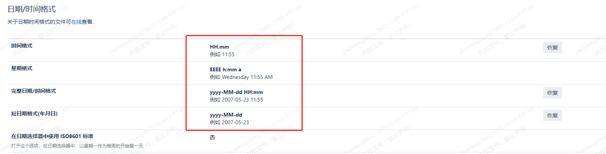
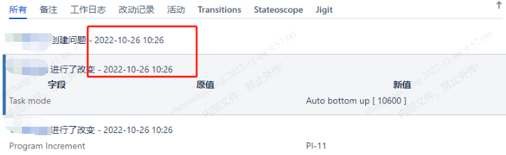
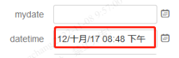
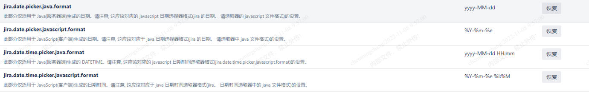
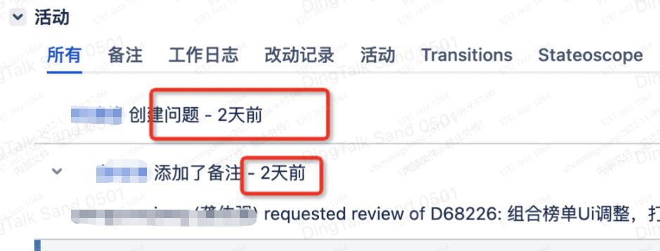
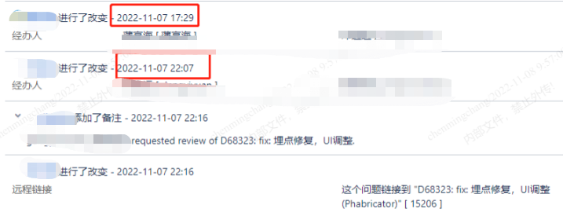

由于jira系统默认时间会采用“14/Jul/22 2:02 PM”的样式，跟我们日常所使用的格式不太一致，看起很不习惯 ，在这里说明一下在JIRA中如何进行日期格式的调整：

想调整2018-12-31和2018-12-31 23:22:29，可以按以下步骤进行设置

1.系统管理员登录系统后台，点击系统-外观

2.在日期/时间格式中将时间格式进行调整

更新完之后时间显示如下：

还有在创建问题单的时候，需要选择日期，选择完之后还是显示之前默认的“14/Jul/22 2:02 PM”的格式：

如果需要2018-12-31和2018-12-31 23:22:29，可以按以下步骤进行设置：

管理员登录系统后台>>系统>>般配置>>高级设置
修改以下项：

更新完后显示如下：

另外，开发要求jira平台问题单时间节点显示为具体的时间，而不是几天前：

解决方法：

1.编辑/usr/local/jira/atlassian-jira/WEB-INF/classes/jpm.xml文件

2.找到对应的参数(key)：jira.lf.date.relativize
3.将对应的值(default-value)改为：false
4.重新启动JIRA

可以看到时间格式已修改：

