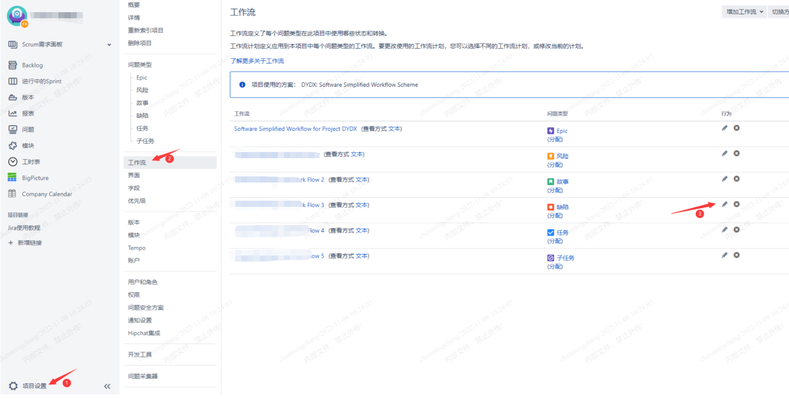
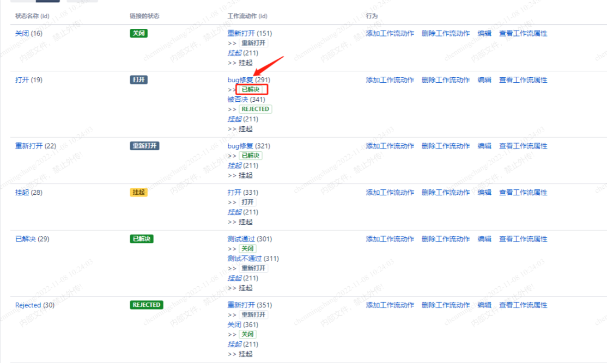
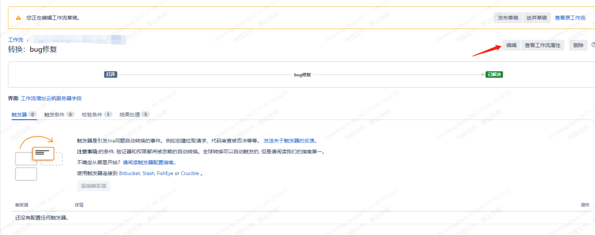
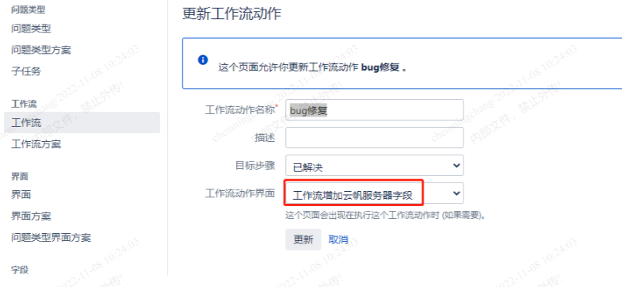
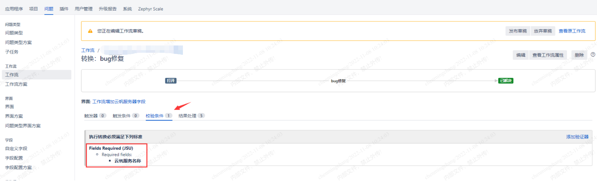
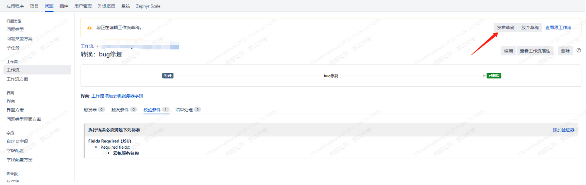
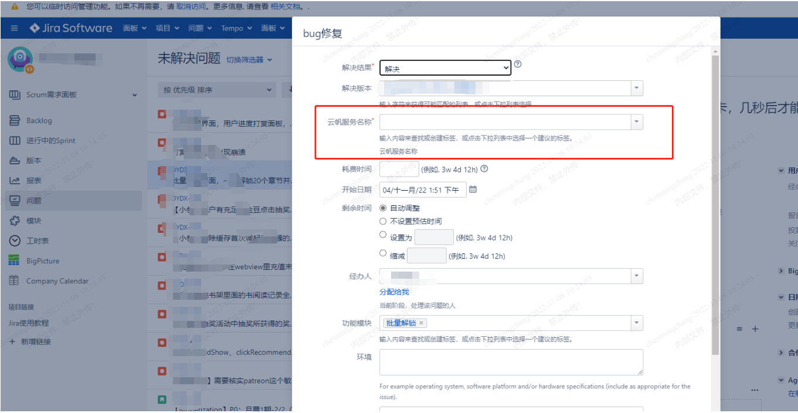

接上篇，研发要求问题单点击已解决后需要强制填写“云帆服务器”字段才可以提交。

<!--more-->

实现方法：

1.点解项目设置-工作流，编辑对应问题类型的工作流：

2.点击链接为已解决的工作流动作：

3.点击编辑：

4.链接到对应的界面（需提前在界面处创建好对应的界面，此处已创建）：

5.校验条件处添加校验器：

6.点击发布：

此时点击解决问题会弹出界面，必须填写云帆服务器名称才可以提交单子：

