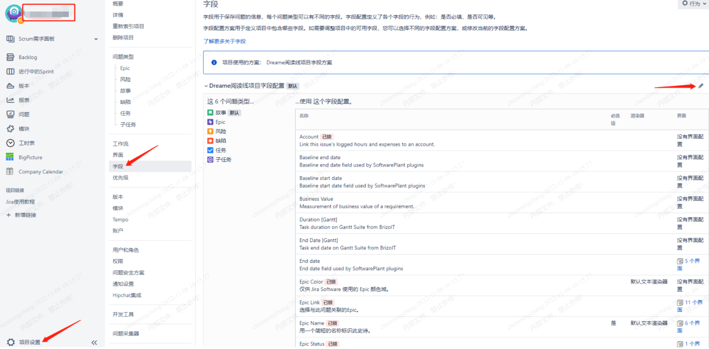
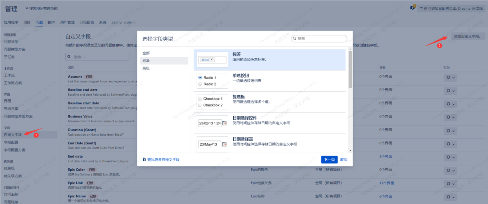
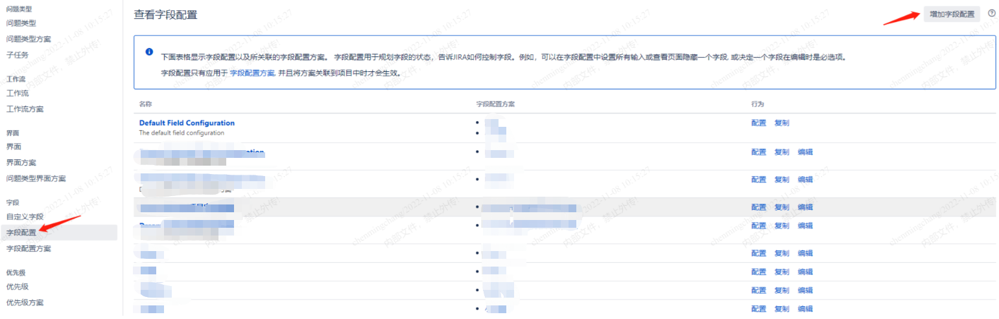
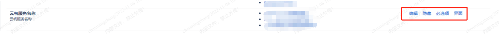
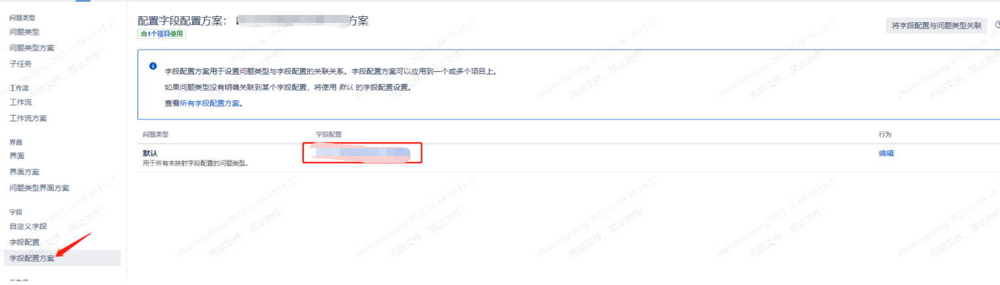
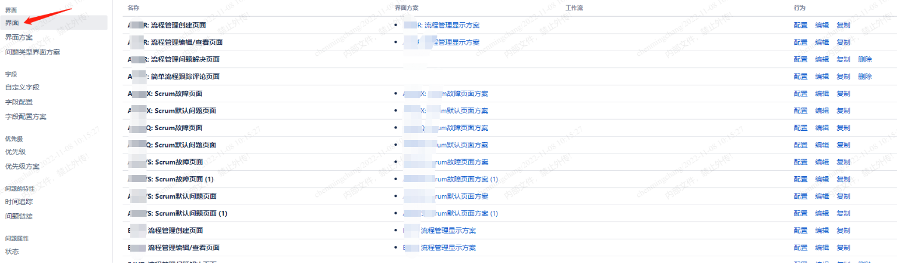
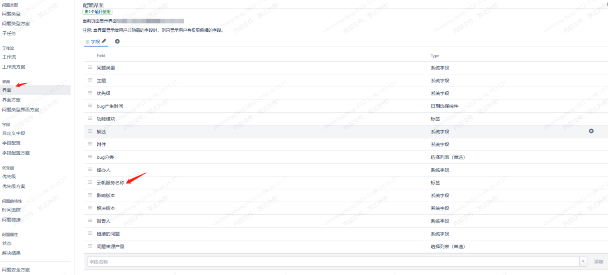
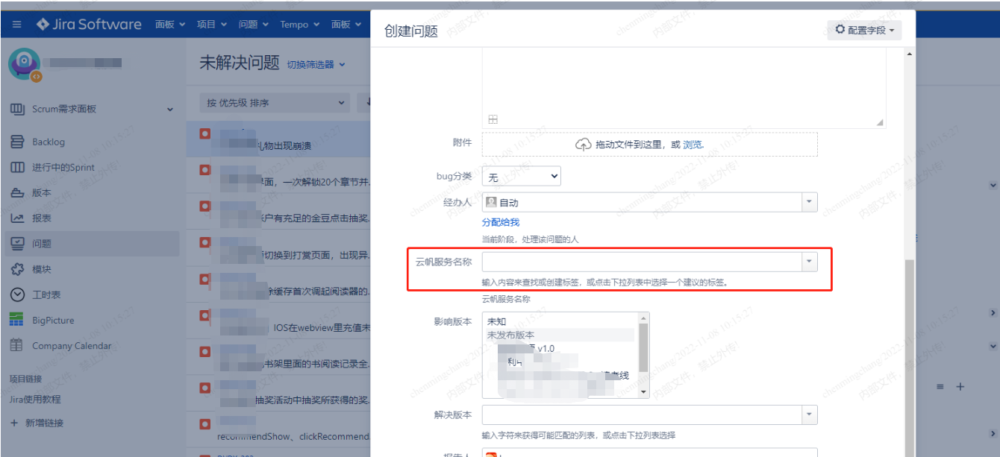

研发要求要在缺陷类的问题单里加一个”云帆服务器“的字段。

<!--more-->

具体实现方法如下：

1.进入需要设置的jira项目，点击项目设置-字段-编辑

2.在自定义字段里添加云帆服务器：

3.点击字段配置-增加字段配置-配置，云帆服务器选项处可以选择是否显示以及是否必选（为了不影响其他项目，可以复制一个默认的配置，然后修改配置，再把项目关联到这个方案）。

4.点击字段配置方案，创建一个方案，引用刚刚创建的字段配置：

5.字段配置了，需要在创建问题单的时候显示出来，找到项目关联的方案（也可复制一个方案，单独修改，以免修改到其他项目），点击界面，找到需要配置的界面-配置，再加入刚创建的字段

6.在创建问题的时候就会显示对应的字段了：

