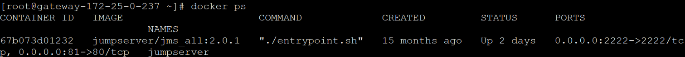
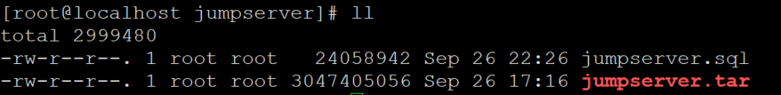
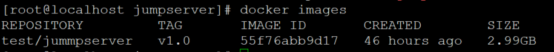
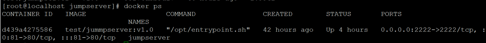
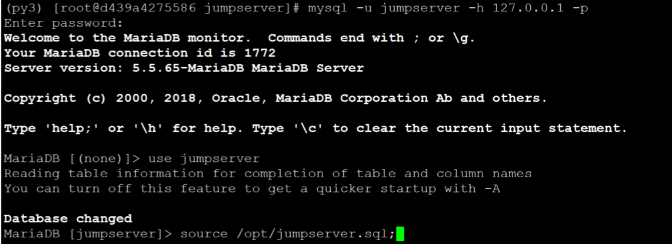
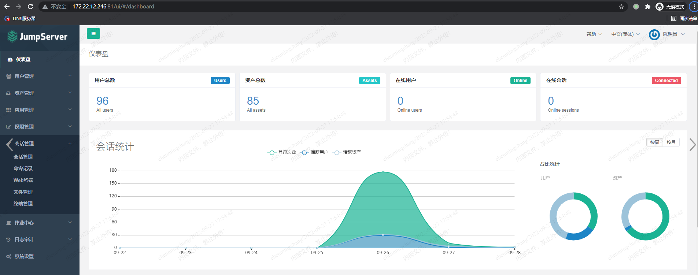
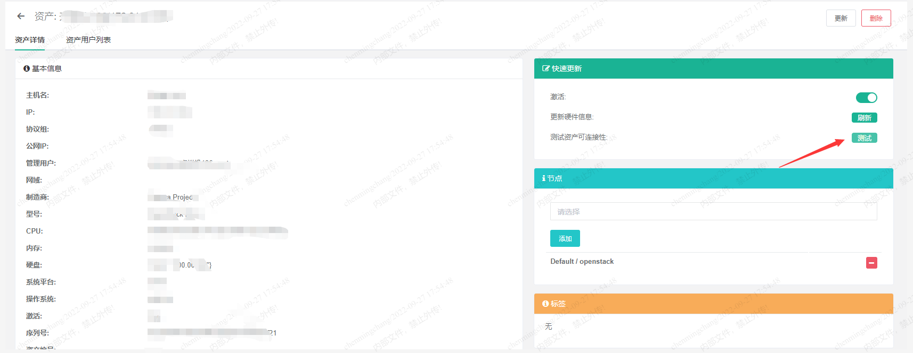
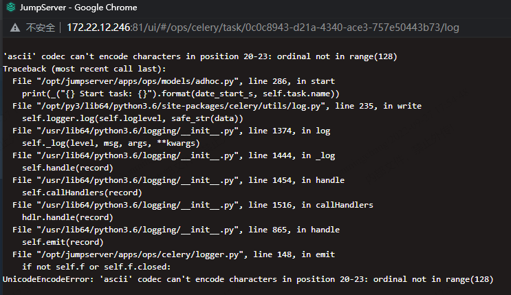
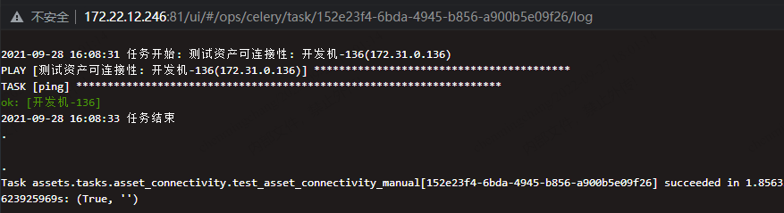

需求：把jumpserver服务搬迁到另一台服务器上

原服务器ip：172.25.0.237

新服务器ip：172.22.12.246

由于jumpserver服务是在docker中启动的，所以直接把docker镜像搬到新服务器里跑就行。

<!--more-->

方法一：

1.查看正在跑的容器：



2.把容器打包为镜像：

```
commit -m "jumpserver backup" 67b073d01232 jumpserverbak:v2.7.0
```

3.导出刚打包的镜像：

```
docker save -o /tmp/jumpserverbak.tar jumpserverbak:v2.7.0
```

4.把镜像上传至新服务器：

```
scp /tmp/jumpserverbak.tar root@172.22.12.246:/data/backup/
```

5.在新服务器安装docker

```
curl -sSL https://get.daocloud.io/docker | sh
```

启动docker并设置开机自启动：

```
systemctl enable docker
systemctl start docker
```

6.docker镜像导入：

```
docker load -i /data/backup/jumpserverbak.tar
```

7.启动容器：

```
docker run -it -d   --name  jumpserverbak jumpserverbak
```


方法二：

1.查看正在跑的容器：


2.导出镜像：

```
docker export -o jumpserver.tar jumpserver
```

其中-o表示输出到文件，jumpserver.tar为目标文件，jumpserver是镜像名（name）

3.进docker把数据库备份：

```
docker exec -it 67b073d01232 /bin/bash
mysqldump -u jumpserver -h 127.0.0.1 -p jumpserver > /opt/jumpserver.sql
exit
```

把数据库备份文件拷贝到本地服务器：

```
docker cp 67b073d01232:/opt/jumpserver.sql /opt/
```

4.把打包的docker镜像以及数据库备份文件拷贝到新服务器：

```
scp /opt/jumpserver.* root@172.22.12.246:/tmp/
```

在新服务器查看是否拷贝成功：



5.在新服务器安装docker

```
curl -sSL https://get.daocloud.io/docker | sh
```

启动docker并设置开机自启动：

```
systemctl enable docker
systemctl start docker
```

6.docker镜像导入：

```
cd  /tmp/jumpserver/
docker import jumpserver.tar test/jumpserver:v1.0
```

查看是否导入成功：



启动容器：

```
docker run --name jumpserver -d -p 81:80 -p 2222:2222 --restart=always -e SECRET_KEY=跟原服务器相同 -e BOOTSTRAP_TOKEN=跟原服务器相同 -e DB_HOST=127.0.0.1 -e DB_PORT=3306 -e DB_USER=jumpserver -e DB_PASSWORD=跟原服务器相同 -e DB_NAME=jumpserver -e REDIS_HOST=127.0.0.1 -e REDIS_PORT=6379 test/jummpserver:v1.0 /opt/entrypoint.sh
```

查看容器是否在跑：



把数据库备份文件拷贝到容器里：

```
docker cp /opt/jumpserver/jumpserver.sql d439a4275586:/opt/
```

把数据库备份文件导入数据库：

```
docker exec -it d439a427558 /bin/bash
mysql -u jumpserver -h 127.0.0.1 -p
use jumpserver;
source /opt/jumpserver.sql;
quit
```



把/opt/koko/data/keys/.access_key文件删除（否则会验证不成功）并重启容器：

```
rm -f /opt/koko/data/keys/.access_key
exit
```

重启容器：

```
docker stop d439a4275586
docker start d439a4275586
```

浏览器进入管理界面：



至此，jumpserver服务搬迁完成。


错误解决：

进入资产列表测试资产可连接性的时候报错如下：

 



或者弹窗一直显示消息：.................................

解决方法：

```
docker exec -it d439a427558 /bin/bash
cd /opt/jumpserver
source /opt/py3/bin/activate
./jms stop
ps aux | grep py3 | awk '{print $2}' |xargs kill -9
rm -rf tmp/*.pid
./jms start -d
```

再到资产列表测试资产可连接性：



